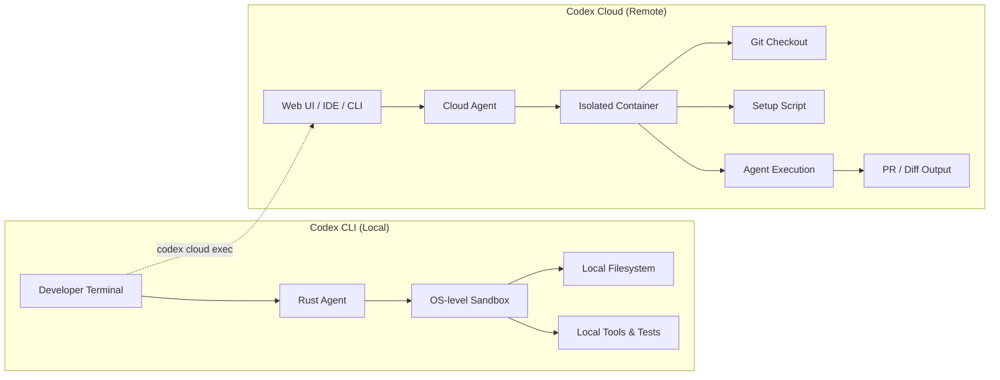
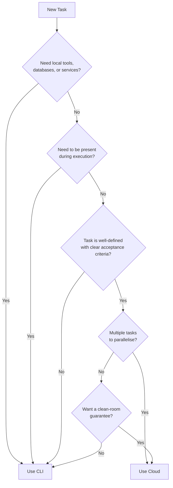
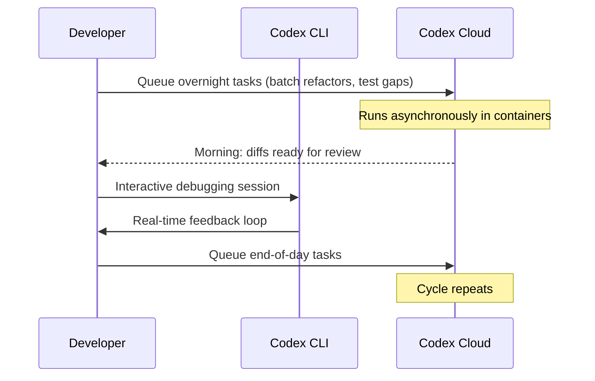

# Codex CLI vs Codex Cloud: When to Use Each


---

OpenAI ships two distinct execution surfaces under the Codex brand: **Codex CLI**, a Rust-based terminal agent that runs on your machine, and **Codex Cloud** (also called "Codex Web"), a managed cloud agent that works asynchronously inside isolated containers[^1][^2]. They share the same model catalogue — GPT-5.4, GPT-5.3-Codex, and GPT-5.4-mini — but differ fundamentally in execution model, sandboxing, network behaviour, and integration surface[^3]. Choosing the wrong one for a given task wastes either time or money. This article provides a concrete decision framework.

## Architecture at a Glance



## Execution Model

### Codex CLI: Synchronous, Interactive

Codex CLI runs in your terminal session. You watch the agent reason, approve or reject tool calls via the approval policy, and the agent writes directly to your working tree[^1]. It supports three approval modes:

- **untrusted** — confirms every non-trusted command
- **on-request** — autonomous within sandbox boundaries, asks when exceeding them
- **never** — no prompts at all (full-auto)[^4]

The agent has access to your local filesystem, your installed toolchains, and your running services. This makes it ideal for tasks requiring tight feedback loops: debugging a test failure you can reproduce locally, exploring an unfamiliar codebase, or iterating on a design with screenshots attached.

### Codex Cloud: Asynchronous, Delegated

Codex Cloud spins up a container, checks out your repository at a specified branch or commit SHA, runs a setup script, then executes the agent in a loop[^2]. Internet access is disabled during agent execution by default[^5]. When the task completes — typically 1 to 30 minutes later — you review the diff and optionally open a PR[^2].

The key insight: **you do not need to be present**. Cloud tasks run in the background while you work on something else, sleep, or take a walk. You can launch multiple tasks in parallel across different repositories[^6].

## Sandboxing Comparison

The two surfaces enforce safety at different layers of the stack.

| Dimension | Codex CLI | Codex Cloud |
|-----------|-----------|-------------|
| **Sandbox mechanism** | OS kernel — Seatbelt (macOS), bubblewrap (Linux), Windows Sandbox (PowerShell)[^4] | Isolated cloud container with HTTP/HTTPS proxy[^5] |
| **Filesystem scope** | Your working directory plus configurable writable roots[^4] | Fresh git checkout per task[^5] |
| **Network** | Configurable domain-level allowlists via managed network profiles[^4] | Internet off by default during agent phase; available during setup[^5] |
| **Persistence** | Writes to your local disk directly | Container cached up to 12 hours; diffs returned as patches[^5] |
| **Secret handling** | Inherits your shell environment | Encrypted secrets, decrypted only during execution, removed before agent phase[^5] |

The practical consequence: CLI lets the agent use whatever is on your machine (databases, Docker, local APIs), while Cloud guarantees a clean-room environment at the cost of needing explicit setup scripts for every dependency.

## Cost and Rate Limits

Both surfaces draw from the same ChatGPT subscription tier[^3]:

| Plan | Monthly Cost | CLI Messages (5h window) | Cloud Tasks |
|------|-------------|--------------------------|-------------|
| **Plus** | \$20 | 20–100 (GPT-5.4) | Included |
| **Pro 5×** | \$100 | 100–500 | Included |
| **Pro 20×** | \$200+ | 400–2000 | Included |
| **API Key** | Pay-per-token | Unlimited (billed) | Not available |

A critical distinction: **API key users cannot use Cloud features**[^3]. If your workflow depends on `codex cloud exec` in CI pipelines, you need a seat-based plan, not a raw API key.

Cloud tasks consume from the same rate-limit pool as interactive sessions. Running five parallel cloud tasks during a heavy CLI session can exhaust your 5-hour window quickly[^3].

## The Decision Framework



### Use CLI When

- **Debugging locally reproducible issues.** The agent can hit your running database, invoke your local Docker stack, or attach to a debugger. Cloud cannot do this.
- **Exploring unfamiliar code.** Interactive mode lets you steer the agent's investigation in real time, ask follow-up questions, and attach screenshots of UI behaviour[^1].
- **Rapid iteration on a single task.** The overhead of container setup and teardown makes Cloud slower for quick, focused changes.
- **You need MCP tool integration.** CLI supports Model Context Protocol servers for third-party tools — Jira, Slack, custom APIs — running on your local machine[^1].
- **Using an API key.** Cloud features are unavailable on the pay-per-token plan[^3].

### Use Cloud When

- **Batch processing across repositories.** Tag `@codex` on multiple GitHub issues and let the agent work through them overnight[^2].
- **Tasks with clear, testable acceptance criteria.** "Add input validation to all API endpoints and ensure existing tests pass" is a good cloud task. "Help me figure out why this is slow" is not.
- **You want a clean-room environment.** Cloud's isolated container guarantees no contamination from local state — useful for reproducible refactors or compliance-sensitive work[^5].
- **Parallelising independent work.** Spin up multiple cloud tasks that each operate on separate branches, then review the resulting PRs in batch[^6].
- **Automated scheduling.** Codex supports recurring task automations that land results in a review queue without manual re-prompting[^6].

## Bridging Both: The Hybrid Workflow

The most effective pattern uses both surfaces together. The `codex cloud` command in the CLI lets you launch, monitor, and apply cloud tasks without leaving your terminal[^1]:

```bash
# Launch a cloud task from the CLI
codex cloud exec --env my-env "Add retry logic to all HTTP client calls"

# Browse active and finished cloud tasks interactively
codex cloud

# Apply a cloud task's diff to your local working tree
codex cloud apply <task-id>
```

A practical hybrid workflow:

1. **Morning triage** — review overnight cloud task results, apply clean diffs, send back tasks that need rework.
2. **Deep work** — use CLI interactively for complex debugging, architecture decisions, or exploratory coding that requires steering.
3. **End of day** — queue up well-defined tasks (test coverage, documentation, mechanical refactors) as cloud tasks to run overnight.



## Configuration Differences

### CLI Configuration

CLI behaviour is controlled via `~/.codex/config.toml` or per-project `codex.toml`[^7]:

```toml
[defaults]
model = "gpt-5.4"
approval-policy = "on-request"

[sandbox]
writable-roots = ["/tmp", "~/projects/shared-libs"]

[network]
allow-domains = ["registry.npmjs.org", "pypi.org"]
```

### Cloud Environment Configuration

Cloud environments are configured through the Codex web dashboard or API, specifying[^5]:

- **Repository** — which GitHub repo to check out
- **Setup script** — dependency installation commands
- **Maintenance script** — runs when resuming a cached container
- **Environment variables and secrets** — injected at runtime
- **Internet access** — toggle for the agent phase (off by default)

The `AGENTS.md` file in your repository root works across both surfaces, providing project-specific instructions that the agent reads during execution[^2].

## When Neither Is Right

Some scenarios call for the **Codex SDK** instead[^8]. If you are building a product that embeds Codex capabilities — a custom code review bot, an internal developer tool, a CI integration beyond what `codex exec` offers — the SDK gives you programmatic control over agent sessions, tool definitions, and output schemas without the constraints of either the CLI's interactive model or Cloud's opinionated container workflow.

## Summary

| Factor | CLI | Cloud |
|--------|-----|-------|
| **Latency** | Immediate | Minutes (container setup) |
| **Presence required** | Yes | No |
| **Local tool access** | Full | None |
| **Clean-room guarantee** | No (uses your environment) | Yes |
| **Parallelism** | One session per terminal | Multiple concurrent tasks |
| **API key compatible** | Yes | No |
| **Best for** | Debugging, exploration, steering | Batch work, delegation, scheduling |

The simplest heuristic: if you need to watch and steer, use CLI. If you can write the task description and walk away, use Cloud.

## Citations

[^1]: [Codex CLI — OpenAI Developers](https://developers.openai.com/codex/cli)
[^2]: [Codex Web/Cloud — OpenAI Developers](https://developers.openai.com/codex/cloud)
[^3]: [Codex Pricing — OpenAI Developers](https://developers.openai.com/codex/pricing)
[^4]: [Sandbox — Codex Concepts — OpenAI Developers](https://developers.openai.com/codex/concepts/sandboxing)
[^5]: [Cloud Environments — Codex Web — OpenAI Developers](https://developers.openai.com/codex/cloud/environments)
[^6]: [Introducing Codex — OpenAI Blog](https://openai.com/index/introducing-codex/)
[^7]: [Configuration Reference — Codex — OpenAI Developers](https://developers.openai.com/codex/config-reference)
[^8]: [Codex SDK — OpenAI Developers](https://developers.openai.com/codex/sdk)
