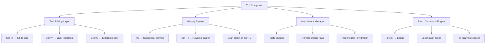
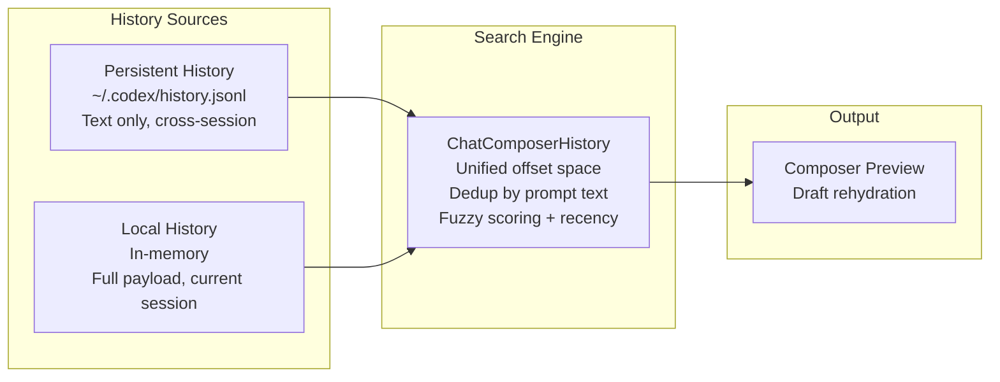

# Mastering the Codex TUI Composer: Ctrl+R History Search, Kill Ring, and Power-User Shortcuts


---

The Codex CLI's TUI composer — the input area where you type prompts — is far more capable than it appears. With v0.121.0 shipping Ctrl+R reverse history search and slash command recall [^1], the composer now rivals shell-level prompt editing. This article maps every keyboard shortcut, explains the dual-layer history system, and demonstrates prompt iteration patterns that eliminate repetitive typing.

## The Composer Is Not a Text Box

Most users treat the Codex TUI composer like a basic text input. It is actually a rich editing environment with a kill ring, dual-source history, draft stashing, image attachment management, and — as of v0.121.0 — incremental reverse search [^2]. Understanding these capabilities transforms your interaction velocity.



## Ctrl+R Reverse History Search

This was one of the most requested features in Codex CLI history. Issue #2622 accumulated 31 upvotes before PR #17550 landed it in v0.121.0 [^3]. The implementation follows the same muscle memory as bash/zsh reverse search, but operates across two history sources.

### How It Works

Press **Ctrl+R** in the composer to enter reverse search mode. The footer line becomes an editable query field while the composer body shows a preview of the currently matched entry [^4].

| Key | Action |
|-----|--------|
| `Ctrl+R` | Enter reverse search / cycle to next match |
| Type characters | Narrows the search query incrementally |
| `Enter` | Accept the previewed match as an editable draft |
| `Esc` or `Ctrl+C` | Cancel search, restore the exact pre-search draft |

The search and composer text remain intentionally separate [^4]. If nothing matches, the original draft stays intact whilst the footer query remains open for further typing. This means you can safely explore history without losing work in progress.

### The Dual-Layer History Architecture

The composer merges two distinct history sources into a single navigable timeline [^4]:

**Persistent history** (`~/.codex/history.jsonl`):

- Survives across sessions
- Text-only restoration — no attachments or text element ranges
- Provides the long-term recall across days and weeks

**Local history** (current session only):

- Stores the complete submission payload
- Includes text elements, local image paths, remote URLs, and pending paste payloads
- Rehydrates placeholders and attachments on recall



`ChatComposerHistory` scans both sources in a single offset space, skips duplicate prompt text within a search session, and sorts results primarily by fuzzy score with recency as a tie-breaker [^4]. Boundary hits (reaching the start or end of history) keep the current match visible rather than wrapping.

### Slash Command Local Recall

v0.121.0 also added local recall for accepted slash commands [^1]. When you use a slash command like `/model gpt-5.4` or `/review`, it enters your local history. This means Ctrl+R can find and replay complex slash command invocations — no need to remember exact syntax.

## The Complete Keyboard Shortcut Reference

Beyond Ctrl+R, the composer supports a rich set of keybindings that most users never discover. Here is the complete reference as of v0.121.0:

### Text Editing

| Shortcut | Action |
|----------|--------|
| `Ctrl+K` | Kill (cut) text from cursor to end of line into kill buffer |
| `Ctrl+Y` | Yank (paste) previously killed text back into draft |
| `Ctrl+G` | Open draft in external editor (`$VISUAL` or `$EDITOR`) [^5] |
| `Ctrl+C` | Clear composer and stash full draft state to local history |
| `Ctrl+L` | Clear screen without starting a new conversation [^5] |

The `Ctrl+K`/`Ctrl+Y` pair implements a basic kill ring — the same concept as Emacs keybindings in your shell. Cut a section of your prompt, type something else, then yank it back.

### History Navigation

| Shortcut | Action |
|----------|--------|
| `↑` / `↓` | Sequential browse through history (persistent + local) |
| `Ctrl+R` | Incremental reverse search |
| `Esc Esc` | Edit previous user message and fork from that point [^5] |

### Submission and Steering

| Shortcut | Action |
|----------|--------|
| `Enter` | Submit message immediately |
| `Tab` | Queue follow-up message if task is running [^5] |
| `Enter` (during execution) | Inject steering instruction mid-turn [^5] |

### Content Insertion

| Shortcut | Action |
|----------|--------|
| `@` | Fuzzy file search — attach files by name [^5] |
| `!` prefix | Run a local shell command directly [^5] |
| `/` prefix | Open slash command popup |
| `?` | Toggle keyboard shortcuts overlay |

### Clipboard and Output

| Shortcut | Action |
|----------|--------|
| `Ctrl+O` | Copy latest agent response to clipboard [^6] |
| `/copy` | Copy latest completed output (also works mid-turn for last completed) [^7] |

## Draft Stashing and Recovery

One of the composer's most underused features is draft stashing. When you press `Ctrl+C`, the composer does not simply clear — it stashes the complete draft state including text elements, image attachments, and pending paste payloads [^4]. Pressing `↑` immediately after restores everything.

This enables a powerful pattern for prompt iteration:

1. Type a complex prompt with file mentions and image attachments
2. Realise you want to check something first
3. `Ctrl+C` to stash the draft
4. Type a quick diagnostic question
5. `↑` after the response to restore your original complex prompt

### Backtrack Prefill

When you use `Esc Esc` to roll back to a prior user message, the composer rehydrates that message's text elements, local image paths, and remote URLs [^4]. This means forking from an earlier point in the conversation preserves the full context of that original prompt — not just the text.

## External Editor Integration

For complex multi-line prompts, `Ctrl+G` opens the current draft in your configured `$VISUAL` or `$EDITOR` [^5]. After editing and saving, the composer rebuilds text elements and keeps only attachments whose placeholders still appear in the edited text. Image placeholders normalise to contiguous numbering with remote rows first [^4].

This is particularly useful for crafting detailed AGENTS.md-style instructions inline, or for editing a long code review prompt that spans multiple paragraphs.

## Paste Burst Detection

A subtle but important feature for Windows terminal users: the composer includes a paste burst detector that handles multiline pastes correctly [^4]. On Windows, these arrive as rapid individual `KeyCode::Char` and `KeyCode::Enter` sequences rather than bracketed paste events.

The detector:

- Buffers rapid character sequences automatically
- Treats `Enter` during a burst as a newline rather than submission — preventing accidental mid-paste message sends
- Handles non-ASCII/IME input carefully to avoid dropped characters

If this causes issues (rare), it can be disabled via the `disable_paste_burst` flag [^4].

## Practical Prompt Iteration Patterns

### Pattern 1: The Refinement Loop

```
You: "Refactor the auth module to use JWT tokens"
[Review output]
Ctrl+R → type "auth" → find original prompt → Enter
[Edit the restored prompt to add constraints]
You: "Refactor the auth module to use JWT tokens, keeping backward compat with session-based auth"
```

### Pattern 2: Slash Command Replay

```
You: /review --base main
[Review output, make changes]
[Later in session...]
Ctrl+R → type "/review" → Enter
[Instantly replays the same review command]
```

### Pattern 3: Draft Stash for Context Switching

```
You: [typing complex refactoring prompt with @src/auth.ts @src/middleware.ts...]
[Realise you need to check current test coverage first]
Ctrl+C  [draft stashed]
You: "What's the current test coverage for the auth module?"
[Read response]
↑  [full draft restored with file mentions intact]
Enter  [submit the original refactoring prompt]
```

### Pattern 4: External Editor for Complex Instructions

```
Ctrl+G  [opens $EDITOR]
[Write a multi-paragraph prompt with code examples, constraints, and edge cases]
[Save and quit editor]
[Composer shows the complete prompt, ready to submit]
Enter
```

## Configuration

The composer's behaviour can be tuned through `ChatComposerConfig` [^4]:

| Setting | Default | Effect |
|---------|---------|--------|
| `popups_enabled` | `true` | Controls command/file/skill popup visibility |
| `slash_commands_enabled` | `true` | Toggles `/command` interpretation |
| `image_paste_enabled` | `true` | Enables file-path paste image attachment |

History persistence is controlled separately via `config.toml`:

```toml
[history]
persistence = "save-all"  # or "none" to disable cross-session history
```

## What This Means for Your Workflow

The TUI composer in v0.121.0 has reached parity with shell-level editing for agent interaction. The Ctrl+R reverse search alone eliminates the most common friction point — retyping variants of prompts you have used before [^3]. Combined with draft stashing, the kill ring, and external editor support, the composer supports rapid prompt iteration without leaving the terminal.

For teams adopting Codex CLI, the key insight is that prompt crafting is itself a skill that benefits from tooling. The same way shell history search transformed command-line productivity decades ago, composer history search transforms agent interaction productivity today.

## Citations

[^1]: OpenAI. "Codex 0.121.0 Release Notes." GitHub Releases, April 15 2026. [https://github.com/openai/codex/releases/tag/rust-v0.121.0](https://github.com/openai/codex/releases/tag/rust-v0.121.0)

[^2]: OpenAI. "Codex 0.121.0 is out!" @Codex_Changelog on X, April 15 2026. [https://x.com/Codex_Changelog/status/2044526487119007827](https://x.com/Codex_Changelog/status/2044526487119007827)

[^3]: mkusaka et al. "Interactive history search." GitHub Issue #2622, closed April 12 2026. [https://github.com/openai/codex/issues/2622](https://github.com/openai/codex/issues/2622)

[^4]: OpenAI. "TUI Chat Composer documentation." GitHub repository, `docs/tui-chat-composer.md`. [https://github.com/openai/codex/blob/main/docs/tui-chat-composer.md](https://github.com/openai/codex/blob/main/docs/tui-chat-composer.md)

[^5]: OpenAI. "Features — Codex CLI." OpenAI Developers documentation. [https://developers.openai.com/codex/cli/features](https://developers.openai.com/codex/cli/features)

[^6]: OpenAI. "Codex Changelog — April 2026." OpenAI Developers. [https://developers.openai.com/codex/changelog](https://developers.openai.com/codex/changelog)

[^7]: OpenAI. "Slash commands in Codex CLI." OpenAI Developers documentation. [https://developers.openai.com/codex/cli/slash-commands](https://developers.openai.com/codex/cli/slash-commands)
