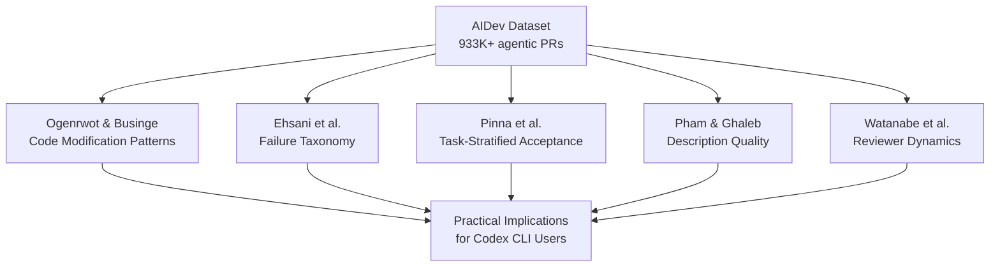
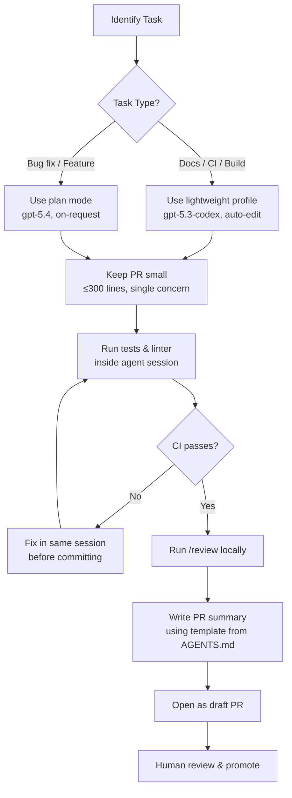

# What 33,000 Agentic Pull Requests Reveal: Empirical Lessons for Codex CLI Practitioners


---

AI coding agents are no longer experimental curiosities — they now submit hundreds of thousands of pull requests to real repositories every month. But how do those contributions actually compare to human ones? And more importantly, what should Codex CLI users do differently based on the evidence?

A cluster of five papers accepted at MSR 2026 (the IEEE/ACM International Conference on Mining Software Repositories) analysed the AIDev dataset — over 933,000 agentic PRs across 61,000 repositories[^1] — and the findings challenge several assumptions about agentic workflows. This article synthesises the key results and maps them to actionable Codex CLI configuration and workflow patterns.

---

## The Data: Five Studies, One Dataset

The MSR 2026 Mining Challenge produced a rare convergence: multiple independent research teams analysing the same corpus of agent-generated pull requests. The studies examined different dimensions of the same phenomenon:

| Study | Focus | Sample | Key Metric |
|---|---|---|---|
| Ogenrwot & Businge[^2] | Code modification patterns | 24,014 agentic vs 5,081 human PRs | Commit structure, files touched |
| Ehsani et al.[^3] | Failure taxonomy | 33,596 agentic PRs (9,582 failed) | 28.5% failure rate |
| Pinna et al.[^4] | Task-stratified acceptance | 7,156 PRs across 5 agents | 82.1% docs vs 66.1% features |
| Pham & Ghaleb[^5] | Description quality & code churn | 33,596 agentic vs 6,618 human PRs | Symbol survival: 3 vs 34 days |
| Watanabe et al.[^6] | Reviewer interaction dynamics | AIDev dataset, 5 agents | PR style ↔ review engagement |



---

## Finding 1: Nearly One in Three Agentic PRs Fails

Ehsani et al. found that **28.52% of agentic PRs fail to merge**[^3]. But the reasons are not what most developers expect. The failure taxonomy breaks down as follows:

| Category | Share | Primary Cause |
|---|---|---|
| Reviewer abandonment | 38% | No meaningful human interaction |
| PR-level issues | 31% | Duplicates (23%), unwanted features (4%) |
| Code-level failures | 22% | CI/test failures (17%), incorrect implementations (3%) |
| Agentic misalignment | 2% | Agent ignores reviewer feedback |
| Licensing issues | <1% | CLA violations |

The dominant failure mode is not bad code — it is **social and workflow misalignment**. Agents submit PRs that nobody asked for, duplicate existing work, or receive no reviewer attention at all[^3].

### What This Means for Codex CLI

The implication is clear: the agent's code quality matters less than its integration into your team's workflow. Configuration that constrains scope and ensures human oversight outperforms configuration that maximises autonomy.

```toml
# config.toml — constrain scope to reduce abandonment and duplication
[policy]
approval = "on-request"        # require approval before tool execution
sandbox = "workspace-write"    # limit filesystem access to project directory

[agents]
max_subagents = 2              # prevent unbounded parallel work
```

Use plan mode (`codex --approval-mode suggest`) for exploratory tasks where the agent might otherwise produce unwanted features. Reserve full-auto for well-scoped, repeatable work like documentation updates and CI fixes.

---

## Finding 2: Task Type Predicts Success Better Than Agent Choice

Pinna et al. found that **task categorisation is the dominant factor** in PR acceptance, with a 16-percentage-point gap between the best and worst task types — larger than the typical inter-agent variance[^4].

| Task Type | Acceptance Rate |
|---|---|
| Documentation | 82.1% |
| CI/Build | ~78% |
| Testing | ~75% |
| Refactoring | ~72% |
| Bug fixes | ~68% |
| New features | 66.1% |

Agent-by-agent merge rates from Ehsani et al. reinforce this: OpenAI Codex achieved 82.59% overall, Claude Code 59.04%, and Copilot 43.04%[^3]. But Pinna et al. showed that when controlled for task type, the differences narrow substantially[^4]. Codex's advantage partly reflects the types of tasks its users assign to it.

### What This Means for Codex CLI

Match the agent to the task, not the other way round. Use Codex CLI's profiles to create task-specific configurations:

```toml
# Profile for documentation tasks — high confidence, relaxed approval
[profiles.docs]
model = "gpt-5.3-codex"       # smaller model suffices for docs
approval = "auto-edit"

# Profile for bug fixes — tighter constraints, plan-first
[profiles.bugfix]
model = "gpt-5.4"
approval = "on-request"
```

```bash
# Launch with task-appropriate profile
codex --profile docs "Update the API reference for the new /users endpoint"
codex --profile bugfix "Fix the race condition in OrderProcessor.submit()"
```

For documentation-class tasks — where agents excel — consider thread automations to run them on a schedule:

```bash
# Weekly documentation freshness check
codex exec --profile docs \
  "Review all public API endpoints and update any stale examples in docs/"
```

---

## Finding 3: Smaller PRs Win, and Each CI Failure Costs 15%

Two findings from the failure analysis have direct operational implications:

1. **Rejected PRs involve 17% more lines of code and touch 10% more files** than successful ones[^3]
2. **Each failed CI check reduces merge odds by approximately 15%**, with a Cliff's delta effect size of 0.24[^3]

The message is unambiguous: agents should produce smaller, focused changesets and validate against CI before submission.

### What This Means for Codex CLI

Structure your AGENTS.md to enforce small, atomic changes:

```markdown
<!-- AGENTS.md -->
## Pull Request Guidelines

- Each PR should address exactly ONE concern (single bug fix, single feature, single refactor)
- Maximum 300 lines changed per PR — if a task requires more, break it into sequential PRs
- Always run the full test suite before committing: `npm test`
- Always run the linter before committing: `npm run lint`
- If CI fails, fix the failure before opening the PR — never submit with known failures
```

For automated workflows via `codex exec` or `codex-action`, add explicit CI validation:

```bash
# Run tests as part of the agent workflow, not after
codex exec "Fix the failing test in auth.spec.ts. \
  After making changes, run 'npm test' to verify all tests pass. \
  Only commit if tests succeed."
```

---

## Finding 4: Agent Code Is Removed Faster Than Human Code

Pham & Ghaleb found that symbols introduced by agents have a **median survival time of 3 days**, compared to 34 days for human-introduced symbols[^5]. The churn rate for agent code is 7.33% versus 4.10% for human code[^5].

This does not necessarily mean agent code is worse — it may reflect that agents are assigned more experimental or iterative tasks. But it does mean that agent-generated code receives less durable trust from maintainers.

### What This Means for Codex CLI

If agent code is revised quickly, the cost of that revision should be minimised. Two strategies help:

**1. Cross-model review before merge.** Use the `/review` command or a cross-provider review loop to catch issues before they reach human reviewers:

```bash
# Local review before pushing
codex /review --diff HEAD~1
```

**2. Treat agent commits as drafts.** Use draft PRs for agent-generated work and promote to ready-for-review only after local validation:

```bash
# Create as draft PR via GitHub CLI
gh pr create --draft --title "docs: update API reference" \
  --body "Agent-generated, pending human review"
```

---

## Finding 5: Agents Write Better Commits but Worse PR Summaries

Pham & Ghaleb found a curious asymmetry: agents produce commit messages with **higher semantic similarity to their diffs** (0.72 vs 0.68 for humans) but **lower-quality PR-level summaries** (0.86 vs 0.88)[^5]. Agents are precise at the micro level but struggle to synthesise across multiple changes into a coherent narrative.

Watanabe et al. confirmed that PR description style is **associated with measurable differences in reviewer engagement, response time, and merge outcomes**[^6]. The way an agent presents its work matters as much as the work itself.

### What This Means for Codex CLI

Compensate for the PR-summary weakness by encoding your team's PR template in AGENTS.md:

```markdown
<!-- AGENTS.md -->
## PR Description Format

When creating a PR description, always include:
1. **Summary**: One paragraph explaining WHY the change was made (not what changed)
2. **Changes**: Bullet list of what was modified and why each change matters
3. **Testing**: How the changes were verified
4. **Risk Assessment**: What could go wrong and how to roll back

Do NOT simply list the files changed or repeat commit messages.
Focus on the reviewer's perspective: what context do they need to approve this?
```

---

## Finding 6: Code Smells Dominate Post-Merge Quality Issues

A complementary study by Jain et al. analysed 1,210 merged agent-generated bug-fix PRs using SonarQube static analysis[^7]. The most common post-merge quality issues were:

| Issue Type | Most Common Violation | Count |
|---|---|---|
| Code smells | Duplicated string literals | 212 |
| Code smells | Excessive cognitive complexity | 157 |
| Code smells | Unused function parameters | 114 |
| Bugs | Incorrect number of function arguments | 23 |
| Security | Weak encryption operations | 33 |

Critically, after normalising for PR size (lines of code changed), **the differences between agents largely disappeared**[^7]. Larger PRs produce more issues, regardless of which agent wrote them — further supporting the "smaller is better" principle.

### What This Means for Codex CLI

Add static analysis to your agent workflow. Codex can run linters as part of its execution loop:

```markdown
<!-- AGENTS.md -->
## Code Quality Gates

Before committing any changes:
1. Run `npx eslint --max-warnings 0 .` (or your project's linter)
2. Run `npx tsc --noEmit` for TypeScript projects
3. Fix any issues found — do not commit with warnings
4. For Python projects: `ruff check . && mypy .`
```

For enterprise teams, combine with the Guardian auto-review model (`codex-auto-review`) to catch quality issues at the model level before they reach static analysis[^8].

---

## The Synthesis: A Research-Backed Codex CLI Workflow



The research converges on six principles:

1. **Constrain scope** — smaller, focused PRs merge at significantly higher rates
2. **Match task to profile** — documentation and CI tasks need less oversight than features and bug fixes
3. **Validate before submission** — each CI failure costs ~15% merge probability
4. **Invest in PR presentation** — description style directly affects reviewer engagement
5. **Treat agent output as draft** — the 3-day median symbol survival suggests maintainers will revise anyway
6. **Run static analysis early** — quality issues scale with PR size, not with agent choice

---

## Limitations and Caveats

These studies carry important caveats. The AIDev dataset captures open-source GitHub contributions, which may not reflect private enterprise repositories where contribution norms differ. The agent identification methodology relies on bot signatures and may misattribute some PRs[^3]. The studies also predate the April 2026 Codex update that introduced built-in memory, thread automations, and the `codex-auto-review` model[^8] — features that may alter the dynamics observed.

⚠️ The merge rates reported (e.g., Codex at 82.59%) reflect the AIDev dataset's agent detection heuristics and should not be interpreted as absolute quality rankings. Different detection methods, repository populations, and time windows could produce different figures.

---

## Citations

[^1]: AIDev Dataset, MSR 2026 Mining Challenge. Available at [https://www.emergentmind.com/topics/agentic-pull-requests-prs](https://www.emergentmind.com/topics/agentic-pull-requests-prs)

[^2]: Ogenrwot, D. & Businge, J. (2026). "How AI Coding Agents Modify Code: A Large-Scale Study of GitHub Pull Requests." MSR 2026 Mining Challenge Track. [arXiv:2601.17581](https://arxiv.org/abs/2601.17581)

[^3]: Ehsani, R., Pathak, S., Rawal, S., Al Mujahid, A., Imran, M. M. & Chatterjee, P. (2026). "Where Do AI Coding Agents Fail? An Empirical Study of Failed Agentic Pull Requests in GitHub." MSR 2026. [arXiv:2601.15195](https://arxiv.org/abs/2601.15195)

[^4]: Pinna, G., Gong, J., Williams, D. & Sarro, F. (2026). "Comparing AI Coding Agents: A Task-Stratified Analysis of Pull Request Acceptance." MSR 2026 Mining Challenge Track. [arXiv:2602.08915](https://arxiv.org/abs/2602.08915)

[^5]: Pham, D. & Ghaleb, T. A. (2026). "Code Change Characteristics and Description Alignment: A Comparative Study of Agentic versus Human Pull Requests." MSR 2026 Mining Challenge Track. [arXiv:2601.17627](https://arxiv.org/abs/2601.17627)

[^6]: Watanabe, K., Tsuchida, R., Monno, T., Huang, B., Yamasaki, K., Fan, Y., Shimari, K. & Matsumoto, K. (2026). "How AI Coding Agents Communicate: A Study of Pull Request Description Characteristics and Human Review Responses." [arXiv:2602.17084](https://arxiv.org/abs/2602.17084)

[^7]: Jain, S. et al. (2026). "Beyond Bug Fixes: An Empirical Investigation of Post-Merge Code Quality Issues in Agent-Generated Pull Requests." MSR 2026. [arXiv:2601.20109](https://arxiv.org/abs/2601.20109)

[^8]: OpenAI (2026). Codex CLI v0.122.0-alpha.5: `codex-auto-review` model for Guardian. PR #18169, [github.com/openai/codex](https://github.com/openai/codex/releases)
