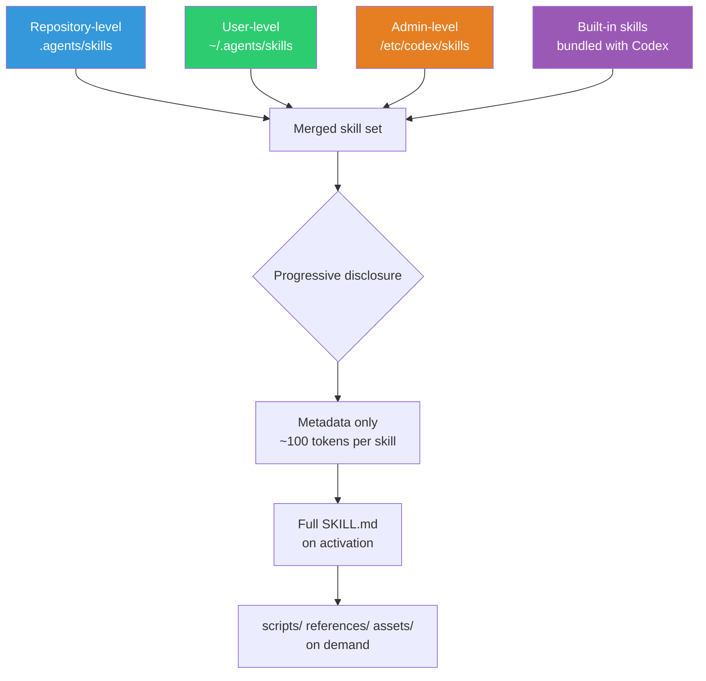
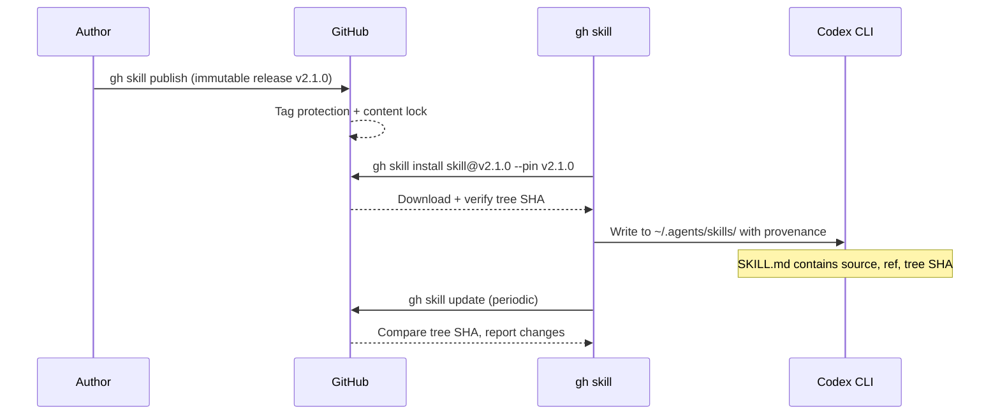

# gh skill: Supply-Chain-Secure Agent Skills from GitHub CLI to Codex CLI


---

On 16 April 2026, GitHub shipped `gh skill` in CLI v2.90.0 — a first-class subcommand for discovering, installing, pinning, updating, and publishing agent skills directly from the terminal[^1][^2]. The timing matters: the agent-skills ecosystem has grown rapidly across Codex CLI, Claude Code, Cursor, Gemini CLI, and others, but until now there was no unified package-manager-style toolchain with provenance guarantees. This article unpacks how `gh skill` works, how it interacts with Codex CLI's skill-loading pipeline, and what it means for teams managing skills at scale.

## What Problem Does gh skill Solve?

Agent skills — portable directories of instructions, scripts, and resources that teach coding agents how to perform specific tasks — follow the open Agent Skills specification hosted at agentskills.io[^3]. The specification standardises the `SKILL.md` format, directory layout, and progressive-disclosure loading model. But the specification deliberately says nothing about *distribution*.

Before `gh skill`, installing a skill meant cloning a repository and manually copying directories into the right location. Updating meant remembering where you got it. Verifying integrity meant trusting the author. For a single developer running a handful of personal skills, that works. For a team deploying twenty skills across four agent hosts, it does not.

`gh skill` fills this gap by providing:

- **Discovery** via `gh skill search`
- **Inspection** before installation via `gh skill preview`
- **Version-pinned installation** with `--pin`
- **Cross-agent-host targeting** with `--agent`
- **Provenance tracking** baked into the installed skill itself
- **Supply-chain hardening** through immutable releases and content-addressed change detection

## The Five Core Subcommands


### search

Browse available skills from any repository that publishes them:

```bash
gh skill search mcp-apps
gh skill search --topic codex --topic infrastructure
```

### preview

Inspect a skill's `SKILL.md`, scripts, and references *before* committing to installation:

```bash
gh skill preview openai/skills terraform-drift
```

### install

Install a skill into the correct directory for your chosen agent host:

```bash
# Install interactively from a skill repository
gh skill install openai/skills

# Install a specific skill at a specific version for Codex CLI
gh skill install openai/skills terraform-drift@v2.1.0 --agent codex --scope user

# Pin to a commit SHA for maximum reproducibility
gh skill install github/awesome-copilot documentation-writer --pin abc123def
```

The `--agent` flag accepts `codex`, `claude-code`, `cursor`, `gemini`, and `antigravity`[^1]. When targeting Codex CLI, `gh skill` writes to the appropriate directory in the Codex skill hierarchy.

### update

Scan installed skills, read provenance metadata, and check upstream for changes:

```bash
# Interactive update check
gh skill update

# Update a single skill
gh skill update terraform-drift

# Update everything non-interactively
gh skill update --all
```

### publish

Validate skills against the Agent Skills specification and optionally enable immutable releases:

```bash
# Dry-run validation
gh skill publish --dry-run

# Publish with auto-fix for metadata issues
gh skill publish --fix
```

The publish step checks remote settings including tag protection, secret scanning, and code scanning configuration[^2].

## How Codex CLI Loads Skills

Understanding how `gh skill install --agent codex` maps to Codex CLI's runtime requires knowing the skill-loading hierarchy. Codex CLI scans four tiers in order[^4]:



When `gh skill install` targets `--agent codex --scope user`, the skill directory lands in `~/.agents/skills/<skill-name>/`. At startup, Codex reads only the `name` and `description` fields from each `SKILL.md` frontmatter — roughly 100 tokens per skill[^3]. The full body loads only when the skill activates, and referenced files (`scripts/`, `references/`, `assets/`) load only on demand. This progressive-disclosure model means you can install dozens of skills without bloating your context window.

Skills can be disabled without removal via `~/.codex/config.toml`:

```toml
[[skills.config]]
path = "/home/dev/.agents/skills/terraform-drift/SKILL.md"
enabled = false
```

## Provenance: Supply-Chain Security That Travels with the Skill

The standout feature of `gh skill` is portable provenance. When it installs a skill, it writes tracking metadata directly into the `SKILL.md` frontmatter[^1]:

```yaml
---
name: terraform-drift
description: Detect and remediate Terraform state drift using plan output analysis.
metadata:
  gh-skill-source: openai/skills
  gh-skill-ref: v2.1.0
  gh-skill-tree-sha: a1b2c3d4e5f6
---
```

Because provenance data lives *inside* the skill file, it travels with the skill regardless of how it is subsequently copied, committed to a monorepo, or synced across machines. `gh skill update` reads this metadata to determine whether a newer version is available upstream, using content-addressed change detection based on the git tree SHA[^2].

### Immutable Releases

When publishing with `gh skill publish`, you can enable immutable releases. This prevents post-publication alteration of release content, even by repository admins[^1]. Combined with tag pinning at install time, this gives teams a guarantee chain:



## Practical Patterns for Teams

### Pattern 1: Monorepo Skill Distribution

For teams that vendor skills into their repository:

```bash
# Install project-level skills pinned to a release
gh skill install myorg/agent-skills api-reviewer@v3.0.0 --agent codex --scope project
gh skill install myorg/agent-skills db-migration@v3.0.0 --agent codex --scope project

# Skills land in .agents/skills/ and can be committed
git add .agents/skills/
git commit -m "chore: pin agent skills to v3.0.0"
```

Every developer cloning the repository gets the same skills at the same version. The provenance metadata in each `SKILL.md` enables automated freshness checks in CI.

### Pattern 2: Cross-Agent Skill Sharing

A skill authored for one agent often works across others. Install the same skill for multiple hosts:

```bash
gh skill install myorg/skills code-reviewer --agent codex
gh skill install myorg/skills code-reviewer --agent claude-code
```

The Agent Skills specification ensures `SKILL.md` is portable[^3]. Agent-specific behaviour goes in the `compatibility` field:

```yaml
---
name: code-reviewer
description: Reviews pull request diffs for security, performance, and style issues.
compatibility: Requires git and access to the internet.
---
```

### Pattern 3: CI Skill Validation

Add skill validation to your publishing pipeline:

```bash
# In CI: validate all skills before release
gh skill publish --dry-run

# Check that all installed skills are up to date
gh skill update --all --dry-run 2>&1 | grep -c "outdated"
```

## The SKILL.md Specification

For teams authoring skills to distribute via `gh skill`, the specification defines clear constraints[^3]:

| Field | Required | Notes |
|---|---|---|
| `name` | Yes | 1–64 chars, lowercase alphanumeric + hyphens, must match directory name |
| `description` | Yes | 1–1024 chars, should describe *what* and *when* |
| `license` | No | License name or reference to bundled file |
| `compatibility` | No | 1–500 chars, environment requirements |
| `metadata` | No | Arbitrary key-value pairs (used by `gh skill` for provenance) |
| `allowed-tools` | No | Space-separated pre-approved tools (experimental) |

The `allowed-tools` field is particularly interesting for Codex CLI's sandbox model. A skill can declare upfront which tools it needs:

```yaml
allowed-tools: Bash(git:*) Bash(terraform:*) Read
```

This reduces approval friction in stricter sandbox configurations, though support varies across agent implementations[^3].

## Security Considerations

`gh skill` brings package-manager ergonomics but inherits package-manager risks. GitHub's own documentation warns: "Skills are installed at your own discretion. They are not verified by GitHub and may contain prompt injections, hidden instructions, or malicious scripts"[^1].

For enterprise deployments, consider:

- **Always pin to tags or SHAs** — never install from `HEAD`
- **Enable immutable releases** on skill repositories you publish
- **Review skills with `gh skill preview`** before installation
- **Use `/etc/codex/skills` for admin-managed, audited skills** that override user-level installations
- **Validate provenance metadata in CI** — if the `gh-skill-tree-sha` changes unexpectedly, investigate

⚠️ The `allowed-tools` field is experimental and its enforcement behaviour may differ between agent hosts. Do not rely on it as a sole security boundary.

## What This Means for the Ecosystem

`gh skill` represents GitHub treating agent skills as a first-class supply-chain artefact alongside packages, containers, and actions. The parallels to `gh extension` are deliberate — both use the same install-update-publish lifecycle, and `gh extension install` gained unauthenticated public release support in the same v2.90.0 release[^2].

For Codex CLI users specifically, `gh skill` solves the "works on my machine" problem for skills. A team can now declare their skill dependencies in version control, pin them to immutable releases, and verify provenance automatically. Combined with Codex CLI's progressive-disclosure loading and the `codex marketplace add` command for plugin-level distribution[^5], the toolchain for managing agent customisation at scale is maturing rapidly.

---

## Citations

[^1]: [Manage agent skills with GitHub CLI — GitHub Changelog](https://github.blog/changelog/2026-04-16-manage-agent-skills-with-github-cli/)
[^2]: [Release GitHub CLI 2.90.0 — cli/cli](https://github.com/cli/cli/releases/tag/v2.90.0)
[^3]: [Agent Skills Specification — agentskills.io](https://agentskills.io/specification)
[^4]: [Agent Skills — Codex CLI | OpenAI Developers](https://developers.openai.com/codex/skills)
[^5]: [Changelog — Codex | OpenAI Developers](https://developers.openai.com/codex/changelog)
