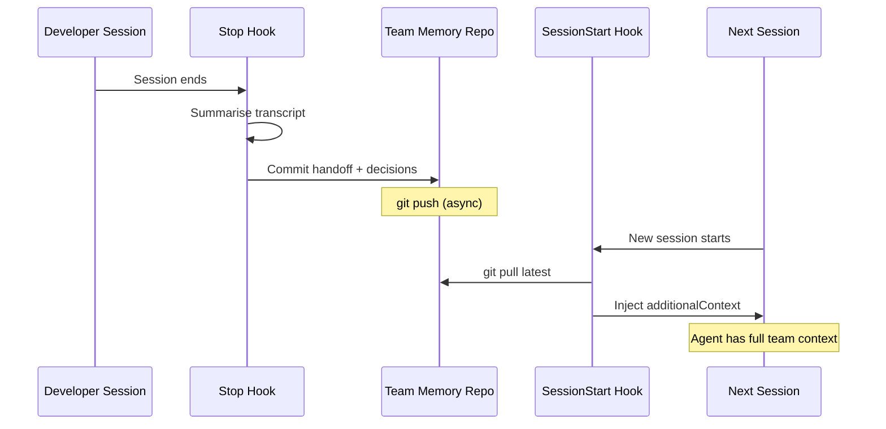

# Git-Backed Team Memory for Coding Agents: From Egregore to Codex Hooks


---

Every developer team already has a shared, versioned, conflict-resolving knowledge store: git. Yet most AI coding agents treat memory as a single-user concern — personal context that evaporates when the session ends or a different team member picks up the work. Egregore, an open-source shared cognition layer for Claude Code that launched on Show HN on 18 April 2026[^1], demonstrates that git-backed team memory is not only viable but remarkably practical. This article maps Egregore's three-pillar architecture to Codex CLI equivalents, showing how to build cross-session, cross-developer team memory using hooks, AGENTS.md composition, and the built-in memory system.

## The Problem: Context Fragmentation Across Sessions and Developers

When three developers and their agents work on the same codebase, each agent accumulates session-specific knowledge — architectural decisions, debugging insights, API quirks — that dies with the session. The next developer starts cold. Manual handoff documents help, but they're rarely written and never structured consistently enough for an agent to consume programmatically.

Egregore's insight is that the coordination primitives already exist in git: branching for isolation, merging for reconciliation, commit history for provenance, and pull requests for review[^2]. The missing piece is a protocol layer that structures *what* gets written and *when* it gets read.

## Egregore's Three-Pillar Architecture

Egregore transforms Claude Code into a multiplayer environment through three interlocking components[^1][^2]:

```mermaid
graph TB
    subgraph "Pillar 1: Identity"
        ED[egregore.md<br/>Team values, norms, principles]
    end

    subgraph "Pillar 2: Memory Repo"
        MR[memory/ git repo]
        MR --> P[people/]
        MR --> H[handoffs/]
        MR --> K[knowledge/<br/>decisions/ + patterns/]
        MR --> I[infrastructure/]
    end

    subgraph "Pillar 3: Protocol Commands"
        HC[/handoff — context transfer]
        RC[/reflect — knowledge capture]
        AC[/activity — team visibility]
        IC[/invite — onboarding]
        SC[/save — git workflows]
        DR[/deep-reflect — cross-referencing]
    end

    ED -->|loaded at session start| MR
    HC -->|writes to| H
    RC -->|writes to| K
    AC -->|reads from| MR

    style ED fill:#f9f,stroke:#333
    style MR fill:#bbf,stroke:#333
```

### Pillar 1: The Identity Document

`egregore.md` is an evolving document that captures the team's values, operational norms, and architectural principles[^2]. It functions as a team-level AGENTS.md — not instructions for a single project, but shared cognitive context for the entire group. Every session loads it, ensuring agents operate with consistent team identity regardless of which developer initiated the session.

### Pillar 2: The Memory Repository

A separate git repository (symlinked into the working tree as `memory/`) stores versioned team knowledge[^3]:

- **`people/`** — Team member profiles and working styles
- **`handoffs/`** — Structured session summaries with an index
- **`knowledge/decisions/`** — Organisational choices with rationale
- **`knowledge/patterns/`** — Emergent team patterns surfaced through reflection
- **`infrastructure/`** — Service registry and system topology

Every write is a git commit. Every read checks the latest state. The entire history is browsable, searchable, and auditable outside the agent[^3].

### Pillar 3: Protocol Commands

Six slash commands provide the coordination protocol[^2]:

| Command | Purpose | Memory Effect |
|---|---|---|
| `/handoff` | Transfer context between sessions | Writes structured summary to `handoffs/` |
| `/reflect` | Capture decisions and insights | Writes to `knowledge/` |
| `/deep-reflect` | Cross-reference across knowledge base | Reads and connects existing entries |
| `/activity` | Team-wide work visibility | Aggregates across all stored sessions |
| `/invite` | Onboard new team members | Grants access with full context inheritance |
| `/save` | Automated git stage, commit, PR | Enforces versioning best practices |

## Mapping Egregore to Codex CLI

Egregore is built on Claude Code hooks[^1], but every pattern it implements has a direct Codex CLI equivalent. Here's how to build the same capabilities.

### Team-Level AGENTS.md via `@include`

Egregore's identity document maps to a team-level AGENTS.md. Codex CLI's proposed `@include` directive (issue #17401[^4]) enables composable instruction files:

```markdown
# .codex/AGENTS.md (project-level)
@~/.codex/team/identity.md
@~/.codex/team/coding-standards.md
@docs/architecture-decisions.md

## Project-Specific Instructions
- Use the repository's existing error handling patterns
- All new endpoints require OpenAPI specs
```

The `@include` directive is a CLI-side text transformation during instruction assembly — no API changes required[^4]. Until it ships, a `SessionStart` hook can achieve the same effect by injecting team context via `additionalContext`.

### Session-Start Context Sync

Egregore pulls accumulated team context on every session start. In Codex CLI, a `SessionStart` hook does the same[^5]:

```json
{
  "hooks": {
    "SessionStart": [
      {
        "type": "command",
        "command": "bash .codex/hooks/team-sync.sh",
        "statusMessage": "Syncing team context...",
        "timeout": 15000
      }
    ]
  }
}
```

The hook script pulls the latest team memory and injects it:

```bash
#!/usr/bin/env bash
# .codex/hooks/team-sync.sh

TEAM_MEMORY_DIR="$HOME/.codex/team-memory"

# Pull latest team knowledge
if [ -d "$TEAM_MEMORY_DIR/.git" ]; then
    git -C "$TEAM_MEMORY_DIR" pull --rebase --quiet 2>/dev/null
fi

# Read recent decisions and active handoffs
RECENT_DECISIONS=$(find "$TEAM_MEMORY_DIR/knowledge/decisions" \
    -name "*.md" -mtime -7 -exec cat {} + 2>/dev/null | head -c 2000)

ACTIVE_HANDOFFS=$(cat "$TEAM_MEMORY_DIR/handoffs/index.md" 2>/dev/null \
    | head -c 1500)

# Inject as additional context
cat <<EOF
{
  "hookSpecificOutput": {
    "hookEventName": "SessionStart",
    "additionalContext": "## Team Context (auto-synced)\n\n### Recent Decisions\n${RECENT_DECISIONS}\n\n### Active Handoffs\n${ACTIVE_HANDOFFS}"
  }
}
EOF
```

The `additionalContext` field adds developer context that the model receives before the first prompt[^5], giving the agent immediate awareness of team state.

### Structured Handoffs via Stop Hooks

When a session ends, a `Stop` hook captures the session's knowledge and commits it to the team memory repo:

```json
{
  "hooks": {
    "Stop": [
      {
        "type": "command",
        "command": "bash .codex/hooks/handoff-capture.sh",
        "statusMessage": "Capturing session handoff...",
        "timeout": 30000
      }
    ]
  }
}
```

```bash
#!/usr/bin/env bash
# .codex/hooks/handoff-capture.sh

# Read session context from stdin
SESSION_DATA=$(cat)
SESSION_ID=$(echo "$SESSION_DATA" | jq -r '.session_id')
TRANSCRIPT_PATH=$(echo "$SESSION_DATA" | jq -r '.transcript_path')

TEAM_MEMORY_DIR="$HOME/.codex/team-memory"
HANDOFF_FILE="$TEAM_MEMORY_DIR/handoffs/$(date +%Y-%m-%d)-${SESSION_ID:0:8}.md"

# Use codex exec to summarise the transcript
if [ -f "$TRANSCRIPT_PATH" ]; then
    SUMMARY=$(cat "$TRANSCRIPT_PATH" | codex exec \
        "Summarise this session: key decisions, files changed, \
         open threads, and gotchas for the next developer. \
         Output structured markdown." 2>/dev/null)

    mkdir -p "$TEAM_MEMORY_DIR/handoffs"
    echo "$SUMMARY" > "$HANDOFF_FILE"

    cd "$TEAM_MEMORY_DIR"
    git add handoffs/
    git commit -m "handoff: session $SESSION_ID" --quiet
    git push --quiet 2>/dev/null
fi
```

This mirrors Egregore's `/handoff` command but runs automatically on every session close[^2].

### The Reflect Loop: Knowledge Consolidation

Egregore's `/reflect` captures insights; `/deep-reflect` cross-references them[^2]. In Codex CLI, this maps to a periodic consolidation pattern — either triggered manually or via a scheduled automation:



The reflection step can use Codex CLI's built-in two-phase memory pipeline (extract → integrate)[^6] extended to team scope: raw session transcripts feed into extraction, and the resulting insights merge into the shared knowledge repository rather than personal memory alone.

## Comparison: Three Approaches to Agent Memory

The ecosystem has converged on three distinct strategies[^7][^8][^9]:

| Approach | Example | Storage | Verification | Team Support |
|---|---|---|---|---|
| **Git-backed files** | Egregore, Letta Context Repos | Git repository | Version history | Native (merge/branch) |
| **Citation-verified** | GitHub Copilot Memory | Repository-scoped DB | Real-time code citation checks | Per-repository |
| **Progressive palace** | MemPalace | ChromaDB + SQLite | Vector similarity | Single-user |

Git-backed memory has a structural advantage for teams: conflict resolution, branching, and access control are solved problems[^7]. Letta's Context Repositories independently arrived at the same architecture, using git worktrees to enable concurrent subagent memory writes that merge back through standard git operations[^7].

GitHub Copilot's agentic memory takes a different approach — storing memories with code citations that are verified in real-time before use[^8]. This provides accuracy guarantees (3% precision increase, 4% recall increase in evaluation[^8]) but is repository-scoped and platform-locked.

MemPalace achieves impressive benchmark scores (96.6% on LongMemEval[^9]) through its progressive-disclosure architecture, but operates as a single-user system with no native team coordination.

## Why Git Beats Cloud Memory Services for Small Teams

The argument for git-as-memory-substrate over centralised services is pragmatic[^3][^7]:

1. **Zero new infrastructure** — Every team already has git hosting, CI, and access controls
2. **Offline-first** — Memory works without network connectivity; sync happens on push/pull
3. **Auditable** — `git log` and `git blame` provide complete provenance
4. **Conflict resolution** — Concurrent writes from multiple agents resolve through standard merge strategies
5. **Portable** — No vendor lock-in; memory is plain markdown files in a repository
6. **Cost** — Free, versus per-seat pricing for managed memory services

The trade-off is query sophistication. Vector-search-backed systems like MemPalace can retrieve semantically similar memories without exact keyword matches[^9]. Git-backed systems rely on file organisation and grep — effective for structured knowledge, less so for fuzzy recall. For teams writing structured decisions and handoffs, this trade-off favours git.

## Practical Implementation Checklist

To implement git-backed team memory in Codex CLI today:

1. **Create a team memory repository** with the directory structure: `knowledge/decisions/`, `knowledge/patterns/`, `handoffs/`, `people/`
2. **Add a `SessionStart` hook** that pulls the repo and injects recent context via `additionalContext`
3. **Add a `Stop` hook** that summarises the session transcript and commits a handoff document
4. **Add team-level AGENTS.md content** — either via `@include` (when available) or injected through the `SessionStart` hook
5. **Set up periodic consolidation** — a scheduled `codex exec` job that deduplicates and cross-references accumulated knowledge
6. **Configure access** — use the same branch protection and code review rules you'd use for production code

The entire system requires no custom infrastructure beyond what's already in your development workflow. Git is the memory layer. Hooks are the sync mechanism. AGENTS.md is the identity document.

## Citations

[^1]: [Egregore — Shared Cognition for Teams and Agents](https://egregore.xyz/) and [Show HN discussion](https://news.ycombinator.com/item?id=47806427), April 18, 2026
[^2]: [Egregore Shared Memory Documentation](https://egregore.xyz/docs/concepts/memory), Egregore Docs, 2026
[^3]: Daniel Vaughan, internal notes: [egregore-shared-cognition-patterns.md](#), 2026-04-18
[^4]: [feat: @include directive for composable AGENTS.md files · Issue #17401](https://github.com/openai/codex/issues/17401), openai/codex, April 11, 2026
[^5]: [Hooks – Codex | OpenAI Developers](https://developers.openai.com/codex/hooks), OpenAI, 2026
[^6]: [Features – Codex CLI | OpenAI Developers](https://developers.openai.com/codex/cli/features), OpenAI, 2026
[^7]: [Introducing Context Repositories: Git-based Memory for Coding Agents](https://www.letta.com/blog/context-repositories), Letta, 2026
[^8]: [Building an agentic memory system for GitHub Copilot](https://github.blog/ai-and-ml/github-copilot/building-an-agentic-memory-system-for-github-copilot/), GitHub Blog, 2026
[^9]: [MemPalace: 170 Tokens to Recall Everything](https://recca0120.github.io/en/2026/04/08/mempalace-ai-memory-system/), recca0120, April 8, 2026
