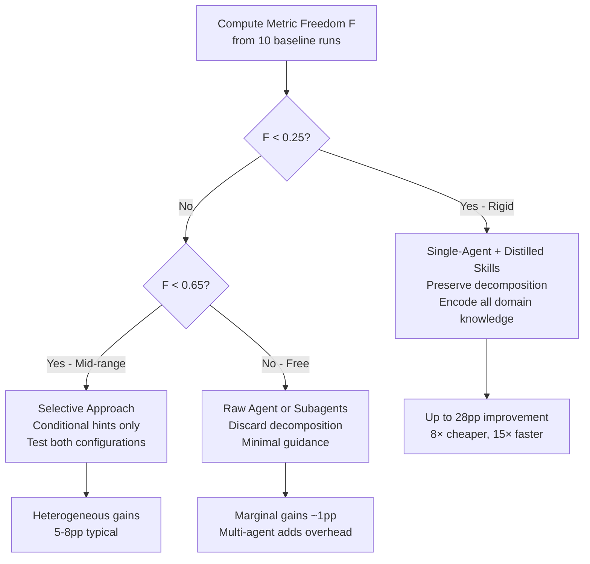
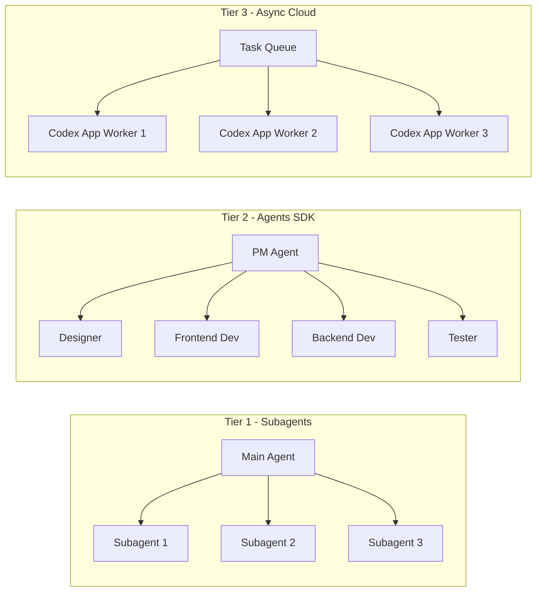

# When to Use Multi-Agent vs Single-Agent: A Practical Framework for Codex CLI Teams


---

Codex CLI's subagent system lets you spawn parallel agents for concurrent work — but more agents does not always mean better results. Recent academic research formalises what many practitioners have felt intuitively: the decision to go multi-agent or stay single-agent depends not on the task itself, but on the *shape of the evaluation metric* you are optimising for[^1]. This article translates that research into a practical decision framework for Codex CLI teams.

## The Core Insight: Metric Freedom Determines Strategy

In April 2026, Xu et al. published "From Multi-Agent to Single-Agent: When Is Skill Distillation Beneficial?"[^1], introducing the concept of **Metric Freedom (F)** — a measure of how rigidly a metric constrains acceptable outputs.

The formula is straightforward:

```
F = 1 − ρ(D_out, D_score)
```

Where ρ is the Spearman rank correlation between output diversity and score variance, computed via a Mantel test[^1].

- **Low F (≈ 0, "rigid")** — One correct answer exists. Output variation maps directly to score variation. Single-agent with distilled skills excels.
- **High F (≈ 1, "free")** — Diverse outputs score similarly. The raw agent already explores effectively. Multi-agent coordination overhead buys you nothing.

The striking finding: identical agent trajectories produced *diametrically opposite* outcomes depending on the metric. A skill that improved causal estimation by 28 percentage points *degraded* performance on a free-form metric for the same task[^1].



## How Codex CLI Subagents Work

Before applying the framework, you need to understand what Codex CLI actually offers. Subagents are parallel child agents spawned from your main session, each running independently and returning summaries[^2].

**Key characteristics:**

- **Manual triggering only** — Codex never spawns subagents autonomously. You must explicitly request them with prompts like "spawn two agents" or "use one agent per point"[^2].
- **Each subagent runs its own model and tool calls** — this means higher token consumption than equivalent single-agent work[^2].
- **Results return as summaries** — noisy intermediate output stays off the main thread[^2].

### Model Selection for Subagents

Codex CLI supports per-agent model configuration[^2]:

| Role | Recommended Model | Reasoning Effort |
|------|------------------|-----------------|
| Main orchestrator | `gpt-5.4` | `high` |
| Read-heavy subagent | `gpt-5.4-mini` | `medium` |
| Fast exploration | `gpt-5.4-mini` | `low` |
| Security review | `gpt-5.4` | `high` |

You can set these in your agent configuration file:

```toml
[model]
name = "gpt-5.4-mini"
reasoning_effort = "medium"
```

## The Decision Framework: When to Use Each Pattern

### Pattern 1: Single-Agent with Skills (F < 0.25)

**Use when:** The task has a clear correct answer — CI/CD pipeline fixes, type error resolution, deterministic refactors, test generation against a specification.

**Why it works:** Rigid metrics mean the search space is narrow. A single well-prompted agent with encoded domain knowledge navigates it more efficiently than multiple agents coordinating[^1]. The research showed cost reductions of 1.4–8× and latency reductions up to 15× compared to multi-agent configurations[^1].

**Codex CLI approach:** Invest in your `AGENTS.md` file and project-specific instructions rather than spawning subagents.

```markdown
<!-- AGENTS.md -->
## CI Fix Protocol
1. Read the failing test output completely before proposing changes
2. Check if the failure is flaky (search git log for prior occurrences)
3. Fix the root cause, not the symptom
4. Run the full test suite before committing
```

Single-agent systems also exploit **prompt caching** effectively — achieving 30–40% cost savings on cached prompts — whilst multi-agent systems with dynamic inter-agent communication cannot cache effectively[^1].

### Pattern 2: Multi-Agent Subagents (F > 0.65)

**Use when:** The task is read-heavy, highly parallelisable, and outputs are evaluated flexibly — codebase exploration, log triage, multi-file review, documentation generation.

**Why it works:** When diverse outputs score similarly, the overhead of coordination is wasted. Instead, use subagents for *embarrassingly parallel* read operations where each agent has a bounded, independent scope[^2][^3].

**Codex CLI approach:**

```
Review this branch with parallel subagents.
Spawn one subagent for security risks,
one for test coverage gaps,
and one for maintainability issues.
Wait for all three, then summarise findings by category.
```

Research from Addy Osmani's analysis of multi-agent coding patterns confirms this: "Three focused agents consistently outperform one generalist agent working three times as long" — but specifically for read-heavy, parallelisable work[^3].

### Pattern 3: Selective (0.25 ≤ F ≤ 0.65)

**Use when:** The task has structure but permits variation — feature implementation, API design, refactoring with multiple valid approaches.

**Why it works:** Mid-range freedom metrics show heterogeneous gains. Text-to-SQL tasks (F ≈ 0.50) saw 5.8–8.8 percentage point improvements from skill distillation[^1], but results vary enough that you should benchmark both approaches.

**Codex CLI approach:** Start single-agent with conditional hints, then measure. If the task decomposes into independent subtasks, selectively spawn subagents for the parallelisable portions.

## Beyond Subagents: The Three Orchestration Tiers

Codex CLI's subagent model is one of three available orchestration approaches, each suited to different scales[^3][^4]:



### Tier 1: Built-in Subagents

Zero setup. Single terminal. Best for ad hoc parallel reads with 2–5 agents[^2].

### Tier 2: Agents SDK Orchestration

Expose Codex CLI as an MCP server and orchestrate with the OpenAI Agents SDK[^4]:

```bash
codex mcp-server
```

Then build deterministic pipelines in Python:

```python
from agents import Agent, Runner
from agents.mcp import MCPServerStdio

async with MCPServerStdio(
    name="Codex CLI",
    params={"command": "npx", "args": ["-y", "codex", "mcp-server"]},
    client_session_timeout_seconds=360000,
) as codex_mcp:
    reviewer = Agent(
        name="Reviewer",
        instructions="Review code for security issues.",
        mcp_servers=[codex_mcp],
    )
    implementer = Agent(
        name="Implementer",
        instructions="Implement features per spec.",
        mcp_servers=[codex_mcp],
    )
```

This tier supports handoffs between agents, file-existence verification gates, and full tracing via the OpenAI dashboard[^4]. Use `approval-policy: never` and `sandbox: workspace-write` for unattended execution[^4].

### Tier 3: Cloud Async

Assign tasks to Codex App workers for overnight batch processing. Combine with `codex exec` for CI integration[^5].

## Practical Decision Tree

For teams adopting this framework, here is the concrete workflow:

1. **Characterise your metric.** Run 10 baseline single-agent attempts. Compute F from the output diversity vs. score variance correlation[^1].
2. **Route by F value:**
   - F < 0.25 → Invest in `AGENTS.md`, single-agent with rich context
   - 0.25 ≤ F ≤ 0.65 → A/B test both configurations, use conditional subagents
   - F > 0.65 → Spawn parallel subagents for read-heavy work
3. **Select the orchestration tier** based on team size and automation needs.
4. **Measure token costs.** Multi-agent runs consume linearly more tokens[^3]. Route subagents to `gpt-5.4-mini` where possible[^2].

## Cost Reality Check

Multi-agent workflows are not free. Key cost drivers to monitor:

- **Token scaling**: Each subagent runs its own context window. Three subagents ≈ 3× the token cost of a single agent[^2][^3].
- **Model routing**: Using `gpt-5.4-mini` for subagents whilst keeping `gpt-5.4` for the orchestrator can reduce costs by 40–60%[^2].
- **Prompt caching losses**: Single-agent workflows benefit from 30–40% prompt cache savings; multi-agent workflows forfeit this[^1].
- **AGENTS.md overhead**: Research shows LLM-generated `AGENTS.md` files offer no benefit and can reduce success rates by ~3% whilst increasing inference costs by over 20%[^3]. Human-curated context documents are essential.

## When Not to Use Multi-Agent

Avoid multi-agent patterns when:

- **Write-heavy work** — multiple agents editing simultaneously creates merge conflicts and coordination overhead[^2][^3]
- **Tight deadlines** — subagent spawning adds latency for the initial fork and final aggregation
- **Simple, sequential tasks** — a single agent with a good `AGENTS.md` is faster and cheaper
- **Your metric is rigid (F < 0.25)** — skill distillation into a single agent yields up to 28pp improvements[^1]

## Conclusion

The multi-agent vs. single-agent decision is not about capability — it is about the structure of what you are optimising for. Codex CLI gives you the tools for both approaches: rich `AGENTS.md` configuration for single-agent depth, built-in subagents for parallel breadth, and Agents SDK integration for full orchestration pipelines. The Metric Freedom framework provides the missing decision criterion: compute F, then route accordingly.

---

## Citations

[^1]: Xu, B., Fang, D., Li, H., & Zhang, K. (2026). "From Multi-Agent to Single-Agent: When Is Skill Distillation Beneficial?" *arXiv:2604.01608*. [https://arxiv.org/abs/2604.01608](https://arxiv.org/abs/2604.01608)

[^2]: OpenAI. "Subagents – Codex." *OpenAI Developers Documentation*. [https://developers.openai.com/codex/concepts/subagents](https://developers.openai.com/codex/concepts/subagents)

[^3]: Osmani, A. "The Code Agent Orchestra — What Makes Multi-Agent Coding Work." *AddyOsmani.com*. [https://addyosmani.com/blog/code-agent-orchestra/](https://addyosmani.com/blog/code-agent-orchestra/)

[^4]: OpenAI. "Use Codex with the Agents SDK." *OpenAI Developers Documentation*. [https://developers.openai.com/codex/guides/agents-sdk](https://developers.openai.com/codex/guides/agents-sdk)

[^5]: OpenAI. "Introducing Upgrades to Codex." *OpenAI Blog*. [https://openai.com/index/introducing-upgrades-to-codex/](https://openai.com/index/introducing-upgrades-to-codex/)
