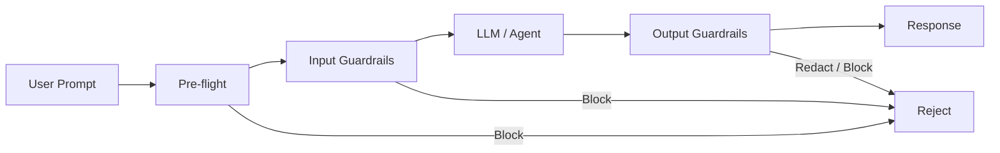
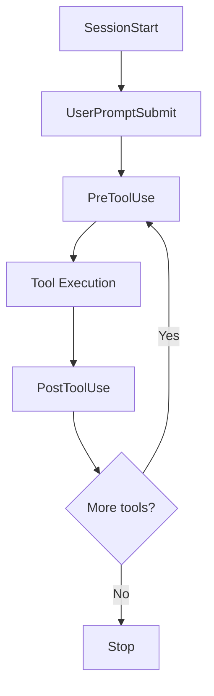
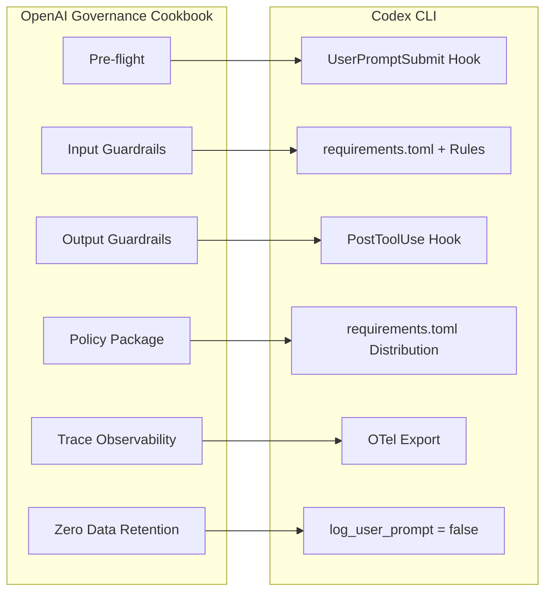

# Policy-as-Code for Coding Agents: From the OpenAI Governance Cookbook to Codex CLI guardrails


---

Every organisation deploying coding agents hits the same wall: security wants to audit, legal wants guardrails, and engineering wants to ship. OpenAI's *Building Governed AI Agents* cookbook [^1] provides a reference architecture for policy-as-code in multi-agent systems. This article maps that pattern onto Codex CLI's enterprise governance stack — `requirements.toml`, execution policy rules, hooks, and OpenTelemetry — and identifies where Codex already delivers and where gaps remain.

## The Cookbook's Three-Stage Guardrails Pipeline

The governance cookbook defines a three-stage pipeline enforced through a `GuardrailsOpenAI` client wrapper [^1]:



| Stage | When | Purpose |
|-------|------|---------|
| **Pre-flight** | Before LLM call | Validate the request meets organisational policy — topic scope, format constraints |
| **Input** | On user input | PII detection, jailbreak prevention, content moderation |
| **Output** | On agent response | Content filtering, sensitive data redaction, hallucination flagging |

Critically, guardrails **halt execution via exceptions** rather than silently modifying responses [^1]. This fail-loud design prevents partially-compliant outputs from reaching production.

### Policy-as-Code Distribution

The cookbook packages governance configuration as a pip-installable Python module [^1]:

```bash
pip install git+https://github.com/yourorg/policies.git
```

Any team importing the package inherits organisation-wide compliance controls. Configuration travels with the code — versioned, tested, and auditable through standard Git workflows.

## Codex CLI's Native Governance Stack

Codex CLI already ships a multi-layered governance system. The challenge is understanding how each layer maps to the cookbook's patterns and where they diverge.

### Layer 1: requirements.toml — Admin-Enforced Constraints

`requirements.toml` is Codex's declarative policy-as-code mechanism [^2]. Administrators define constraints that users cannot override, applied across CLI, App, and IDE Extension surfaces.

```toml
# Restrict to safe execution modes
allowed_approval_policies = ["untrusted", "on-request"]
allowed_sandbox_modes = ["read-only", "workspace-write"]
allowed_web_search_modes = ["cached"]

# Pin feature flags
[features]
codex_hooks = true
multi_agent = false

# Block destructive commands organisation-wide
[rules]
prefix_rules = [
  { pattern = [{ token = "rm" }], decision = "forbidden" },
  { pattern = [{ token = "git" }, { any_of = ["push", "reset"] }],
    decision = "prompt",
    justification = "Require review before mutating remote history." }
]
```

The enforcement precedence is strict — earlier layers win per field [^2]:

1. **Cloud-managed requirements** (ChatGPT Business/Enterprise)
2. **macOS managed preferences** (MDM via `com.openai.codex:requirements_toml_base64`)
3. **System requirements.toml** (`/etc/codex/requirements.toml` on Unix)

This maps directly to the cookbook's policy distribution model: a central policy repository with immutable enforcement, except Codex uses TOML-based config rather than Python packages.

### Layer 2: Execution Policy Rules — Command-Level Gating

Codex's `.rules` files use Starlark syntax to define fine-grained command execution policies [^3]. Rules live in `.codex/rules/` directories and are scanned across all config layers at startup.

```python
# .codex/rules/security.rules
prefix_rule(
    pattern = ["docker", "run", "--privileged"],
    decision = "forbidden",
    justification = "Privileged containers violate security policy. Use rootless mode.",
    match = ["docker run --privileged nginx"],
    not_match = ["docker run --rm nginx"],
)

prefix_rule(
    pattern = ["gh", "pr", "merge"],
    decision = "prompt",
    justification = "PR merges require human review.",
)
```

When multiple rules match, the strictest decision wins: `forbidden` > `prompt` > `allow` [^3]. Rules can be validated offline using `codex execpolicy check`:

```bash
codex execpolicy check --pretty \
  --rules ~/.codex/rules/security.rules \
  -- docker run --privileged nginx
```

Administrators can enforce restrictive `prefix_rule` entries organisation-wide via `requirements.toml` [^2], closing the loop between local development rules and enterprise policy.

### Layer 3: Hooks — Procedural Guardrails

Hooks inject custom scripts into the agentic loop at five lifecycle events [^4]:



Enable hooks via `config.toml`:

```toml
[features]
codex_hooks = true
```

A `hooks.json` file placed at `~/.codex/hooks.json` or `<repo>/.codex/hooks.json` defines handlers per event [^4]:

```json
{
  "hooks": {
    "PreToolUse": [
      {
        "matcher": "Bash",
        "hooks": [
          {
            "type": "command",
            "command": "/usr/bin/python3 .codex/hooks/policy-check.py",
            "statusMessage": "Checking command against policy"
          }
        ]
      }
    ],
    "UserPromptSubmit": [
      {
        "matcher": "",
        "hooks": [
          {
            "type": "command",
            "command": ".codex/hooks/scan-secrets.sh",
            "statusMessage": "Scanning for credentials"
          }
        ]
      }
    ]
  }
}
```

A `PreToolUse` hook can block execution by returning a deny decision [^4]:

```json
{
  "hookSpecificOutput": {
    "hookEventName": "PreToolUse",
    "permissionDecision": "deny",
    "permissionDecisionReason": "Command violates data residency policy."
  }
}
```

⚠️ Hooks are currently marked experimental and disabled on Windows [^4].

### Layer 4: OpenTelemetry — Compliance Observability

Codex exports traces via OpenTelemetry, covering API requests, tool invocations, and approval decisions [^5]:

```toml
[otel]
exporter = "otlp-http"
log_user_prompt = false
```

Setting `log_user_prompt = false` ensures raw prompts never leave the local environment — essential for Zero Data Retention (ZDR) compliance [^5]. Administrators can pin OTel settings in `requirements.toml` to prevent users from disabling observability.

## Mapping: Cookbook Patterns to Codex CLI



| Cookbook Pattern | Codex CLI Equivalent | Coverage |
|----------------|---------------------|----------|
| Pre-flight guardrails | `UserPromptSubmit` hooks | ✅ Functional — scan prompts before agent acts |
| Input guardrails | `requirements.toml` + Starlark rules + sandbox restrictions | ✅ Strong — declarative + command-level gating |
| Output guardrails | `PostToolUse` hooks | ⚠️ Partial — cannot undo side effects from already-executed commands |
| Policy-as-code package | `requirements.toml` + MDM/cloud distribution | ✅ Native — multi-layer enforcement hierarchy |
| Trace observability | OTel export configuration | ✅ Native — OTLP-HTTP/gRPC with configurable verbosity |
| Zero Data Retention | `log_user_prompt = false` + custom hook redaction | ✅ Supported — hook lifecycle enables PII scrubbing |
| Exception-based halting | Hook exit codes (non-zero = block) | ✅ Functional — deny decisions halt execution |

## Building a Complete Governance Pipeline

Here is a practical three-file setup that implements the full cookbook pattern within Codex CLI:

**1. Organisation policy (`/etc/codex/requirements.toml`):**

```toml
allowed_approval_policies = ["untrusted", "on-request"]
allowed_sandbox_modes = ["workspace-write"]
allowed_web_search_modes = ["disabled"]

[features]
codex_hooks = true

[rules]
prefix_rules = [
  { pattern = [{ token = "curl" }], decision = "prompt",
    justification = "Network requests require approval." },
  { pattern = [{ token = "rm" }, { token = "-rf" }], decision = "forbidden",
    justification = "Recursive deletion blocked by policy." }
]

[otel]
exporter = "otlp-http"
log_user_prompt = false
```

**2. Secret scanning hook (`.codex/hooks/scan-secrets.sh`):**

```bash
#!/usr/bin/env bash
# Pre-flight: block prompts containing API keys
INPUT=$(cat)
PROMPT=$(echo "$INPUT" | jq -r '.userPrompt // empty')

if echo "$PROMPT" | grep -qE '(sk-[a-zA-Z0-9]{20,}|ghp_[a-zA-Z0-9]{36})'; then
  echo '{"decision":"block","reason":"Prompt contains what appears to be an API key. Remove it before resubmitting."}'
  exit 0
fi
echo '{}'
```

**3. Hook registration (`.codex/hooks.json`):**

```json
{
  "hooks": {
    "UserPromptSubmit": [
      {
        "matcher": "",
        "hooks": [
          {
            "type": "command",
            "command": "bash .codex/hooks/scan-secrets.sh",
            "statusMessage": "Scanning for credentials"
          }
        ]
      }
    ]
  }
}
```

## The Wider Industry Context

Policy-as-code for coding agents is not an OpenAI-only concern. Microsoft's Agent Governance Toolkit, released in April 2026 under the MIT licence, provides a seven-package runtime security system addressing all ten OWASP agentic AI risk categories [^6]. It includes execution rings modelled on CPU privilege levels, saga orchestration for multi-step rollback, and integration hooks for LangChain, CrewAI, and Google ADK [^6].

The convergence is clear: every major platform is moving towards **declarative, versionable, auditable policy enforcement** for autonomous agents. Codex CLI's `requirements.toml` + hooks architecture is well-positioned, but teams should track the emerging standards — particularly OWASP's agentic AI top 10 [^7] — to ensure their governance configurations remain comprehensive.

## Gap Analysis: Where Codex CLI Needs to Evolve

Three areas where the cookbook's patterns expose limitations in the current Codex CLI governance story:

1. **Declarative guardrails config** — The cookbook uses a structured JSON schema defining pre-flight/input/output policies declaratively. Codex CLI's equivalent requires writing procedural hook scripts. A native `guardrails.toml` defining entity detection rules, moderation categories, and content filters without custom code would close this gap.

2. **Built-in entity detection** — The cookbook includes ready-made PII scanners (SSN, credit cards, medical licences, crypto addresses) with configurable confidence thresholds. Codex CLI has no built-in entity detection; teams must bring their own scanning in hooks.

3. **Trace-level data residency** — While `log_user_prompt = false` provides session-level ZDR, the cookbook supports per-trace data residency routing via custom trace processors. Codex CLI's OTel integration does not yet support per-trace routing decisions.

These gaps represent genuine feature requests rather than architectural limitations — the hook system provides the extensibility to work around each one today, but native support would reduce the governance burden for enterprise teams.

## Citations

[^1]: OpenAI, "Building Governed AI Agents — A Practical Guide to Agentic Scaffolding," OpenAI Cookbook, February 2026. [https://developers.openai.com/cookbook/examples/partners/agentic_governance_guide/agentic_governance_cookbook](https://developers.openai.com/cookbook/examples/partners/agentic_governance_guide/agentic_governance_cookbook)

[^2]: OpenAI, "Managed Configuration — Codex Enterprise," OpenAI Developers, 2026. [https://developers.openai.com/codex/enterprise/managed-configuration](https://developers.openai.com/codex/enterprise/managed-configuration)

[^3]: OpenAI, "Rules — Codex," OpenAI Developers, 2026. [https://developers.openai.com/codex/rules](https://developers.openai.com/codex/rules)

[^4]: OpenAI, "Hooks — Codex," OpenAI Developers, 2026. [https://developers.openai.com/codex/hooks](https://developers.openai.com/codex/hooks)

[^5]: OpenAI, "Advanced Configuration — Codex," OpenAI Developers, 2026. [https://developers.openai.com/codex/config-advanced](https://developers.openai.com/codex/config-advanced)

[^6]: Microsoft, "Introducing the Agent Governance Toolkit: Open-source runtime security for AI agents," Microsoft Open Source Blog, April 2026. [https://opensource.microsoft.com/blog/2026/04/02/introducing-the-agent-governance-toolkit-open-source-runtime-security-for-ai-agents/](https://opensource.microsoft.com/blog/2026/04/02/introducing-the-agent-governance-toolkit-open-source-runtime-security-for-ai-agents/)

[^7]: OWASP, "OWASP Top 10 for Agentic AI," 2026. [https://owasp.org/www-project-top-10-for-large-language-model-applications/](https://owasp.org/www-project-top-10-for-large-language-model-applications/)
