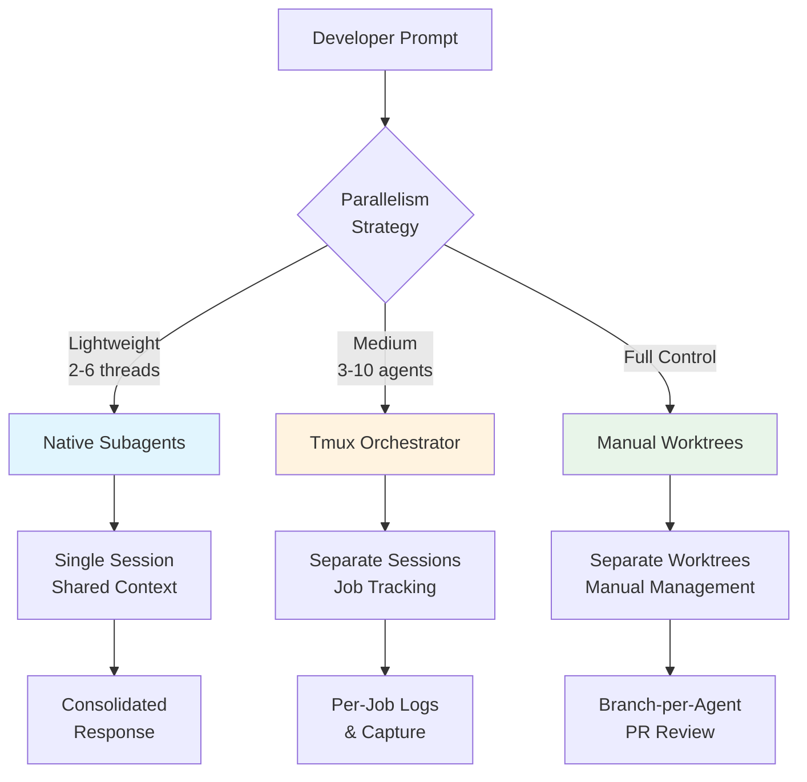

# Running Multiple Codex Agent Instances: Parallel Orchestration Patterns


Running a single Codex CLI agent is powerful. Running several in parallel — each tackling an independent slice of your codebase — transforms your throughput entirely. This article covers the three main approaches to parallel Codex execution: native subagents, tmux-based orchestrators, and manual git worktree patterns.

## Why Parallel Agents?

Modern codebases contain independent subsystems that can be modified concurrently. A frontend refactor, an API endpoint addition, and a test coverage gap can all be addressed simultaneously if each agent operates in isolation. The constraint is not compute — it is preventing agents from trampling each other's changes[^1].

Three developments in late 2025 and early 2026 made this practical: CLI agents became reliable enough to work unsupervised, git worktrees solved the isolation problem, and orchestration tooling matured around tmux[^2].

## Approach 1: Native Codex Subagents

Codex CLI has built-in support for spawning subagents — child agents that execute tasks in parallel threads within a single session[^3]. This is the lightest-weight approach and requires no external tooling.

### Triggering Subagents

Subagents spawn only when explicitly requested. Structure your prompt to decompose work:

```
Spawn one agent per module: fix the auth bug in src/auth/,
add validation to src/api/orders.ts, and update the tests
in tests/integration/. Wait for all, then summarise results.
```

Codex orchestrates the parallel execution, routes follow-up instructions to active threads, and returns a consolidated response once all agents complete[^3].

### Configuration

Subagent behaviour is controlled in `config.toml` under the `[agents]` section[^3]:

```toml
[agents]
max_threads = 6          # concurrent thread cap (default: 6)
max_depth = 1            # nesting depth — prevents recursive delegation
job_max_runtime_seconds = 300  # timeout per CSV batch worker
```

### Managing Active Threads

The `/agent` command provides runtime thread management[^3]:

- Switch between active threads
- Inspect progress on any running thread
- Steer, pause, or terminate individual agents

When an inactive thread raises an approval request during an interactive session, press `o` to open that thread before responding[^3].

### Custom Agent Roles

Beyond the three built-in agents (`default`, `worker`, `explorer`), you can define custom agents as TOML files[^3]:

```toml
# ~/.codex/agents/reviewer.toml
name = "reviewer"
description = "Code review specialist — reads but never writes"
developer_instructions = """
Review the provided files for bugs, security issues, and style violations.
Report findings but do not modify any files.
"""
sandbox_mode = "read-only"
```

Project-scoped agents live in `.codex/agents/` and inherit the parent session's sandbox policies and runtime overrides[^3].

### CSV Batch Processing

For repetitive tasks across many targets, the experimental `spawn_agents_on_csv` tool processes rows in parallel[^3]:

```
Process this CSV of API endpoints. For each row, generate
integration tests using the {method} and {path} columns.
```

Each worker calls `report_agent_job_result` exactly once, and Codex exports combined results to a CSV with metadata[^3].

### Subagent Trade-offs

Subagents are convenient but carry costs. Token consumption scales linearly with thread count — each subagent runs its own model inference[^3]. The default `max_depth=1` prevents recursive delegation, which is sensible: nested subagents can rapidly exhaust context windows and budgets.

## Approach 2: Tmux-Based Orchestrators

For heavier parallelism — five or more agents working independently on separate branches — external orchestrators provide better visibility and control than native subagents.

### Codex-Orchestrator

Codex-orchestrator spawns Codex agents in separate tmux sessions, enabling background execution with immediate job tracking[^4]:

```bash
# Install via Claude Code plugin
/plugin marketplace add kingbootoshi/codex-orchestrator
/plugin install codex-orchestrator

# Or manually
curl -fsSL https://raw.githubusercontent.com/kingbootoshi/codex-orchestrator/main/install.sh | bash
```

Key commands[^4]:

```bash
# Launch an agent
codex-orchestrator start "refactor the auth module to use JWT"

# Monitor all running agents
codex-orchestrator jobs --json

# Send a follow-up instruction mid-task
codex-orchestrator send <job-id> "also add rate limiting"

# Capture recent output
codex-orchestrator capture <job-id> 100
```

Each job stores metadata, the original prompt, and a complete terminal transcript in `~/.codex-agent/jobs/`[^4]. The `--map` flag injects a `CODEBASE_MAP.md` into agent prompts for instant architectural context[^4].

### Codex-YOLO

Codex-yolo optimises for speed by auto-approving permission prompts whilst preserving OS-level sandboxing (Landlock/seccomp on Linux, Seatbelt on macOS)[^5]:

```bash
# Install
curl -fsSL https://raw.githubusercontent.com/codex-yolo/codex-yolo/refs/heads/main/install.sh | bash

# Run three agents in parallel
codex-yolo "fix the login bug" "add unit tests for auth" "update the README"

# Specify model and working directory
codex-yolo -m o4-mini -d /path/to/project "refactor the API layer"
```

The launcher spawns one tmux window per task. An approver daemon polls every 0.3 seconds, detecting permission prompts via two-tier signal matching and sending confirmations automatically[^5]. A 2-second per-pane cooldown prevents duplicate approvals, with a full audit log at `/tmp/codex-yolo-<session>.log`[^5].

> **⚠️ Warning:** Auto-approval tools reduce human oversight. Use them only in sandboxed environments with expendable branches — never on production code or shared mainlines.

### Oh My Codex (OMX)

OMX adds session persistence, hooks, and structured workflows (autopilot, TDD, code review, planning) on top of Codex CLI[^6]. It spawns parallel workers in isolated git worktrees, preventing write conflicts during simultaneous edits[^6].

## Approach 3: Manual Git Worktree Patterns

If you prefer full control without third-party tooling, git worktrees plus tmux give you everything you need.

### Setting Up Isolated Worktrees

```bash
# Create worktrees for each agent's task
git worktree add -b feature/auth-refactor ../agent-auth main
git worktree add -b feature/api-orders ../agent-api main
git worktree add -b fix/test-coverage ../agent-tests main

# Verify
git worktree list
```

Each worktree shares the `.git` object database but has its own working directory, HEAD, and staging area[^7]. Agents cannot interfere with each other's uncommitted changes.

### Launching Agents in Tmux

```bash
# Create a tmux session with three panes
tmux new-session -d -s agents -c ../agent-auth
tmux send-keys -t agents "codex 'Refactor auth to use JWT tokens'" Enter

tmux split-window -h -t agents -c ../agent-api
tmux send-keys -t agents "codex 'Add order validation endpoint'" Enter

tmux split-window -v -t agents -c ../agent-tests
tmux send-keys -t agents "codex 'Increase test coverage to 80%'" Enter

tmux attach -t agents
```

### Resource Considerations

Parallel agents consume significant resources. Key numbers to watch[^7][^8]:

| Resource | Concern | Mitigation |
|----------|---------|------------|
| **RAM** | Each agent uses 8–10 GB | Limit to 3–5 concurrent agents |
| **Disk** | Worktrees duplicate build artefacts | Use `pnpm` for shared packages; clean build dirs |
| **Ports** | Dev servers collide on defaults | Index ports: `BASE_PORT + (WORKTREE_INDEX * 10)` |
| **Tokens** | Linear cost scaling per agent | Set per-agent budgets; pause at 85% threshold |
| **Database** | Shared local DBs create race conditions | Use separate DB instances or test databases per worktree |

### Cleanup

```bash
# After merging, remove worktrees
git worktree remove ../agent-auth
git worktree remove ../agent-api
git worktree remove ../agent-tests

# Prune stale references
git worktree prune
```

## Orchestration Architecture

The following diagram shows how the three approaches relate:



## Best Practices

**Scope work clearly.** Each agent should own a distinct set of files. Overlapping file ownership creates merge conflicts that consume more time than the parallelism saves[^1].

**Use AGENTS.md for shared context.** Document architectural decisions, style conventions, and gotchas so every agent follows the same rules. Critically, only humans should write this file — LLM-generated context files provide no measurable benefit[^9].

**Set iteration limits.** Enforce a maximum of 8 iterations per agent with forced reflection prompts before retries. This prevents agents from looping endlessly on identical failing approaches[^9].

**Budget tokens aggressively.** Set hard per-agent token budgets (e.g., 180k for frontend tasks, 280k for backend). Auto-kill agents stuck after 3+ iterations on the same error[^9].

**Keep agent count manageable.** 3–5 concurrent agents is the practical sweet spot for active development. Beyond that, the review burden exceeds the generation throughput — the bottleneck shifts from writing code to verifying it[^9].

**Dedicate a reviewer agent.** Spawn a permanent read-only agent that runs linting, tests, and security checks on every task completion. This creates an automated quality gate before human review[^9].

## Choosing the Right Approach

| Factor | Native Subagents | Tmux Orchestrator | Manual Worktrees |
|--------|-----------------|-------------------|------------------|
| **Setup effort** | None | Plugin install | Shell scripting |
| **Agent count** | 2–6 | 3–10+ | Unlimited |
| **Isolation** | Thread-level | Session-level | Full worktree |
| **Visibility** | `/agent` command | `jobs --json` | `tmux` panes |
| **Best for** | Quick decomposition | Sustained parallel work | Enterprise/custom pipelines |

Start with native subagents for ad-hoc parallelism. Graduate to an orchestrator when you regularly run more than three agents or need persistent job logs. Use manual worktrees when your workflow demands custom integration with CI/CD pipelines or enterprise tooling.

## Citations

[^1]: Simon Willison, "Embracing the parallel coding agent lifestyle," October 2025. [https://simonwillison.net/2025/Oct/5/parallel-coding-agents/](https://simonwillison.net/2025/Oct/5/parallel-coding-agents/)
[^2]: Vibecoding.app, "Agentmaxxing: Run Multiple AI Agents in Parallel," 2026. [https://vibecoding.app/blog/agentmaxxing](https://vibecoding.app/blog/agentmaxxing)
[^3]: OpenAI, "Subagents – Codex," OpenAI Developers Documentation, 2026. [https://developers.openai.com/codex/subagents](https://developers.openai.com/codex/subagents)
[^4]: kingbootoshi, "codex-orchestrator," GitHub, 2026. [https://github.com/kingbootoshi/codex-orchestrator](https://github.com/kingbootoshi/codex-orchestrator)
[^5]: codex-yolo, "codex-yolo: Run parallel OpenAI Codex CLI agents in tmux," GitHub, 2026. [https://github.com/codex-yolo/codex-yolo](https://github.com/codex-yolo/codex-yolo)
[^6]: scalarian, "oh-my-codex (OMX)," GitHub, 2026. [https://github.com/staticpayload/oh-my-codex](https://github.com/staticpayload/oh-my-codex)
[^7]: Upsun, "Git worktrees for parallel AI coding agents," Upsun Developer Documentation, 2026. [https://developer.upsun.com/posts/2026/git-worktrees-for-parallel-ai-coding-agents](https://developer.upsun.com/posts/2026/git-worktrees-for-parallel-ai-coding-agents)
[^8]: Patrick D'Appollonio, "How to run multiple Claude Code or Codex agents in parallel against a single codebase," 2026. [https://www.patrickdap.com/post/how-to-run-multiple-agents/](https://www.patrickdap.com/post/how-to-run-multiple-agents/)
[^9]: Addy Osmani, "The Code Agent Orchestra — what makes multi-agent coding work," AddyOsmani.com, 2026. [https://addyosmani.com/blog/code-agent-orchestra/](https://addyosmani.com/blog/code-agent-orchestra/)
