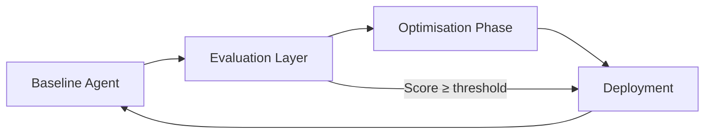
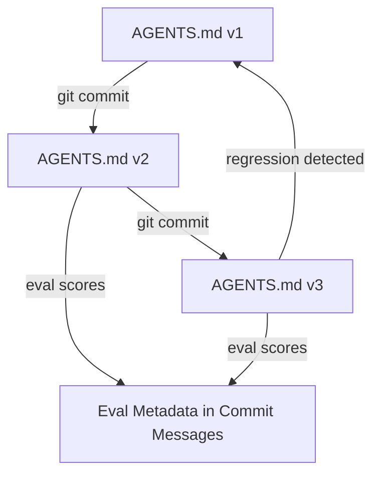
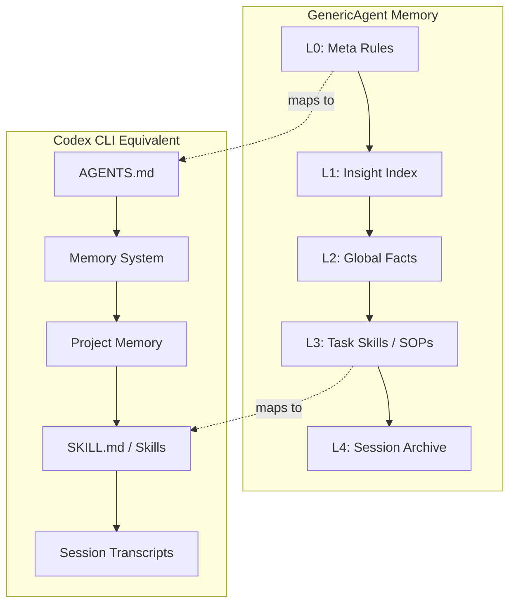
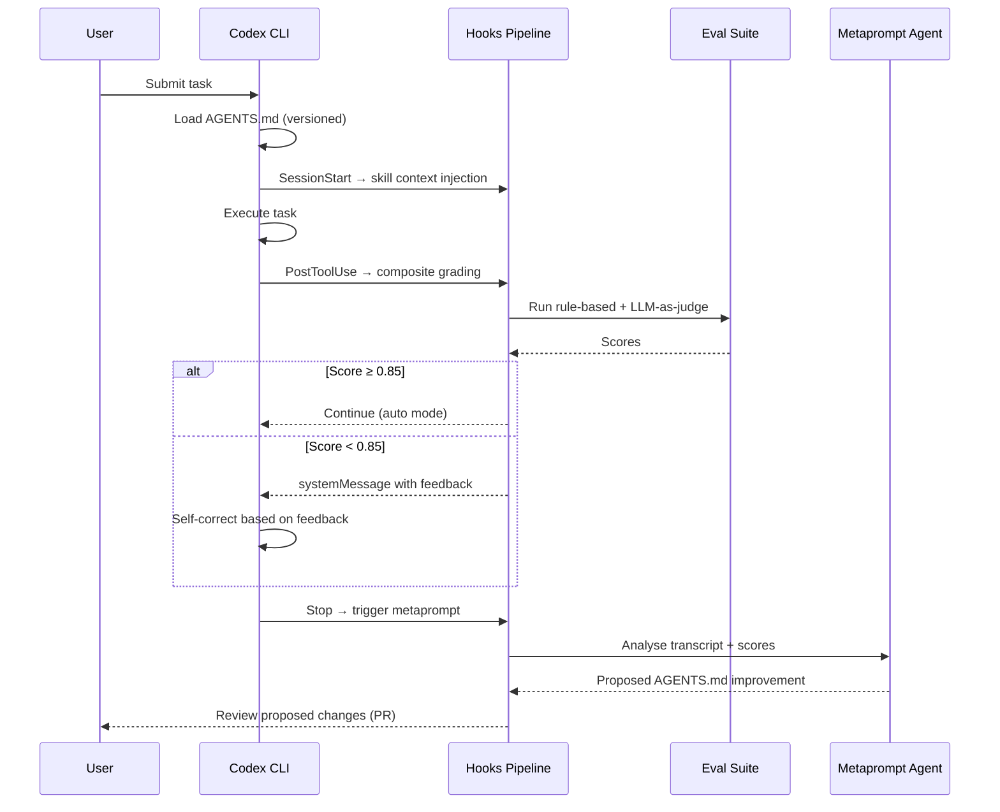

# Self-Evolving Agents in Practice: Implementing the OpenAI Cookbook Retraining Loop with Codex CLI Hooks


---

Most agentic systems plateau after proof-of-concept. The agent handles the happy path, but edge cases accumulate, prompts drift, and performance quietly degrades. The official OpenAI Cookbook now provides a reference architecture for **self-evolving agents** — systems that diagnose their own failures, capture structured feedback, and iteratively refine their behaviour through autonomous retraining loops[^1]. This article maps that architecture onto Codex CLI's hook system, showing how to build a self-improving coding agent using tools you already have.

## The Retraining Loop: Four Stages

The cookbook's core pattern is a closed feedback loop with four stages[^1]:



1. **Baseline Agent** executes a task using the current prompt configuration
2. **Evaluation Layer** scores the output through composite grading (rule-based validators + LLM-as-judge)
3. **Optimisation Phase** feeds failure signals to a metaprompt agent that generates improved instructions
4. **Deployment** replaces the baseline prompt when the improved version exceeds target thresholds

The loop continues until scores pass (typically ≥0.85 average across graders) or a retry budget of three attempts is exhausted, at which point human escalation triggers[^1].

## Composite Grading: Why One Metric Isn't Enough

The cookbook employs four complementary graders to prevent single-metric optimisation[^1]:

| Grader | Type | Threshold | Purpose |
|--------|------|-----------|---------|
| Entity preservation | Rule-based | 0.80 | Ensures critical terms survive summarisation |
| Length discipline | Deterministic | 0.85 | Maintains target word count ±20% |
| Semantic consistency | Cosine similarity | 0.85 | Guards against content drift |
| Holistic quality | LLM-as-judge | 0.85 | Captures nuanced signals rules miss |

The lenient pass criteria require either ≥75% of graders to pass individually, or an average score ≥0.85 across all four[^1]. This accommodates scenarios where perfection on every dimension simultaneously isn't achievable.

For Codex CLI, the natural mapping is a **PostToolUse hook** that runs composite validation after each tool execution:

```json
{
  "hooks": [
    {
      "event": "PostToolUse",
      "matcher": "Bash",
      "command": ".codex/hooks/composite-grader.sh",
      "statusMessage": "Running composite evaluation..."
    }
  ]
}
```

The hook receives the executed command and its output via stdin JSON[^2], enabling a grader script to run linting, type checking, test suites (rule-based) and optionally pipe the output through an LLM-as-judge evaluation.

> **Note:** PostToolUse hooks currently only fire for the Bash tool[^2]. Apply Patch events do not yet trigger hooks (tracked in issue #16732[^3]). Plan your grading pipeline around Bash-based validation commands.

## Prompt Versioning via AGENTS.md Git History

The cookbook's `VersionedPrompt` class tracks prompt iterations with immutable version numbers, timestamps, and associated eval metadata[^1]. In Codex CLI, you get this for free through **AGENTS.md under version control**.



Codex walks down from the project root to your current working directory, concatenating `AGENTS.md` files found along the path[^4]. Files closer to the working directory override earlier guidance because they appear later in the combined prompt[^4]. This hierarchical resolution means you can version task-specific instructions independently of project-level rules.

A practical versioning workflow:

```bash
# After a successful eval run, commit the improved AGENTS.md
git add AGENTS.md
git commit -m "agents: v14 — improve error handling instructions

Eval scores: entity=0.92, length=0.88, semantic=0.91, quality=0.87
Average: 0.895 (target: 0.85) — PASS
Previous version average: 0.81"

# If a regression surfaces, revert cleanly
git revert HEAD --no-edit
```

Each commit message becomes the audit trail — the `eval_id` and `run_id` equivalent from the cookbook's `PromptVersionEntry`[^1].

## The Metaprompt Pattern: An Agent That Rewrites Its Own Instructions

The cookbook's most powerful concept is the **metaprompt agent** — a dedicated agent that receives the original prompt, the failed output, and specific grader feedback, then generates an improved prompt[^1]. It's the "self-evolving" core: the system writes better instructions for itself.

In Codex CLI, implement this as a **Stop hook** that triggers a secondary Codex session:

```bash
#!/usr/bin/env bash
# .codex/hooks/metaprompt-optimiser.sh
# Triggered by the Stop hook event

INPUT=$(cat)
STOP_REASON=$(echo "$INPUT" | jq -r '.stopReason // empty')

# Only trigger on task completion, not user interrupts
if [ "$STOP_REASON" != "task_complete" ]; then
  echo '{"continue": false}'
  exit 0
fi

# Run eval suite against the session transcript
TRANSCRIPT=$(echo "$INPUT" | jq -r '.transcript_path')
EVAL_SCORE=$(codex exec "Evaluate the quality of the work in $TRANSCRIPT against our grading rubric in .codex/eval-rubric.md. Return a JSON score object." 2>/dev/null | jq -r '.average_score')

if (( $(echo "$EVAL_SCORE < 0.85" | bc -l) )); then
  # Trigger metaprompt optimisation
  codex exec "You are a prompt optimisation agent. Read the current AGENTS.md instructions and the session transcript at $TRANSCRIPT. The composite eval score was $EVAL_SCORE (target: 0.85). Generate an improved AGENTS.md that addresses the identified weaknesses. Write the result to AGENTS.md.proposed" 2>/dev/null

  echo '{"systemMessage": "Eval score below threshold. Proposed AGENTS.md improvement generated.", "continue": false}'
else
  echo '{"continue": false}'
fi
```

The Stop hook supports `continue`, `stopReason`, and `systemMessage` fields[^2]. Setting `continue: false` with a `systemMessage` ensures the feedback is logged without forcing further agent execution.

## Skill Crystallisation: From Sessions to Reusable Knowledge

GenericAgent (3.9K ⭐) independently arrived at the same pattern through its **L3 task skills layer** — successful complex task executions are crystallised into reusable SOPs stored for direct invocation on future similar tasks[^5]. The framework claims 6× less token consumption than comparable agents by using layered memory (L0–L4) instead of massive context windows[^5].



| GenericAgent Layer | Purpose | Codex CLI Analogue |
|-------------------|---------|-------------------|
| L0 — Meta Rules | Behavioural constraints | `AGENTS.md` system prompt |
| L1 — Insight Index | Fast routing and recall | Built-in memory system[^4] |
| L2 — Global Facts | Accumulated knowledge | Project-level memory |
| L3 — Task Skills | Reusable workflows | Skills / `SKILL.md` files |
| L4 — Session Archive | Long-horizon recall | Session transcripts (JSONL) |

For Codex CLI, skill crystallisation can be implemented through a **SessionStart hook** that analyses previous session transcripts and extracts reusable patterns:

```bash
#!/usr/bin/env bash
# .codex/hooks/skill-crystalliser.sh
# Runs on SessionStart to check for crystallisation opportunities

INPUT=$(cat)
SOURCE=$(echo "$INPUT" | jq -r '.source')

# Only run on fresh sessions, not resumes
if [ "$SOURCE" = "resume" ]; then
  echo '{"continue": true}'
  exit 0
fi

# Check for recent successful sessions worth crystallising
RECENT=$(find ~/.codex/sessions -name "*.jsonl" -mtime -1 -type f | head -5)
if [ -n "$RECENT" ]; then
  CONTEXT="Review these recent sessions for repeatable patterns worth crystallising into SKILL.md entries: $RECENT"
  echo "{\"additionalContext\": \"$CONTEXT\", \"continue\": true}"
else
  echo '{"continue": true}'
fi
```

SessionStart hooks support the `additionalContext` field[^2], which injects developer context into the session without appearing as a system message. This primes the agent to consider skill crystallisation without overriding the user's actual task.

## EvoMap/Evolver: Governed Evolution with Audit Trails

EvoMap's Evolver (4.4K ⭐) takes a more formal approach through its **Genome Evolution Protocol (GEP)**[^6]. Where the cookbook evolves prompts and GenericAgent evolves skills, Evolver evolves structured **genes** — reusable improvement patterns bundled into capsules with a full audit trail[^6].

The evolution strategies map well to Codex CLI's profile system:

| Evolver Strategy | Mix | Codex CLI Profile Equivalent |
|-----------------|-----|------------------------------|
| `balanced` | 50% innovate, 30% optimise, 20% repair | Default development profile |
| `innovate` | 80% new features | Greenfield/prototyping profile |
| `harden` | Stability focus | Pre-release CI profile |
| `repair-only` | Emergency mode | Production incident response |

All three frameworks — the OpenAI Cookbook, GenericAgent, and Evolver — converge on the same fundamental cycle: execute → evaluate → improve → deploy[^7]. The implementation details differ (prompts vs skills vs genes), but the architectural pattern is identical.

## Approval Mode Escalation as Threshold Enforcement

The cookbook's lenient pass thresholds (75% grader pass rate or 0.85 average)[^1] map naturally to Codex CLI's **approval mode escalation**. Configure progressively stricter modes based on evaluation confidence:

```toml
# config.toml — profile-based escalation
[profile.high-confidence]
approval-mode = "auto-edit"  # Score ≥ 0.90: full autonomy

[profile.moderate-confidence]
approval-mode = "suggest"    # Score 0.85–0.90: suggestions only

[profile.low-confidence]
approval-mode = "ask-every"  # Score < 0.85: human approval required
```

A hook can dynamically select the profile based on the most recent eval score, creating a self-regulating feedback loop where agent autonomy scales with demonstrated competence.

## Putting It All Together

A complete self-evolving Codex CLI setup combines these patterns into a coherent pipeline:



The critical safety mechanism is the **git-backed PR review gate**. Unlike GenericAgent's autonomous skill writing or Evolver's automatic gene solidification, Codex CLI's evolution is governed through standard code review — the improved `AGENTS.md` goes through a pull request, not a silent overwrite[^4]. This makes the pattern suitable for team environments where prompt changes have the same blast radius as code changes.

## Limitations and Gaps

Several gaps remain before this pattern is fully production-ready:

- **PostToolUse hook coverage**: currently Bash-only; Apply Patch events don't trigger hooks[^3], meaning code edits bypass the grading pipeline
- **No native eval framework**: Codex CLI lacks a built-in eval runner; you must shell out to external tools or `codex exec`
- **SessionComplete hook**: ⚠️ The backlog references a "SessionComplete" hook, but no such event type exists in the current hooks documentation[^2]. The Stop hook is the closest equivalent
- **Context limits**: composite grading adds tokens; monitor context compaction behaviour when running multi-grader pipelines

## Citations

[^1]: OpenAI. "Self-Evolving Agents — A Cookbook for Autonomous Agent Retraining." *OpenAI Developers Cookbook*, 2025. [https://developers.openai.com/cookbook/examples/partners/self_evolving_agents/autonomous_agent_retraining](https://developers.openai.com/cookbook/examples/partners/self_evolving_agents/autonomous_agent_retraining)

[^2]: OpenAI. "Hooks — Codex." *OpenAI Developers*, 2026. [https://developers.openai.com/codex/hooks](https://developers.openai.com/codex/hooks)

[^3]: "ApplyPatchHandler doesn't emit PreToolUse/PostToolUse hook event." GitHub Issue #16732, openai/codex. [https://github.com/openai/codex/issues/16732](https://github.com/openai/codex/issues/16732)

[^4]: OpenAI. "Custom instructions with AGENTS.md — Codex." *OpenAI Developers*, 2026. [https://developers.openai.com/codex/guides/agents-md](https://developers.openai.com/codex/guides/agents-md)

[^5]: lsdefine. "GenericAgent: Self-evolving agent — grows skill tree from 3.3K-line seed." GitHub, 2026. [https://github.com/lsdefine/GenericAgent](https://github.com/lsdefine/GenericAgent)

[^6]: EvoMap. "Evolver: The GEP-Powered Self-Evolution Engine for AI Agents." GitHub, 2026. [https://github.com/EvoMap/evolver](https://github.com/EvoMap/evolver)

[^7]: SoftmaxData. "Self-Evolving Agents: Three Frameworks That Let Your AI Improve Itself." 2026. [https://softmaxdata.com/blog/evo/](https://softmaxdata.com/blog/evo/)
