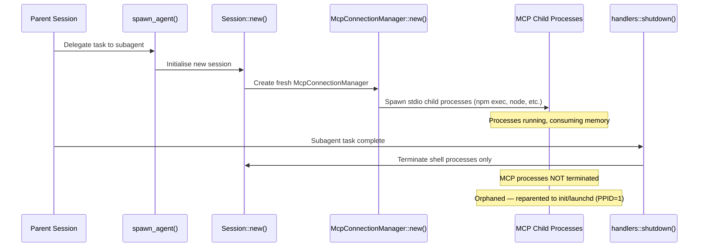
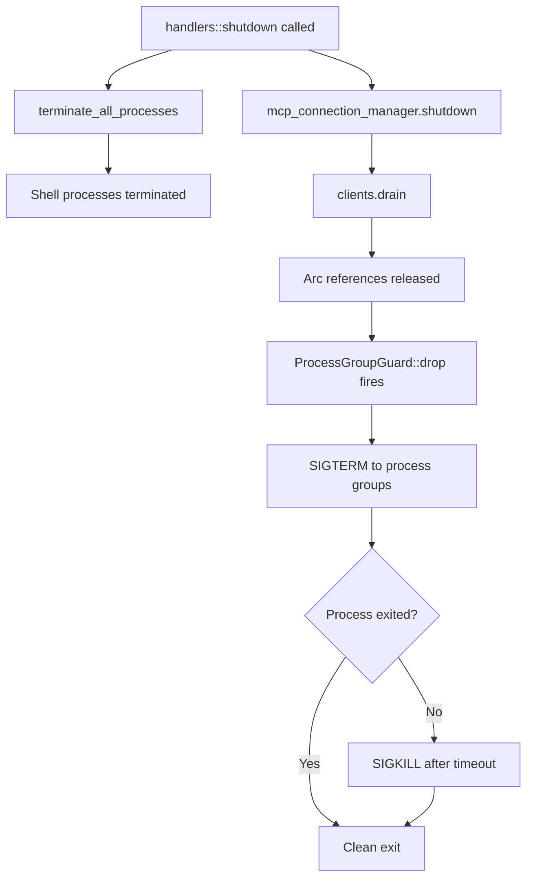

# The Subagent Resource Leak Problem: Why MCP Process Trees Accumulate and What McpConnectionManager::shutdown() Fixes


---

If you run Codex CLI with multiple MCP servers and use subagent workflows, you have almost certainly experienced the symptoms: swap pressure creeping up, fans spinning, and — when you finally check `ps aux` — hundreds of orphaned `npm exec` and `node` processes consuming double-digit gigabytes of RAM. This article dissects the root cause, traces the code path responsible, explains the proposed fix, and offers defensive patterns you can deploy today.

## The Symptoms

The first major report surfaced as issue #12491, where a user running Codex.app v0.98.0 with five MCP servers (four oh-my-codex instances plus Serena) observed 1,319 zombie Codex processes and 1,537 orphaned Node processes consuming approximately 37 GB of RSS plus 40 GB of swap on a 64 GB machine[^1]. By April 2026, issue #17574 documented the same pattern in Codex CLI v0.120.0: 791 accumulated processes totalling ~13.5 GB RSS across xcodebuildmcp and chrome-devtools-mcp server trees[^2]. Days later, #17832 confirmed a regression where 213 leaked Playwright MCP process pairs consumed 13.6 GB on an M3 Pro with 36 GB RAM[^3].

The pattern is consistent: every subagent spawn leaves behind a process tree that is never reaped.

## The Leak Mechanism

Understanding the leak requires tracing the subagent lifecycle from spawn to (missing) teardown.



### Step by Step

1. **Subagent spawn**: When Codex receives a task delegation instruction, it calls `spawn_agent()` to create a new thread[^4].
2. **Session initialisation**: Each subagent gets its own `Session::new()`, which instantiates a dedicated `McpConnectionManager::new()`. This is not a shared pool — every subagent session creates fresh stdio child processes for every configured MCP server[^2].
3. **MCP process creation**: For each stdio-transport MCP server in `config.toml`, the connection manager executes the configured `command` (e.g., `npx -y @playwright/mcp@latest`), spawning an `npm exec` parent and a `node` child. With five MCP servers configured, that is ten new processes per subagent[^1].
4. **Task completion**: When the subagent finishes, `handlers::shutdown()` is called. This method invokes `unified_exec_manager.terminate_all_processes()` to clean up shell processes — but it **never touches MCP connections**[^3].
5. **Orphaning**: The `McpConnectionManager` has no `Drop` implementation, no `shutdown()` method, and no `close()` method. The `Arc<RmcpClient>` references are never released, so `ProcessGroupGuard::drop()` never fires. The child processes are reparented to PID 1 and persist indefinitely[^2][^3].

### Why the Partial Fix in v0.120.0 Was Insufficient

Version 0.120.0 introduced a fix for app-server MCP cleanup on disconnect, ensuring that "unsubscribed threads and resources are torn down correctly"[^5]. However, this fix addressed the **app-server's** connection tracking rather than the **per-session** `McpConnectionManager` lifecycle. Subagent-spawned sessions continued to leak because the teardown path in `handlers::shutdown()` was not updated to include MCP cleanup[^3].

## Quantifying the Impact

The resource cost scales multiplicatively: `subagent_count × mcp_servers × processes_per_server × memory_per_process`.

| Scenario | Subagents | MCP Servers | Leaked Processes | Estimated RSS |
|---|---|---|---|---|
| Light use (2 servers, 5 tasks) | 5 | 2 | 20 | ~700 MB |
| Moderate (3 servers, 20 tasks) | 20 | 3 | 120 | ~4.2 GB |
| Heavy (5 servers, 40 tasks) | 40 | 5 | 400 | ~14 GB |
| Enterprise CI pod (5 servers, 100 tasks) | 100 | 5 | 1,000 | ~35 GB |

Each `npm exec` parent process typically consumes ~35 MB RSS, with MCP server children adding 30–65 MB depending on the server[^3]. On long-running CI pods or developer machines left running overnight, the accumulation can exhaust available RAM within hours.

## The Proposed Fix: McpConnectionManager::shutdown()

The fix described in #17832 is remarkably small — an 11-line change across two files[^3]:

### 1. Add a shutdown method to McpConnectionManager

```rust
impl McpConnectionManager {
    /// Drain all MCP client connections, releasing Arc<RmcpClient>
    /// references so ProcessGroupGuard::drop() fires and delivers
    /// SIGTERM/SIGKILL to each MCP process group.
    pub async fn shutdown(&self) {
        let mut clients = self.clients.lock().await;
        clients.drain();
    }
}
```

When `drain()` empties the `HashMap`, the last `Arc<RmcpClient>` reference for each connection is dropped. This triggers `ProcessGroupGuard::drop()`, which sends `SIGTERM` to the process group, waits briefly, then escalates to `SIGKILL` if the process has not exited[^2].

### 2. Call shutdown from handlers::shutdown()

```rust
async fn shutdown(session: &Session) {
    // Existing shell process cleanup
    session.unified_exec_manager.terminate_all_processes().await;

    // NEW: Clean up MCP connections
    session.mcp_connection_manager.shutdown().await;
}
```

This ensures the MCP cleanup runs alongside existing shell process teardown on every subagent session close[^3].



## Defensive Patterns for Today

Until the fix lands in a release, several strategies can limit the damage.

### Monitor MCP Process Counts

Add a watchdog script to your session or CI pipeline:

```bash
#!/usr/bin/env bash
# mcp-watchdog.sh — alert when MCP process count exceeds threshold
THRESHOLD=${1:-50}
COUNT=$(pgrep -f 'npm exec.*mcp' | wc -l)
if [ "$COUNT" -gt "$THRESHOLD" ]; then
    echo "WARNING: $COUNT MCP processes detected (threshold: $THRESHOLD)"
    # Optionally kill orphans:
    # pkill -f 'npm exec.*mcp'
fi
```

### Restart Long Sessions

The leak is proportional to subagent spawns within a single Codex process. Restarting the CLI between major task batches resets the process tree. For CI, prefer one Codex invocation per job rather than a persistent agent pod[^4].

### Limit Subagent Concurrency

In your `config.toml`, constrain the blast radius:

```toml
[agents]
max_threads = 3      # Default is 6 — halving limits peak leak rate
max_depth = 1        # Prevent recursive subagent fan-out
```

Reducing `max_threads` from the default of 6 to 3 halves the peak leak rate per unit time[^4]. Setting `max_depth = 1` prevents nested subagent spawning, which would compound the leak exponentially.

### Prefer HTTP Transport Where Possible

Streamable HTTP MCP servers (configured with `url` rather than `command` in `config.toml`) do not spawn local child processes and are therefore immune to this leak[^6]:

```toml
[mcp_servers.my-server]
url = "https://mcp.example.com/sse"
bearer_token_env_var = "MCP_TOKEN"
```

The trade-off is latency and the need to host the MCP server externally, but for enterprise deployments already running shared infrastructure, this sidesteps the process accumulation entirely.

### Manual Cleanup

For immediate relief on a machine already suffering from the leak:

```bash
# Kill all orphaned MCP stdio processes
pkill -f 'npm exec.*mcp'

# Verify recovery
echo "Recovered $(ps aux | grep -c '[n]pm exec.*mcp') processes"
```

The reporter of #17832 confirmed that `pkill` immediately recovered 13.6 GB, proving the processes were genuinely orphaned rather than legitimately retained[^3].

## Broader Architectural Implications

This leak exposes a fundamental tension in Codex's subagent architecture: **session isolation versus resource sharing**. Each subagent currently gets its own `McpConnectionManager` with dedicated child processes, providing strong isolation but no resource pooling[^2].

Issue #16256 proposed an alternative: a single MCP daemon per user handling multiple sessions, with process group management via `setpgid()` enabling clean subtree termination with a single `kill(-pgid, SIGTERM)` call[^7]. This would eliminate the per-subagent spawn overhead entirely, though it would require significant architectural changes to the connection manager.

The v0.119.0 extraction of MCP into a dedicated `codex-mcp` crate suggests the team is laying groundwork for exactly this kind of architectural evolution[^5].

## What to Watch For

- **The shutdown fix**: Track #17574 and #17832 for the `McpConnectionManager::shutdown()` merge. The fix is small and well-understood; landing it is primarily a question of test coverage and edge cases around concurrent session teardown.
- **Connection pooling**: A shared MCP connection pool across subagent sessions would eliminate the leak class entirely. Watch for changes to `codex-mcp` crate architecture.
- **Signal handling**: Proper `SIGTSTP` handling (issue #16256) would address the related problem of suspended sessions holding process references[^7].

⚠️ The exact timeline for the fix is unconfirmed — the issues remain open as of 18 April 2026.

## Citations

[^1]: [Codex.app GUI: MCP child processes not reaped after task completion — 1300+ zombies, 37GB memory leak · Issue #12491](https://github.com/openai/codex/issues/12491)
[^2]: [Subagents leak stdio MCP helper trees in Codex App; xcodebuildmcp and chrome-devtools-mcp accumulate indefinitely · Issue #17574](https://github.com/openai/codex/issues/17574)
[^3]: [Regression: Playwright MCP stdio processes still leak after #16895 fix — 213 orphaned pairs, 13.6 GB RSS · Issue #17832](https://github.com/openai/codex/issues/17832)
[^4]: [Subagents – Codex | OpenAI Developers](https://developers.openai.com/codex/subagents)
[^5]: [Changelog – Codex | OpenAI Developers](https://developers.openai.com/codex/changelog)
[^6]: [Model Context Protocol – Codex | OpenAI Developers](https://developers.openai.com/codex/mcp)
[^7]: [MCP sub-agent processes are never terminated when codex sessions are stopped/suspended · Issue #16256](https://github.com/openai/codex/issues/16256)
