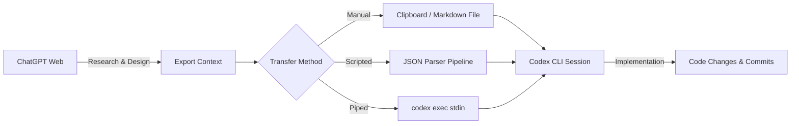
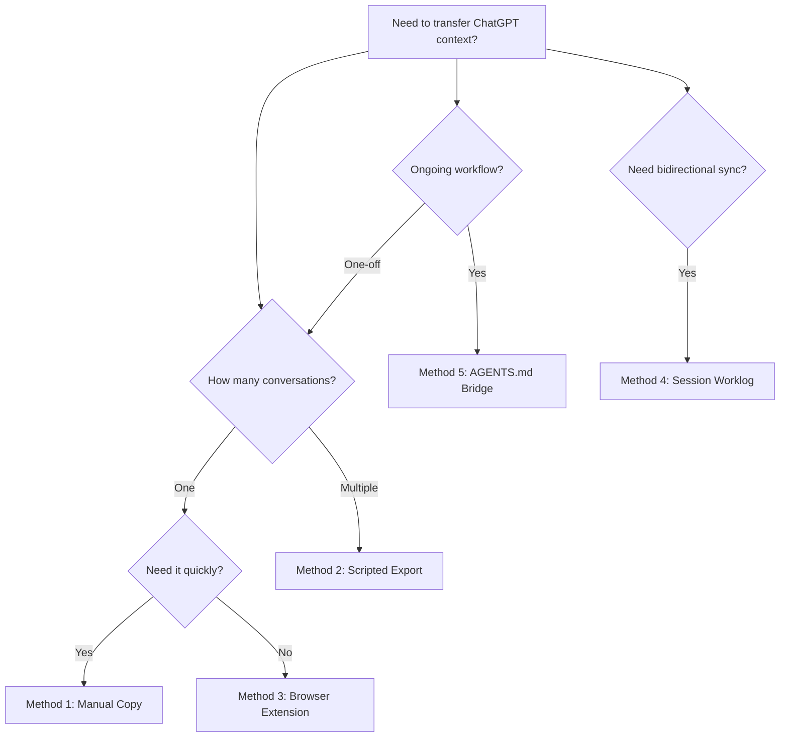

# Transferring ChatGPT Conversations to Codex CLI


---

Many developers start their thinking in ChatGPT — brainstorming architecture, researching APIs, sketching out approaches with web search — then need to hand that context to Codex CLI for actual implementation. There is no native "transfer conversation" button yet[^1], but several practical patterns exist today to bridge the gap effectively. This article covers every viable method, from quick-and-dirty clipboard workflows to scripted pipelines that slot into your daily routine.

## Why Transfer Context at All?

ChatGPT and Codex CLI serve different roles in a development workflow. ChatGPT excels at open-ended research, brainstorming, and leveraging web search[^2]. Codex CLI excels at autonomous code changes within your actual repository, with sandboxed execution, approval modes, and git-aware tooling[^3]. The problem is that context built up in one tool doesn't automatically flow to the other — and rebuilding that context from scratch wastes tokens and time.



## Method 1: Manual Markdown Handoff

The simplest approach — and often sufficient for one-off transfers.

### Steps

1. In ChatGPT, select the conversation content you need (or use the "Copy" button on individual responses).
2. Paste into a markdown file in your project directory:

```bash
cat > .context/chatgpt-design-notes.md << 'EOF'
# Architecture Discussion from ChatGPT

## Key Decisions
- Use event-driven architecture for the notification service
- PostgreSQL for persistence, Redis for pub/sub
- Rate limiting at the API gateway level

## Proposed API Schema
...
EOF
```

1. Reference the file when launching Codex CLI:

```bash
codex "Read .context/chatgpt-design-notes.md and implement the notification service as described"
```

Codex's file-reading tools will ingest the markdown as part of its context window. The `@` fuzzy-search in the interactive composer also lets you drop file paths directly into your prompt[^4].

### When to Use This

Single conversations. Quick design-to-implementation handoffs. When you need to curate which parts of the conversation to transfer.

## Method 2: ChatGPT Data Export and Scripted Extraction

For transferring multiple conversations or building repeatable workflows, use ChatGPT's built-in data export.

### Exporting from ChatGPT

Navigate to **Settings → Data Controls → Export Data** in ChatGPT[^5]. OpenAI will email you a ZIP file containing `conversations.json` — a complete archive of every conversation in your account.

### Understanding the Export Format

The `conversations.json` file uses a tree structure with a `mapping` field linking messages by UUID[^6]:

```json
{
  "title": "Notification Service Design",
  "create_time": 1713398400.0,
  "mapping": {
    "uuid-1": {
      "message": {
        "author": { "role": "user" },
        "content": { "content_type": "text", "parts": ["Design a notification..."] },
        "create_time": 1713398401.0
      },
      "parent": null,
      "children": ["uuid-2"]
    },
    "uuid-2": {
      "message": {
        "author": { "role": "assistant" },
        "content": { "content_type": "text", "parts": ["Here's my suggested..."] },
        "create_time": 1713398410.0
      },
      "parent": "uuid-1",
      "children": []
    }
  }
}
```

### Conversion Script

This Python script extracts a named conversation into clean markdown suitable for Codex CLI:

```python
#!/usr/bin/env python3
"""Extract a ChatGPT conversation to markdown for Codex CLI."""

import json
import sys
from pathlib import Path


def extract_conversation(export_path: str, title_search: str) -> str:
    data = json.loads(Path(export_path).read_text())

    # Find conversation by title substring
    conv = next(
        (c for c in data if title_search.lower() in c["title"].lower()),
        None,
    )
    if not conv:
        print(f"No conversation matching '{title_search}'", file=sys.stderr)
        sys.exit(1)

    # Extract messages sorted by timestamp
    messages = []
    for node in conv["mapping"].values():
        msg = node.get("message")
        if not msg or not msg.get("content", {}).get("parts"):
            continue
        role = msg["author"]["role"]
        text = "\n".join(msg["content"]["parts"])
        ts = msg.get("create_time", 0)
        if role in ("user", "assistant") and text.strip():
            messages.append((ts, role, text))

    messages.sort(key=lambda x: x[0])

    # Format as markdown
    lines = [f"# {conv['title']}\n"]
    for _, role, text in messages:
        prefix = "**User:**" if role == "user" else "**ChatGPT:**"
        lines.append(f"\n{prefix}\n\n{text}\n")

    return "\n".join(lines)


if __name__ == "__main__":
    if len(sys.argv) != 3:
        print("Usage: chatgpt2md.py <conversations.json> <title-search>")
        sys.exit(1)
    print(extract_conversation(sys.argv[1], sys.argv[2]))
```

Usage:

```bash
python3 chatgpt2md.py ~/Downloads/conversations.json "notification service" \
  > .context/chatgpt-notification-design.md
```

### Piping Directly to Codex

The extracted markdown can be piped straight into `codex exec` using the prompt-plus-stdin pattern[^7]:

```bash
python3 chatgpt2md.py conversations.json "notification service" \
  | codex exec "Implement the design described in this ChatGPT conversation"
```

When stdin is piped alongside a prompt argument, Codex treats the prompt as the instruction and the piped content as additional context[^8]. This avoids creating intermediate files entirely.

## Method 3: Browser Extension Export

The [chatgpt-exporter](https://github.com/pionxzh/chatgpt-exporter) browser extension provides per-conversation export in markdown, JSON, or HTML format directly from the ChatGPT interface[^9] — no need to wait for the full data export email.

```bash
# After exporting a single conversation as markdown
codex "Read .context/exported-chat.md and implement the suggested refactoring"
```

This is the fastest path for transferring a single conversation without scripting.

## Method 4: Session Worklog Sync

For developers who work across both tools regularly, a session-scanning approach keeps a running worklog. One community pattern scans `~/.codex/sessions/` and converts each session to markdown[^10]:

```bash
#!/usr/bin/env bash
# Sync Codex sessions to a worklog directory
SESSIONS_DIR="$HOME/.codex/sessions"
WORKLOG_DIR="./worklog"
mkdir -p "$WORKLOG_DIR"

for session in "$SESSIONS_DIR"/*.jsonl; do
  name=$(basename "$session" .jsonl)
  target="$WORKLOG_DIR/${name}.md"
  [ -f "$target" ] && continue

  echo "# Session: $name" > "$target"
  echo "" >> "$target"
  jq -r 'select(.type == "message") |
    "## " + .message.role + "\n\n" + .message.content + "\n"' \
    "$session" >> "$target" 2>/dev/null
done
```

This creates a bidirectional bridge: ChatGPT context comes in via the methods above, and Codex session history becomes available for reference back in ChatGPT.

## Method 5: AGENTS.md as a Persistent Context Bridge

Rather than transferring raw conversation history, distil the key decisions into your project's `AGENTS.md` file[^11]. This is often more effective than dumping an entire conversation, because it gives Codex structured, actionable context:

```markdown
# AGENTS.md

## Architecture Decisions (from ChatGPT research session 2026-04-18)

- Event-driven notification service using PostgreSQL + Redis pub/sub
- Rate limiting handled at API gateway, not service level
- Use OpenAPI 3.1 spec-first approach for API design
- Error responses follow RFC 9457 Problem Details format

## Implementation Constraints

- Target 99.9% uptime SLA — circuit breakers on all external calls
- Max notification latency: 500ms p99
- Must support webhook, email, and push notification channels
```

This approach survives across sessions, works with `codex resume`[^12], and benefits every future Codex invocation in the repository — not just the immediate one.

## Choosing the Right Method



| Method | Speed | Automation | Best For |
|--------|-------|------------|----------|
| Manual markdown | Fast | None | Quick one-off transfers |
| Scripted export | Medium | Full | Batch processing, CI pipelines |
| Browser extension | Fast | None | Single conversation, no scripting |
| Session worklog | Slow setup | Ongoing | Bidirectional team workflows |
| AGENTS.md bridge | Medium | None | Persistent architectural context |

## What's Coming: Native Integration

This is one of the most-requested features in the Codex CLI repository. Issue #2153 has over 111 upvotes and is the canonical tracking issue for ChatGPT–Codex integration[^1]. OpenAI's team has acknowledged the demand, and the recent additions of plugin support and sub-agent messaging in the April 2026 changelog[^13] suggest the infrastructure for cross-product context sharing is being built. Until then, the patterns above will keep your workflow moving.

## Citations

[^1]: [ChatGPT integration · Issue #2153 · openai/codex](https://github.com/openai/codex/issues/2153) — 111+ upvotes, canonical feature request for ChatGPT–Codex integration.
[^2]: [Using Codex with your ChatGPT plan | OpenAI Help Center](https://help.openai.com/en/articles/11369540-using-codex-with-your-chatgpt-plan) — Official guidance on ChatGPT and Codex relationship.
[^3]: [CLI – Codex | OpenAI Developers](https://developers.openai.com/codex/cli) — Official Codex CLI documentation and capabilities overview.
[^4]: [Features – Codex CLI | OpenAI Developers](https://developers.openai.com/codex/cli/features) — Interactive composer features including `@` file fuzzy-search.
[^5]: [How to Export ChatGPT Conversations: Every Method Compared (2026)](https://www.ai-toolbox.co/chatgpt-management-and-productivity/export-chatgpt-every-method-2026) — Comprehensive guide to ChatGPT export methods.
[^6]: [Decoding Exported Data by Parsing conversations.json — OpenAI Developer Community](https://community.openai.com/t/decoding-exported-data-by-parsing-conversations-json-and-or-chat-html/403144) — Community analysis of the conversations.json tree structure.
[^7]: [Non-interactive mode – Codex | OpenAI Developers](https://developers.openai.com/codex/noninteractive) — Official documentation for `codex exec` stdin piping.
[^8]: [Support Codex CLI stdin piping for `codex exec` · PR #15917 · openai/codex](https://github.com/openai/codex/pull/15917) — Implementation of prompt-plus-stdin support.
[^9]: [chatgpt-exporter — GitHub](https://github.com/pionxzh/chatgpt-exporter) — Browser extension for per-conversation ChatGPT export.
[^10]: [Sync my chats, conversation history between ChatGPT website, Codex in VScode · Issue #5609 · openai/codex](https://github.com/openai/codex/issues/5609) — Community workaround scanning `~/.codex/sessions/`.
[^11]: [Codex CLI Features — AGENTS.md](https://developers.openai.com/codex/cli/features) — Documentation for AGENTS.md project configuration.
[^12]: [Command line options – Codex CLI | OpenAI Developers](https://developers.openai.com/codex/cli/reference) — `codex resume` subcommand reference.
[^13]: [Changelog – Codex | OpenAI Developers](https://developers.openai.com/codex/changelog) — April 2026 changelog entries for plugin support and sub-agent messaging.
