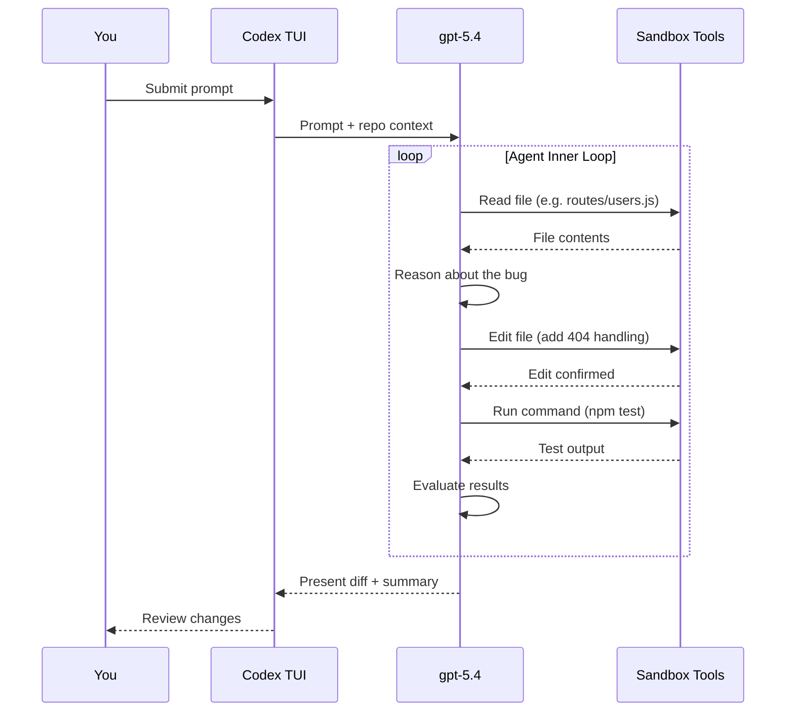

# Your First 30 Minutes with Codex CLI: From Install to First Fix


---

Thirty minutes. That is all you need to go from zero to watching an AI agent autonomously diagnose a bug, write a fix, run the tests, and present you with a clean diff. This article walks through that experience step by step—no hand-waving, no hypotheticals. You will install the CLI, point it at a real repository, feed it a real bug, and watch the agent loop do its thing.

## Prerequisites

Before you start the clock, make sure you have:

- **Node.js 22+** installed (required for the npm package)[^1]
- A **ChatGPT account** or an **OpenAI API key**[^2]
- A **Git repository** with a codebase you want to work on
- A terminal emulator (iTerm2, Warp, Windows Terminal, or any modern equivalent)

If you are on Windows, OpenAI recommends running Codex inside WSL for the most stable experience[^3].

## Minute 0–3: Installation

Two package managers can get you running in under a minute:

```bash
# Via npm (cross-platform)
npm install -g @openai/codex

# Via Homebrew (macOS/Linux)
brew install codex
```

Verify the install:

```bash
codex --version
```

You can also download a standalone binary from the [GitHub releases page](https://github.com/openai/codex/releases) if you prefer not to use a package manager[^1].

## Minute 3–5: Authentication

Run `codex` for the first time and you will be prompted to authenticate:

```bash
codex login
```

You can sign in with your ChatGPT account via OAuth or paste an API key directly[^2]. If you already have `OPENAI_API_KEY` set in your environment, the CLI picks it up automatically.

## Minute 5–8: Choose Your Model and Approval Mode

Codex CLI defaults to **gpt-5.4**, which is the recommended model for most coding tasks[^4]. For lighter work or when cost matters, switch to **gpt-5.4-mini**:

```bash
codex --model gpt-5.4-mini
```

Three approval modes control how much autonomy the agent has[^5]:

| Mode | Flag | Behaviour |
|------|------|-----------|
| **Auto** (default) | `-a on-request` | Reads, edits, and runs commands in the working directory; asks before anything external |
| **Read-only** | `-s read-only` | Browses files but asks before making changes |
| **Full Access** | `-s danger-full-access` | Unrestricted—use only in disposable environments |

For your first session, stick with the default. You want to see the agent work, but you also want a safety net.

## Minute 8–12: Point Codex at a Repository

Navigate to a Git repository you know well:

```bash
cd ~/projects/my-api
codex
```

The full-screen terminal UI (TUI) launches. Start with an orientation prompt:

```
Tell me about this project
```

The agent reads your directory structure, inspects key files (`package.json`, `README.md`, `AGENTS.md` if present), and returns a summary. This is the agent's **context-gathering phase**—it builds a mental model of your codebase before doing anything[^6].

## Minute 12–20: Feed It a Real Bug

Now for the interesting part. Give Codex a concrete task with a clear success criterion. The more specific your prompt, the better the result[^7]:

```
The endpoint GET /api/users/:id returns a 500 when the user ID
doesn't exist in the database. It should return a 404 with a
JSON error body. Fix this and make sure the existing tests pass.
```

### What Happens Next: The Agent Loop

Once you hit Enter, the agent enters its execution loop. Here is what unfolds:



The LLM generates a stream of output events. Some are **tool calls** (read a file, edit a file, run a command), and some are **reasoning steps** (planning the fix, evaluating test output). Both are appended to the conversation context and fed back into the model for the next iteration—this is a single **turn** of the inner loop[^8].

The loop continues until the model emits a **done event**, indicating it believes the task is complete. Prompt caching keeps inference performance linear rather than quadratic as the conversation grows[^8].

### Watching It Work

In the TUI, you will see each step in real time:

1. **File discovery** — The agent locates the relevant route handler
2. **Code reading** — It reads the current implementation
3. **Reasoning** — It identifies the missing null check
4. **Editing** — It adds the 404 response path
5. **Testing** — It runs your test suite to verify the fix
6. **Summary** — It presents the diff and explains what changed

If you are in the default approval mode, the agent may pause to ask permission before running commands. Approve with a keypress and it continues.

## Minute 20–25: Review the Diff

Once the agent finishes, review the changes directly in the TUI. You can:

- **Accept** the changes and they are written to your working tree
- **Reject** individual edits if something looks wrong
- **Copy the response** with `Ctrl+O` for pasting elsewhere[^9]

The diff is a standard Git diff. If you want to inspect it further:

```bash
git diff
```

If you are happy with the fix, commit it:

```bash
git add -p  # Stage selectively
git commit -m "fix: return 404 for missing user instead of 500"
```

## Minute 25–28: Set Up AGENTS.md

Before you close the session, invest two minutes in creating an `AGENTS.md` file at the root of your repository. This file auto-loads on every Codex session and gives the agent durable context about your project[^10]:

```bash
codex /init
```

This scaffolds a starter file. Edit it to include the essentials:

```markdown
# AGENTS.md

## Repository layout
- `src/` — Application source code (TypeScript)
- `tests/` — Jest test suite
- `docs/` — API documentation

## Build and test
- `npm run build` — Compile TypeScript
- `npm test` — Run all tests
- `npm run lint` — ESLint check

## Conventions
- All API endpoints return JSON error bodies with `{ error: string }`
- Use early returns for error handling
- Every new endpoint needs a corresponding test file
```

Keep it short and practical. Vague rules like "write clean code" waste tokens—be specific or leave it out[^10]. The AGENTS.md format is now an open standard stewarded by the Linux Foundation, adopted by over 60,000 open-source projects[^11].

## Minute 28–30: Persist Your Preferences

Store your preferred defaults in `~/.codex/config.toml` so every session starts the way you want[^12]:

```toml
model = "gpt-5.4"

[approvals]
ask-for-approval = "on-request"

[sandbox]
mode = "workspace-write"
```

Project-specific overrides go in `.codex/config.toml` at the repository root.

## What You Just Did

In 30 minutes you:

1. Installed the CLI and authenticated
2. Explored a codebase through natural language
3. Fixed a real bug with the agent loop handling file discovery, editing, and testing autonomously
4. Set up `AGENTS.md` for durable project context
5. Configured persistent preferences

You did not write a single line of application code yourself. The agent did the implementation; you directed the work and reviewed the result.

## Where to Go Next

| Next step | Command or resource |
|-----------|-------------------|
| Resume this session later | `codex resume` or `/resume` in the TUI[^13] |
| Review a branch before merging | `/review` in the TUI[^5] |
| Run Codex non-interactively in CI | `codex exec "run the linter and fix issues"` [^14] |
| Add MCP integrations | `codex mcp add <server>` [^5] |
| Try a planning workflow | Start your prompt with `/plan` [^7] |

The first 30 minutes are about building intuition for the feedback loop: **prompt → agent loop → review → commit**. Once that loop feels natural, everything else—subagents, MCP servers, CI automation—is just configuration on top of the same pattern.

## Citations

[^1]: [Codex CLI Installation — OpenAI Developers](https://developers.openai.com/codex/cli)
[^2]: [Codex Quickstart — OpenAI Developers](https://developers.openai.com/codex/quickstart)
[^3]: [How to Install Codex CLI on Windows (2026 Guide) — ITECS](https://itecsonline.com/post/how-to-install-codex-cli-on-windows-2026-guide)
[^4]: [Codex Models — OpenAI Developers](https://developers.openai.com/codex/models)
[^5]: [Codex CLI Features — OpenAI Developers](https://developers.openai.com/codex/cli/features)
[^6]: [Codex CLI: The Definitive Technical Reference — Blake Crosley](https://blakecrosley.com/guides/codex)
[^7]: [Best Practices — Codex, OpenAI Developers](https://developers.openai.com/codex/learn/best-practices)
[^8]: [OpenAI Begins Article Series on Codex CLI Internals — InfoQ](https://www.infoq.com/news/2026/02/codex-agent-loop/)
[^9]: [Codex Changelog — OpenAI Developers](https://developers.openai.com/codex/changelog)
[^10]: [Custom Instructions with AGENTS.md — OpenAI Developers](https://developers.openai.com/codex/guides/agents-md)
[^11]: [AGENTS.md — Open Format for Coding Agents](https://agents.md/)
[^12]: [Command Line Options — Codex CLI, OpenAI Developers](https://developers.openai.com/codex/cli/reference)
[^13]: [Codex CLI Features: Session Resumption — OpenAI Developers](https://developers.openai.com/codex/cli/features)
[^14]: [Codex CLI Headless Batch Mode — Codex Blog](https://codex.danielvaughan.com/2026/04/18/codex-cli-headless-batch-mode-automation/)
