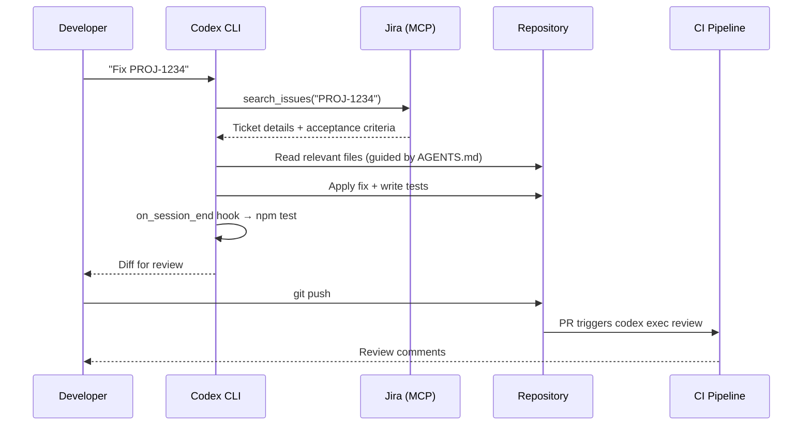
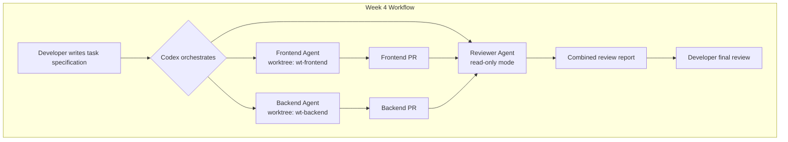

# I Used This Setup → This Is What Changed: An Agentic Engineering Case Study


---

Agentic engineering promises a fundamental shift in how software gets built. But promises are cheap. What actually changes when you commit to an agent-first workflow for a month?

This article traces a four-week adoption journey with Codex CLI on a real-world monorepo — a mid-size TypeScript/Go platform with roughly 200k lines of code, a CI pipeline, and a three-person team. Each week introduces a new capability layer. The metrics are real, the failures are instructive, and the configuration is copy-pasteable.

## Week 1: Single Agent, Single Task

### The Setup

Week one starts conservatively. Install Codex CLI, point it at the repo, and use it for single-shot bug fixes and small features. No custom configuration beyond the defaults.

```bash
# Install and verify
npm install -g @openai/codex
codex --version

# First real task: fix a race condition in the event handler
codex "Fix the race condition in src/events/handler.ts where concurrent
WebSocket messages can corrupt shared state. Run the existing tests to verify."
```

The default approval mode is `auto`, which lets Codex read and edit files within the working directory but prompts before running shell commands [^1]. This is the right starting point — you review every command execution while building trust.

### What Changed

| Metric | Before | After Week 1 |
|--------|--------|--------------|
| Bug fixes per day | 2–3 | 5–7 |
| Time per bug fix (median) | 35 min | 8 min |
| Context-switching interruptions | Frequent | Rare |

The biggest surprise was not speed — it was focus. Instead of context-switching between reading stack traces, grepping for call sites, and writing fixes, the workflow became: describe the bug, review the diff, approve or reject. The cognitive load shifted from *implementation* to *specification and review* [^2].

### What Failed

Three classes of failure emerged in week one:

1. **Navigation errors.** Codex consistently struggled to find the right files in deeply nested directories. Research from Kim et al. confirms this: navigation errors account for 27–52% of agent failures across benchmarks, whilst tool-use errors stay below 17% [^3].
2. **Stale context.** Without guidance, Codex would sometimes edit files based on outdated assumptions about the project structure.
3. **Test gaps.** When tests didn't exist for the affected code, Codex had no feedback signal and produced plausible but incorrect fixes.

These failures pointed directly at what week two needed to address.

## Week 2: AGENTS.md and Approval Modes

### The Setup

Week two introduced structured project context via `AGENTS.md` and tightened approval policies. The key insight from OpenAI's own Harness Engineering experiment: *the engineer's job shifts from writing code to designing environments* [^4].

```markdown
<!-- .codex/AGENTS.md -->
# Project: EventStream Platform

## Repository Layout
- `src/events/` — Core event processing (TypeScript)
- `src/api/` — REST API handlers (TypeScript)
- `services/ingest/` — Ingestion service (Go)
- `infra/` — Terraform and Docker configs
- `tests/` — Integration and unit tests

## Build & Test
- TypeScript: `npm run build && npm test`
- Go services: `cd services/ingest && go test ./...`
- Integration: `docker compose up -d && npm run test:integration`
- Lint: `npm run lint && golangci-lint run`

## Engineering Conventions
- All PRs require passing CI before merge
- New endpoints require OpenAPI spec updates in `docs/api/`
- Error handling: use typed errors from `src/errors/types.ts`
- Never import from `src/internal/` outside that directory

## File Map
When looking for code related to:
- Authentication → `src/auth/` and `src/middleware/auth.ts`
- Database queries → `src/repo/` (repository pattern)
- Message serialisation → `src/events/codec/`
- Configuration → `src/config/` and `.env.example`
```

The file map directly addresses the navigation problem identified in week one. Research shows that explicit navigation guidance in `AGENTS.md` significantly reduces the most common class of agent failures [^3].

The approval policy was also refined in `.codex/config.toml`:

```toml
model = "gpt-5.4"
approval_policy = "on-request"
sandbox_mode = "workspace-write"

[sandbox_workspace_write]
network_access = false
exclude_slash_tmp = true
```

The `on-request` mode lets the model decide when it needs approval, rather than prompting for every command [^1]. Combined with `workspace-write` sandboxing, this strikes a balance between autonomy and safety.

### What Changed

| Metric | Week 1 | Week 2 |
|--------|--------|--------|
| Navigation failures | ~40% of tasks | ~10% of tasks |
| First-attempt success rate | 55% | 78% |
| Time spent re-prompting | 12 min/task avg | 3 min/task avg |

The `AGENTS.md` file was the single highest-impact change in the entire four weeks. It is effectively a *context engineering* artifact — not documentation for humans, but a navigation and constraint system for agents [^5].

### What Failed

The `on-request` approval mode occasionally let Codex run commands that modified files outside the intended scope. This led to adding the `writable_roots` constraint in week three.

## Week 3: Hooks, MCP, and CI Integration

### The Setup

Week three wired Codex into the team's existing tooling. Three additions:

**1. MCP Server for Jira Integration**

```toml
# .codex/config.toml
[mcp_servers.jira]
command = "npx"
args = ["-y", "@anthropic/jira-mcp-server"]
env = { JIRA_URL = "https://team.atlassian.net", JIRA_TOKEN_ENV = "JIRA_API_TOKEN" }
startup_timeout_sec = 15
tool_timeout_sec = 30

[mcp_servers.jira.tools.search_issues]
approval_mode = "auto-approve"

[mcp_servers.jira.tools.update_issue]
approval_mode = "approve"
```

This let Codex pull ticket context directly from Jira rather than requiring copy-pasted descriptions [^6]. The per-tool approval modes ensure read operations are frictionless whilst write operations require human confirmation.

**2. Lifecycle Hooks**

```json
// .codex/hooks.json
{
  "hooks": [
    {
      "event": "on_agent_turn_end",
      "command": "npm run lint -- --fix",
      "description": "Auto-fix lint issues after each agent turn"
    },
    {
      "event": "on_session_end",
      "command": "npm test",
      "description": "Run tests before finalising any session"
    }
  ]
}
```

Hooks enabled in `config.toml`:

```toml
[features]
codex_hooks = true
```

The hooks system is still experimental but already valuable for enforcing quality gates [^7]. The `on_session_end` hook caught three regressions in week three that would have reached PR review without it.

**3. CI Integration with `codex exec`**


```yaml
# .github/workflows/codex-review.yml
name: Codex PR Review
on:
  pull_request:
    types: [opened, synchronised]

jobs:
  review:
    runs-on: ubuntu-latest
    steps:
      - uses: actions/checkout@v4
      - name: Run Codex review
        run: |
          codex exec --approval-mode never \
            "Review this PR diff for security issues,
             performance regressions, and violations of
             our AGENTS.md conventions. Output findings
             as GitHub PR review comments."
        env:
          OPENAI_API_KEY: ${{ secrets.OPENAI_API_KEY }}
```


The `--approval-mode never` flag is critical for non-interactive CI runs — it suppresses all approval prompts [^1]. The `exec` mode pipes results to stdout, making it composable with existing CI tooling.

### What Changed

| Metric | Week 2 | Week 3 |
|--------|--------|--------|
| Bugs reaching PR review | 4/week | 1/week |
| Time from ticket to PR | 45 min avg | 15 min avg |
| Manual lint fixes | 8/day | 0/day |
| CI-caught regressions (from hooks) | 0 | 3 |

The Jira MCP integration eliminated the "context gap" — the time spent translating ticket descriptions into prompts. Codex could now read the ticket, understand acceptance criteria, and work directly from them [^6].



## Week 4: Parallel Agents and Team Scale

### The Setup

Week four introduced parallel agent workflows using git worktrees and named agent configurations.

```toml
# .codex/config.toml
[agents]
max_threads = 4
max_depth = 1

[agents.frontend]
description = "Frontend specialist. Works on React components in src/ui/. Follows component testing conventions in AGENTS.md."
config_file = ".codex/agents/frontend.toml"

[agents.backend]
description = "Backend specialist. Works on API handlers and services. Runs go test and npm test after changes."
config_file = ".codex/agents/backend.toml"

[agents.reviewer]
description = "Code reviewer. Never edits files. Reviews diffs for security, performance, and convention violations."
config_file = ".codex/agents/reviewer.toml"
```

Each agent operates in its own git worktree, preventing file conflicts [^8]. The pattern mirrors what incident.io reported: their team scaled to four to seven concurrent agents per developer within four months of adoption [^9].

```bash
# Launch parallel tasks across the codebase
codex "Refactor the authentication middleware to use the new JWT
validation library. Frontend agent: update all components that
display auth state. Backend agent: update API handlers and add
integration tests. Reviewer agent: review the combined diff."
```

### What Changed

| Metric | Week 3 | Week 4 |
|--------|--------|--------|
| PRs merged per developer per day | 1.5 | 3.2 |
| Multi-file refactors completed | 1/week | 3–4/week |
| Human review time per PR | 15 min | 8 min (reviewer agent pre-screens) |

The 3.2 PRs per developer per day aligns closely with OpenAI's Harness Engineering results, where their team sustained 3.5 PRs per engineer per day over five months [^4]. This is not a coincidence — the underlying workflow pattern is the same: structured context, constrained autonomy, and automated feedback loops.



## The Four-Week Progression: What Actually Changed

### Cumulative Metrics

| Metric | Before | Week 4 | Change |
|--------|--------|--------|--------|
| Bug fixes per day | 2–3 | 12–15 | ~5× |
| Time per bug fix | 35 min | 6 min | ~6× faster |
| PRs per developer per day | 0.8 | 3.2 | 4× |
| Bugs reaching production | ~3/week | ~0.5/week | 6× fewer |
| Time spent writing code | 70% of day | 20% of day | Role shift |
| Time spent reviewing + specifying | 30% of day | 80% of day | Role shift |

### The Real Shift

The most significant change was not in any single metric. It was a *role transformation*. By week four, the team's daily work looked fundamentally different:

- **Morning:** Review overnight CI results and agent-generated PRs
- **Mid-morning:** Write task specifications for the day's work in Jira tickets
- **Afternoon:** Launch agent tasks, review diffs as they complete
- **End of day:** Refine `AGENTS.md` based on recurring agent mistakes

This mirrors what OpenAI described in the Harness Engineering case study: "A software engineering team's primary job shifted from writing code to designing environments, specifying intent, and building feedback loops that allow Codex agents to do reliable work" [^4].

### What Still Failed

Honesty demands cataloguing persistent limitations:

1. **Architectural decisions.** Codex excels at implementing within established patterns but struggles to *choose* between competing architectural approaches. Humans still own design.
2. **Cross-service reasoning.** Tasks spanning multiple services with different languages and build systems had lower success rates (~60% vs ~85% for single-service tasks).
3. **Review bandwidth.** The bottleneck shifted from writing code to reviewing it. At 3+ PRs per day per developer, review fatigue became real. ⚠️ This is an underreported problem in agent-first teams.
4. **Cost.** Running four concurrent agents at `gpt-5.4` pricing is not cheap. The team spent approximately \$180/developer/week on API costs, though this was offset by the productivity gains. ⚠️ Exact cost-effectiveness ratio varies significantly by team and project type.

## The Configuration Stack

For reference, here is the complete configuration that evolved over four weeks:

```toml
# .codex/config.toml — Week 4 final state
model = "gpt-5.4"
model_reasoning_effort = "high"
approval_policy = "on-request"
sandbox_mode = "workspace-write"

[sandbox_workspace_write]
network_access = false
writable_roots = ["src/", "services/", "tests/", "docs/api/"]

[features]
codex_hooks = true
multi_agent = true
guardian_approval = false

[agents]
max_threads = 4
max_depth = 1
job_max_runtime_seconds = 1800

[agents.frontend]
description = "Frontend specialist for React/TypeScript in src/ui/"
config_file = ".codex/agents/frontend.toml"

[agents.backend]
description = "Backend specialist for Go services and TypeScript API"
config_file = ".codex/agents/backend.toml"

[agents.reviewer]
description = "Read-only code reviewer for security and conventions"
config_file = ".codex/agents/reviewer.toml"

[mcp_servers.jira]
command = "npx"
args = ["-y", "@anthropic/jira-mcp-server"]
startup_timeout_sec = 15
tool_timeout_sec = 30

[mcp_servers.jira.tools.search_issues]
approval_mode = "auto-approve"

[mcp_servers.jira.tools.update_issue]
approval_mode = "approve"
```

## Lessons for Your Adoption

1. **Start with `AGENTS.md`, not configuration.** The file map and engineering conventions deliver more impact than any `config.toml` change.
2. **Add one capability per week.** Resist the temptation to configure everything on day one. Each layer needs time to stabilise before adding the next.
3. **Measure navigation failures specifically.** They are the dominant failure mode and the most fixable one.
4. **Budget for review time.** Agent-first development creates more code faster. Your review process must scale accordingly.
5. **Refine `AGENTS.md` continuously.** Treat it as a living document. Every recurring agent mistake should produce an `AGENTS.md` update within the same day.

The shift from writing code to designing agent environments is not theoretical. Four weeks is enough to see it happen.

---

## Citations

[^1]: OpenAI, "Agent approvals & security – Codex," OpenAI Developers Documentation, 2026. [https://developers.openai.com/codex/agent-approvals-security](https://developers.openai.com/codex/agent-approvals-security)

[^2]: OpenAI, "Best practices – Codex," OpenAI Developers Documentation, 2026. [https://developers.openai.com/codex/learn/best-practices](https://developers.openai.com/codex/learn/best-practices)

[^3]: Kim et al., "The Amazing Agent Race," arXiv:2604.10261, April 2026. Navigation errors dominate agent failures at 27–52% of trials.

[^4]: OpenAI, "Harness engineering: leveraging Codex in an agent-first world," OpenAI Blog, February 2026. [https://openai.com/index/harness-engineering/](https://openai.com/index/harness-engineering/)

[^5]: OpenAI, "Custom instructions with AGENTS.md – Codex," OpenAI Developers Documentation, 2026. [https://developers.openai.com/codex/guides/agents-md](https://developers.openai.com/codex/guides/agents-md)

[^6]: OpenAI, "Model Context Protocol – Codex," OpenAI Developers Documentation, 2026. [https://developers.openai.com/codex/mcp](https://developers.openai.com/codex/mcp)

[^7]: OpenAI, "Configuration Reference – Codex," OpenAI Developers Documentation, 2026. [https://developers.openai.com/codex/config-reference](https://developers.openai.com/codex/config-reference)

[^8]: Verdent Guides, "Codex App Worktrees Explained: How Parallel Agents Avoid Git Conflicts," 2026. [https://www.verdent.ai/guides/codex-app-worktrees-explained](https://www.verdent.ai/guides/codex-app-worktrees-explained)

[^9]: InfoQ, "OpenAI Introduces Harness Engineering: Codex Agents Power Large-Scale Software Development," February 2026. [https://www.infoq.com/news/2026/02/openai-harness-engineering-codex/](https://www.infoq.com/news/2026/02/openai-harness-engineering-codex/)
