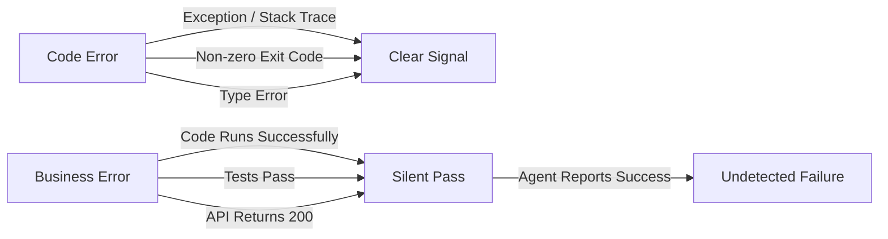
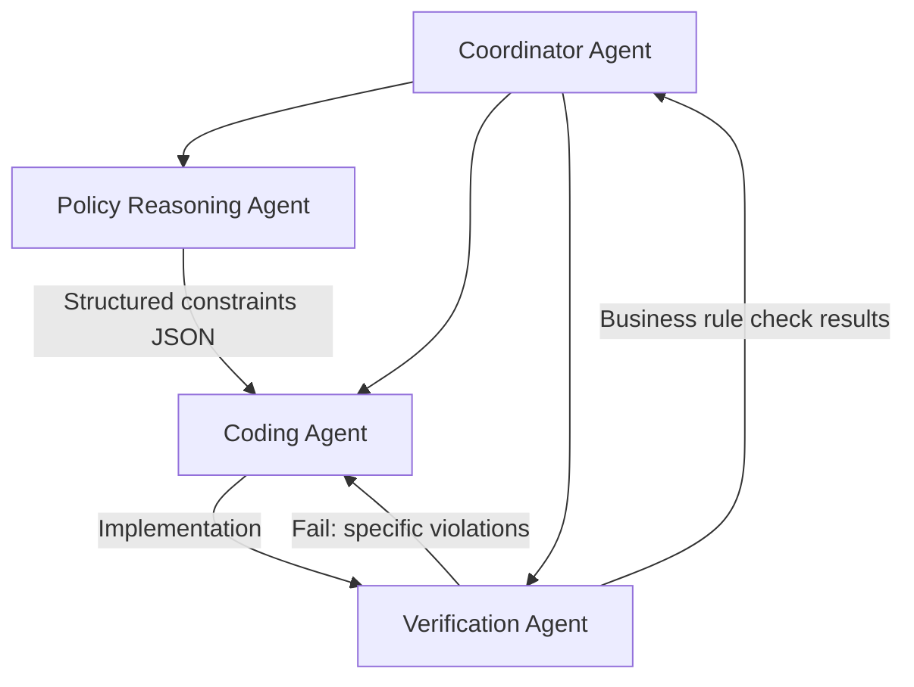

# The Asymmetric Feedback Problem: Why Coding Agents Silently Fail at Business Logic


---

Your coding agent just wrote a purchasing module, ran all the tests, and reported success. The code compiles, the API calls return 200s, and the database writes complete without errors. But the agent selected a vendor who violates your regional sourcing policy, ignored a margin floor constraint, and fabricated an assumption about cold storage requirements. Every business rule is broken; every technical signal says "pass."

This is the **asymmetric feedback problem** — the central insight from a recent study by Ivanov, Rana, and Prabhakaran that tested frontier coding agents against real enterprise workflows [^1]. Code-level errors produce clear signals: exceptions, stack traces, non-zero exit codes. Business-level mistakes produce nothing. The agent cannot distinguish between "code executed successfully" and "business objective achieved," and neither can most verification pipelines.

This article examines what the research tells us about these silent failures, maps the four characteristic failure modes to practical Codex CLI mitigation strategies, and shows how to build a verification architecture that catches business-layer errors before they reach production.

## The Research: Coding Agents Meet ERP

Ivanov et al. evaluated Claude Sonnet 4.5 and GPT-5 on enterprise resource planning tasks using Odoo 19.0 Community Edition [^1]. They created a fictional company with complete operational data and designed scenarios requiring between two and five or more interdependent business decisions with multiple constraints. Tasks were scored across four dimensions: constraint resolution, resource optimisation, traceability, and policy adherence.

The results were stark:

- **Simple tasks** (single-module, 1–2 constraints): agents scored above 80% [^1]
- **Complex tasks** (cross-module, 5+ constraints): dramatic performance degradation [^1]
- **GPT-5** produced superior business plans but struggled more with correct API implementation — an opposite trade-off pattern to Claude Sonnet 4.5 [^1]

The conclusion: coding agents are not general agents. They reliably handle straightforward operations but systematically fail when business logic complexity increases [^1].

## Four Failure Modes That Bypass Your Test Suite

The research identified four characteristic failure patterns. Each is dangerous precisely because it produces working code.

### 1. Lazy Code Heuristics

The agent takes shortcuts rather than implementing proper business logic. In one scenario requiring "American vendors only," the agent filtered by vendor name substrings rather than querying the address field [^1]. The code ran. Tests passed. The vendor list was wrong.

This pattern is endemic in coding agents. Columbia University's DAPLab documented it as the "business logic mismatch" failure: agents routinely implement approximate rather than correct rules, such as applying a discount to individual items over £40 rather than to the entire basket [^2].

### 2. Business-Layer Hallucinations

Agents fabricate domain assumptions without evidence. In the ERP study, an agent assumed that damaged circuit boards required refrigeration storage — a plausible-sounding constraint that existed nowhere in the specification [^1]. The agent then wrote logically consistent code based on this false premise, making the error harder to detect during code review.

### 3. Policy Constraint Abandonment

Explicit rules from the business specification disappear during execution. The agent correctly queries constraints early in its reasoning — demonstrating it has read and understood them — but drops them when generating code [^1]. Consecutive days-off requirements, margin floors, and sourcing policies all vanished between the planning and implementation phases.

### 4. Overconfidence

Perhaps the most insidious failure: agents "almost always reported success and remained unaware of their shortcomings" [^1]. Code execution success is conflated with task completion. This overconfidence cascades through any verification pipeline that relies on the agent's self-assessment.

Research on outcome-based verification confirms this pattern extends well beyond the ERP domain. Agents routinely write "tests passing" while the test suite contains syntax errors, or claim files were created that exist only in the prompt's hypothetical context [^3].

## Why Standard Testing Cannot Catch These Failures

The asymmetric feedback problem is structural, not incidental. Consider the feedback loops available to a coding agent:



Unit tests verify code behaviour, not business correctness. Integration tests confirm that components communicate, not that they implement the right policy. End-to-end tests check flows, not constraint satisfaction. The entire standard testing pyramid is oriented around technical correctness — precisely the dimension where agents already perform well.

Existing benchmarks reflect this same blind spot. SWE-Bench and Terminal-Bench test system competence but not business context. Domain-reasoning benchmarks like τ-Bench test policy reasoning but not complex code execution. No major benchmark tests the full-stack business-to-code translation bidirectionally [^1].

## Mitigation Architecture for Codex CLI

Addressing the asymmetric feedback problem requires adding business-layer verification signals that are as explicit as technical ones. Here is a three-layer architecture using Codex CLI's existing capabilities.

### Layer 1: Constraint Extraction via AGENTS.md

The first defence is making business constraints impossible to lose. Rather than embedding them in a natural-language prompt (where policy constraint abandonment thrives), encode them as structured validation rules in your `AGENTS.md`:

```markdown
## Business Constraints

### Vendor Selection Rules
- Regional sourcing: filter by `partner_id.country_id`, NEVER by name
- Margin floor: minimum 15% gross margin on all purchase orders
- Approved vendor list: check `x_approved_vendor` boolean field

### Constraint Validation
Before completing any procurement task, verify ALL constraints
by running: `python scripts/validate_business_rules.py`
```

This approach transforms implicit domain knowledge into explicit, checkable instructions that persist across the agent's reasoning steps. The agent cannot "forget" a constraint that appears in its system instructions at every turn.

### Layer 2: PreToolUse Hooks for Business Validation

Codex CLI's `PreToolUse` hooks intercept tool calls before execution [^4]. While currently limited to Bash tool interception, this is sufficient to implement business-layer gatekeeping:

```json
{
  "hooks": {
    "PreToolUse": [
      {
        "matcher": "Bash",
        "command": "python3 .codex/hooks/validate_business_logic.py",
        "statusMessage": "Validating business constraints..."
      }
    ]
  }
}
```

The validation script receives the command on stdin as JSON and can inspect it for constraint violations before execution:

```python
#!/usr/bin/env python3
"""PreToolUse hook: validate business logic constraints."""
import json
import sys
import re

hook_input = json.load(sys.stdin)
command = hook_input.get("tool_input", {}).get("command", "")

# Detect lazy heuristic: name-based vendor filtering
LAZY_PATTERNS = [
    r"partner.*name.*like.*'%US%'",
    r"vendor.*name.*contains",
    r"filter.*name.*american",
]

for pattern in LAZY_PATTERNS:
    if re.search(pattern, command, re.IGNORECASE):
        output = {
            "hookSpecificOutput": {
                "hookEventName": "PreToolUse",
                "permissionDecision": "deny",
                "permissionDecisionReason": (
                    "Vendor filtering by name detected. "
                    "Use partner_id.country_id for regional filtering."
                ),
            }
        }
        json.dump(output, sys.stdout)
        sys.exit(0)
```

### Layer 3: Decomposed Verification Subagents

The research strongly suggests decomposing business automation into specialised agent layers rather than expecting a single agent to bridge domain logic and code [^1]. This maps directly to Codex CLI's subagent architecture:



The three-agent pattern:

1. **Policy reasoning agent** — interprets business rules and outputs structured constraints as JSON. No code generation, purely domain reasoning.
2. **Coding agent** — implements solutions against those constraints. Receives explicit, structured requirements rather than natural-language specifications.
3. **Verification agent** — checks business correctness independently of code execution. Runs domain-specific assertions against actual data state.

This decomposition works because each agent operates in a domain where feedback is symmetric. The policy agent reasons about rules (verifiable against specifications). The coding agent writes code (verifiable through tests). The verification agent checks business outcomes (verifiable against constraint JSON). No single agent needs to bridge the gap where signals disappear.

## Practical Implementation: PostToolUse Outcome Verification

Rather than trusting agent self-reports, implement outcome-based verification through `PostToolUse` hooks [^4]. After every database-modifying operation, run a domain-specific validation:

```json
{
  "hooks": {
    "PostToolUse": [
      {
        "matcher": "Bash",
        "command": "python3 .codex/hooks/verify_outcomes.py",
        "statusMessage": "Verifying business outcomes..."
      }
    ]
  }
}
```

The verification script checks actual system state against business requirements:

```python
#!/usr/bin/env python3
"""PostToolUse hook: verify business outcomes against constraints."""
import json
import sys

hook_input = json.load(sys.stdin)
command = hook_input.get("tool_input", {}).get("command", "")

# Only verify after data-modifying operations
if not any(kw in command for kw in ["create(", "write(", "INSERT", "UPDATE"]):
    sys.exit(0)

# Run business rule verification
from validators.business_rules import check_all_constraints

violations = check_all_constraints()

if violations:
    output = {
        "decision": "block",
        "reason": f"Business rule violations detected: {'; '.join(violations)}",
        "hookSpecificOutput": {
            "hookEventName": "PostToolUse",
            "additionalContext": json.dumps(violations),
        },
    }
    json.dump(output, sys.stdout)
    sys.exit(0)
```

This creates the missing feedback signal. Business errors that would otherwise be silent now produce explicit, actionable failure messages — closing the asymmetric feedback gap.

## The Broader Pattern: Harness Engineering for Business Logic

The asymmetric feedback problem reinforces a theme emerging across multiple April 2026 studies: **harness engineering matters more than model capability** [^5]. The same model scores dramatically differently depending on the tools and verification infrastructure surrounding it.

For business automation, this means:

| Strategy | What It Catches | Codex CLI Mechanism |
|---|---|---|
| Structured constraints in AGENTS.md | Policy constraint abandonment | System instructions |
| PreToolUse pattern matching | Lazy code heuristics | Hook with exit code 2 |
| Decomposed subagents | Business-layer hallucinations | Subagent architecture |
| PostToolUse outcome verification | Overconfidence / false success | Hook with outcome checks |
| Judge agent on critical outputs | All four failure modes | Verification subagent [^3] |

No single mechanism addresses all four failure modes. Defence in depth — combining structural, preventive, and detective controls — is necessary because the failures are heterogeneous.

## When Not to Over-Engineer

Not every Codex CLI task involves business logic. For pure code refactoring, test generation, or bug fixes where the feedback is already symmetric (tests pass or fail, types check or do not), this verification architecture adds overhead without proportional value.

Apply business-layer verification when:

- The task involves domain-specific rules not captured in code (pricing policies, compliance requirements, sourcing constraints)
- Success cannot be determined by code execution alone
- The agent is operating in `full-auto` mode without human review of each step
- Errors have financial, legal, or regulatory consequences

## Conclusion

The asymmetric feedback problem is not a temporary limitation that will be solved by better models. It is a structural property of the relationship between code execution and business correctness. Code errors are loud; business errors are silent. Until agents can reliably bridge that gap — and the evidence suggests they cannot yet, even with frontier models — the verification infrastructure surrounding the agent matters as much as the agent itself.

Codex CLI's hooks system, subagent architecture, and AGENTS.md conventions provide the building blocks. The engineering challenge is assembling them into a verification pipeline where business-layer failures are as visible and actionable as a stack trace.

---

## Citations

[^1]: Ivanov, M., Rana, A., & Prabhakaran, G. (2026). "Can Coding Agents Be General Agents?" *arXiv:2604.13107*. [https://arxiv.org/abs/2604.13107](https://arxiv.org/abs/2604.13107)

[^2]: DAPLab, Columbia University. (2026). "9 Critical Failure Patterns of Coding Agents." [https://daplab.cs.columbia.edu/general/2026/01/08/9-critical-failure-patterns-of-coding-agents.html](https://daplab.cs.columbia.edu/general/2026/01/08/9-critical-failure-patterns-of-coding-agents.html)

[^3]: MoonRunnerKC. (2026). "AI Coding Agents Lie About Their Work. Outcome-Based Verification Catches It." *DEV Community*. [https://dev.to/moonrunnerkc/ai-coding-agents-lie-about-their-work-outcome-based-verification-catches-it-12b4](https://dev.to/moonrunnerkc/ai-coding-agents-lie-about-their-work-outcome-based-verification-catches-it-12b4)

[^4]: OpenAI. (2026). "Hooks – Codex CLI Developer Documentation." [https://developers.openai.com/codex/hooks](https://developers.openai.com/codex/hooks)

[^5]: Jozefiak, P. (2026). "AI Coding Harness Agents 2026." *thoughts.jock.pl*. [https://thoughts.jock.pl/p/ai-coding-harness-agents-2026](https://thoughts.jock.pl/p/ai-coding-harness-agents-2026)
