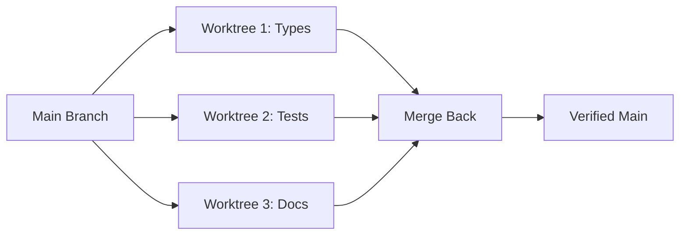
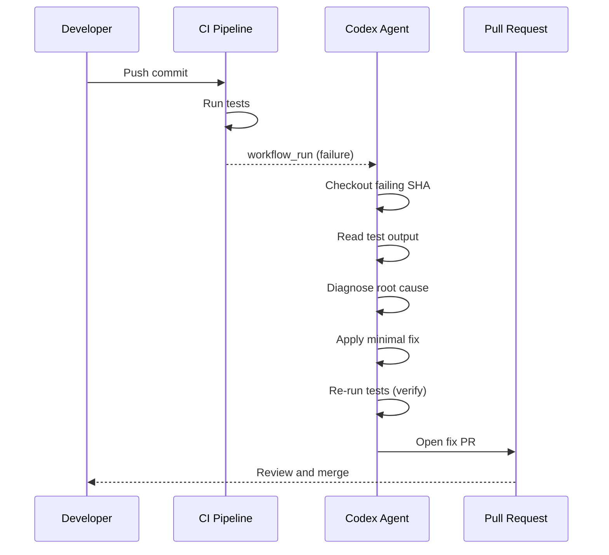
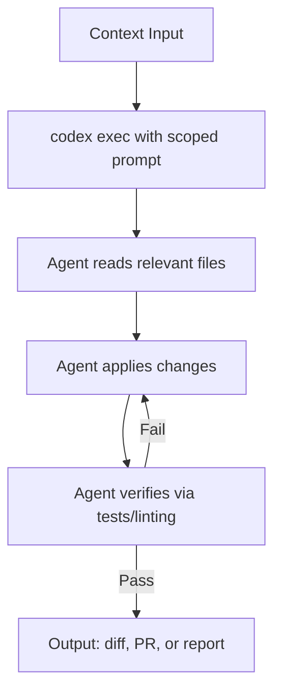

# Before and After: 5 Developer Workflows Transformed by Codex CLI


---

Every developer has workflows they endure rather than enjoy — the 45-minute bug-fix cycle, the mind-numbing PR review backlog, the test coverage debt that never quite gets addressed. Codex CLI transforms these workflows from manual slogs into agent-assisted operations that finish in a fraction of the time.

This article presents five side-by-side comparisons of manual versus agentic workflows, each with specific commands, realistic timings, and the architectural patterns that make them work.

---

## 1. Bug Fix from Error Alert — 45 Minutes → 4 Minutes

### Before: The Manual Cycle

A Sentry alert fires at 09:12. You open the dashboard, read the stack trace, locate the offending file, reproduce the issue locally, write a fix, run tests, and open a PR. Even for a straightforward null-pointer guard, this ritual rarely takes fewer than 40 minutes.

### After: Agent-Assisted Fix

```bash
# Pipe the error context directly to Codex
tail -n 200 /tmp/sentry-export.log \
  | codex exec "Diagnose the root cause from this error log. \
    Apply a minimal fix and add a regression test. \
    Do not refactor unrelated code." \
    --full-auto
```

Codex reads the stack trace, navigates to the relevant source files, applies a targeted patch, writes a regression test, and runs the test suite to verify the fix[^1]. The `--full-auto` flag combines `on-request` approvals with `workspace-write` sandbox access, giving the agent enough autonomy for low-risk local fixes[^2].

**Time breakdown:**

| Phase | Manual | Agentic |
|-------|--------|---------|
| Triage and locate | 15 min | ~30 sec |
| Reproduce | 10 min | Automatic |
| Write fix + test | 15 min | ~2 min |
| Run tests | 5 min | ~1 min |
| **Total** | **~45 min** | **~4 min** |

The key insight: Codex's "tight loop with reproduction and verification" means it discovers the failing code path, proposes a patch, and re-runs the test suite iteratively until everything passes[^3].

---

## 2. PR Code Review — 25 Minutes → 3 Minutes

### Before: The Manual Review

You open the PR, read through 400 lines of diff across eight files, cross-reference the ticket, check for edge cases, verify naming conventions, look for security issues, and leave inline comments. A thorough review of a medium-sized PR typically takes 20–30 minutes.

### After: Automated Review with codex-action


```yaml
# .github/workflows/codex-review.yml
name: Codex PR Review
on:
  pull_request:
    types: [opened, synchronize, reopened]

jobs:
  review:
    runs-on: ubuntu-latest
    permissions:
      contents: read
      pull-requests: write
    steps:
      - uses: actions/checkout@v5
        with:
          ref: refs/pull/${{ github.event.pull_request.number }}/merge

      - name: Run Codex Review
        uses: openai/codex-action@v1
        with:
          openai-api-key: ${{ secrets.OPENAI_API_KEY }}
          prompt-file: .github/codex/prompts/review.md
          output-file: codex-output.md
          safety-strategy: drop-sudo
          sandbox: read-only
```


The `openai/codex-action@v1` installs the Codex CLI, starts the Responses API proxy, and runs `codex exec` with the permissions you specify[^4]. The `drop-sudo` safety strategy irreversibly removes sudo capability, preventing the agent from accessing its own API key — critical for public repositories[^5].

Your review prompt file (`.github/codex/prompts/review.md`) can focus on what matters:

```markdown
Review this pull request. Focus on:
1. Logic errors and edge cases
2. Security vulnerabilities (injection, auth bypass, data exposure)
3. Performance regressions
4. API contract changes
Post findings as inline PR comments, prioritised by severity.
```

The agent reads the full diff, analyses control flow, and posts prioritised, actionable findings without touching the working tree[^6]. You still do the final sign-off — but now you're reviewing the agent's findings rather than scanning raw diffs.

---

## 3. Test Coverage Gap — 2 Hours → 12 Minutes

### Before: The Manual Grind

Your coverage report shows `src/services/billing.ts` at 34%. You spend two hours writing 15 test cases: happy paths, edge cases, error conditions, mock setups. It's valuable work, but it's also the kind of work that gets perpetually deprioritised.

### After: Targeted Test Generation

```bash
codex exec "Analyse src/services/billing.ts. Write comprehensive tests \
  covering happy path, edge cases, error handling, and boundary \
  conditions. Target 85% branch coverage. Use the existing test \
  framework and patterns from tests/services/." \
  --full-auto
```

Codex reads the source file, infers testable units, identifies critical code paths, determines edge cases, creates realistic test data, and writes tests to the appropriate location[^7]. Crucially, it executes the tests it creates and iterates until they pass — ensuring generated tests are both syntactically correct and functionally effective[^8].

For CI integration, pipe structured output for downstream processing:

```bash
codex exec --json \
  "Generate missing tests for all files below 60% coverage \
   in the coverage report at coverage/lcov.info" \
  -o test-gen-results.json
```

The `--json` flag emits newline-delimited JSON events, whilst `--output-last-message` (`-o`) writes the final response to a file for downstream automation[^2].

**Realistic expectations:** The agent handles straightforward unit tests brilliantly. Complex integration tests with intricate state management still benefit from human design, but the boilerplate and repetitive case generation — the bit that takes the longest — is fully automated.

---

## 4. Multi-File Refactor — Half a Day → 20 Minutes

### Before: The Manual Refactor

Renaming a core interface that's referenced across 47 files, updating type signatures, fixing downstream consumers, and ensuring nothing breaks. Even with IDE tooling, a cross-cutting refactor in a large TypeScript or Java codebase easily consumes half a day when you factor in test updates and integration verification.

### After: Parallel Agents via Git Worktrees

Git worktrees give each agent an isolated copy of your repository sharing the same history but checked out to its own directory[^9]. This is how you run multiple refactoring tasks in parallel without agents interfering with each other.

```bash
# Terminal 1: Rename the interface and update type signatures
git worktree add ../refactor-types feature/rename-types
cd ../refactor-types
codex exec "Rename the PaymentProvider interface to BillingGateway \
  across the entire codebase. Update all type signatures, imports, \
  and documentation references. Run the type checker after changes." \
  --full-auto

# Terminal 2: Update all tests referencing the old name
git worktree add ../refactor-tests feature/rename-tests
cd ../refactor-tests
codex exec "Update all test files to use BillingGateway instead of \
  PaymentProvider. Ensure all mocks and fixtures are updated. \
  Run the full test suite." \
  --full-auto

# Terminal 3: Update API documentation and OpenAPI specs
git worktree add ../refactor-docs feature/rename-docs
cd ../refactor-docs
codex exec "Update all API documentation, OpenAPI specs, and README \
  files to reference BillingGateway instead of PaymentProvider." \
  --full-auto
```

Each agent operates on its own worktree, so Agent A can be refactoring your type signatures whilst Agent B updates tests, and neither touches the other's files[^10]. When all three finish, you merge the branches sequentially, resolving any minimal conflicts.



The Codex desktop app automates worktree creation — each agent thread gets its own worktree automatically[^11]. On the CLI, you manage worktrees manually with standard `git worktree` commands, but the pattern is identical.

---

## 5. CI Failure Triage — 30 Minutes → 5 Minutes

### Before: The Manual Triage

CI goes red on a colleague's branch. You pull it locally, read 200 lines of test output, identify which test failed, work out whether it's a genuine regression or a flaky test, find the root cause, and either fix it or flag it. The context-switching alone costs 10 minutes before you even start diagnosing.

### After: Automated Diagnosis and Fix

The most powerful pattern uses `workflow_run` to react to CI failures automatically[^12]:


```yaml
# .github/workflows/autofix.yml
name: Codex Autofix
on:
  workflow_run:
    workflows: ["CI"]
    types: [completed]

jobs:
  autofix:
    if: ${{ github.event.workflow_run.conclusion == 'failure' }}
    runs-on: ubuntu-latest
    permissions:
      contents: write
      pull-requests: write
    steps:
      - uses: actions/checkout@v5
        with:
          ref: ${{ github.event.workflow_run.head_sha }}

      - name: Diagnose and Fix
        uses: openai/codex-action@v1
        with:
          openai-api-key: ${{ secrets.OPENAI_API_KEY }}
          prompt: |
            The CI workflow failed on this commit. Diagnose the
            failure from the test output. Apply a minimal fix and
            verify the tests pass. Do not refactor unrelated code.
          sandbox: workspace-write
          safety-strategy: drop-sudo
```


When the CI workflow completes with a failure, this workflow triggers automatically. Codex checks out the failing commit, reads the test output, diagnoses the root cause, applies a minimal fix, re-runs the tests to verify, and opens a PR with the resulting patch[^12].



**What this doesn't replace:** Flaky test investigation, architectural issues causing cascading failures, and environment-specific problems still need human judgement. The agent excels at the mechanical parts — reading logs, locating the failing assertion, and applying a straightforward fix.

---

## The Pattern Behind the Transformation

All five workflows share a common structure:



The recurring principles:

1. **Scoped prompts** — Tell the agent exactly what to do and what not to do. "Do not refactor unrelated code" prevents scope creep.
2. **Appropriate sandbox levels** — Use `read-only` for analysis tasks, `workspace-write` for fix-and-verify loops, and reserve `danger-full-access` for hardened, isolated environments only[^2].
3. **Verification loops** — Codex re-runs tests after making changes. This iterative loop is what separates agent-assisted development from copy-paste AI suggestions[^3].
4. **Human sign-off** — Every workflow ends with a human reviewing the output. The agent handles the mechanical work; you handle the judgement calls.

---

## Getting Started

If you're new to Codex CLI, start with Workflow 1 (bug fix). It's the lowest-risk, highest-reward entry point:

```bash
# Install Codex CLI
npm install -g @openai/codex

# Set your API key
export CODEX_API_KEY="sk-..."

# Try a simple analysis first (read-only, no changes)
codex exec "Analyse the repository structure and identify the top 5 areas with potential bugs"

# Then try a fix with --full-auto
codex exec "Fix the failing test in tests/unit/billing.test.ts and explain what was wrong" --full-auto
```

Tasks that used to consume 30–40% of a developer's morning — fixing type errors, updating endpoints, migrating legacy patterns — can now be batched and executed before diving into manual work[^13]. Queue up four or five Codex tasks, then shift to deep-focus work on harder problems. That two-tier approach is where the real productivity transformation happens.

---

## Citations

[^1]: [Codex CLI Workflows — Official Documentation](https://developers.openai.com/codex/workflows)
[^2]: [Codex CLI Command Line Options Reference](https://developers.openai.com/codex/cli/reference)
[^3]: [Codex CLI Features — Official Documentation](https://developers.openai.com/codex/cli/features)
[^4]: [Codex GitHub Action — Official Documentation](https://developers.openai.com/codex/github-action)
[^5]: [Build Code Review with the Codex SDK — OpenAI Cookbook](https://developers.openai.com/cookbook/examples/codex/build_code_review_with_codex_sdk)
[^6]: [Codex CLI Features — Code Review](https://developers.openai.com/codex/cli/features)
[^7]: [How to Use OpenAI Codex for Unit Test Generation — APIDog](https://apidog.com/blog/generate-unit-tests-with-codex/)
[^8]: [Does Codex Support Unit Test Generation? — Milvus](https://milvus.io/ai-quick-reference/does-codex-support-unit-test-generation)
[^9]: [Git Worktrees: The Secret Weapon for Running Multiple AI Coding Agents in Parallel](https://medium.com/@mabd.dev/git-worktrees-the-secret-weapon-for-running-multiple-ai-coding-agents-in-parallel-e9046451eb96)
[^10]: [Codex App Worktrees Explained — Verdent Guides](https://www.verdent.ai/guides/codex-app-worktrees-explained)
[^11]: [Codex App First Impressions (2026) — Verdent Guides](https://www.verdent.ai/guides/codex-app-first-impressions-2026)
[^12]: [Use Codex CLI to Automatically Fix CI Failures — OpenAI Cookbook](https://developers.openai.com/cookbook/examples/codex/autofix-github-actions)
[^13]: [OpenAI Codex Review 2026 — Updated from Daily Use](https://zackproser.com/blog/openai-codex-review-2026)
