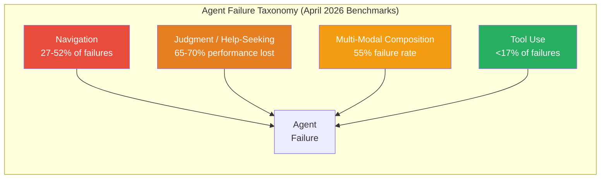
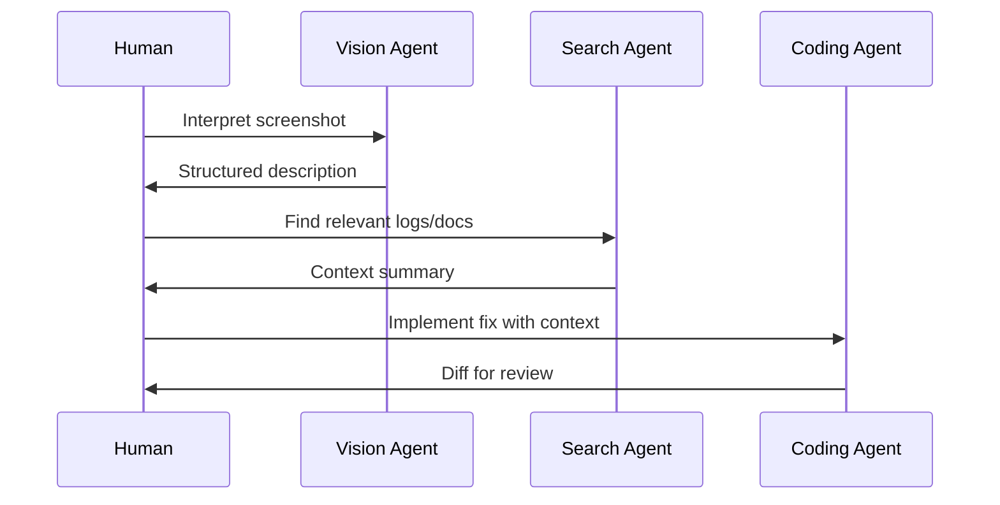
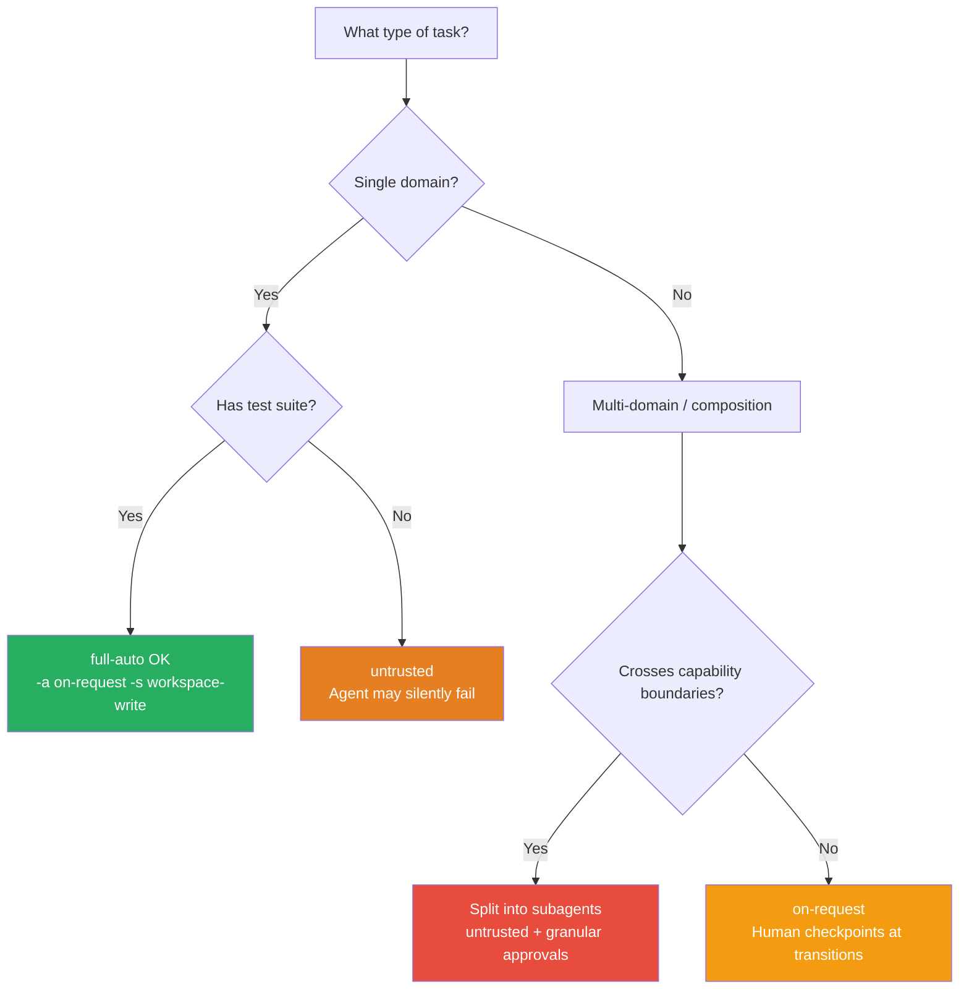

# Benchmarking Your Agentic Pod: What CocoaBench, HiL-Bench, and AAR Tell Us About Agent Limits


---

Three benchmarks published in April 2026 expose where frontier coding agents actually break down — and the failure modes they reveal map directly onto configuration decisions you make every day in Codex CLI. This article synthesises the findings from CocoaBench, HiL-Bench, and The Amazing Agent Race (AAR), then translates each into actionable guidance for structuring agentic pods, approval policies, and AGENTS.md files.

## The Three Benchmarks at a Glance

| Benchmark | Focus | Best Score | Key Finding |
|-----------|-------|------------|-------------|
| **CocoaBench** | Multi-modal composition (vision + search + code) | 45.1% [^1] | Agents fail when tasks require combining capabilities |
| **HiL-Bench** | Help-seeking judgment | 62.0 Ask-F1 (best domain) [^2] | Agents recover only 30–35% of full-information performance when they must decide whether to ask for help |
| **AAR** | Navigation vs tool use in graph-structured tasks | 37.2% accuracy [^3] | Navigation errors dominate at 27–52% of trials; tool-use errors stay below 17% |



The striking pattern: **agents are already decent at calling tools — they fail at finding the right context and knowing when they're stuck.**

## CocoaBench: The Composition Problem

CocoaBench[^1] evaluates unified digital agents on 153 human-authored, long-horizon tasks requiring flexible composition of vision, search, and coding. The best system scored just 45.1% — and analysis points to three bottlenecks: reasoning and planning, tool orchestration, and visual grounding[^4].

### What This Means for Your Pod

If your agentic pod involves agents that need to combine capabilities — say, reading a screenshot of a failing UI, searching logs, then writing a fix — expect roughly half your tasks to fail without human checkpoints. The practical response:

**Structure subagent boundaries around capability composition points.** Rather than one agent handling screenshot → search → code, split the pipeline:



Each handoff becomes a natural approval checkpoint. In Codex CLI, this maps to separate sessions with explicit context passing rather than a single `full-auto` session attempting everything.

### Configuration Response

For composition-heavy workflows, use the `untrusted` approval policy so the agent pauses at state-mutating boundaries[^5]:

```toml
# config.toml — composition-aware setup
approval_policy = "untrusted"
sandbox_mode = "workspace-write"
```

Or use granular control to keep sandbox and MCP approvals interactive while letting routine operations proceed[^5]:

```toml
approval_policy = { granular = {
  sandbox_approval = true,
  mcp_elicitations = true,
  request_permissions = true,
  rules = false,
  skill_approval = false
} }
```

## HiL-Bench: The Judgment Gap

HiL-Bench[^2] measures something most benchmarks ignore: can an agent recognise when it lacks sufficient information and ask for help? The answer is a resounding "poorly."

### Model-Specific Failure Signatures

The benchmark reveals distinct failure patterns across model families[^2]:

| Model | Text-to-SQL Ask-F1 | SWE Ask-F1 | Dominant Failure Mode |
|-------|--------------------:|------------:|----------------------|
| Claude Opus 4.6 | 62.0% | 28.2% | Detects uncertainty but submits anyway |
| Gemini 3.1 Pro | 52.7% | 41.6% | Domain-sensitive; loses responsiveness in SWE |
| GPT 5.4 Pro | 28.7% | 37.9% | Overconfident; rarely detects ambiguity |
| GPT 5.3 Codex | 18.8% | 35.7% | Confident execution with wrong beliefs |

The critical finding: agents recover only **30–35% of their fully-informed performance** when they must judge whether to escalate[^2]. In software engineering tasks specifically, recovery drops to roughly **12% of baseline** — far worse than in structured domains like SQL.

### Three Failure Archetypes

HiL-Bench identifies three distinct help-seeking failures[^2]:

1. **Overconfident wrong beliefs** — The agent has an incorrect mental model but never detects the gap. It executes confidently on wrong assumptions. (GPT family dominant pattern.)

2. **Uncertainty detection without resolution** — The agent explicitly recognises infeasibility or ambiguity but submits its attempt anyway, failing to convert uncertainty into an escalation. (Claude dominant pattern.)

3. **Broad, imprecise escalation** — The agent asks many questions but without targeting the actual blockers, creating noise rather than useful help requests. (Gemini on SQL tasks.)

### What This Means for Your Pod

**Your agents will not reliably ask for help.** Design your approval modes and AGENTS.md to compensate:

```markdown
<!-- AGENTS.md — help-seeking compensation -->
## Escalation Rules

When you encounter ANY of the following, STOP and report to the user
rather than attempting a workaround:

- Missing environment variables or credentials
- Ambiguous requirements with multiple valid interpretations
- Test failures you cannot reproduce locally
- Files or modules referenced in the task that don't exist in the repo
- API responses that don't match expected schemas

Do NOT attempt to infer missing information. Ask explicitly.
```

This explicit instruction set compensates for the judgment gap HiL-Bench exposes. You are essentially training your agent's behaviour through prompt engineering where reinforcement learning hasn't yet closed the gap.

### Approval Policy Implications

For workflows where incorrect silent execution is costly (production deployments, database migrations, security-sensitive changes), the `on-request` policy provides the safest baseline[^5]:

```bash
codex --ask-for-approval on-request --sandbox-mode workspace-write
```

For routine development where false confidence is less damaging, `untrusted` lets safe reads proceed while catching mutations:

```bash
codex --ask-for-approval untrusted
```

⚠️ The HiL-Bench data strongly suggests that `full-auto` mode should be reserved for well-constrained, single-domain tasks with comprehensive test suites as a safety net. Multi-step workflows crossing domain boundaries are precisely where the judgment gap is widest.

## The Amazing Agent Race: Navigation Is the Bottleneck

AAR[^3] tested agents on 1,400 instances requiring navigation through graph-structured information landscapes — closer to real-world codebases than linear benchmark chains. The results are stark:

- **Navigation errors: 27–52% of all trial failures**
- **Tool-use errors: below 17%**
- The best agent achieved only **37.2% accuracy** overall

A particularly notable finding: Claude Code matched larger models at 37% accuracy whilst using 6× fewer tokens[^3] — suggesting that architectural efficiency matters as much as raw model capability for navigation tasks.

### Why Navigation Fails

Linear benchmarks hide the navigation problem because they present tasks as sequential chains: read file → modify → test. Real codebases are graphs: understanding a bug might require jumping between the failing test, the implementation, the interface definition, two configuration files, and a migration script — with no predetermined order.

Agents struggle because they lack **spatial awareness of the codebase**. They don't know what exists three directories away, they can't efficiently scan for relevant files they weren't told about, and they waste tokens exploring dead ends.

### The AGENTS.md File Map Solution

This is where AGENTS.md file maps directly compensate for the navigation weakness[^6]:

```markdown
<!-- AGENTS.md — navigation compensation -->
## Repository Structure

### Core Application
- `src/api/` — REST endpoint handlers (Express routes)
- `src/services/` — Business logic layer; each service maps 1:1 to an API resource
- `src/models/` — Sequelize model definitions; migrations in `db/migrations/`
- `src/middleware/` — Auth, rate limiting, error handling

### Configuration
- `config/` — Environment-specific configs (dev, staging, prod)
- `.env.example` — Required environment variables template

### Testing
- `tests/unit/` — Unit tests mirroring `src/` structure
- `tests/integration/` — API-level tests requiring database
- `tests/fixtures/` — Shared test data

### Key Patterns
- Every service has a corresponding test file: `src/services/foo.ts` → `tests/unit/services/foo.test.ts`
- Database queries are ONLY in model files, never in services or controllers
- All API responses use the `ResponseWrapper` class from `src/utils/response.ts`
```

This explicit map reduces the navigation search space dramatically. Instead of exploring blindly, the agent can jump directly to relevant locations.

## Synthesising the Benchmarks: A Configuration Decision Tree



### Practical Recommendations

1. **Always provide file maps in AGENTS.md.** Navigation is the dominant failure mode (27–52% of failures)[^3]. An explicit repository structure section costs nothing and directly compensates for the biggest weakness.

2. **Don't trust agents to ask for help.** The judgment gap means agents recover only 12–35% of their capability when they need to escalate[^2]. Build explicit escalation rules into AGENTS.md and prefer `untrusted` or `on-request` approval policies for anything beyond single-file edits.

3. **Split composition tasks across sessions.** When a task requires combining vision, search, and coding, the 45.1% ceiling on CocoaBench[^1] means a single agent will fail more often than it succeeds. Use separate, focused sessions with human-mediated handoffs.

4. **Lean on test suites as a safety net.** Since tool-use errors are relatively rare (<17%)[^3], agents that can run tests will catch most of their own mistakes. The risk comes from navigation failures leading to edits in the wrong files — which tests catch. Configure your pod to run tests after every edit:

    ```markdown
    <!-- AGENTS.md -->
    ## After Every Change
    Run `npm test` before considering any task complete.
    Always run the specific test file for the module you modified.
    ```

5. **Match approval policy to task structure.** Single-domain tasks with tests → `full-auto`. Cross-domain without tests → `on-request`. The benchmarks validate what experienced practitioners already intuit: autonomy should scale with constraint, not with convenience.

## The Bigger Picture

These three benchmarks converge on a single insight: **the bottleneck has shifted from tool execution to judgment and navigation.** Agents can write code, run commands, and call APIs competently. They cannot reliably find the right context, recognise when they're lost, or ask for help when they should.

For Codex CLI users, this means the highest-leverage investment isn't in model selection or prompt engineering — it's in **structural scaffolding**: file maps, explicit escalation rules, approval policies tuned to task complexity, and subagent boundaries at composition points.

The agents will get better at judgment. The April 2026 HiL-Bench results show that reinforcement learning on shaped Ask-F1 rewards can improve help-seeking behaviour, with gains transferring across domains[^2]. But until that improvement ships in production models, your AGENTS.md and approval configuration are doing the work that the models can't yet do themselves.

---

## Citations

[^1]: Hao, S., Zhang, Z., et al. "CocoaBench: Evaluating Unified Digital Agents in the Wild." arXiv:2604.11201, April 2026. [https://arxiv.org/abs/2604.11201](https://arxiv.org/abs/2604.11201)

[^2]: Elfeki, M., et al. "HiL-Bench: Do Agents Know When to Ask for Help?" arXiv:2604.09408, April 2026. [https://arxiv.org/abs/2604.09408](https://arxiv.org/abs/2604.09408)

[^3]: Kim, Z.M., Lee, D., Kim, J., Raheja, V., Kang, D. "The Amazing Agent Race: Strong Tool Users, Weak Navigators." arXiv:2604.10261, April 2026. [https://arxiv.org/abs/2604.10261](https://arxiv.org/abs/2604.10261)

[^4]: Hao, S. et al. "CocoaBench," Section 5: Analysis. arXiv:2604.11201. [https://arxiv.org/html/2604.11201](https://arxiv.org/html/2604.11201)

[^5]: OpenAI. "Agent Approvals & Security — Codex CLI." OpenAI Developers, 2026. [https://developers.openai.com/codex/agent-approvals-security](https://developers.openai.com/codex/agent-approvals-security)

[^6]: OpenAI. "Custom Instructions with AGENTS.md — Codex." OpenAI Developers, 2026. [https://developers.openai.com/codex/guides/agents-md](https://developers.openai.com/codex/guides/agents-md)
