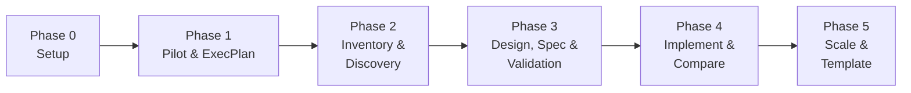
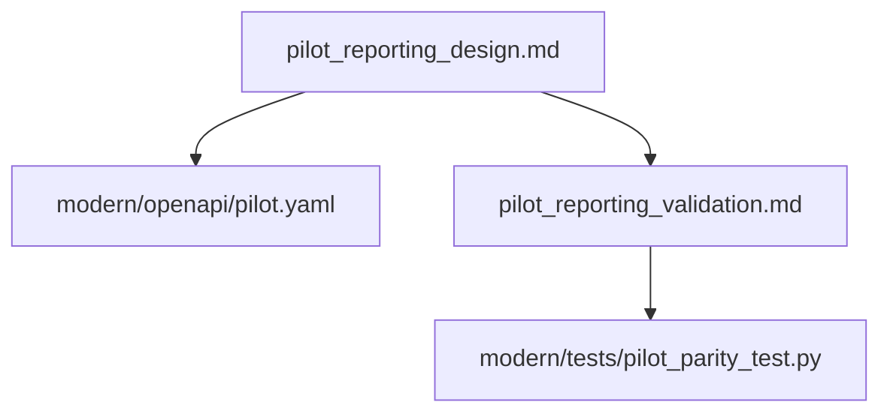
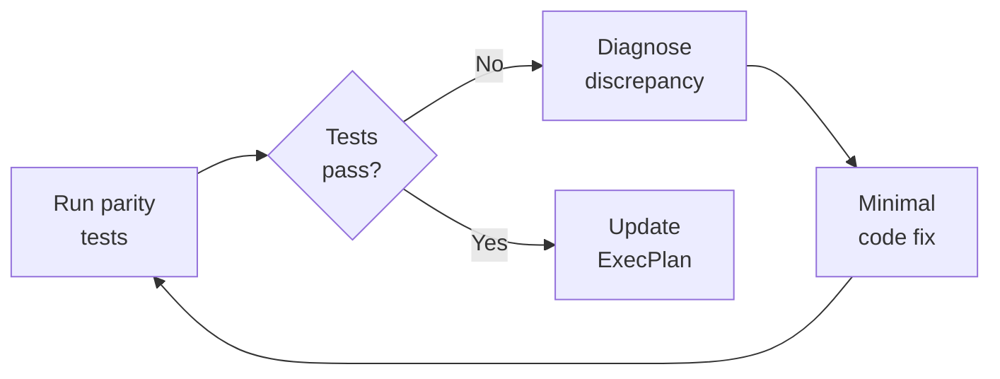

# Code Modernisation with Codex CLI: The ExecPlan-Driven Migration Pipeline


Legacy modernisation projects have a well-earned reputation for overruns and silent failures. A 2026 industry analysis found that organisations adopting AI-driven modernisation workflows report up to 80% cost savings and 87% accuracy in extracting core business logic from obsolete codebases[^1]. OpenAI's official Codex Cookbook now provides a structured five-phase pipeline that turns "modernise our codebase" into a series of small, testable, auditable steps[^2]. This article walks through that pipeline, adapts it for Codex CLI workflows, and shows how ExecPlans keep multi-week migrations on track.

## Why Agents Alone Aren't Enough

Pointing Codex at a legacy codebase and saying "rewrite this in Python" produces exactly the result you'd expect: plausible-looking code with silently broken business logic. The OpenAI Cookbook's code modernisation guide[^2] and the official migration use-cases page[^3] both emphasise the same principle: **behaviour-preserving migration requires structured checkpoints, not wholesale rewrites**.

The five-phase pipeline below enforces that structure. Each phase produces concrete artefacts, and no phase begins until the previous one's outputs are verified.



## Phase 0: Establish Planning Contracts

Before touching legacy code, set up two files that govern how Codex approaches the work.

### AGENTS.md

Run `/init` in your repository to generate the initial file, then add a section referencing your planning conventions:

```markdown
## Planning

When the user asks you to modernise, migrate, or rewrite a subsystem:
1. Create an ExecPlan following the structure in PLANS.md
2. Never begin implementation without a completed inventory phase
3. Always propose a parity test strategy before writing modern code
```

### PLANS.md

This file tells Codex what an ExecPlan is, when to create one, and which sections are required[^4]. The eight required sections from the OpenAI Cookbook's convention are:

1. **Goal** — one-sentence objective
2. **Plan of work** — ordered phases with deliverables
3. **Concrete steps** — actionable checklist
4. **Progress** — checkmarks updated after each phase
5. **Surprises and discoveries** — unexpected findings
6. **Decision log** — architectural choices with rationale
7. **Validation** — how you'll prove correctness
8. **Outcomes** — final summary when complete

```toml
# .codex/config.toml — recommended profile for migration work
[profiles.migration]
model = "gpt-5.4"
approval_policy = "on-request"
sandbox_mode = "workspace-write"
```

GPT-5.4 is the recommended model for migration work: it uses 47% fewer tokens than GPT-5.3 Codex on complex tasks[^5] and supports a 1,050,000-token context window[^6] — critical when reasoning across large legacy codebases.

## Phase 1: Pick a Pilot and Create the ExecPlan

Start small. Ask Codex to propose one or two bounded candidate flows:

```bash
codex --profile migration "Analyse the COBOL programs in src/cobol/ and \
propose 1-2 bounded pilot flows for modernisation. For each, list: \
programs and copybooks involved, JCL members, business scenario in \
plain language, and your recommendation."
```

Codex will read the codebase, identify data flows, and produce a recommendation. Once you've chosen a pilot, have it generate the ExecPlan:

```bash
codex --profile migration "Create pilot_execplan.md for the reporting \
flow following PLANS.md structure. Reference actual file paths. Define \
four outcomes: inventory, technical report, target design, parity tests."
```

The resulting `pilot_execplan.md` becomes your **home base** — a single document that tracks every decision, artefact, and validation result across the entire pilot.

## Phase 2: Inventory and Discovery

This phase produces `pilot_reporting_overview.md` with two main sections[^2]:

### Inventory

| Category | Contents |
|----------|----------|
| Programs | COBOL programs and copybooks, grouped by function (batch, online, utilities) |
| Jobs | JCL jobs and steps calling each program |
| Data | Datasets or tables read and written |
| Flow | Data flow diagram showing job sequence |

### Modernisation Technical Report (MTR)

The MTR captures what the code actually does — not what the documentation claims it does:

- Business scenario in plain language
- Detailed behaviour of each program
- Data model with field names and meanings
- Technical risks: date handling, packed decimals, EBCDIC encoding, rounding behaviour

```bash
codex --profile migration "Read the COBOL programs listed in \
pilot_execplan.md and create pilot_reporting_overview.md with \
inventory and MTR sections. Flag any date handling, packed decimal, \
or encoding risks."
```

**Critical human step**: confirm production jobs, fill gaps Codex cannot infer (SLAs, operational context, data ownership), and validate the data flow diagrams. The OpenAI Cookbook explicitly states that engineers must fill these gaps[^2] — Codex handles analysis, not institutional knowledge.

After review, update the ExecPlan:

```bash
codex --profile migration "Update pilot_execplan.md: mark inventory \
and MTR as drafted, add findings to Surprises and Decision log."
```

## Phase 3: Design, Specification, and Validation Plan

This phase produces four artefacts before any modern code is written[^2]:



### Target Design Document

Specifies which service owns the flow, whether it becomes a REST API, batch job, or event listener, and how it fits the broader domain model.

### OpenAPI Specification

```bash
codex --profile migration "Generate modern/openapi/pilot.yaml from \
the MTR data model. Map COBOL copybook fields to JSON schema types. \
Document packed-decimal-to-numeric conversions."
```

### Validation Plan

The validation plan defines parity testing **before implementation begins** — a deliberate inversion of the usual "write code, then figure out how to test it" pattern:

- Key scenarios (happy path plus edge cases derived from COBOL paragraph analysis)
- How to run legacy and modern implementations on identical input data
- Which outputs to compare (files, tables, logs)
- Difference detection and triage methods

### Test Scaffolding

```bash
codex --profile migration "Generate modern/tests/pilot_parity_test.py \
with placeholder assertions for each scenario in the validation plan. \
Reference original COBOL paragraph names in comments."
```

## Phase 4: Implement and Compare

Now — and only now — write the modern code.

### Code Generation

```bash
codex --profile migration "Implement the pilot reporting flow in \
Python under modern/python/pilot/. Generate domain models from the \
OpenAPI spec, service classes preserving COBOL behaviour, and \
repository classes for database access. Comment each method with \
the original COBOL paragraph reference."
```

### The Parity Loop

The implementation phase follows a tight iteration loop[^2]:



Each iteration is a single Codex session:

```bash
codex --profile migration "Run pilot_parity_test.py. For each \
failure, explain the COBOL vs Python discrepancy, propose a \
minimal fix, and update the Decision log in pilot_execplan.md."
```

### Migration Strategy Selection

The official Codex migration use-cases page[^3] identifies four strategies. Choose based on your codebase structure:

| Strategy | Best For | Codex CLI Approach |
|----------|----------|-------------------|
| **Strangler pattern** | System boundaries | Parallel worktrees — old and new coexist |
| **Branch by abstraction** | Internal modules | AGENTS.md enforces abstraction layer rules |
| **Module-by-module port** | Well-structured codebases | One ExecPlan per module, sequential execution |
| **Compatibility layers** | Gradual transitions | Codex generates adapter code with parity tests |

## Phase 5: Scale with Templates

Once the pilot succeeds, extract reusable patterns[^2]:

### Template ExecPlan

```bash
codex --profile migration "Create template_modernization_execplan.md \
by generalising pilot_execplan.md. Replace specific file references \
with placeholders. Keep the phase structure and required sections."
```

### How-To Guide

```bash
codex --profile migration "Create how_to_use_codex_for_modernization.md \
covering each phase, where Codex helps, and example prompts."
```

### Expected Folder Structure

```
.agents/
  AGENTS.md
  PLANS.md
pilot_execplan.md
pilot_reporting_overview.md
pilot_reporting_design.md
pilot_reporting_validation.md
modern/
  openapi/
    pilot.yaml
  tests/
    pilot_parity_test.py
  python/
    pilot/
      models.py
      repositories.py
      services.py
template_modernization_execplan.md
how_to_use_codex_for_modernization.md
```

## Practical Tips from the Field

**Use `codex exec` for CI integration.** Once parity tests are stable, run them in headless mode as part of your CI pipeline[^7]:

```bash
codex exec --approval-mode full-auto \
  "Run all parity tests in modern/tests/ and report failures."
```

**Leverage the review model for migration diffs.** Configure a separate review model to catch behavioural regressions[^8]:

```toml
# .codex/config.toml
review_model = "gpt-5.3-codex"
```

**Don't skip the MTR.** Morgan Stanley's internal DevGen.AI tool demonstrated the value of thorough analysis: interpreting 9 million lines of obsolete code saved 280,000 developer hours[^9]. The analysis phase is where agents deliver the highest ROI.

**Keep ExecPlans on disk.** The PLANS.md skill convention[^4] ensures that ExecPlans survive session boundaries. If Codex compacts its context window mid-session, it can re-read the ExecPlan from disk and resume without losing state.

**Validate before celebrating.** Anthropic's February 2026 analysis of COBOL modernisation noted that AI tools accelerate code analysis and transformation but "do not yet address the full programme scope that determines whether migrations succeed or fail"[^10]. Business scoping, data migration planning, and organisational change management remain human responsibilities. ⚠️

## When Not to Use This Pipeline

This pipeline assumes you want **behavioural parity** — the modern system does exactly what the legacy system did. If you're deliberately changing business logic during migration (rewriting pricing rules, redesigning data models), the parity testing approach breaks down. In that case, use specification-driven development instead, where tests encode the new desired behaviour rather than matching legacy output.

## Citations

[^1]: [AI-Assisted Legacy Code Modernization Guide 2026](https://www.cleveroad.com/blog/ai-assisted-legacy-code-modernization/) — Cleveroad, 2026
[^2]: [Modernizing your Codebase with Codex](https://developers.openai.com/cookbook/examples/codex/code_modernization) — OpenAI Cookbook, 2025
[^3]: [Run code migrations — Codex use cases](https://developers.openai.com/codex/use-cases/code-migrations) — OpenAI Developers, 2026
[^4]: [Using PLANS.md for multi-hour problem solving](https://developers.openai.com/cookbook/articles/codex_exec_plans) — OpenAI Cookbook (Aaron Friel), October 2025
[^5]: [GPT-5.4 vs GPT-5.3 Codex: Should Developers Upgrade?](https://www.nxcode.io/resources/news/gpt-5-4-vs-gpt-5-3-codex-upgrade-comparison-2026) — NxCode, 2026
[^6]: [Models — Codex | OpenAI Developers](https://developers.openai.com/codex/models) — OpenAI, 2026
[^7]: [Command line options — Codex CLI | OpenAI Developers](https://developers.openai.com/codex/cli/reference) — OpenAI, 2026
[^8]: [Features — Codex CLI | OpenAI Developers](https://developers.openai.com/codex/cli/features) — OpenAI, 2026
[^9]: [AI Can Now Modernize Legacy Software](https://www.metaintro.com/blog/ai-modernize-legacy-software-tech-workers-2026) — Metaintro, 2026
[^10]: [IBM vs. Anthropic: A Tale of the COBOL Modernization Tape](https://futurumgroup.com/insights/ibm-vs-anthropic-a-tale-of-the-cobol-modernization-tape/) — Futurum Group, 2026
