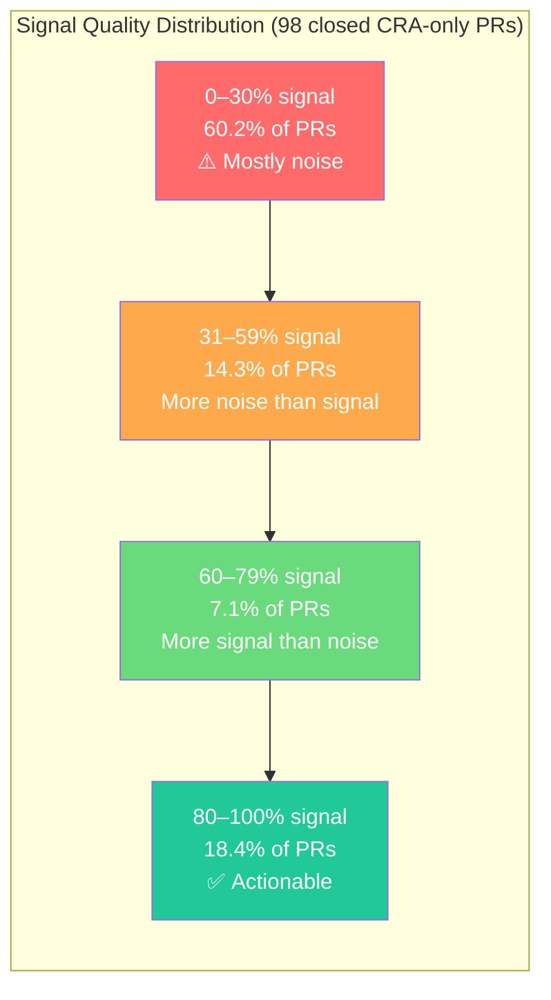
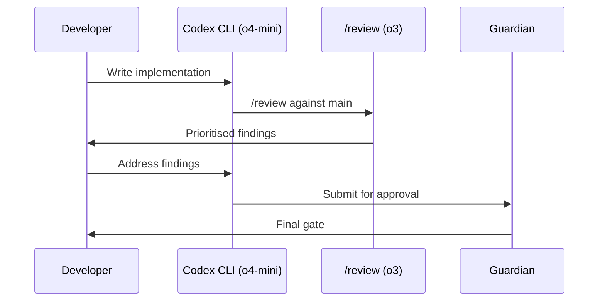

# Why Code Review Agents Produce 60% Noise — and How to Configure Codex CLI Reviews That Don't


---

A new empirical study accepted at MSR 2026 has quantified what many practitioners already suspected: most code review agents produce predominantly noisy feedback, and relying on them without human oversight correlates with significantly worse merge outcomes. The paper, "From Industry Claims to Empirical Reality" by Chowdhury et al., analysed 3,109 pull requests from the AIDev dataset and found that 60.2% of closed CRA-only PRs had signal-to-noise ratios below 30%[^1].

This article unpacks the research, maps its findings to Codex CLI's `/review` command, and provides concrete configuration patterns that push your automated reviews toward the high-signal end of the spectrum.

---

## The MSR 2026 Findings: What the Numbers Say

The researchers examined 19,450 PR records from the AIDev dataset on HuggingFace, isolating 3,109 unique pull requests in a commented review state[^1]. They compared four categories of reviewer composition: CRA-only, human-only, mixed (CRA-dominant), and mixed (human-dominant).

### Merge Rates by Reviewer Type

| Reviewer composition | Merge rate | Abandonment rate |
|---|---|---|
| Human-only | 68.37% | 21.60% |
| Mixed (human-dominant) | 67.99% | — |
| Mixed (CRA-dominant) | 63.25% | — |
| Mixed (equal) | 61.09% | — |
| CRA-only | 45.20% | 34.88% |

The 23-percentage-point gap between CRA-only and human-only merge rates is statistically significant (χ² = 83.03, p < 0.001)[^1]. The pattern is clear: the more human involvement in review, the better the outcome.

### Signal Quality Across 13 Code Review Agents

The researchers manually classified every comment from 98 closed CRA-only PRs as signal (actionable, relevant feedback) or noise (generic, unhelpful, or false-positive comments)[^1]:

- **60.2%** of closed CRA-only PRs fell in the 0–30% signal range
- **14.3%** in the 31–59% range
- Only **25.5%** achieved signal ratios above 60%

Of the 13 CRAs studied, 12 exhibited average signal ratios below 60%[^1]. The top two by volume — `github-advanced-security[bot]` (27.62% average signal across 36 PRs) and `Copilot` (19.79% across 24 PRs) — were among the noisiest[^1].



### The Abandonment Correlation

CRA-only reviewed PRs had a 34.88% closure rate compared to 21.60% for human-only reviews — a 13-percentage-point increase in abandonment[^1]. The researchers hypothesise that noisy, generic feedback discourages contributors from iterating on their PRs, leading them to abandon rather than engage.

---

## Why Review Agents Produce Noise

The MSR findings align with broader industry data. CodeRabbit's own analysis of 470 open-source PRs found that AI-coauthored PRs contained 2.74 times more security vulnerabilities than human-only PRs[^2], and an independent 2026 evaluation scored CodeRabbit 1/5 on completeness and 2/5 on depth[^3]. The root causes are structural:

1. **Generic rules applied universally.** Most CRAs ship with broad rulesets designed for maximum coverage, producing false positives on projects with non-standard conventions.

2. **No project context.** Without understanding a repository's architecture, conventions, and business logic, a CRA cannot distinguish between a genuine violation and an intentional design decision.

3. **Volume over precision.** CRAs optimise for catching everything, not for being right. A security scanner flagging every use of `eval()` — including those inside a sandboxed test harness — adds noise without value.

4. **No feedback loop.** Unlike human reviewers who learn a codebase's idioms over time, most CRAs have no mechanism to incorporate dismissal patterns into future reviews.

---

## Codex CLI's Review Architecture: Built Differently

Codex CLI's `/review` command takes a fundamentally different approach from external CRA bots. Instead of running a fixed ruleset against a diff, it launches a dedicated agent that reads the full diff context and produces prioritised, natural-language findings[^4]. This means it benefits from the same context mechanisms — `AGENTS.md`, project-level instructions, and model selection — that make Codex effective for code generation.

### The `/review` Command

From within an active Codex session, `/review` offers four modes[^4]:

- **Review against a base branch** — compares the current worktree to an upstream branch
- **Review uncommitted changes** — inspects staged, unstaged, or untracked files
- **Review a commit** — analyses a specific recent commit
- **Custom review instructions** — accepts free-text criteria like "focus on thread safety" or "check for N+1 queries"

Each review run appears as a separate turn in the transcript, so you can rerun reviews as code evolves and compare feedback across iterations[^4].

### Configuring `review_model`

By default, `/review` uses the current session model. For teams that want a faster model for general coding but a more capable one for review, set `review_model` in `~/.codex/config.toml`[^4]:

```toml
# Use the session's default model for code generation
model = "o4-mini"

# But use a stronger model for reviews
review_model = "o3"
```

This separation mirrors the MSR finding that specialised, focused review produces better signal than generic broad-spectrum analysis.

---

## Five Configuration Patterns for High-Signal Reviews

Based on the MSR data and Codex CLI's capabilities, here are five patterns that push automated reviews toward the 80–100% signal range.

### Pattern 1: Scoped Review via `code_review.md`

Create a `code_review.md` file in your repository root and reference it from `AGENTS.md`[^5]:

```markdown
<!-- AGENTS.md -->
## Code Review Standards
When running /review, follow the guidelines in `code_review.md`.
```

```markdown
<!-- code_review.md -->
## Review Focus Areas
1. **Security**: SQL injection, XSS, credential exposure
2. **Concurrency**: Race conditions in async handlers
3. **API contracts**: Breaking changes to public interfaces

## Ignore List
- Formatting differences (handled by prettier)
- Import ordering (handled by eslint)
- TODO comments (tracked in issue tracker)
```

The key insight from the MSR data: CRAs with narrow, specific focus areas produce higher signal than those attempting general-purpose review[^1]. By explicitly listing what to ignore, you eliminate the largest source of noise.

### Pattern 2: Layered Review with Hooks

Use Codex CLI hooks to create a two-stage review pipeline — deterministic checks first, then LLM-based review for what remains[^6]:

```bash
#!/bin/bash
# .codex/hooks/pre-review.sh
# Run fast, deterministic checks before the LLM review

set -euo pipefail

echo "Running type-check..."
npx tsc --noEmit 2>&1 | head -20

echo "Running security scan..."
npx audit-ci --moderate 2>&1 | head -20

echo "Running lint..."
npx eslint --quiet . 2>&1 | head -20
```

This pattern ensures the LLM review isn't wasting tokens flagging issues that a linter would catch in milliseconds. The MSR data shows that `github-advanced-security[bot]` — a deterministic scanner — produced only 27.62% signal[^1]. Combining deterministic and LLM-based review, with clear boundaries, prevents duplication.

### Pattern 3: CI Integration with `codex exec`

For automated PR review in CI, use `codex exec` in non-interactive mode[^7]:

```bash
# In your CI pipeline
git diff origin/main...HEAD | codex exec \
  "Review this diff for security vulnerabilities, breaking API changes, \
   and missing error handling. Report only high-confidence findings. \
   Format as a JSON array of {file, line, severity, message}." \
  --approval-mode full-auto
```

The prompt-plus-stdin pattern lets you pipe the exact diff context and provide focused review instructions[^8]. The critical detail: explicitly asking for "high-confidence findings only" directly addresses the noise problem.

### Pattern 4: Cross-Model Review for Critical Paths

For high-stakes changes (security, payments, data migrations), configure a cross-model review loop using Codex's Guardian feature and the `codex-plugin-cc` bridge[^9]:



The MSR data shows that mixed reviews with human dominance (67.99% merge rate) nearly match pure human review (68.37%)[^1]. The same principle applies to multi-model review: a secondary model reviewing the primary model's output catches errors that self-review misses.

### Pattern 5: Feedback-Loop Review with Memory

Codex CLI's memory system lets review patterns improve over time[^10]. When you dismiss a finding as a false positive, Codex can learn from that:

```toml
# ~/.codex/config.toml
[features]
memories = true

[memories]
use_memories = true
```

Over sessions, Codex learns your project's idioms — that your custom `assertRejects()` helper is intentional, that your `eval()` calls in the test harness are sandboxed, that your non-standard import order is deliberate. This is the feedback loop that external CRAs lack.

---

## Quantifying the Difference: What to Measure

The MSR study's signal-to-noise classification provides a useful framework for evaluating your own review setup. Track these metrics:

| Metric | Target | How to measure |
|---|---|---|
| Signal ratio | >60% | Classify review comments as actionable vs dismissed over 50 PRs |
| False positive rate | <20% | Track how often review findings are dismissed without code changes |
| Time-to-merge | Baseline ± 10% | Automated review should not significantly slow merge velocity |
| Escape rate | Decreasing | Bugs found in production that review should have caught |

If your signal ratio drops below 60%, you've entered the noise zone where CRAs actively harm productivity. Revisit your `code_review.md` scope and add items to the ignore list.

---

## The Human-in-the-Loop Remains Essential

The MSR data's clearest message: human involvement in code review correlates with better outcomes across every metric studied[^1]. Even a single human reviewer alongside a CRA shifts the merge rate from 45.20% to 63.25% or higher[^1].

The practical implication for Codex CLI teams: use `/review` and CI-integrated review to triage and prioritise, but always route the findings to a human reviewer for the final decision. Configure Codex to produce a short, prioritised list of high-confidence findings — not an exhaustive catalogue of every possible issue.

The goal is not to replace human review. It is to make human review faster and more focused by filtering out the noise before a human ever sees the PR.

---

## Citations

[^1]: Chowdhury, K., Banik, D., Ferdous, K.M., & Shamim, S.I. (2026). "From Industry Claims to Empirical Reality: An Empirical Study of Code Review Agents in Pull Requests." *Proceedings of the 23rd International Conference on Mining Software Repositories (MSR '26)*. [arXiv:2604.03196](https://arxiv.org/abs/2604.03196)

[^2]: CodeRabbit (2026). "State of AI vs Human Code Generation Report." [https://www.coderabbit.ai/blog/state-of-ai-vs-human-code-generation-report](https://www.coderabbit.ai/blog/state-of-ai-vs-human-code-generation-report)

[^3]: UCS Strategies (2026). "CodeRabbit Review 2026: Fast AI Code Reviews, But a Critical Gap Enterprises Can't Ignore." [https://ucstrategies.com/news/coderabbit-review-2026-fast-ai-code-reviews-but-a-critical-gap-enterprises-cant-ignore/](https://ucstrategies.com/news/coderabbit-review-2026-fast-ai-code-reviews-but-a-critical-gap-enterprises-cant-ignore/)

[^4]: OpenAI (2026). "Features – Codex CLI." [https://developers.openai.com/codex/cli/features](https://developers.openai.com/codex/cli/features)

[^5]: OpenAI (2026). "Best practices – Codex." [https://developers.openai.com/codex/learn/best-practices](https://developers.openai.com/codex/learn/best-practices)

[^6]: OpenAI (2026). "Codex CLI Hooks Complete Guide." [https://developers.openai.com/codex/cli/features](https://developers.openai.com/codex/cli/features)

[^7]: SmartScope (2026). "OpenAI Codex /review Command Implementation: Integrating Automated Code Review into CI/CD." [https://smartscope.blog/en/generative-ai/chatgpt/codex-review-command-deep-dive/](https://smartscope.blog/en/generative-ai/chatgpt/codex-review-command-deep-dive/)

[^8]: OpenAI (2026). "Non-interactive mode – Codex." [https://developers.openai.com/codex/noninteractive](https://developers.openai.com/codex/noninteractive)

[^9]: OpenAI (2026). "codex-plugin-cc: Use Codex from Claude Code to review code or delegate tasks." [https://github.com/openai/codex-plugin-cc](https://github.com/openai/codex-plugin-cc)

[^10]: OpenAI (2026). "Memories – Codex." [https://developers.openai.com/codex/memories](https://developers.openai.com/codex/memories)
