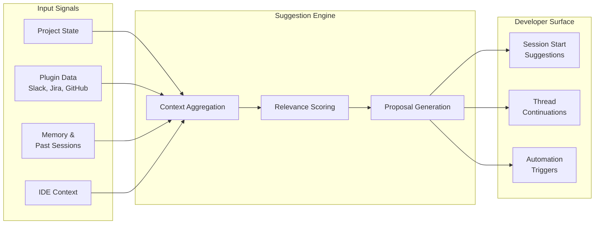
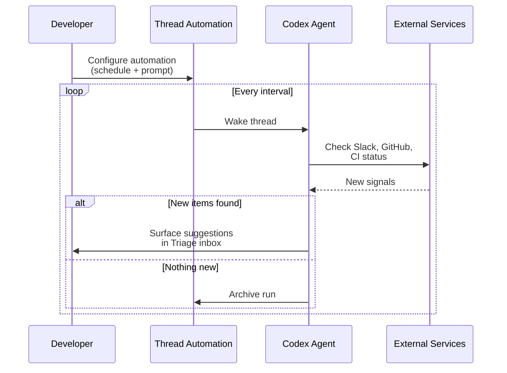

# Ambient Suggestions: When Your Coding Agent Starts Thinking Ahead


---

Coding agents have traditionally been reactive: you type a prompt, the agent responds. OpenAI's Codex is shifting that paradigm with **ambient suggestions** — a collection of features that allow the agent to proactively propose work, surface relevant context, and anticipate your next move before you ask. This article examines the underlying mechanisms, how they connect to the hooks lifecycle and automations framework, and how to configure them for your team's workflow.

## The Shift from Reactive to Proactive

Most developers interact with coding agents through an explicit request–response loop. You describe a task, the agent executes it, and you review the output. Ambient suggestions break this pattern by introducing **context-aware task proposals** that appear when you start or return to a Codex session[^1].

The April 2026 release (v26.415) introduced context-aware suggestions as part of a broader push towards what OpenAI describes as an "ambient, agentic operating layer for knowledge work"[^2]. Rather than waiting for instructions, Codex now analyses project state, connected plugins, and conversation memory to suggest actions — from resuming interrupted work to triaging bugs surfaced through Slack threads[^3].



## How Ambient Suggestions Work

Ambient suggestions draw on four primary signal sources:

### 1. Project State Analysis

When you open Codex in a repository, it reads `AGENTS.md`, `README.md`, and other project documentation files (configurable via `project_doc_fallback_filenames` in `config.toml`)[^4]. Combined with git status and recent commit history, this gives the agent a baseline understanding of what's in progress.

```toml
# ~/.codex/config.toml
project_doc_max_bytes = 5000
project_doc_fallback_filenames = ["README.md", "CONTRIBUTING.md", "AGENTS.md"]
```

### 2. Plugin-Driven Context

Connected plugins — Slack, GitHub, Notion, Google Docs — feed real-time signals into the suggestion engine. The most striking example is Slack integration: Codex parses bug reports from Slack threads via a dedicated plugin and surfaces a list of suggested actions in a new chat[^3]. Pilot programmes have shown approximately 25% reductions in mean time to bug resolution using this approach[^5].

### 3. Memory Persistence

Codex's memory system carries useful context from past tasks into future threads[^6]. When you return to a project after days away, the agent can recall previous decisions, unresolved issues, and architectural patterns — using these to generate relevant suggestions rather than starting from a blank slate.

### 4. IDE Context Synchronisation

When the IDE extension is connected with **Auto context** enabled, Codex tracks the files you're viewing and references them indirectly[^7]. This means suggestions can be informed by what you're actively reading, not just what you've explicitly shared.

## The Hooks Connection

Ambient suggestions don't exist in isolation — they build on the **hooks extensibility framework** that lets you inject custom scripts into the agentic loop[^8]. Understanding hooks is essential to building your own proactive workflows.

### Hook Lifecycle Events

Codex supports five hook events that form the backbone of extensible agent behaviour:

| Event | Scope | Use Case |
|-------|-------|----------|
| `SessionStart` | Session | Load workspace conventions, initialise logging |
| `PreToolUse` | Turn | Validate commands before execution |
| `PostToolUse` | Turn | Scan outputs, enforce standards |
| `UserPromptSubmit` | Turn | Block sensitive data, augment prompts |
| `Stop` | Turn | Validate output, trigger continuation |

The `SessionStart` hook is particularly relevant to ambient suggestions: it fires when a session begins or resumes, making it the natural injection point for custom suggestion logic[^8].

### Building a Custom Suggestion Hook

Here's a practical example — a `SessionStart` hook that checks for open GitHub issues assigned to you and presents them as suggestions:

```json
{
  "hooks": [
    {
      "event": "SessionStart",
      "matcher": {
        "source": "startup|resume"
      },
      "handlers": [
        {
          "command": ["python3", "/path/to/suggest-issues.py"],
          "timeout": 30
        }
      ]
    }
  ]
}
```

The handler script might look like:

```python
#!/usr/bin/env python3
"""suggest-issues.py — SessionStart hook for ambient issue suggestions."""
import json
import subprocess
import sys

result = subprocess.run(
    ["gh", "issue", "list", "--assignee", "@me", "--state", "open",
     "--json", "number,title,labels", "--limit", "5"],
    capture_output=True, text=True
)

issues = json.loads(result.stdout) if result.returncode == 0 else []

if issues:
    suggestions = "\n".join(
        f"- #{i['number']}: {i['title']}" for i in issues
    )
    output = {
        "message": f"You have {len(issues)} open issues:\n{suggestions}\n"
                   "Would you like to work on any of these?"
    }
    json.dump(output, sys.stdout)
```

Place the hook configuration at `<repo>/.codex/hooks.json` for repository-scoped behaviour or `~/.codex/hooks.json` for global use[^8]. Enable hooks in your configuration:

```toml
[features]
codex_hooks = true
```

## Thread Automations: Ambient Suggestions on a Schedule

While hooks trigger at specific lifecycle points, **thread automations** provide the scheduling layer that makes ambient suggestions persistent[^9]. A thread automation is a "heartbeat-style recurring wake-up call" that preserves conversation context across runs.



### Creating an Ambient Monitor

You can create a thread automation conversationally:

> "Check my GitHub notifications and open PRs every 30 minutes. If there are new review requests or failing checks, summarise them and suggest next steps."

Codex will set up a minute-based interval automation that polls GitHub, filters for actionable items, and surfaces them in your Triage inbox[^9].

For more precise control, standalone automations run independently of any conversation thread and can use cron syntax for scheduling:

```
┌─────── minute
│ ┌───── hour
│ │ ┌─── day of month
│ │ │
0 9 * * 1-5   # Weekdays at 09:00
```

### Automation Configuration

Automations respect your sandbox and approval settings. For unattended runs, you'll typically want workspace-write access with standard approval:

```toml
# Automation defaults inherit from your global config
sandbox = "workspace-write"
approval_policy = "unless-allow-listed"
```

⚠️ Setting `approval_policy = "never"` for automations may be restricted by admin-enforced requirements in enterprise environments[^9].

## Skills as Context-Triggered Actions

Codex Skills add another dimension to ambient behaviour. Skills are reusable capability bundles that can be invoked explicitly with `$skill-name` syntax or — crucially — **triggered automatically based on context**[^10]. This means a well-configured skill can activate without the developer requesting it, responding to patterns in the conversation or project state.

For example, if you've defined a `$lint-check` skill, Codex may invoke it automatically when it detects you're working on files that have historically triggered linting issues. Combined with automations, skills enable sophisticated ambient workflows:

```
Automation (schedule) → Skill (action) → Hook (validation) → Triage (output)
```

## The Goal Mode Connection

Ambient suggestions complement **Goal Mode** — the Codex app's approach to user-side autonomy where you define a high-level objective and let the agent determine the implementation path[^2]. Where Goal Mode gives the agent latitude in *how* to accomplish a task, ambient suggestions give it latitude in *what* to propose next.

Together, they represent a shift towards what the research community calls **proactive agent UX**: systems that don't just respond to instructions but actively participate in workflow planning[^11].

## Practical Configuration Patterns

### Pattern 1: Morning Standup Bot

Combine a daily automation with Slack and GitHub plugins to generate a standup summary:

```json
{
  "hooks": [
    {
      "event": "SessionStart",
      "matcher": { "source": "startup" },
      "handlers": [
        {
          "command": ["bash", "-c",
            "echo '{\"message\": \"Good morning. Checking overnight activity...\"}'"
          ],
          "timeout": 10
        }
      ]
    }
  ]
}
```

Pair this with a standalone automation that runs at 08:30 on weekdays, checking:

- Open PRs awaiting your review
- CI failures on your branches
- New Slack threads mentioning your team

### Pattern 2: Continuous Triage

Use a thread automation with a 15-minute interval to monitor error telemetry:

> "Poll our Sentry integration every 15 minutes. If new unassigned errors appear in the `api-gateway` project with severity >= warning, create a summary with reproduction steps and suggest which team member should investigate."

### Pattern 3: Post-Deploy Watchdog

After a production deployment, create a temporary thread automation:

> "Every 5 minutes for the next hour, check the `/health` endpoint and error rate dashboard. If error rate exceeds 2%, alert me immediately with a rollback recommendation."

This pattern leverages the thread automation's context preservation — each check builds on the previous one, allowing Codex to detect trends rather than treating each poll independently[^9].

## Current Limitations

Ambient suggestions are still evolving. Several constraints are worth noting:

- **CLI vs App asymmetry**: Context-aware suggestions are primarily a Codex App feature. CLI users get hooks and can build custom suggestion flows, but the built-in suggestion engine is app-first[^7].
- **Plugin availability**: Slack-driven suggestions require the Codex Slack plugin, which may not be available in all enterprise configurations[^5].
- **Hook platform support**: Hooks are currently disabled on Windows[^8].
- **Cost implications**: Proactive polling through automations consumes tokens on each run. A 15-minute automation running 24/7 generates 96 daily invocations — budget accordingly.
- **Signal noise**: Without careful prompt engineering, ambient suggestions can surface low-value items. Start with narrow scopes and widen gradually.

## What's Next

The trajectory is clear: coding agents are moving from tools you invoke to collaborators that anticipate your needs. The ambient suggestions framework — built on hooks, automations, memory, and plugin integrations — provides the foundation for this shift. For teams already using Codex CLI, the practical entry point is hooks: start with a `SessionStart` hook that surfaces your most actionable items, then layer in automations as your confidence grows.

The question isn't whether your coding agent should think ahead — it's how much latitude you're comfortable giving it.

---

## Citations

[^1]: [Changelog – Codex | OpenAI Developers](https://developers.openai.com/codex/changelog) — v26.415 release notes, context-aware suggestions feature.
[^2]: [Exploring OpenAI Codex: Features of the 2026 SuperApp](https://digitalstrategy-ai.com/2026/04/14/exploring-openai-codex-features/) — Overview of Codex as an ambient agentic operating layer.
[^3]: [OpenAI Codex Shows Proactive AI: Slack-Driven Task Suggestions Explained](https://blockchain.news/ainews/openai-codex-shows-proactive-ai-slack-driven-task-suggestions-explained-2026-analysis) — Slack plugin integration and proactive task surfacing.
[^4]: [Advanced Configuration – Codex | OpenAI Developers](https://developers.openai.com/codex/config-advanced) — Project documentation discovery configuration.
[^5]: [OpenAI Codex Shows Proactive AI: Slack-Driven Task Suggestions Explained](https://blockchain.news/ainews/openai-codex-shows-proactive-ai-slack-driven-task-suggestions-explained-2026-analysis) — Pilot programme results showing 25% reduction in bug resolution time.
[^6]: [Features – Codex app | OpenAI Developers](https://developers.openai.com/codex/app/features) — Memory persistence across threads.
[^7]: [Features – Codex app | OpenAI Developers](https://developers.openai.com/codex/app/features) — IDE context synchronisation and Auto context feature.
[^8]: [Hooks – Codex | OpenAI Developers](https://developers.openai.com/codex/hooks) — Hook lifecycle events, configuration, and platform limitations.
[^9]: [Automations – Codex app | OpenAI Developers](https://developers.openai.com/codex/app/automations) — Thread automations, scheduling, and sandbox settings.
[^10]: [Exploring OpenAI Codex: Features of the 2026 SuperApp](https://digitalstrategy-ai.com/2026/04/14/exploring-openai-codex-features/) — Skills as context-triggered execution bundles.
[^11]: [Codex | AI Coding Partner from OpenAI](https://openai.com/codex/) — OpenAI's vision for proactive agent UX and developer collaboration.
