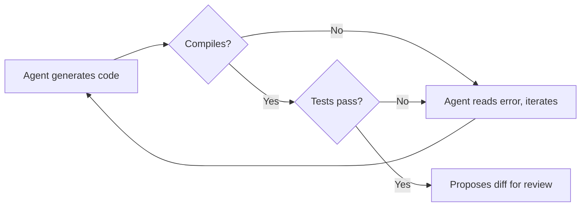

# Codex CLI for the Sceptic: Honest Answers to "Why Should I Bother?"


---

Every team has one: the developer who rolls their eyes when someone mentions AI coding tools. Perhaps you *are* that developer. You've seen the hype cycles before — and you've watched enough "revolutionary" tools quietly disappear from your toolchain within six months.

This article isn't here to sell you on Codex CLI. It's here to give you honest, evidence-based answers to the seven most common objections — acknowledging where the scepticism is warranted and where it isn't.

## Objection 1: "It's Just Fancy Autocomplete"

**The concern:** Codex CLI is just a glorified tab-completion engine, no different from what IDEs have done for years.

**The honest answer:** This was a fair characterisation of early Copilot-era tools. It is not an accurate description of Codex CLI in 2026. The distinction is *agency*: Codex CLI doesn't suggest the next line — it reads your codebase, reasons about the change, executes shell commands, runs your tests, and iterates on failures autonomously [^1]. It operates inside a sandboxed environment with configurable approval modes that let you control how much autonomy the agent has [^2].

The agent loop — file discovery → context gathering → reasoning → tool calls → test execution → commit — is architecturally closer to a junior developer pair-programming with you than to autocomplete [^3].

**When the objection holds:** If you're only using Codex CLI for single-line completions in your editor, you *are* using fancy autocomplete. The value emerges when you use the full agent loop for multi-file tasks, refactoring, and CI integration.

## Objection 2: "I'll Spend More Time Fixing AI Code Than Writing My Own"

**The concern:** The agent will generate plausible-looking but subtly broken code, and debugging it will cost more time than writing it from scratch.

**The honest answer:** This was genuinely true 18 months ago. Task success rates for well-scoped maintenance work have climbed from roughly 40–60% to approximately 85–90% with current models [^4]. The key qualifier is *well-scoped* — Codex CLI excels at bug fixes, test generation, and bounded refactoring. It struggles with novel architectural decisions and complex cross-cutting concerns.

The practical mitigation is straightforward: use approval modes. In `suggest` mode, Codex proposes changes but applies nothing without your explicit sign-off. In `auto-edit` mode, it can modify files but still requires approval before executing commands [^2]. You review diffs, not generated files.

```bash
# Run in suggest mode for maximum control
codex --approval-mode suggest "Fix the race condition in the connection pool"

# Auto-edit for trusted refactoring tasks
codex --approval-mode auto-edit "Add error handling to all database queries"
```

**When the objection holds:** On codebases with minimal test coverage and no type system, you *will* spend time chasing subtle bugs. Codex CLI's output quality is directly proportional to the quality of your existing guardrails — tests, linters, and type checkers are not optional [^4].

## Objection 3: "It'll Hallucinate and Break Everything"

**The concern:** LLMs hallucinate. A coding agent with file-system access that hallucinates is a liability, not an asset.

**The honest answer:** Hallucination is a real and mathematically proven limitation of current LLM architectures [^5]. Benchmarks in 2026 show hallucination rates remain above 15% for most models on general tasks [^6]. OpenAI's o3 model hallucinated 33% of the time on the PersonQA factual benchmark — more than double its predecessor [^6].

However, coding is a domain where hallucination is *partially self-correcting*. Unlike prose generation, code has a ground truth: it either compiles, passes tests, and produces correct output, or it doesn't. Codex CLI's agent loop runs your test suite after making changes. A hallucinated API call fails at compile time. A fabricated library name fails at import.



**When the objection holds:** Hallucination remains dangerous for *logic* errors that pass tests — incorrect business rules, subtle off-by-one errors, or security vulnerabilities that no existing test catches. Code review is still essential. The agent doesn't replace your judgement; it replaces your keystrokes [^7].

## Objection 4: "My Codebase Is Too Complex"

**The concern:** AI tools work on toy examples and greenfield projects. Real codebases with years of accumulated complexity, custom frameworks, and undocumented conventions will confuse the agent.

**The honest answer:** Navigation errors are the dominant failure mode for coding agents, accounting for 27–52% of failures in benchmarks, while tool-use errors stay below 17% [^8]. Large, complex codebases genuinely do cause more failures — this isn't FUD.

The mitigation is `AGENTS.md`. This project-level configuration file tells Codex CLI about your codebase's structure, conventions, and key files. Teams that invest 30 minutes writing a good `AGENTS.md` see measurably better results because the agent spends less time lost in the file tree [^9].

```markdown
<!-- AGENTS.md example for a complex monorepo -->
# Project Structure
- `/services/auth` — Authentication service (Go, gRPC)
- `/services/billing` — Billing service (Go, REST)
- `/frontend` — React SPA, uses `/packages/ui-kit`
- `/packages/ui-kit` — Shared component library

# Conventions
- All services use `internal/` for non-exported packages
- Database migrations live in `migrations/` within each service
- Tests follow `*_test.go` naming; integration tests tagged `//go:build integration`
```

**When the objection holds:** If your codebase has no tests, no documentation, inconsistent naming, and no `AGENTS.md`, the agent *will* struggle. But frankly, so will any new human developer you onboard. The investment in making your codebase agent-friendly also makes it human-friendly.

## Objection 5: "It's Too Expensive for Daily Use"

**The concern:** Token costs will eat through budgets, especially for teams.

**The honest answer:** This depends entirely on your access model. Codex CLI is open source and free to run [^10]. In ChatGPT authentication mode (the default), CLI usage draws from your existing subscription — a Plus plan at \$20/month covers moderate usage [^11]. Complex refactoring tasks can drain a Plus allocation in 2–4 sessions, at which point you'd need Pro (\$200/month) or API key mode [^11].

In API key mode, a documented comparison found a complex task costing approximately \$15 with Codex CLI versus \$155 with Claude Code via API — a 10× cost difference driven by Codex CLI's token efficiency [^12]. Codex CLI uses roughly 4× fewer tokens than competitors for equivalent tasks [^7].

| Access Mode | Cost | Best For |
|---|---|---|
| ChatGPT Plus | \$20/month | 10–15 sessions/month |
| ChatGPT Pro | \$200/month | Heavy daily use |
| API key (codex-mini) | ~\$0.75–\$3.00/M tokens | Pay-per-use, budget control |
| API key (GPT-5) | ~\$1.25–\$10.00/M tokens | Maximum capability |

**When the objection holds:** For teams of 20+ developers on Pro subscriptions, monthly costs reach \$4,000+. Without tracking whether the tool actually saves engineering time, that's a hard line item to justify. Measure before you commit — track time saved per task for a trial month.

## Objection 6: "I'll Lose My Coding Skills"

**The concern:** Relying on an AI agent will atrophy my programming ability. I'll become a prompt engineer who can't debug a segfault.

**The honest answer:** This concern has empirical support. An Anthropic study published in February 2026 found that developers using AI coding assistance scored 17% lower on comprehension tests when learning new libraries [^13]. Participants who fully delegated coding tasks showed some productivity improvements but at the cost of understanding the code they'd produced [^13]. The researchers specifically noted that agent-based systems like Codex CLI, which require even less human involvement, could make this effect worse [^14].

However, the same study found an important exception: developers who used AI assistance *to build comprehension* — asking follow-up questions, requesting explanations, and posing conceptual questions — maintained their skill development while gaining productivity [^14].

**The practical takeaway:** Use `suggest` mode as your default. Read every diff the agent produces. Ask it *why* it chose a particular approach. Treat it as a teaching tool, not a delegation tool — at least until you're confident in the domain.

**When the objection holds:** If you're a junior developer still building foundational skills, uncritical reliance on Codex CLI is a genuine risk. The 17% comprehension penalty is significant. Senior developers with established mental models face less risk because they're reviewing agent output against deep existing knowledge.

## Objection 7: "My Company Won't Allow It"

**The concern:** Enterprise compliance, IP concerns, and security policies will block adoption.

**The honest answer:** This is often the most legitimate objection. A 2026 industry report found that 81% of teams are past the planning phase for AI agents, yet only 14.4% have full security or IT approval [^15]. The EU AI Act enforcement begins August 2026, adding another compliance layer [^16]. And security incidents are real — a critical vulnerability in Codex CLI in March 2026 involved command injection that could steal GitHub installation access tokens [^17].

That said, Codex CLI has architectural advantages for enterprise adoption:

- **It runs locally.** Your code never leaves your machine unless you configure it otherwise [^1].
- **Sandboxed execution.** Commands run in an isolated environment with configurable network access [^2].
- **Open source.** Your security team can audit every line of the Rust codebase — 67,000+ GitHub stars and 400+ contributors provide community scrutiny [^10].
- **Configurable approval modes.** `suggest` mode ensures no file is modified and no command is executed without explicit developer approval [^2].

```toml
# .codex/config.toml — enterprise-friendly defaults
[approval]
mode = "suggest"          # Nothing happens without explicit approval
allow_network = false     # No outbound network access from sandbox
```

**When the objection holds:** If your organisation handles classified data, operates in a regulated industry with strict data-residency requirements, or has a blanket policy against LLM-powered tools, these are genuine blockers that Codex CLI's architecture doesn't fully resolve. The model inference still happens via OpenAI's API unless you're using a local model setup. ⚠️ Verify your specific compliance requirements with your security team before adoption.

## The Bottom Line

Codex CLI is not a silver bullet. It won't write your architecture, it won't understand your business domain without guidance, and it will occasionally produce code that looks correct but isn't.

What it *will* do is handle the mechanical parts of software development — the parts you've done a thousand times before — faster and more consistently than you can manually. The evidence suggests an 85–90% success rate on well-scoped tasks [^4], significant cost advantages over competitors [^12], and genuine time savings for experienced developers who know how to scope work effectively.

The sceptic's best move isn't to dismiss the tool or to adopt it blindly. It's to run a controlled experiment: pick five well-defined, well-tested tasks from your backlog. Time yourself doing them manually. Then do five equivalent tasks with Codex CLI. Compare the results. Let the data decide.

```bash
# Start with something low-risk and measurable
codex --approval-mode suggest "Add input validation to the /api/users endpoint"
```

If the numbers don't work, you've lost an afternoon. If they do, you've gained a workflow that compounds daily.

---

## Citations

[^1]: OpenAI, "CLI – Codex," OpenAI Developers, 2026. [https://developers.openai.com/codex/cli](https://developers.openai.com/codex/cli)

[^2]: OpenAI, "Features – Codex CLI," OpenAI Developers, 2026. [https://developers.openai.com/codex/cli/features](https://developers.openai.com/codex/cli/features)

[^3]: D. Vaughan, "The Codex CLI Agent Loop Explained," codex-resources, 2026-04-18. [https://github.com/danielvaughan/codex-resources](https://github.com/danielvaughan/codex-resources)

[^4]: Z. Proser, "OpenAI Codex Review 2026 — Updated from Daily Use," 2026. [https://zackproser.com/blog/openai-codex-review-2026](https://zackproser.com/blog/openai-codex-review-2026)

[^5]: Z. Xu et al., "On the Hallucination in Simultaneous Machine Translation," arXiv, 2025. Referenced via Lakera, "LLM Hallucinations in 2026." [https://www.lakera.ai/blog/guide-to-hallucinations-in-large-language-models](https://www.lakera.ai/blog/guide-to-hallucinations-in-large-language-models)

[^6]: ModelsLab, "LLM Hallucination Rates 2026: Best and Worst Models," 2026. [https://modelslab.com/blog/llm/llm-hallucination-rates-2026](https://modelslab.com/blog/llm/llm-hallucination-rates-2026)

[^7]: DEV Community, "Claude Code vs Codex 2026 — What 500+ Reddit Developers Really Think," 2026. [https://dev.to/_46ea277e677b888e0cd13/claude-code-vs-codex-2026-what-500-reddit-developers-really-think-31pb](https://dev.to/_46ea277e677b888e0cd13/claude-code-vs-codex-2026-what-500-reddit-developers-really-think-31pb)

[^8]: K. Kim et al., "The Amazing Agent Race," arXiv:2604.10261, April 2026.

[^9]: D. Vaughan, "Why Coding Agents Fail at Navigation (and How AGENTS.md File Maps Fix It)," codex-resources, 2026-04-19. [https://github.com/danielvaughan/codex-resources](https://github.com/danielvaughan/codex-resources)

[^10]: OpenAI, "Codex — GitHub Repository," 2026. [https://github.com/openai/codex](https://github.com/openai/codex)

[^11]: UI Bakery, "OpenAI Codex Pricing (2026): API Cost, Credits & Usage Limits Explained," 2026. [https://uibakery.io/blog/openai-codex-pricing](https://uibakery.io/blog/openai-codex-pricing)

[^12]: NxCode, "AI Coding Tools Pricing Comparison 2026," 2026. [https://www.nxcode.io/resources/news/ai-coding-tools-pricing-comparison-2026](https://www.nxcode.io/resources/news/ai-coding-tools-pricing-comparison-2026)

[^13]: J. H. Shen, A. Tamkin, "How AI Impacts Skill Formation," arXiv:2601.20245, February 2026. [https://arxiv.org/html/2601.20245v1](https://arxiv.org/html/2601.20245v1)

[^14]: Anthropic, "How AI assistance impacts the formation of coding skills," Anthropic Research, February 2026. [https://www.anthropic.com/research/AI-assistance-coding-skills](https://www.anthropic.com/research/AI-assistance-coding-skills)

[^15]: Gravitee, "State of AI Agent Security 2026 Report," 2026. [https://www.gravitee.io/blog/state-of-ai-agent-security-2026-report-when-adoption-outpaces-control](https://www.gravitee.io/blog/state-of-ai-agent-security-2026-report-when-adoption-outpaces-control)

[^16]: Covasant, "EU AI Act Compliance for Autonomous AI Agents in 2026," 2026. [https://www.covasant.com/blogs/eu-ai-act-compliance-autonomous-agents-enterprise-2026](https://www.covasant.com/blogs/eu-ai-act-compliance-autonomous-agents-enterprise-2026)

[^17]: The Hacker News, "OpenAI Patches ChatGPT Data Exfiltration Flaw and Codex GitHub Token Vulnerability," March 2026. [https://thehackernews.com/2026/03/openai-patches-chatgpt-data.html](https://thehackernews.com/2026/03/openai-patches-chatgpt-data.html)
