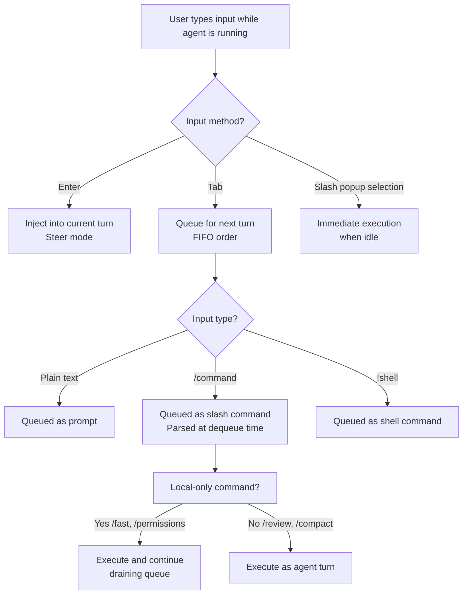

# Slash Command Queueing: Fire-and-Forget Workflows in Codex CLI


---

The single most frustrating friction point in any interactive coding agent is *waiting*. You know exactly what you want to do next — toggle fast mode, compact the context, run a review — but the agent is mid-turn, and the TUI ignores your slash command until it finishes. PR #18542[^1], currently under review in the Codex CLI repository, eliminates this friction by extending the Tab-key queueing mechanism to slash commands and shell commands, enabling genuine fire-and-forget workflows in the TUI.

## The Problem: Idle Hands During Agent Execution

Codex CLI's TUI has supported two input modes during agent execution since v0.98.0[^2]:

- **Enter** — injects new instructions into the *current* turn (steer mode)
- **Tab** — queues a follow-up plain-text prompt for the *next* turn

This works beautifully for conversational prompts. But slash commands — `/fast`, `/compact`, `/review`, `/model`, `/permissions` — were excluded from the queueing mechanism[^3]. If you wanted to toggle fast mode for the next turn, you had to wait for the current turn to complete, type `/fast on`, and only then submit your next prompt. The community flagged this repeatedly:

- Issue #14081 requested the ability to queue `/fast` while a task was running[^4]
- Issue #14588 asked for queueable `/compact`, noting "it doesn't make sense that I have to wait until the return completes"[^5]
- Issue #13779 highlighted the inconsistency: Tab worked for messages but not for `/compact`[^6]
- Issue #14286 broadened the request to "allow queueing all `/` commands"[^5]

## What PR #18542 Changes

The pull request, authored by etraut-openai, introduces a unified queueing architecture for the TUI input system[^1]. The core changes are:

### A New Queued-Input Action Enum

Rather than treating slash commands as a special case requiring immediate parsing, the PR introduces a queued-input action type that supports three variants[^1]:

1. **Plain prompts** — standard text instructions (existing behaviour)
2. **Slash commands** — any `/`-prefixed command
3. **Shell commands** — `!`-prefixed shell invocations

### Deferred Parsing

Previously, slash commands were validated and parsed at input time, which meant they couldn't be queued while the agent was busy. The PR moves slash command parsing to *dequeue time*, enabling consistent FIFO (first-in, first-out) behaviour across all input types[^1]. This is a subtle but important architectural decision — it means the queue doesn't need to know what a command does, only that it exists.

### Queue Draining Behaviour

The queue continues draining after local-only actions (commands that don't require an API call, like `/fast` or `/permissions`), ensuring that a sequence of queued commands executes without manual intervention[^1].

## How It Works in Practice

### Basic Slash Command Queueing

While Codex is processing a task, press **Tab** and type your slash command:

```bash
# Agent is currently working on a refactor...
# Press Tab, then type:
/fast on
# Press Tab again, then type:
Now add unit tests for the refactored module
```

Both the `/fast on` toggle and the follow-up prompt are queued in FIFO order. When the current turn completes, Codex first enables fast mode, then immediately processes your test-writing prompt in fast mode[^1].

### Shell Command Queueing

The `!` prefix allows queueing shell commands via Tab[^1]:

```bash
# Agent is working...
# Press Tab, then type:
!git stash
# Press Tab, then type:
Review the clean working tree for any missed changes
```

### Chaining Configuration Changes

This is where queueing becomes genuinely powerful. You can reconfigure the session *between* agent turns without touching the keyboard again:

```bash
# Queue a full workflow pivot:
/model gpt-5.4          # Switch to the most capable model
/permissions auto        # Grant full autonomy
/fast off                # Disable fast mode for thorough reasoning
Refactor the authentication module to use OAuth 2.1
/review                  # Auto-review when done
/compact                 # Compact context after review
```

Each command queues via Tab and executes in sequence. You've effectively scripted six turns of interaction in advance.

## The Interaction Model

Understanding the distinction between Enter, Tab, and the slash popup is critical for effective use:



### Slash Popup Completion Is Preserved

A key design detail: the existing `/mo<Tab>` completion behaviour (where Tab completes `/model` from the slash popup menu) is preserved[^1]. Tab only queues when you're in the standard input mode during an active turn, not when you're navigating the slash popup. This prevents the muscle-memory conflict that would otherwise make the feature unusable.

## Practical Workflow Patterns

### Pattern 1: The Review-and-Continue Pipeline

```bash
# Start a feature implementation
Implement the user profile API endpoint with validation

# While it's working, queue the review and next step:
/review                          # Tab-queued
Fix any issues found in the review   # Tab-queued
```

This creates a three-step pipeline: implement → review → fix, all from a single burst of input.

### Pattern 2: Model Switching for Cost Optimisation

```bash
# Use fast mode for the scaffolding
/fast on
Generate the boilerplate for the new service module

# Queue the switch to full reasoning for the complex logic
/fast off
Now implement the rate limiting algorithm with sliding window
```

Toggle between fast mode (lower cost, lower latency) and full reasoning (higher accuracy) without interrupting the flow[^7].

### Pattern 3: Context Management

Long sessions accumulate context. Queue compaction between logical phases:

```bash
Refactor the database layer to use connection pooling
/compact                         # Free up context window
Now update the integration tests to match the new DB layer
```

### Pattern 4: Pre-Flight Configuration

Before a complex task, queue all your configuration changes:

```bash
/model gpt-5.4
/permissions auto
/fast off
Perform a comprehensive security audit of the authentication module, \
fix any vulnerabilities found, and add regression tests
```

## Connection to the Broader Autonomy Trajectory

Slash command queueing fits into a broader trend in Codex CLI's evolution towards user-side autonomy — the ability for *you* to automate your interaction with the agent, not just the agent's interaction with your codebase.

Consider the progression:

| Feature | Version | User Autonomy Level |
|---------|---------|-------------------|
| Steer mode (Enter injection) | v0.98.0[^2] | Reactive — redirect mid-turn |
| Tab queueing (plain prompts) | v0.98.0+[^2] | Planned — one step ahead |
| Slash command queueing | PR #18542[^1] | Scripted — multi-step pipeline |
| `codex exec` (non-interactive) | v0.110.0+[^8] | Fully autonomous — fire and forget |

The gap between "Tab queue a single prompt" and "run a fully non-interactive `codex exec` pipeline" was significant. Slash command queueing fills that gap: you get the flexibility of interactive mode with the workflow scripting of non-interactive mode.

This also complements the Realtime V2 streaming introduced in v0.120.0, which can stream background agent progress while work is still running[^9]. Combined with queueing, you can monitor agent progress *and* pre-load the next steps without waiting.

## Limitations and Caveats

⚠️ **PR status**: As of 19 April 2026, PR #18542 is open but not yet merged. The feature is under review and may change before release[^1].

⚠️ **Queue visibility**: The PR updates the pending-input preview snapshots[^1], but there's no dedicated queue inspector yet. If you've queued five commands, there's no `/queue list` to review them. You rely on the preview area in the TUI.

⚠️ **Error handling in queued chains**: If a queued slash command fails (e.g., `/model nonexistent-model`), the behaviour during queue draining is not yet fully documented. Test carefully with critical workflows.

⚠️ **No conditional logic**: The queue is strictly FIFO. You cannot express "run `/review`, and if it finds issues, run this fix prompt, otherwise skip." For conditional workflows, `codex exec` with external scripting remains the better tool[^8].

## Getting Started

Once PR #18542 merges and ships (likely in a forthcoming 0.122.x release), no configuration is needed — the feature extends existing Tab behaviour. To prepare:

1. **Ensure you're on the latest CLI version**: `npm update -g @anthropic-ai/codex` or check your package manager
2. **Practice the Tab rhythm**: Get comfortable with Tab-to-queue for plain prompts first
3. **Start with simple chains**: Queue `/fast on` followed by a prompt before attempting longer pipelines
4. **Watch the preview area**: The TUI shows pending queued input — use it to verify your queue before the current turn completes

## Citations

[^1]: PR #18542 "Queue slash and shell prompts in the TUI" by etraut-openai, openai/codex, April 19, 2026. [https://github.com/openai/codex/pull/18542](https://github.com/openai/codex/pull/18542)

[^2]: "Features – Codex CLI", OpenAI Developers documentation, 2026. [https://developers.openai.com/codex/cli/features](https://developers.openai.com/codex/cli/features)

[^3]: "Slash commands in Codex CLI", OpenAI Developers documentation, 2026. [https://developers.openai.com/codex/cli/slash-commands](https://developers.openai.com/codex/cli/slash-commands)

[^4]: Issue #14081 "Queue /fast while running" by dat-lequoc, openai/codex. [https://github.com/openai/codex/issues/14081](https://github.com/openai/codex/issues/14081)

[^5]: Issue #14588 "Allow queuing a /compact request" by saulrichardson, openai/codex. [https://github.com/openai/codex/issues/14588](https://github.com/openai/codex/issues/14588)

[^6]: Issue #13779 "use tab for /compact" — openai/codex. [https://github.com/openai/codex/issues/13779](https://github.com/openai/codex/issues/13779)

[^7]: "Codex CLI Token Usage and Cost by Reasoning Effort Level", danielvaughan/codex-resources, April 2026. [https://github.com/danielvaughan/codex-resources](https://github.com/danielvaughan/codex-resources)

[^8]: "Non-interactive mode – Codex", OpenAI Developers documentation, 2026. [https://developers.openai.com/codex/noninteractive](https://developers.openai.com/codex/noninteractive)

[^9]: "Changelog – Codex", OpenAI Developers documentation — Codex CLI 0.120.0, April 11, 2026. [https://developers.openai.com/codex/changelog](https://developers.openai.com/codex/changelog)
