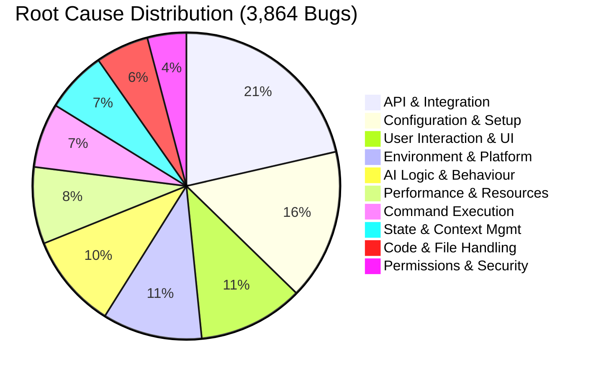
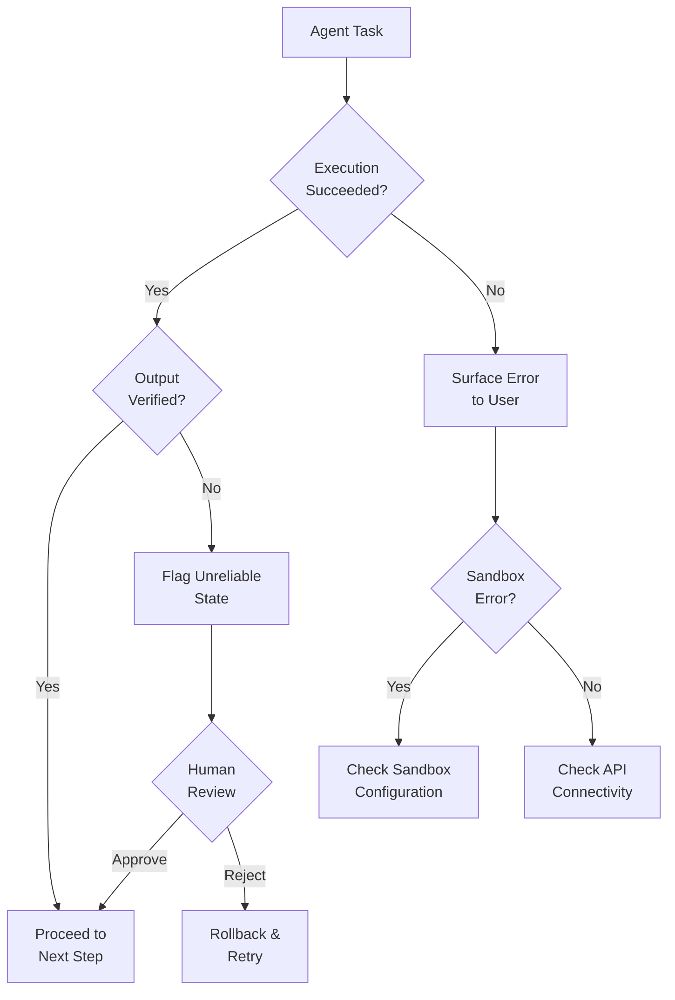
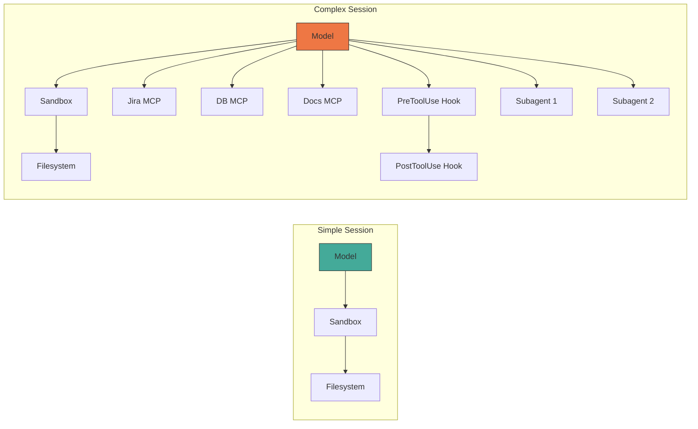

# Engineering Pitfalls in AI Coding Tools: What 3,864 Bugs Reveal About Codex, Claude Code, and Gemini CLI


---

When an AI coding agent produces wrong code, developers blame the model. When it crashes mid-session, they blame the tool. A new empirical study from York University and Concordia University suggests both instincts are usually wrong — the real failures cluster at the integration boundaries between the model, the execution environment, and external services [^1].

The paper, "Engineering Pitfalls in AI Coding Tools," analysed 3,864 publicly reported bugs across Claude Code (2,343), Codex CLI (1,192), and Gemini CLI (329) [^1]. Its findings challenge the common assumption that improving the underlying LLM is the primary path to more reliable agentic workflows. Instead, the data points to orchestration engineering — the plumbing that connects model reasoning to real-world execution — as the dominant failure surface.

This article distils the study's key findings into actionable guidance for Codex CLI practitioners, with concrete configuration and workflow patterns to mitigate the most common pitfalls.

## The Bug Landscape: Where Things Actually Break

The study classified bugs into five categories, and the distribution is striking [^1]:

| Category | Percentage | Count |
|---|---|---|
| Functional | 67.0% | 2,587 |
| Usability & UI | 17.9% | 690 |
| Compatibility | 7.6% | 294 |
| Performance | 5.9% | 227 |
| Security | 1.7% | 66 |

Two-thirds of all bugs are functional — the tool fails to do what it's supposed to do. But the root cause analysis reveals where within the stack those functional failures originate, and it's not where most developers assume.

### Root Causes: The Integration Layer Dominates

The top five root causes paint a clear picture [^1]:

1. **API & Integration Errors** — 21.4% (827 cases)
2. **Configuration & Setup** — 15.9% (615 cases)
3. **User Interaction & UI** — 11.1% (429 cases)
4. **Environment & Platform Compatibility** — 10.5% (406 cases)
5. **AI Logic & Behaviour** — 10.0% (386 cases)

The model's own reasoning — the "AI" part of the AI coding tool — accounts for only 10% of bugs. The orchestration layer between the model and the outside world accounts for over 37% [^1]. Configuration and environment issues add another 26%.



### Architectural Layer Analysis

The study also mapped bugs to the architectural layer where they manifest [^1]:

- **Tool/API Orchestration**: 37.6% — the primary failure concentration
- **Command Execution & Monitoring**: 25.0%
- **User Interface & Interaction**: 16.3%
- **State & Memory Management**: 9.1%
- **LLM Reasoning & Planning**: 6.4%
- **Prompt Engineering & Context**: 5.6%

Only 12% of bugs trace back to the LLM itself (reasoning + prompt engineering). The remaining 88% are conventional software engineering problems — integration contracts, platform compatibility, state management — that happen to occur inside an AI tool [^1].

## Tool-Specific Patterns: How Codex CLI Differs

Each tool has a distinct bug profile. For Codex CLI practitioners, the most relevant finding is that Codex has proportionally higher **AI Logic & Behaviour** issues (183 cases, ~15.4% of its bugs) compared to Claude Code's absolute dominance in API/Integration errors (495 cases) [^1].

This makes sense architecturally. Codex CLI's Rust-based agent loop is tightly coupled to the sandbox execution layer [^2], meaning integration with the OS-level sandbox (Bubblewrap on Linux, seatbelt on macOS, local user isolation on Windows) is a significant failure surface [^3]. The `apply_patch` command — Codex's primary mechanism for writing code to disk — has been a recurring source of sandbox-related regressions [^4][^5].

### The apply_patch Pattern

A concrete example from the study: Codex Issue #593 documents how the agent "fails to execute the apply_patch command and instead merely displays the patch text" [^1]. This is a classic orchestration failure — the model generates the correct patch, but the tool fails to execute it. The user sees wrong output and blames the model, but the model did its job correctly.

Recent Codex releases have addressed several `apply_patch` regressions:

- **v0.118.0**: Patch-approval loop where the UI repeatedly prompts "command failed; retry without sandbox?" for valid operations [^5]
- **v0.121.0**: `apply_patch` fails with `use_legacy_landlock=true` due to incompatible split sandbox policies [^4]
- **v0.116.0**: Ubuntu 22.04 bwrap `--argv0` option not recognised on older distributions [^6]

## Four Lessons for Codex CLI Workflows

The study's authors distilled four actionable recommendations [^1]. Here's how each applies to Codex CLI configuration:

### 1. System-Level Failures Dominate — Engineer Accordingly

> "Many failures in AI coding tools arise from weak coordination among the language model, supporting infrastructure, and execution environment, rather than model reasoning alone." [^1]

**Practical implication**: When a Codex session fails, start debugging at the integration layer, not the prompt. Check:

```bash
# Verify sandbox health
codex --version
# Check MCP server connectivity
codex mcp list
# Confirm environment variables are set
env | grep OPENAI
```

Your `AGENTS.md` should include environment prerequisites, not just task instructions:

```markdown
## Environment Requirements
- Node.js >= 18 (required for MCP servers)
- Bubblewrap >= 0.8.0 on Linux (sandbox)
- `OPENAI_API_KEY` must be set
- Network access required for API calls
```

### 2. Explicitly Define Tool Interactions

> "Interactions among LLMs, tools, and execution environments should be explicitly specified, validated, and continuously maintained." [^1]

For Codex CLI, this means being explicit about MCP server configurations. The study found that API & Integration errors are the #1 root cause — and MCP servers are Codex's primary integration surface [^7].

```toml
# ~/.codex/config.toml — explicit, validated configuration
[mcp_servers.jira]
command = "npx"
args = ["-y", "@atlassian/mcp-server-jira"]
startup_timeout_sec = 15
tool_timeout_sec = 30
enabled_tools = ["search_issues", "get_issue", "create_issue"]
```

Key practices:

- Set explicit `startup_timeout_sec` and `tool_timeout_sec` rather than relying on defaults [^7]
- Use `enabled_tools` to restrict the tool surface — the Aethelgard research found 15× capability overprovisioning in typical configurations [^8]
- Pin MCP server versions in your project's `.codex/config.toml` to prevent drift

### 3. Provide Clear Execution Feedback

The study found that hidden errors from prior commands propagate downstream failures [^1]. In Codex CLI, this manifests when the sandbox silently blocks an operation and the agent proceeds with incorrect assumptions about file state.

Configure hooks to surface execution state explicitly:

```toml
# .codex/config.toml — pre-tool validation
[[hooks]]
event = "pre_tool_use"
command = "bash"
args = ["-c", "echo 'Tool: $CODEX_TOOL_NAME, Args: $CODEX_TOOL_ARGS' >> /tmp/codex-audit.log"]
```

For critical workflows, add post-execution verification in your `AGENTS.md`:

```markdown
## Verification Protocol
After any file modification:
1. Run `git diff` to confirm changes match intent
2. Run project tests before proceeding to next task
3. If a command fails with a sandbox error, report the exact error — do not retry silently
```

### 4. Signal Unreliable States

The study recommends tools "clearly indicate when execution feedback or system state is unreliable" [^1]. The reliability compounding problem — where subtly wrong outputs cascade through multi-step agent workflows — is particularly acute in agentic pods with parallel execution [^9].



In practice, prefer `suggest` approval mode for unfamiliar codebases, escalating to `auto-edit` only after establishing that the tool-integration layer is stable:

```bash
# Start conservative, escalate when stable
codex --approval-mode suggest "Implement the feature from JIRA-1234"

# After confirming sandbox + MCP stability
codex --approval-mode auto-edit "Implement the feature from JIRA-1234"
```

## The Reliability Compounding Problem

The study's findings align with broader industry observations about AI agent reliability [^9]. A traditional software function given the same input produces the same output. An LLM call does not. This means failures in agent stacks aren't just about components going down — they're about components producing subtly wrong outputs that cause cascading failures downstream [^9].

For Codex CLI workflows, this has a concrete implication: **each additional integration point multiplies your failure surface**. A Codex session with three MCP servers, a custom hook chain, and parallel subagents has exponentially more failure modes than a vanilla session with the default model and no integrations.



The practical recommendation: **start simple, add integrations incrementally, and verify each integration point independently before combining them**. This is conventional software engineering discipline applied to an unconventional tool.

## What This Means for the Ecosystem

The study's most provocative finding is that 88% of bugs in AI coding tools are not AI problems — they're software engineering problems [^1]. The tools fail not because the models can't reason, but because the surrounding infrastructure can't reliably translate model intent into executed actions.

This has implications for how teams evaluate and adopt Codex CLI:

- **Don't evaluate based on model benchmarks alone.** SWE-bench scores measure model capability in isolation. Your actual experience depends on the orchestration layer — the sandbox, MCP servers, hooks, and approval workflows [^10].
- **Invest in integration testing.** If you're building custom MCP servers or hook chains, test them independently of the model. The 21.4% API & Integration error rate suggests this is where your reliability budget should go.
- **Track bugs by architectural layer, not by symptom.** A "wrong code" complaint might be an LLM reasoning failure (10% likely) or an `apply_patch` sandbox regression (far more likely). The fix for each is completely different.

The path to reliable agentic engineering isn't better models — it's better plumbing. The models are already good enough for most coding tasks [^1]. The challenge is ensuring that model intent reliably reaches the filesystem, the API, and the CI pipeline without silent corruption along the way.

## Citations

[^1]: Zhang, R., Dai, W., Pham, H.V., Uddin, G., Yang, J., & Wang, S. (2026). "Engineering Pitfalls in AI Coding Tools: An Empirical Study of Bugs in Claude Code, Codex, and Gemini CLI." arXiv:2603.20847. [https://arxiv.org/abs/2603.20847](https://arxiv.org/abs/2603.20847)

[^2]: OpenAI. (2026). "Codex CLI — Lightweight coding agent that runs in your terminal." GitHub. [https://github.com/openai/codex](https://github.com/openai/codex)

[^3]: OpenAI. (2026). "Sandbox — Codex Concepts." OpenAI Developers. [https://developers.openai.com/codex/concepts/sandboxing](https://developers.openai.com/codex/concepts/sandboxing)

[^4]: GitHub Issue #18069. "v0.121.0: apply_patch fails with use_legacy_landlock=true." [https://github.com/openai/codex/issues/18069](https://github.com/openai/codex/issues/18069)

[^5]: GitHub Issue #16407. "Regression in 0.118.0: apply_patch enters patch-approval loop." [https://github.com/openai/codex/issues/16407](https://github.com/openai/codex/issues/16407)

[^6]: GitHub Issue #15260. "v0.116.0 ubuntu22.04 errors mentioning bwrap sandbox wrapper constantly occur." [https://github.com/openai/codex/issues/15260](https://github.com/openai/codex/issues/15260)

[^7]: OpenAI. (2026). "Model Context Protocol — Codex." OpenAI Developers. [https://developers.openai.com/codex/mcp](https://developers.openai.com/codex/mcp)

[^8]: Sidik, M. & Rokach, L. (2026). "Aethelgard: Learned Capability Governance for Autonomous Coding Agents." arXiv:2604.11839. [https://arxiv.org/abs/2604.11839](https://arxiv.org/abs/2604.11839)

[^9]: MindStudio. (2026). "What Is the Reliability Compounding Problem in AI Agent Stacks?" [https://www.mindstudio.ai/blog/reliability-compounding-problem-ai-agent-stacks](https://www.mindstudio.ai/blog/reliability-compounding-problem-ai-agent-stacks)

[^10]: Zhang, R. et al. (2026). Replication package and dataset. Zenodo. [https://zenodo.org/records/18342487](https://zenodo.org/records/18342487)
