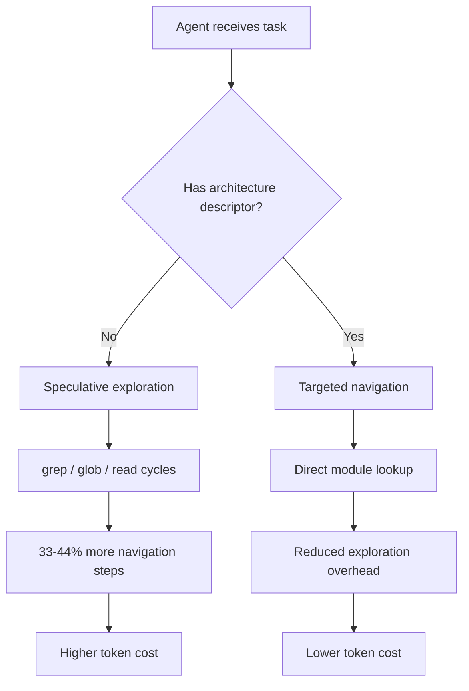
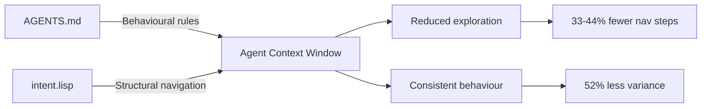

# Formal Architecture Descriptors: Cutting Codex CLI Navigation Overhead by a Third


Your `AGENTS.md` file tells your coding agent *what* to do. But does it tell the agent *where things are* in a way that actually reduces navigational overhead? A controlled study published in April 2026 found that formal architecture descriptors — structured declarations of module boundaries, symbol signatures, and data flows — reduce Codex CLI navigation steps by 33–44%, with a large effect size (Cohen's d = 0.92)[^1]. A companion field study across 7,012 Claude Code sessions showed a 52% reduction in behavioural variance when formal descriptors were present[^1]. This article explains the research, introduces the `intent.lisp` format, and shows how to integrate architecture descriptors into your Codex CLI workflow.

## The Navigation Paradox

Context windows have grown from 128K to 1M tokens in the past year[^2], yet coding agents still spend a disproportionate fraction of their tool calls on undirected exploration — grepping, globbing, and reading modules speculatively[^1]. This is the **Navigation Paradox**: the bottleneck has shifted from retrieval capacity to navigational salience[^1].

Research consistently confirms this. The Amazing Agent Race benchmark found navigation errors account for 27–52% of all trial failures, whilst tool-use errors stay below 17%[^3]. AGENTS.md file maps help[^4], but natural-language descriptions lack structural guarantees — there is nothing preventing an agent from misinterpreting an ambiguous module description or missing a critical dependency relationship.



## What Are Formal Architecture Descriptors?

A formal architecture descriptor is a structured document declaring four things about your codebase[^1]:

1. **Module boundaries** — which directories and files constitute each logical component
2. **Symbol signatures** — function names, types, and their call signatures
3. **Constraints and invariants** — rules that must hold within each module
4. **Data flows** — how data moves between components

Unlike free-form AGENTS.md documentation, formal descriptors use a parseable syntax that enforces structural hierarchy. The research paper proposes `intent.lisp`, an S-expression format, but the controlled experiments found no statistically significant difference between S-expression, JSON, YAML, and Markdown formats for reader comprehension (p > 0.07 across all pairwise comparisons)[^1].

The advantage of S-expressions emerges in **error resilience**, not comprehension. More on that below.

## The Evidence: Four Experiments

### Experiment 1: Code Localisation (Controlled)

Jin ran 24 code localisation tasks on a ~22K-line Rust project using Claude Sonnet 4.6 at temperature 0 with a maximum of 20 steps[^1].

| Condition | Navigation Steps (median) | Accuracy |
|-----------|--------------------------|----------|
| Blind (no context) | Baseline | 54% |
| S-expression | –33% | 58% |
| JSON | –38% | 58% |
| Markdown | –44% | 63% |

The navigation reduction was statistically significant (Wilcoxon p = 0.009, Cohen's d = 0.92)[^1]. Format differences were not (p > 0.07)[^1]. The implication: **any structured architecture context helps; the specific format matters far less than having one at all**.

### Experiment 2: Auto-Generated vs. Hand-Curated

Fifteen tasks on a 43K-line Rust project tested three conditions[^1]:

- **Blind**: 80% accuracy
- **AutoGen** (170-line auto-generated descriptor): 100% accuracy
- **Curated** (698-line hand-refined descriptor): 87% accuracy

The auto-generated descriptor outperformed the curated one — a counter-intuitive result explained by token budget constraints. Longer descriptors consume context window capacity that could be used for actual code[^1]. The practical takeaway: **auto-generate your descriptors first; refine only when governance demands it**.

### Experiment 3: Error Resilience

Ninety-six error injections across four formats revealed dramatically different failure modes[^1]:

| Format | Structural Error Detection | Silent Corruption Rate |
|--------|---------------------------|----------------------|
| S-expression | 100% | 50% |
| JSON | Atomic failure | 21% |
| YAML | 50% | 50% |
| Markdown | 0% | 100% |

JSON fails loudly (atomic parse failure on structural errors), which is either a virtue or a disaster depending on your error-handling strategy. S-expressions detect all structural completeness errors. **YAML silently corrupts half the time**, and Markdown provides zero error detection[^1]. If your descriptor will be auto-generated or frequently updated, JSON or S-expressions are the safer choices.

### Experiment 4: Field Study (7,012 Sessions)

An observational study across 7,012 Claude Code sessions spanning November 2025 to April 2026 measured the per-session explore/edit ratio[^1]:

- **Pre-descriptor IQR**: 2.24
- **Post-descriptor IQR**: 1.08
- **Reduction**: 52%

Interestingly, sessions that directly read the `intent.lisp` file showed no advantage over those that did not (ratio 1.65 vs. 1.65)[^1]. This suggests the act of formalising architecture may itself improve code organisation, producing benefits even when the agent does not directly consume the descriptor.

## The intent.lisp Format

The proposed S-expression format declares architecture as nested lists[^1]:

```lisp
(intent my-project
  (design-constraints
    "All database access goes through the repository layer"
    "HTTP handlers must not import domain logic directly")

  (pillar api-gateway
    (component routes
      (role "HTTP request routing and middleware chain")
      (invariants "No business logic in route handlers")
      (data-flow "request → middleware → handler → service")
      (symbols
        (function handle_create_user
          (sig "(req: Request) -> Result<Response, ApiError>"))
        (function validate_auth_token
          (sig "(token: &str) -> Result<Claims, AuthError>")))))

  (pillar domain
    (component user-service
      (role "User lifecycle management")
      (invariants "Email uniqueness enforced at service layer")
      (data-flow "handler → service → repository → database")
      (symbols
        (function create_user
          (sig "(cmd: CreateUserCmd) -> Result<User, DomainError>"))
        (function find_by_email
          (sig "(email: &str) -> Option<User>"))))))
```

### Compression Ratios

The format achieves substantial compression across production codebases[^1]:

| Project | Source Lines | Descriptor Lines | Ratio |
|---------|-------------|-----------------|-------|
| xiaojinpro-backend | 469,594 | 7,877 | 60:1 |
| jarvis-forge | 44,321 | 698 | 64:1 |
| missiond | 107,986 | 5,846 | 18:1 |
| **Weighted average** | | | **34:1** |

A 34:1 compression ratio means a 100K-line codebase reduces to roughly 3,000 lines of architectural description — well within context window budgets even for smaller models[^1].

## Integrating with Codex CLI

### Step 1: Generate Your Descriptor

You can use Codex CLI itself to generate an initial architecture descriptor. Create a prompt that asks for a structured survey:

```bash
codex exec "Survey this codebase and produce an intent.lisp file \
  declaring all top-level modules, their roles, key function \
  signatures, invariants, and data flows. Use S-expression format." \
  > intent.lisp
```

Based on the research, this auto-generated descriptor will already deliver the full navigation benefit without manual refinement[^1].

### Step 2: Place the Descriptor

Add `intent.lisp` to your project root alongside `AGENTS.md`. Reference it from your AGENTS.md so the agent knows it exists:

```markdown
## Architecture

This project uses a formal architecture descriptor.
See `intent.lisp` for module boundaries, symbol signatures,
and data flow declarations.
```

### Step 3: Configure AGENTS.md to Complement, Not Duplicate

With a formal descriptor handling navigation, your `AGENTS.md` can focus on what it does best — behavioural instructions[^5]:

- Code style preferences and conventions
- Testing requirements and approval modes
- Files that should never be modified
- Domain-specific terminology

This separation of concerns keeps both files shorter and more effective. Research shows AGENTS.md files beyond 150 lines deliver diminishing returns and can increase inference costs by 20–23%[^6].

### Step 4: Keep Descriptors Current

Architecture descriptors drift as code evolves. Use a Codex CLI hook to regenerate on significant changes:

```toml
# codex.toml
[hooks.post-commit]
command = "codex exec 'Update intent.lisp to reflect the current codebase structure. Preserve existing design-constraints and invariants. Only update module boundaries and symbol signatures that have changed.' > intent.lisp"
```

⚠️ Hook-based auto-regeneration is an emerging pattern — monitor for drift between the descriptor and actual code structure, particularly in rapidly evolving projects.



## Choosing Your Format

The research tested four formats and found equivalent comprehension across all of them[^1]. Your choice should depend on downstream tooling and error tolerance:

| Criterion | S-expression | JSON | YAML | Markdown |
|-----------|-------------|------|------|----------|
| LLM comprehension | ✅ 95% | ✅ 95% | ✅ 95% | ✅ 95% |
| Generation reliability | 95.8% | 100% | 91.7% | — |
| Error detection | High | Atomic | Low | None |
| Silent corruption | 50% | 21% | 50% | 100% |
| Compression vs. JSON | 22% smaller | Baseline | Similar | Larger |
| Tooling ecosystem | Niche | Ubiquitous | Common | Universal |

For most teams, **JSON is the pragmatic choice** — perfect generation reliability, lowest silent corruption, and universal tooling support. Choose S-expressions if you want structural error detection and maximum compression. Avoid YAML for auto-generated descriptors given its 50% silent corruption rate[^1].

## Limitations and Caveats

The research has important constraints to keep in mind:

- **Model specificity**: All controlled experiments used Claude Sonnet 4.6. Results may differ with other models, though weaker models showed even larger benefits (d = 1.70)[^1].
- **Task scope**: Only code localisation was tested. Multi-file modification, refactoring, and generation tasks remain untested[^1].
- **Codebase size**: The controlled experiments used 22K–44K line projects. The compression ratios suggest scaling to 100K+ line projects should work, but this is not yet empirically validated under controlled conditions[^1].
- **Self-clarification confound**: The field study cannot fully separate the benefit of the descriptor artefact from the benefit of the developer thinking through their architecture to write it[^1].

## Key Takeaways

1. **Any structured architecture context reduces navigation by a third** — the format barely matters for comprehension[^1].
2. **Auto-generated descriptors work as well as hand-curated ones** — start with `codex exec` and refine only if needed[^1].
3. **Separate navigation from behaviour** — let `intent.lisp` (or `architecture.json`) handle structure whilst `AGENTS.md` handles conventions[^5].
4. **Watch your error resilience** — if the descriptor is auto-generated or frequently updated, avoid YAML and Markdown[^1].
5. **The 34:1 compression ratio** means even large codebases fit comfortably within context budgets[^1].

The Navigation Paradox is solvable. Formal architecture descriptors give your coding agent a map instead of a compass — and the empirical evidence shows that map cuts a third of the wandering.

## Citations

[^1]: Jin, R. (2026). "Formal Architecture Descriptors as Navigation Primitives for AI Coding Agents." arXiv:2604.13108. [https://arxiv.org/abs/2604.13108](https://arxiv.org/abs/2604.13108)

[^2]: Farajijobehdar, V., Köseoğlu Sarı, İ., Üre, N. K., & Zeydan, E. (2026). "Tokalator: A Context Engineering Toolkit for Artificial Intelligence Coding Assistants." arXiv:2604.08290. [https://arxiv.org/abs/2604.08290](https://arxiv.org/abs/2604.08290)

[^3]: Kim, J. et al. (2026). "The Amazing Agent Race." arXiv:2604.10261. [https://arxiv.org/abs/2604.10261](https://arxiv.org/abs/2604.10261)

[^4]: Jin, R. et al. (2026). "On the Impact of AGENTS.md Files on the Efficiency of AI Coding Agents." arXiv:2601.20404. [https://arxiv.org/abs/2601.20404](https://arxiv.org/abs/2601.20404)

[^5]: OpenAI. (2026). "Custom instructions with AGENTS.md." Codex Developer Documentation. [https://developers.openai.com/codex/guides/agents-md](https://developers.openai.com/codex/guides/agents-md)

[^6]: Augment Code. (2026). "How to Build Your AGENTS.md (2026)." [https://www.augmentcode.com/guides/how-to-build-agents-md](https://www.augmentcode.com/guides/how-to-build-agents-md)
