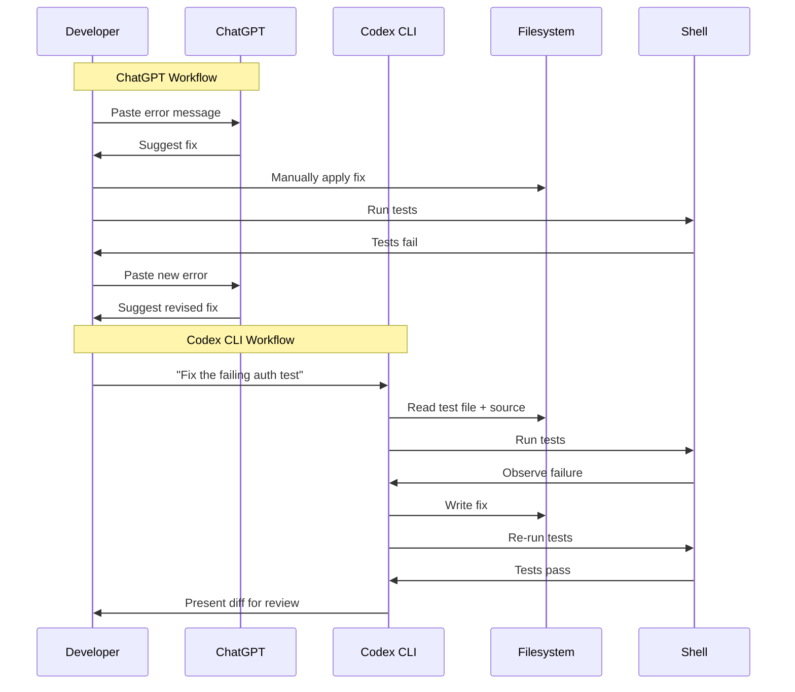

# From ChatGPT to Codex CLI: What Changes When Your AI Can Actually Run Code


---

If you already use ChatGPT to help you write code — pasting in error messages, asking for function implementations, copying suggestions back into your editor — you are closer to agentic coding than you think. The gap between "AI suggests code" and "AI executes code in your actual codebase" is smaller than it appears, but the consequences of crossing it are profound. This article maps that transition.

## The Copy-Paste Ceiling

ChatGPT is a remarkably capable coding assistant. You paste in a traceback, it suggests a fix. You describe a function signature, it writes the body. But every interaction follows the same loop:

1. You copy context from your editor or terminal
2. You paste it into ChatGPT
3. ChatGPT generates a response
4. You copy the suggestion back
5. You manually verify and integrate it

This works, but it imposes a hard ceiling. ChatGPT cannot see your full repository structure. It cannot run your test suite. It cannot verify that its suggestion actually compiles, passes linting, or integrates with the rest of your codebase[^1]. Every round trip through your clipboard is a context boundary — information is lost, and the burden of integration falls entirely on you.

## What Codex CLI Actually Is

Codex CLI is OpenAI's open-source terminal-native coding agent, built in Rust[^2]. Unlike ChatGPT's web interface, it runs locally on your machine with direct access to your filesystem and shell. The default model is `codex-mini-latest`, a variant of o4-mini optimised for software engineering tasks, though you can also use `codex-1` (based on o3) for more complex reasoning[^3].

The critical difference: when you give Codex CLI a task, it does not just suggest code. It reads your files, writes changes, runs commands, observes the output, and iterates — all inside a sandboxed environment on your own machine[^4].

```bash
# ChatGPT workflow: you are the integration layer
# 1. Copy error from terminal
# 2. Paste into browser
# 3. Copy fix from ChatGPT
# 4. Paste into editor
# 5. Run tests manually
# 6. Repeat if it fails

# Codex CLI workflow: the agent is the integration layer
codex "Fix the failing test in src/auth/token.ts and make sure all tests pass"
```

## The Five Things That Change

### 1. Context Goes from Fragments to Full Repository

When you paste code into ChatGPT, you choose what to include. You might paste a single file, an error message, or a function signature. The model works with whatever fragment you provide.

Codex CLI reads your entire project structure. It can traverse imports, check type definitions across files, read your `package.json` or `Cargo.toml`, and understand how components connect[^5]. This means it can make changes that account for downstream effects — renaming a function and updating every call site, for instance.

### 2. Execution Replaces Speculation

ChatGPT's suggestions are hypothetical. It generates code that *should* work based on its training data, but it cannot verify this against your specific environment, dependency versions, or runtime behaviour.

Codex CLI executes within your actual project. When it writes a fix, it can run your test suite immediately and observe whether the fix works. If tests fail, it reads the output and iterates — without you touching the keyboard[^6].



### 3. The Sandbox Changes the Trust Model

When you copy code from ChatGPT into your editor, you are the safety layer. You read the suggestion, decide whether it looks right, and apply it.

Codex CLI introduces a structured trust model through sandbox modes and approval policies[^7]:

| Mode | What Codex Can Do | When to Use |
|------|-------------------|-------------|
| `read-only` | Inspect files, no edits without approval | Exploratory questions, code review |
| `workspace-write` (default) | Read, edit workspace files, run sandboxed commands | Daily development tasks |
| `danger-full-access` | Unrestricted filesystem and network access | Trusted automation, CI pipelines |

The sandbox is enforced at the OS level — Seatbelt on macOS, bubblewrap on Linux — not just by prompting conventions[^8]. This means Codex cannot accidentally `rm -rf` your home directory or exfiltrate data, even if the model hallucinates a dangerous command.

```bash
# Start in read-only mode for a code review
codex --approval-mode read-only "Review the error handling in src/api/"

# Default workspace-write for normal development
codex "Add input validation to the user registration endpoint"

# Full access only when needed (e.g., installing dependencies)
codex --approval-mode danger-full-access "Set up the test database and seed it"
```

### 4. MCP Extends the Agent's Reach

ChatGPT's coding help is limited to what you paste in and what the model knows from training. Codex CLI can connect to external tools and services via the Model Context Protocol (MCP)[^9], turning it from a code-focused assistant into a workflow-aware agent.

Configure MCP servers in `~/.codex/config.toml` or per-project in `.codex/config.toml`:

```toml
[mcp_servers.github]
command = "npx"
args = ["-y", "@modelcontextprotocol/server-github"]
env = { GITHUB_PERSONAL_ACCESS_TOKEN = "ghp_..." }

[mcp_servers.postgres]
command = "npx"
args = ["-y", "@modelcontextprotocol/server-postgres"]
env = { DATABASE_URL = "postgresql://localhost/myapp_dev" }
```

With this configuration, you can say:

```bash
codex "Check the open issues labelled 'bug' on GitHub, find the one about\
 duplicate user records, query the database to understand the data pattern,\
 then write and test a fix"
```

The agent reads the GitHub issue, queries your database for context, writes the fix, and runs your tests — a workflow that would require switching between four different tools manually.

### 5. Automation Becomes Native

ChatGPT is inherently interactive — it requires a human at the keyboard. Codex CLI has a non-interactive `exec` subcommand designed for automation[^10]:

```bash
# In a CI pipeline or git hook
codex exec "Run the linter, fix any issues, and ensure all tests pass"

# Batch processing
find . -name "*.py" -path "*/legacy/*" | \
  xargs -I {} codex exec "Modernise {} to use Python 3.12 conventions"
```

This opens up workflows that ChatGPT simply cannot support: pre-commit hooks that fix issues automatically, CI jobs that triage and fix failing tests, or cron jobs that keep dependency versions current.

## When to Still Use ChatGPT

Codex CLI does not replace ChatGPT for every coding task. ChatGPT remains the better choice when:

- **You need conceptual explanations** — "Explain how the Raft consensus algorithm works" is a conversation, not a task
- **You are exploring design options** — brainstorming architecture decisions benefits from dialogue, not autonomous execution
- **You are working on a machine where you cannot install Codex CLI** — ChatGPT runs in any browser
- **You want multi-modal input** — pasting screenshots of UI bugs, whiteboard diagrams, or error dialogs into ChatGPT's vision capabilities[^1]
- **Cost sensitivity** — ChatGPT Plus at \$20/month includes generous usage; Codex CLI consumes API credits that scale with usage[^11]

The practical heuristic: if your task ends with "and verify it works," Codex CLI is the right tool. If your task ends with "and help me understand," ChatGPT is.

## Making the Switch: A Practical Checklist

If you are a ChatGPT-for-coding user ready to try Codex CLI, here is your migration path:

```bash
# 1. Install Codex CLI
npm install -g @openai/codex

# 2. Authenticate
codex auth

# 3. Start with read-only to build trust
cd your-project
codex --approval-mode read-only "Explain the architecture of this project"

# 4. Graduate to workspace-write for your first real task
codex "Fix the TODO in src/utils/parser.ts and add a test for it"

# 5. Configure AGENTS.md for project-specific guidance
cat > AGENTS.md << 'EOF'
# Project Conventions
- Use vitest for testing
- Follow the existing error handling pattern in src/errors/
- All API endpoints need input validation with zod
EOF

# 6. Add MCP servers for your workflow tools
codex mcp add github -- npx -y @modelcontextprotocol/server-github
```

## The Paradigm Shift in One Sentence

ChatGPT is an AI you talk to about code. Codex CLI is an AI that works on code. The difference is not incremental — it is the difference between describing a task and delegating it[^12].

For developers who have built muscle memory around the copy-paste loop, the hardest part of the transition is not technical. It is learning to let go of the clipboard and trust a well-sandboxed agent to do the integration work you have been doing manually. Start with read-only mode, watch what it does, and gradually expand its autonomy as you build confidence.

The code is still yours. The reviews are still yours. The architecture decisions are still yours. But the mechanical work of reading, writing, running, and iterating? That is what changes.

---

## Citations

[^1]: [ChatGPT vs Claude 2026 comparison](https://tech-insider.org/claude-vs-chatgpt-2026/) — Overview of ChatGPT's capabilities and limitations for coding tasks.

[^2]: [OpenAI Codex CLI GitHub repository](https://github.com/openai/codex) — Codex CLI is described as a "lightweight coding agent that runs in your terminal," built in Rust.

[^3]: [Codex models documentation](https://developers.openai.com/codex/models) — codex-1 is a version of o3 optimised for software engineering; codex-mini-latest is a version of o4-mini for Codex CLI.

[^4]: [Codex CLI features documentation](https://developers.openai.com/codex/cli/features) — Codex CLI reads, edits, and runs code with direct filesystem and shell access.

[^5]: [Codex CLI features — file access and workspace navigation](https://developers.openai.com/codex/cli/features) — Support for multi-directory workspaces via `--add-dir` and fuzzy file search.

[^6]: [First few days with Codex CLI](https://amanhimself.dev/blog/first-few-days-with-codex-cli/) — Developer experience report on Codex CLI's iterative execution loop.

[^7]: [Codex agent approvals and security](https://developers.openai.com/codex/agent-approvals-security) — Graduated approval modes: read-only, workspace-write, and full access.

[^8]: [Codex sandboxing concepts](https://developers.openai.com/codex/concepts/sandboxing) — OS-level enforcement via Seatbelt (macOS) and bubblewrap (Linux).

[^9]: [Codex MCP integration](https://developers.openai.com/codex/mcp) — Model Context Protocol connects Codex to external tools and services.

[^10]: [Codex CLI reference — exec subcommand](https://developers.openai.com/codex/cli/reference) — Non-interactive `codex exec` for automation and CI/CD pipelines.

[^11]: [Codex pricing and ChatGPT plans](https://help.openai.com/en/articles/11369540-using-codex-with-your-chatgpt-plan) — Codex included with ChatGPT Plus, Pro, and Enterprise plans.

[^12]: [OpenAI Codex vs GitHub Copilot comparison](https://www.morphllm.com/comparisons/codex-vs-copilot) — Copilot enhances typing; Codex replaces typing with delegation.
