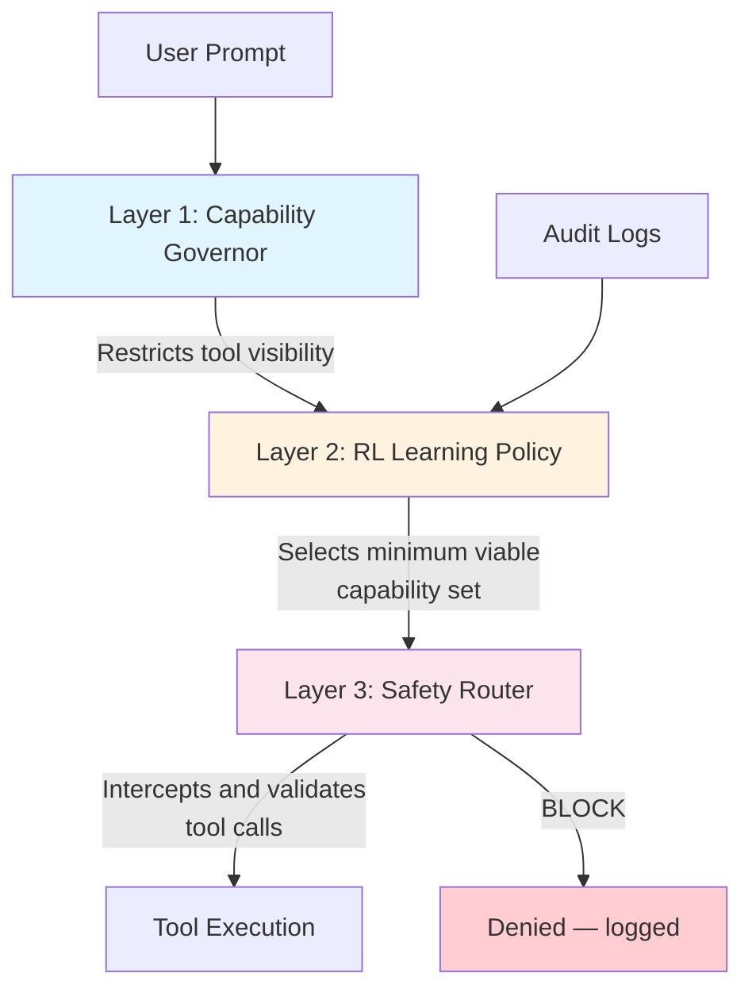
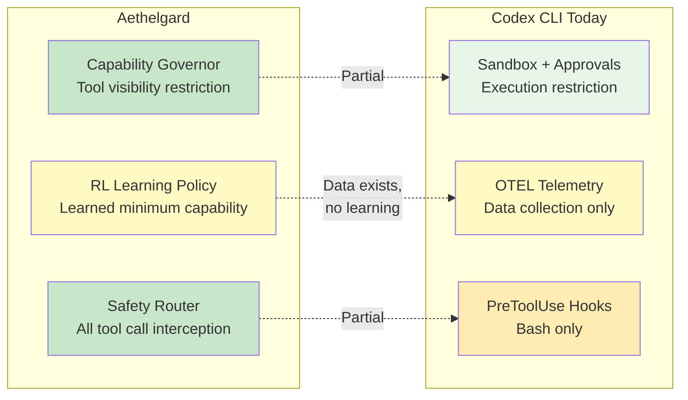

# Learned Capability Governance: What Aethelgard Means for Codex Permission Profiles


---

## The Capability Overprovisioning Problem

A summarisation task receives the same shell execution, subagent spawning, and credential access capabilities as a code deployment task. Sidik and Rokach call this the **capability overprovisioning problem** and measure a 15× overprovision ratio in default agent runtimes[^1]. Every tool visible to the model is a tool the model can misuse — whether through prompt injection, hallucination, or simple misunderstanding.

This is not a theoretical concern. Amazon introduced mandatory approval policies for AI-generated modifications after costly outages linked to overprivileged agent sessions[^2]. The core insight from the Aethelgard paper, submitted to the NeurIPS 2026 Agent Safety Workshop, is that **an agent cannot misuse a tool it does not know exists**[^1].

Codex CLI already ships with static permission controls — approval policies, sandbox modes, and hooks. Aethelgard shows where these controls need to evolve: from static configuration to learned, adaptive governance.

## Aethelgard's Four-Layer Framework

The Aethelgard framework introduces four governance layers, each addressing a different failure mode[^1]:



### Layer 1 — Capability Governor

The Governor restricts which tools an agent can even *perceive* during a session. It uses two mechanisms: semantic restriction via `AGENTS.md` injection (the model is told certain tools do not exist) and infrastructure enforcement via `tools.deny` configuration (the runtime blocks tool invocations regardless of what the model attempts)[^1].

In their evaluation, a summarisation task's visible toolset dropped from 15 tools to 4 — a 73.3% reduction in attack surface[^1]. All dangerous tools (shell execution, subagent spawning) were eliminated for tasks that did not require them.

### Layer 2 — RL Learning Policy

Rather than hand-crafting per-task tool allowlists, Aethelgard trains a PPO policy on accumulated audit logs to learn the minimum viable capability set for each task type[^1]. The reward function balances three objectives:

- **Accuracy** — did the task complete successfully?
- **Economy** — measured by the Skill Economy Ratio (SER), the proportion of granted tools actually used
- **Safety** — were any blocked tools requested?

The RL policy outperforms static YAML rules by 28% on SER, learning patterns that human rule authors miss[^1]. Training completes in under 5 minutes on a single RTX 3090.

### Layer 3 — Safety Router

A two-stage man-in-the-middle proxy intercepts every tool call before execution[^1]:

1. **Stage 1 — Rule-based classifier**: Sub-millisecond (0.1ms) pattern matching against known-dangerous operations. Blocks 100% of `exec` commands and `sessions_spawn` calls in evaluation.
2. **Stage 2 — Fine-tuned LLM classifier**: A Qwen2.5-1.5B model, fine-tuned on 273 labelled examples, handles ambiguous cases with ~800ms latency.

Across 500 evaluation calls, the Safety Router achieved a 100% true positive rate with 0% false positives[^1]. Against adversarial prompt injection, all attacks were neutralised — 92% by the model layer and the remainder by infrastructure-level blocking.

### Layer 4 — Future Work

Layer 4, covering NemoClaw integration and mobile NPU runtime, remains unimplemented in the current paper[^1]. The roadmap suggests pushing governance policies to edge devices for latency-sensitive deployments.

## Where Codex CLI Stands Today

Codex CLI's current permission model is static but already more sophisticated than most agent runtimes. Understanding where it maps to Aethelgard's layers reveals both strengths and gaps.

### Approval Policies (Partial Layer 1)

Codex offers three approval strictness levels configured via `config.toml`[^3]:

```toml
# Strictest: auto-approve safe reads only
approval_policy = "untrusted"

# Interactive: ask before actions
approval_policy = "on-request"

# Fully autonomous
approval_policy = "never"
```

For finer control, granular policies scope approvals per category[^4]:

```toml
approval_policy = { granular = {
  sandbox_approval = true,
  rules = true,
  mcp_elicitations = true,
  request_permissions = false,
  skill_approval = false
}}
```

These controls determine *whether* the agent can act, but not *which tools it sees* — a crucial distinction from Aethelgard's Capability Governor, which removes tools from the model's awareness entirely.

### Sandbox Modes (Layer 1 Infrastructure)

The sandbox restricts execution at the OS level[^3]:

| Mode | Filesystem | Network | Use Case |
|------|-----------|---------|----------|
| `read-only` | Read only | Blocked | Code review, analysis |
| `workspace-write` | Read/write in workspace | Blocked by default | Standard development |
| `danger-full-access` | Unrestricted | Open | ⚠️ Trusted environments only |

On macOS, sandboxing uses Seatbelt policies via `sandbox-exec`; on Linux, `bwrap` plus `seccomp`[^3]. Protected paths (`.git/`, `.codex/`, `.agents/`) remain read-only even in `workspace-write` mode.

This maps directly to Aethelgard's infrastructure enforcement layer — but it scopes *filesystem and network access*, not *tool visibility*.

### Hooks (Partial Layer 3)

Codex's hooks engine provides the closest analogue to the Safety Router. `PreToolUse` hooks can intercept and block tool calls before execution[^5]:

```json
{
  "hooks": {
    "PreToolUse": [
      {
        "matcher": "Bash",
        "hooks": [
          {
            "type": "command",
            "command": "/usr/bin/python3 check_command.py",
            "statusMessage": "Validating command safety"
          }
        ]
      }
    ]
  }
}
```

A hook script can deny execution by returning a permission decision[^5]:

```json
{
  "hookSpecificOutput": {
    "permissionDecision": "deny",
    "permissionDecisionReason": "Command attempts network access outside approved scope"
  }
}
```

**Current limitation**: `PreToolUse` only intercepts Bash tool calls. Write, WebSearch, and MCP tool calls are not interceptable via hooks today[^5]. This leaves a significant gap compared to Aethelgard's Safety Router, which intercepts *all* tool calls.

### OTEL Telemetry (Data for Layer 2)

Codex's OpenTelemetry integration emits structured events covering tool invocations, approval decisions, and token counts[^6]:

```toml
[otel]
environment = "production"
exporter = "otlp-http"
log_user_prompt = false
```

This audit data is precisely what Aethelgard's RL Learning Policy trains on. The gap: Codex collects the data but does not feed it back into a learning loop. OTEL metrics currently serve observability, not governance[^6]. Additionally, `codex exec` has gaps in metrics emission, and `codex mcp-server` emits no OTEL telemetry at all[^7].

## Mapping the Gaps



Three specific gaps emerge:

1. **No tool visibility scoping.** Codex restricts what the agent *can do* but not what it *knows about*. In `workspace-write` mode, the model sees every tool — shell, file write, web search — even when the task only requires file reading.

2. **No learned governance.** OTEL data flows to external backends for dashboards and alerts, but nothing learns from it. An RL policy trained on usage patterns could auto-narrow tool surfaces per task type, achieving the 73.3% attack surface reduction Aethelgard demonstrates[^1].

3. **Incomplete hook coverage.** `PreToolUse` blocking only Bash calls leaves Write, MCP, and WebSearch unguarded. Extending hook coverage to all tool types would complete the Safety Router analogue.

## Building Toward Learned Governance Today

While Codex CLI does not yet offer learned capability governance, you can approximate Aethelgard's approach using existing features.

### Step 1 — Profile-Based Task Scoping

Create named profiles that restrict capabilities by task type[^4]:

```toml
[profiles.review]
# Code review: read-only, no shell execution needed
sandbox_mode = "read-only"
approval_policy = "never"
model_reasoning_effort = "high"

[profiles.implement]
# Implementation: workspace write, interactive approvals
sandbox_mode = "workspace-write"
approval_policy = "on-request"

[profiles.deploy]
# Deployment: full access, guardian review
sandbox_mode = "danger-full-access"
approval_policy = { granular = { sandbox_approval = true, rules = true }}
approvals_reviewer = "guardian_subagent"
```

Switch profiles per task: `codex --profile review "Analyse this PR for security issues"`.

### Step 2 — PreToolUse as a Safety Router

Write a Python hook that implements rule-based blocking, mirroring Aethelgard's Stage 1[^5]:

```python
#!/usr/bin/env python3
"""PreToolUse hook: block dangerous patterns in Bash commands."""
import json, sys, re

BLOCKED_PATTERNS = [
    r"curl\s+.*\|.*sh",       # Pipe-to-shell
    r"rm\s+-rf\s+/",          # Recursive root delete
    r"chmod\s+777",           # World-writable permissions
    r"ssh\s+",                # Outbound SSH
    r"docker\s+run\s+--privileged",  # Privileged containers
]

data = json.load(sys.stdin)
command = data.get("tool_input", {}).get("command", "")

for pattern in BLOCKED_PATTERNS:
    if re.search(pattern, command):
        json.dump({
            "hookSpecificOutput": {
                "permissionDecision": "deny",
                "permissionDecisionReason": f"Blocked by safety policy: matches {pattern}"
            }
        }, sys.stdout)
        sys.exit(0)

json.dump({"continue": True}, sys.stdout)
```

### Step 3 — OTEL-Fed Audit Analysis

Export telemetry to a backend and periodically analyse tool usage per task type[^6]:

```bash
# Query tool invocation patterns from your OTEL backend
# Identify tools granted but never used (overprovisioned)
codex exec --profile review "Summarise tool usage from last 30 days of OTEL data"
```

The Skill Economy Ratio from Aethelgard — `tools_used / tools_available` — is calculable from OTEL data today. A ratio significantly below 1.0 indicates overprovisioning[^1].

### Step 4 — Shell Environment Hardening

Restrict environment variable exposure to limit credential leakage[^4]:

```toml
[shell_environment_policy]
inherit = "none"
exclude = ["AWS_*", "AZURE_*", "GH_TOKEN", "GITHUB_TOKEN"]
include_only = ["PATH", "HOME", "TERM"]
```

## The Architectural Principle

Aethelgard's central lesson aligns with a broader consensus emerging in agent security research: **containment must be architectural, not behavioural**[^8]. Prompting an agent to avoid dangerous actions is insufficient. The security boundary must exist at the infrastructure level — restricting tool visibility, intercepting tool calls, and learning from usage patterns to continuously tighten the boundary.

As the InfoQ reference architecture for AI agent gateways demonstrates, defence-in-depth for agents follows the same unidirectional flow as traditional infrastructure security: discovery → validation → authorisation → isolated execution → observability[^9]. Every layer reduces blast radius independently.

Codex CLI's current controls — sandboxes, approval policies, hooks, OTEL — provide three of Aethelgard's four layers in partial form. The missing piece is the learning loop: feeding audit data back into governance policy to achieve adaptive, per-task-type least privilege. When that loop closes, the 15× overprovisioning ratio drops toward 1:1, and the attack surface contracts by the 73.3% that Aethelgard demonstrates[^1].

For enterprise teams deploying Codex CLI today, the practical path is clear: define profiles per task type, implement `PreToolUse` hooks as a safety router, export OTEL data, and manually review tool usage ratios quarterly. The governance is static, but the data to make it learned is already flowing.

---

## Citations

[^1]: Sidik, B. & Rokach, L. (2026). "Beyond Static Sandboxing: Learned Capability Governance for Autonomous AI Agents." arXiv:2604.11839. [https://arxiv.org/abs/2604.11839](https://arxiv.org/abs/2604.11839)

[^2]: "AI Agent Security: The Complete Enterprise Guide for 2026." MintMCP Blog. [https://www.mintmcp.com/blog/ai-agent-security](https://www.mintmcp.com/blog/ai-agent-security)

[^3]: "Agent Approvals & Security." OpenAI Codex Developers Documentation. [https://developers.openai.com/codex/agent-approvals-security](https://developers.openai.com/codex/agent-approvals-security)

[^4]: "Advanced Configuration." OpenAI Codex Developers Documentation. [https://developers.openai.com/codex/config-advanced](https://developers.openai.com/codex/config-advanced)

[^5]: "Hooks." OpenAI Codex Developers Documentation. [https://developers.openai.com/codex/hooks](https://developers.openai.com/codex/hooks)

[^6]: "OpenAI Codex Observability & Monitoring with OpenTelemetry." SigNoz Documentation. [https://signoz.io/docs/codex-monitoring/](https://signoz.io/docs/codex-monitoring/)

[^7]: "codex exec emits no OTel metrics; codex mcp-server emits no OTel telemetry at all." GitHub Issue #12913. [https://github.com/openai/codex/issues/12913](https://github.com/openai/codex/issues/12913)

[^8]: "Least Privilege and Capability Containment: Designing Agents That Cannot Exceed Their Mandate." Engineering Notes. [https://notes.muthu.co/2026/04/least-privilege-and-capability-containment-designing-agents-that-cannot-exceed-their-mandate/](https://notes.muthu.co/2026/04/least-privilege-and-capability-containment-designing-agents-that-cannot-exceed-their-mandate/)

[^9]: "Building a Least-Privilege AI Agent Gateway for Infrastructure Automation with MCP, OPA, and Ephemeral Runners." InfoQ. [https://www.infoq.com/articles/building-ai-agent-gateway-mcp/](https://www.infoq.com/articles/building-ai-agent-gateway-mcp/)
