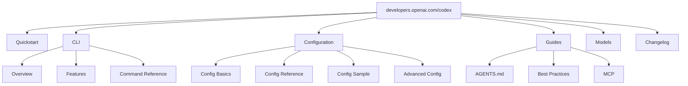
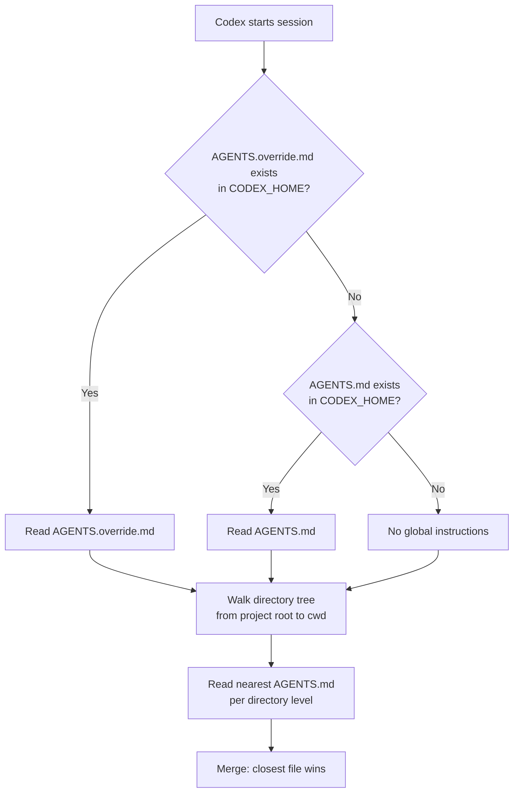

# OpenAI Codex CLI Official Documentation Guide (2026)


---

The official Codex CLI documentation has grown considerably since the tool's open-source debut in mid-2025. What was once a single README and a handful of GitHub docs pages is now a structured documentation site spanning installation, configuration, model selection, features, MCP integration, and an ever-expanding changelog. This guide maps the documentation landscape so you can find exactly what you need without trawling through dozens of pages.

## Documentation Architecture

The official docs live at `developers.openai.com/codex/` and are organised into several distinct sections[^1]. Understanding this structure saves time:



In addition to the official developer docs, the open-source repository at `github.com/openai/codex` contains supplementary documentation in its `docs/` directory, including `getting-started.md` and `config.md`[^2].

## Getting Started: The Quickstart Path

The quickstart guide at `developers.openai.com/codex/quickstart` covers four deployment options: desktop application, IDE extension, CLI, and cloud[^3]. For CLI users specifically, installation is straightforward:

```bash
# Via npm
npm i -g @openai/codex

# Via Homebrew
brew install codex

# Verify installation
codex --version
```

The CLI is fully supported on macOS and Linux[^1]. Windows support remains experimental — the docs recommend running Codex inside a WSL2 workspace for a reliable experience[^1].

### Authentication

First-time authentication offers two paths[^3]:

1. **ChatGPT account** — full functionality including cloud threads and web search
2. **OpenAI API key** — works for local CLI usage, though some features like cloud threads may be unavailable

```bash
# Interactive login (opens browser)
codex login

# Device code flow (headless environments)
codex login --device-auth

# API key via stdin
echo "$OPENAI_API_KEY" | codex login --with-api-key
```

ChatGPT Plus, Pro, Business, Edu, and Enterprise plans all include Codex access[^1].

## Model Selection Reference

The models documentation at `developers.openai.com/codex/models` details the current lineup[^4]:

| Model | Role | When to Use |
|-------|------|-------------|
| `gpt-5.4` | Flagship frontier model | Most tasks — combines coding strength with enhanced reasoning and agentic capabilities |
| `gpt-5.4-mini` | Fast, efficient mini model | Lighter coding tasks, subagent operations, cost-sensitive workflows |
| `gpt-5.3-codex` | Industry-leading coding model | Complex software engineering requiring deep code understanding |
| `gpt-5.3-codex-spark` | Research preview (Pro only) | Near-instant, real-time coding iteration |
| `gpt-5.2` | Previous general-purpose model | Hard debugging tasks benefiting from deeper deliberation |

The documentation recommends starting with `gpt-5.4` for most workflows[^4]. You can switch models at launch or mid-session:

```bash
# At launch
codex --model gpt-5.4-mini "refactor the auth module"

# Mid-session (slash command in TUI)
/model gpt-5.4
```

## Command Line Reference

The command reference at `developers.openai.com/codex/cli/reference` is the most information-dense page in the docs[^5]. Key subcommands:

### Interactive TUI

```bash
# Launch interactive session
codex

# With initial prompt
codex "explain the test failures in src/auth"

# Attach images for visual context
codex -i screenshot.png "fix the layout issues shown here"
```

### Non-Interactive Execution

The `exec` subcommand (aliased as `e`) drives CI/CD and automation workflows[^5]:

```bash
# Basic execution
codex exec "add unit tests for the payment module"

# Machine-readable output for pipelines
codex exec --json --output-last-message result.md "generate migration script"

# Ephemeral run (no session persistence)
codex exec --ephemeral "lint and fix all TypeScript errors"
```

### Session Management

```bash
# Resume last session
codex resume --last

# Resume specific session
codex resume <session-id>
```

### Key Global Flags

The reference documents the full flag set. The most commonly needed[^5]:

| Flag | Purpose |
|------|---------|
| `--model, -m` | Override configured model |
| `--ask-for-approval, -a` | Set approval policy: `untrusted`, `on-request`, `never` |
| `--sandbox, -s` | Sandbox policy: `read-only`, `workspace-write`, `danger-full-access` |
| `--full-auto` | Shortcut for `--ask-for-approval on-request` |
| `--profile, -p` | Load named configuration profile |
| `--add-dir` | Grant write access to additional directories |
| `--oss` | Use local open-source provider (requires Ollama) |
| `--search` | Enable live web search |

⚠️ The `--dangerously-bypass-approvals-and-sandbox` flag (aliased `--yolo`) should only be used inside dedicated sandbox VMs. The docs explicitly warn against combining it with `--full-auto` in production environments[^5].

## Configuration System

Configuration is documented across four pages, reflecting its layered design[^6][^7].

### File Locations and Precedence

The configuration cascade, from highest to lowest priority[^6]:

1. CLI flags and `--config` overrides
2. Profile values (`--profile <name>`)
3. Project config files (`.codex/config.toml`, closest to working directory wins)
4. User config (`~/.codex/config.toml`)
5. System config (`/etc/codex/config.toml`, Unix only)
6. Built-in defaults

### Essential Configuration Keys

```toml
# ~/.codex/config.toml

model = "gpt-5.4"
approval_policy = "on-request"
sandbox_mode = "workspace-write"
web_search = "cached"
model_reasoning_effort = "high"
personality = "friendly"

[features]
shell_snapshot = true    # Speed up repeated commands
memories = false         # Enable persistent memories
multi_agent = true       # Subagent collaboration
undo = false             # Per-turn git snapshots

[shell_environment_policy]
include_only = ["PATH", "HOME", "EDITOR"]
```

### Profiles

Named profiles allow switching between configurations for different contexts[^6]:

```toml
[profiles.ci]
model = "gpt-5.4-mini"
approval_policy = "never"
sandbox_mode = "read-only"

[profiles.exploration]
model = "gpt-5.4"
model_reasoning_effort = "high"
web_search = "live"
```

```bash
codex --profile ci exec "run the test suite and report failures"
```

## Features Documentation

The features page at `developers.openai.com/codex/cli/features` covers the CLI's capabilities in depth[^8]:

### Code Review

The `/review` command provides inline code review without modifying the working tree — useful as a pre-commit check[^8]:

```bash
# In TUI session
/review
```

### Web Search

Enabled by default in cached mode. Switch to live search with `--search` or configure globally[^8]:

```toml
web_search = "live"
```

### Multi-Agent Workflows

Subagent support allows task parallelisation, though the docs note that subagents "consume more tokens than comparable single-agent runs"[^8]. Enable or disable via the `multi_agent` feature flag.

### Image Capabilities

Attach screenshots, design specifications, or diagrams to prompts using the `-i` flag[^8]. The `$imagegen` skill generates images within sessions.

## AGENTS.md Guide

The custom instructions guide at `developers.openai.com/codex/guides/agents-md` explains how to configure project-level and global agent behaviour[^9].



Key points from the documentation[^9]:

- **Global defaults** go in `~/.codex/AGENTS.md` (or `AGENTS.override.md` to take precedence)
- **Project-level** instructions live in `AGENTS.md` at the repo root
- **Subdirectory overrides** — place `AGENTS.md` in any package directory; the nearest file takes precedence
- Content should cover project structure, architecture, commit conventions, security constraints, and deployment steps

The AGENTS.md format is now stewarded by the Agentic AI Foundation under the Linux Foundation[^10], making it a cross-tool standard rather than a Codex-specific convention.

## MCP Integration

The MCP (Model Context Protocol) documentation at `developers.openai.com/codex/mcp` covers connecting external tools[^11]:

```bash
# Add an MCP server via CLI
codex mcp add context7 -- npx -y @upstash/context7-mcp

# Add with environment variables
codex mcp add github --env GITHUB_TOKEN=ghp_xxx -- npx @modelcontextprotocol/server-github

# List configured servers
codex mcp list

# Authenticate OAuth-based servers
codex mcp login figma
```

Or configure directly in TOML[^11]:

```toml
# STDIO server
[mcp_servers.context7]
command = "npx"
args = ["-y", "@upstash/context7-mcp"]

# HTTP server with auth
[mcp_servers.figma]
url = "https://mcp.figma.com/mcp"
bearer_token_env_var = "FIGMA_OAUTH_TOKEN"
```

Popular MCP integrations documented include Context7 (documentation lookup), Figma, Playwright, Chrome DevTools, GitHub, and Sentry[^11].

## Changelog and Release Tracking

The changelog at `developers.openai.com/codex/changelog` tracks both platform and CLI releases[^12]. As of April 2026, the CLI is at version 0.121.0[^12]. Notable recent additions:

- **0.121.0** (15 April 2026) — Marketplace installations from GitHub/git URLs, TUI prompt history with reverse search, memory mode controls, namespaced MCP registration, devcontainer profile with bubblewrap support[^12]
- **0.120.0** (11 April 2026) — Realtime V2 streaming for background agent progress, live hook activity display, MCP output schema in code-mode tools[^12]
- **0.119.0** (10 April 2026) — Realtime voice sessions via WebRTC, MCP resource reads, remote egress WebSocket transport[^12]

For granular release-by-release detail, the GitHub releases page at `github.com/openai/codex/releases` provides the most complete record[^2].

## Supplementary Documentation Sources

Beyond the official docs, several community resources maintain accurate, up-to-date coverage:

| Resource | URL | Focus |
|----------|-----|-------|
| GitHub repo docs | `github.com/openai/codex/blob/main/docs/` | Source-level configuration and getting-started guides |
| OpenAI Cookbook | `cookbook.openai.com` | Practical examples and integration patterns |
| Blake Crosley's Reference | `blakecrosley.com/guides/codex` | Comprehensive third-party technical reference |
| SmartScope Guide | `smartscope.blog` | Setup guide with practical walkthrough |

## Quick Reference: Documentation URL Map

For fast navigation, bookmark these paths:

| Need | URL |
|------|-----|
| Installation | `developers.openai.com/codex/quickstart` |
| CLI overview | `developers.openai.com/codex/cli` |
| All CLI flags | `developers.openai.com/codex/cli/reference` |
| Feature details | `developers.openai.com/codex/cli/features` |
| Model comparison | `developers.openai.com/codex/models` |
| config.toml basics | `developers.openai.com/codex/config-basic` |
| Full config reference | `developers.openai.com/codex/config-reference` |
| Sample config | `developers.openai.com/codex/config-sample` |
| Advanced config | `developers.openai.com/codex/config-advanced` |
| AGENTS.md guide | `developers.openai.com/codex/guides/agents-md` |
| MCP setup | `developers.openai.com/codex/mcp` |
| Changelog | `developers.openai.com/codex/changelog` |
| Best practices | `developers.openai.com/codex/learn/best-practices` |

## Citations

[^1]: [CLI – Codex | OpenAI Developers](https://developers.openai.com/codex/cli)
[^2]: [GitHub – openai/codex](https://github.com/openai/codex)
[^3]: [Quickstart – Codex | OpenAI Developers](https://developers.openai.com/codex/quickstart)
[^4]: [Models – Codex | OpenAI Developers](https://developers.openai.com/codex/models)
[^5]: [Command line options – Codex CLI | OpenAI Developers](https://developers.openai.com/codex/cli/reference)
[^6]: [Config basics – Codex | OpenAI Developers](https://developers.openai.com/codex/config-basic)
[^7]: [Configuration Reference – Codex | OpenAI Developers](https://developers.openai.com/codex/config-reference)
[^8]: [Features – Codex CLI | OpenAI Developers](https://developers.openai.com/codex/cli/features)
[^9]: [Custom instructions with AGENTS.md – Codex | OpenAI Developers](https://developers.openai.com/codex/guides/agents-md)
[^10]: [AGENTS.md – Agentic AI Foundation](https://agents.md/)
[^11]: [Model Context Protocol – Codex | OpenAI Developers](https://developers.openai.com/codex/mcp)
[^12]: [Changelog – Codex | OpenAI Developers](https://developers.openai.com/codex/changelog)
