The system prompt is the soul of a coding agent. It is the document that transforms a general-purpose language model into an opinionated software engineer — one that knows when to be ambitious and when to be surgical, when to ask permission and when to press on, when to write tests and when to leave well enough alone.

The four major open-source coding CLIs — OpenAI's Codex CLI, Google's Gemini CLI, Anthropic's Claude Code, and Mario Zechner's Pi — all ship their system prompts in public repositories. This article dissects all four, compares their philosophies, and examines what these instructions tell us about the future of AI-assisted software engineering.

Why include Pi alongside the Big Three? Because Pi makes a radical counter-argument: that frontier models have been RL-trained so thoroughly on coding agent behaviour that a massive system prompt adds tokens without adding capability. Pi's sub-1,000-token system prompt is the control group that tests whether the other three are over-engineering their instructions.

## Where the Prompts Live

| Tool | Repository | Prompt Location | Architecture |
|------|-----------|----------------|--------------|
| **Codex CLI** | [openai/codex](https://github.com/openai/codex) | `codex-rs/core/*.md` + inline in `models.json` | Static `.md` files per model generation |
| **Gemini CLI** | [google-gemini/gemini-cli](https://github.com/google-gemini/gemini-cli) | `packages/core/src/prompts/snippets.ts` | Dynamic assembly from TypeScript template literals |
| **Claude Code** | [@anthropic-ai/claude-code](https://www.npmjs.com/package/@anthropic-ai/claude-code) npm package | Bundled in `cli.js` (13.2 MB), assembled by `GW()` | Dynamic assembly from ~15 conditional section functions |
| **Pi** | [badlogic/pi-mono](https://github.com/badlogic/pi-mono) | `packages/coding-agent/src/core/system-prompt.ts` | Single TypeScript template, near-static |

The architectural difference is telling. Codex CLI ships separate markdown files for each model generation — one for GPT-5.1, another for GPT-5.2, compact variants for fine-tuned "Codex" models, and inline JSON for GPT-5.4. This means you can `diff` the prompt evolution across model generations. Gemini CLI and Claude Code both assemble their prompts dynamically at runtime, making the full prompt harder to extract but more adaptable to context. Pi takes the opposite approach entirely: a single, near-static template that barely changes between sessions.

## Size Comparison

Codex CLI ships two tiers: full prompts for base GPT models that need tool documentation inline, and compact prompts for fine-tuned "Codex" models that already understand the tools[^5]:

| Prompt File | Characters | Words | Est. Tokens |
|-------------|-----------|-------|-------------|
| **Codex CLI** `gpt_5_1_prompt.md` (full) | 24,224 | 3,924 | ~6,000 |
| **Codex CLI** `gpt-5.2-codex_prompt.md` (compact) | 7,589 | 1,215 | ~1,900 |
| **Codex CLI** `gpt_5_codex_prompt.md` (compact) | 6,647 | 1,082 | ~1,700 |
| **Gemini CLI** assembled from `snippets.ts` | ~20,000-24,000 | ~3,500-4,000 | ~5,000-6,000 |
| **Claude Code** assembled from `cli.mjs` | varies by context | varies | ~3,000-5,000 (core) |
| **Pi** `system-prompt.ts` | ~1,335 | ~181 | ~350 |

The range is significant — Codex CLI's full prompt is roughly **22x larger** than Pi's by word count. But raw prompt text size understates the real gap because tool definitions are serialised as JSON schemas alongside the prompt. When you include everything sent in the initial API call, the total overhead is:

| Metric | Codex CLI | Gemini CLI | Claude Code | Pi |
|--------|----------|------------|-------------|-----|
| **Total initial payload (prompt + tools + context)** | **~8,500 tokens** (baseline)[^2] | ~10,000-13,000[^6] | ~6,000-10,000[^7] | **<1,000 tokens** |

The Codex CLI figure comes from independent measurement by Alex Fazio, who traced the actual API calls in Codex CLI v0.114.0 and measured ~8,497 input tokens for a minimal session (system prompt + tool definitions + trivial user message). With features like `multi_agent` enabled, it rises to ~10,140 tokens[^2]. The standalone `apply_patch` tool instructions are ~3,084 characters (~800 tokens)[^5] — a meaningful chunk but not the dominant factor.

**A note on higher figures:** Some users running Codex CLI with local models via Ollama have reported "context too small" errors at 32K, leading to community claims of ~27,000-token overhead. These figures likely reflect sessions with large AGENTS.md files, registered MCP tools, loaded skills, and other injected context rather than the base system prompt alone. Your actual overhead depends on what you have configured.

Pi's creator Mario Zechner argues the Big Three are over-engineering: "All the frontier models have been RL-trained up the wazoo, so they inherently understand what a coding agent is. There does not appear to be a need for 10,000 tokens of system prompt."[^3] Pi ships exactly four tools — `read`, `write`, `edit`, `bash` — with minimal schemas, and lets the model figure out the rest.

Gemini CLI's assembled prompt is the largest. GitHub issue #3784 flagged that two trivial math queries consumed ~13,055 input tokens because the system prompt is resent with every API call[^6].

Codex CLI's two-tier approach is an elegant solution to the token-budget problem — the compact prompts (~7K chars) for fine-tuned Codex models save roughly two-thirds of the text compared to the full prompts (~24K chars). If the model already knows `apply_patch`, why waste tokens explaining it every turn?

Claude Code's core prompt is compact, but tool definitions are sent separately as schemas, and CLAUDE.md files, auto-memory, and environment details inflate the effective total.

### The Local Model Implication

This size difference is manageable when hitting a cloud API with a 200K context window. It becomes significant when running a local model at 32K or 64K context:

| Context Window | Codex CLI (~8.5K baseline) | Codex CLI (with AGENTS.md + MCP) | Pi (~1K overhead) |
|----------------|---------------------------|----------------------------------|-------------------|
| **32K** | ~23.5K — usable | ~15-20K — tight | ~31K — spacious |
| **64K** | ~55.5K — comfortable | ~47-52K — adequate | ~63K — barely notice it |
| **128K** | ~119.5K — plenty | ~111-116K — plenty | ~127K — negligible |

The baseline gap (~7.5K tokens) is meaningful but not dramatic. Where it matters most is when Codex CLI is loaded with project context — AGENTS.md files, MCP tool schemas, skills, and hierarchical context files can push the real overhead well above the baseline, and that is where Pi's minimalism becomes genuinely advantageous for local-model workflows[^4].

## Identity: Who Does the Agent Think It Is?

The opening line of a system prompt establishes identity. Each tool makes a different bet:

**Codex CLI** (from `gpt_5_1_prompt.md`[^5]):
> "You are a deeply pragmatic, effective software engineer."

**Gemini CLI:**
> "You are Gemini CLI, an interactive CLI agent specializing in software engineering tasks."

**Claude Code:**
> "You are an interactive agent that helps users with software engineering tasks."

**Pi:**
> "You are an expert coding assistant operating inside pi, a coding agent harness."

Codex CLI's identity is the boldest — it claims to *be* a software engineer, not just play one. The full prompt goes further, declaring explicit values and adding: "You avoid cheerleading, motivational language, or artificial reassurance, or any kind of fluff."[^5]

Gemini CLI names itself — "You are Gemini CLI" — anchoring the agent to a specific product identity. Claude Code is the most modest, describing itself simply as "an interactive agent that helps." Pi splits the difference — "expert coding assistant" is confident but qualified by "operating inside pi," which grounds the model in the harness context without over-specifying behaviour.

This matters because identity framing affects behaviour. An agent told it *is* a software engineer will be more likely to exercise judgment and push back on bad ideas. An agent told it *helps with* software engineering will be more deferential. Pi's bet is that the model's RL training has already internalised the right identity, so a brief reminder is sufficient.

## The Philosophy Test: What Do They Prioritise?

### On Autonomy

**Codex CLI:** "Persist until the task is fully handled end-to-end." Assume the user wants code changes unless explicitly brainstorming. The GPT-5.1 prompt adds "Autonomy and Persistence" as a named section.

**Gemini CLI:** "Keep going until the user's query is completely resolved." But it also has the most controversial instruction: "Fulfill the user's request thoroughly, including reasonable, directly implied follow-up actions." Developer Daniela Petruzalek identified this as the source of "80% of my problems" — the agent infers and executes unintended actions[^1].

**Claude Code:** "Don't add features, refactor code, or make 'improvements' beyond what was asked." This is the anti-proactiveness stance. Do exactly what was requested, nothing more.

**Pi:** Says nothing about autonomy or restraint. The entire philosophy is delegated to the model's training. Pi's implicit stance: the model already knows how to be an appropriate level of proactive — just give it the tools and get out of the way.

The spectrum is clear: Gemini is the most proactive (sometimes problematically so), Codex is persistent but scoped, Claude Code is deliberately restrained, and Pi abstains from the debate entirely. If you have ever had an AI agent "helpfully" refactor your entire codebase when you asked it to fix a typo, you understand why Claude Code chose restraint. If you have ever had an agent refuse to do something obvious because the system prompt forbids it, you understand why Pi chose minimalism.

### On Code Quality

**Codex CLI:** "Avoid collapsing into 'AI slop' or safe, average-looking layouts. Aim for interfaces that feel intentional, bold, and a bit surprising."[^5] The prompt specifically calls out purple-on-white defaults, Inter/Roboto/Arial fonts, and dark mode bias.

**Claude Code:** "Three similar lines of code is better than a premature abstraction." And: "Don't add docstrings, comments, or type annotations to code you didn't change."

**Gemini CLI:** "Follow workspace conventions." Less opinionated about aesthetics, more focused on consistency with existing patterns.

Codex CLI is the only prompt that directly names and attacks "AI slop" — the generic, safe-looking output that AI tools default to. This is a remarkable piece of self-awareness from OpenAI: they know their models tend toward bland defaults and they are fighting it in the system prompt itself.

Claude Code's anti-abstraction stance ("three similar lines > premature abstraction") is the most opinionated engineering position in any of the three prompts. It reflects a specific school of thought — YAGNI (You Aren't Gonna Need It) — baked directly into the agent's DNA.

### On Risk and Safety

**Claude Code** has the most sophisticated risk framework. Its "Executing Actions with Care" section (~2,830 chars) is a structured risk taxonomy:
- Freely take local, reversible actions
- Confirm destructive or shared-state operations
- "The cost of pausing to confirm is low, while the cost of an unwanted action can be very high"
- "A user approving an action once does NOT mean that they approve it in all contexts"
- "Measure twice, cut once"

**Codex CLI** adapts behaviour based on approval mode (`never`, `on-failure`, `untrusted`, `on-request`). In non-interactive modes it proactively tests; in interactive modes it holds off. It also has extensive rules about dirty worktrees — never reverting user changes, never using destructive git commands.

**Gemini CLI** has its "Core Mandates" — security, context efficiency, engineering standards — which "cannot be overridden" even by GEMINI.md files. It includes a "3-strike rule": after 3 failed fix attempts, stop, list assumptions, and propose a different approach.

### On Testing

**Gemini CLI** is the most testing-obsessed: "always search for and update related tests" is in its core mandates. It also has explicit validation philosophy: "Validation is the only path to finality."

**Codex CLI** takes a more nuanced stance: "Don't add tests to codebases with no tests. Don't add formatters if none configured." Match the project's existing practices.

**Claude Code** says nothing about testing in its core prompt — it defers to the user's judgment about scope.

### On Output Verbosity

All four fight the same battle: stopping the model from being too chatty.

**Codex CLI** (from `gpt_5_1_prompt.md` / `gpt_5_2_prompt.md`[^5]): The most granular verbosity rules of any prompt:
- Tiny changes → "2-5 sentences or 3 bullets, no headings"
- Medium changes → "at most 1-2 short snippets, 8 lines each max"
- Large changes → "never include before/after pairs, full method bodies, or large code blocks"

**Claude Code:** "If you can say it in one sentence, don't use three."

**Gemini CLI:** "Under 3 lines of text output per response, no filler/preambles/postambles."

Gemini's 3-line limit is the most aggressive constraint. Codex CLI's tiered approach is the most nuanced.

## Structural Features Compared

### Context File Systems

| Feature | Codex CLI | Gemini CLI | Claude Code | Pi |
|---------|----------|------------|-------------|-----|
| **Project context file** | AGENTS.md | GEMINI.md | CLAUDE.md | SYSTEM.md |
| **Hierarchical scoping** | ✅ Root-to-leaf, deeper overrides | ✅ Project > extension > global | ✅ Project + user level | ✅ Project root |
| **Can override system prompt?** | Partially (direct prompts override all) | Yes, but cannot override Core Mandates | Yes, takes precedence over defaults | Yes, fully replaceable |
| **Portable across tools?** | ✅ AGENTS.md supported by 25+ tools | ❌ Gemini-specific | ❌ Claude-specific | ❌ Pi-specific |

Codex CLI's use of the cross-tool AGENTS.md standard (60,000+ repos, 25+ tools) is a strategic advantage. GEMINI.md, CLAUDE.md, and SYSTEM.md are proprietary formats that lock context to a single tool. Pi's SYSTEM.md is notable because it effectively *becomes* the system prompt — given how minimal Pi's default prompt is, a well-written SYSTEM.md can shift the agent's personality more dramatically than in any other tool.

### Sub-Agent Architecture

**Gemini CLI** names four sub-agents directly in its system prompt:
- `codebase_investigator` — code search and analysis
- `cli_help` — Gemini CLI usage guidance
- `generalist` — general tasks
- `browser_agent` — web browsing

**Claude Code** uses a generic Agent tool with depth-limited spawning, and includes specialised sub-agent prompts for code exploration and planning (READ-ONLY mode).

**Codex CLI** has no sub-agent instructions in the system prompt — delegation is handled at the harness level.

### Planning

**Codex CLI** is the most detailed on planning. The prompt includes 3 "high-quality plan" examples and 3 "low-quality plan" examples. Low-quality: "Make styles look good." High-quality: "Define CSS variables for colors." It enforces exactly one `in_progress` step at a time.

**Gemini CLI** has a dedicated "Planning Workflow" mode with read-only exploration, structured plan drafting, and approval flow.

**Claude Code** uses TodoWrite for task tracking but delegates planning to the model's judgment.

## What the Prompts Reveal About Each Tool's Bet

Each system prompt encodes a thesis about what matters most in AI-assisted development:

```mermaid
graph TD
    A[Codex CLI] --> A1["Bet: Model-specific optimisation"]
    A --> A2["Separate prompts per model generation"]
    A --> A3["Anti-slop, anti-generic output"]

    B[Gemini CLI] --> B1["Bet: Proactive autonomy"]
    B --> B2["Largest prompt, most context"]
    B --> B3["Strategic orchestrator pattern"]

    C[Claude Code] --> C1["Bet: Restraint and precision"]
    C --> C2["Small core prompt"]
    C --> C3["Anti-overengineering philosophy"]

    D[Pi] --> D1["Bet: Model knows best"]
    D --> D2["Minimal prompt, maximum headroom"]
    D --> D3["Four tools, zero opinions"]
```



**Codex CLI bets on model-specific optimisation.** By maintaining separate prompts per model generation (GPT-5.1, GPT-5.2, plus compact variants), OpenAI can tune instructions to each model's strengths[^5]. The compact variants for fine-tuned Codex models save roughly two-thirds of the prompt text by not re-explaining tools the model already understands.

**Gemini CLI bets on proactive autonomy.** The largest prompt of the four, it tries to anticipate every scenario — from sandbox error handling to technology recommendations for new apps (React+Bootstrap for web, FastAPI for APIs). It explicitly tells the model to "treat your own context window as your most precious resource," making context management a first-class concern in the prompt itself.

**Claude Code bets on restraint and precision.** A small core prompt, the most anti-overengineering stance ("three similar lines > premature abstraction"), the most conservative risk framework ("measure twice, cut once"). Anthropic's bet is that a restrained agent with a small, focused prompt produces better outcomes than an ambitious one with a large, comprehensive prompt.

**Pi bets on the model knowing best.** Zechner's thesis is that frontier models have internalised coding agent behaviour through RL training — they already know how to plan, recover from errors, and use tools effectively. Pi's ~400-token prompt is an explicit rejection of the assumption that the system prompt needs to teach the model to be an agent. Pi gives the model four tools and trusts it to figure out the rest. This is the most radical position in the field, and its competitive results on Terminal-Bench 2.0 suggest it may be right — at least for frontier models.

## The Hidden Feature: Prompt Override

All four tools let you replace or augment the system prompt:

| Override Method | Codex CLI | Gemini CLI | Claude Code | Pi |
|----------------|----------|------------|-------------|-----|
| **Full replacement** | `model_instructions_file` in config[^9] | `GEMINI_SYSTEM_MD=/path/to/file` | `CLAUDE_CODE_SIMPLE=1` (minimal mode) | SYSTEM.md replaces default |
| **Additive** | `developer_instructions` + AGENTS.md | GEMINI.md (hierarchical) | CLAUDE.md (hierarchical) | Extensions via `promptGuidelines` |
| **Disable sections** | `include_permissions_instructions = false`[^9] | N/A | N/A | N/A |
| **Inspect assembled prompt** | Read `.md` files directly | `GEMINI_WRITE_SYSTEM_MD` writes to file | Extract from npm bundle | Read `system-prompt.ts` (~100 lines) |

### Codex CLI's Custom Prompt System (Key for Local Models)

Codex CLI's prompt override system is more sophisticated than it first appears, and it is **critical for local model performance**. The resolution chain for base instructions is[^9]:

1. `config.base_instructions` (from `model_instructions_file` in config.toml) — **highest priority**
2. `session_meta.base_instructions` (from resumed sessions)
3. `model_info.base_instructions` (from the built-in model catalog)

When Codex CLI encounters a model slug it does not recognise — which includes every local model via Ollama or llama.cpp — it falls back to a default ~276-line prompt from `codex-rs/models-manager/prompt.md`. This is the same prompt used for every unknown model, regardless of capability.

You can replace it entirely per-profile:

```toml
# ~/.codex/config.toml

[profiles.gb10-minimal]
model = "gemma4:31b"
model_provider = "gb10"
model_instructions_file = "~/prompts/minimal-codex.md"
include_permissions_instructions = false
include_apps_instructions = false
```

The codebase includes a strong warning: *"Users are STRONGLY DISCOURAGED from using this field, as deviating from the instructions sanctioned by Codex will likely degrade model performance."*[^9] But for local models that already struggle with context overhead, the trade-off may favour a smaller prompt — exactly the thesis Pi validates.

**Note:** The old `experimental_instructions_file` config key is deprecated and silently ignored. Use `model_instructions_file` instead.

Gemini CLI's `GEMINI_WRITE_SYSTEM_MD` is the most developer-friendly: set it once and the assembled prompt is dumped to `~/.gemini/system.md` for inspection. Codex CLI's approach of shipping readable markdown files in the repo is the most transparent. Claude Code's bundled-in-minified-JS approach is the least accessible. Pi's prompt is so short you can read the entire source file in under a minute — there is nothing to inspect because there is nothing to hide.

## Practical Implications for Engineering Teams

### If you are choosing a tool

- **Want maximum restraint and predictability?** Claude Code's "do exactly what was asked" philosophy minimises surprises. Best for teams with strong existing codebases who want surgical changes.
- **Want proactive assistance on greenfield projects?** Gemini CLI's "fulfill implied follow-up actions" can accelerate new project setup — if you can tolerate occasional over-reach.
- **Want model-specific tuning and anti-slop aesthetics?** Codex CLI's per-model prompt architecture and explicit anti-generic-output instructions produce the most distinctive results.
- **Running local models on limited hardware?** Pi's sub-1,000-token overhead leaves significantly more context for your code. At 32K, the ~7,500-token gap between Codex CLI's baseline and Pi's overhead matters — and it grows if you load AGENTS.md, MCP tools, or skills. If you are on a GB10, Mac, or any device where context is tight, Pi is worth testing.

### If you are writing AGENTS.md

Understanding the system prompt helps you write better AGENTS.md files. Your project-level instructions sit *on top* of these defaults:

- For Codex CLI: your AGENTS.md reinforces or overrides the prompt's tendency toward persistence and ambition. Use it to add constraints.
- For Gemini CLI: your GEMINI.md takes "absolute precedence" over general workflows (but not Core Mandates). Use it to tame proactiveness.
- For Claude Code: your CLAUDE.md adds context the deliberately minimal prompt lacks. Use it to add domain knowledge.

### If you are building agent infrastructure

The system prompt is the first — and often overlooked — layer of your agentic engineering stack. These three prompts collectively represent hundreds of hours of iteration on what makes AI-assisted coding actually work. The convergences (anti-verbosity, risk frameworks, context file hierarchies) are industry consensus. The divergences (proactive vs restrained, large vs small prompt, per-model vs universal) are the open questions.

## What Is Converging

Despite their differences, all four prompts converge on several principles:

1. **Anti-verbosity** — All four explicitly or implicitly fight chatty output. The models' default behaviour is too verbose for a coding context. (Pi achieves this by not giving the model room to be chatty — with only ~400 tokens of instructions, there is nothing reinforcing verbose defaults.)
2. **Context file hierarchies** — All four support project-level instruction files that override defaults. AGENTS.md, GEMINI.md, CLAUDE.md, and SYSTEM.md all follow the same concept: "closer to the code = higher precedence."
3. **Tool preference over shell** — Codex CLI, Gemini CLI, and Claude Code all prefer their built-in tools (Read, Edit, Grep) over raw shell equivalents. Pi is the exception — it provides `bash` as a first-class tool and trusts the model to choose between tools and shell commands.
4. **Never auto-push** — All three of the "big" prompts prohibit automatic `git push`. The blast radius is too high. Pi says nothing about git — another example of trusting the model's training.

## What Is Diverging

1. **Prompt size philosophy** — The spectrum from Pi's ~350-token prompt to Codex CLI's ~8,500-token baseline payload (which can grow much larger with AGENTS.md and MCP tools) represents a fundamental disagreement about how much a system prompt should do.
2. **Proactiveness** — The spectrum from Gemini's "implied follow-up actions" to Claude Code's "don't add features beyond what was asked" to Pi's silence is the most significant philosophical split.
3. **Testing stance** — Gemini mandates test updates; Codex matches existing practices; Claude Code stays silent; Pi stays silent. No consensus on the agent's testing responsibility.
4. **Sub-agent awareness** — Gemini names its sub-agents in the system prompt; Claude Code and Codex handle delegation at the harness level; Pi has no sub-agents at all. Whether the model should know about its own architecture is an open question.
5. **Model specificity** — Codex CLI's per-model prompts vs universal prompts is a unique approach. Pi takes the opposite extreme: one prompt for every model, from GPT-5.2 to a quantised local Gemma. The question is whether prompt-per-model or prompt-agnostic scales better.
6. **Local model viability** — Pi's minimal overhead leaves substantially more room for code at every context window size. With AGENTS.md files and MCP tools loaded, Codex CLI's overhead grows well beyond its ~8.5K baseline, making the gap more pronounced on memory-constrained devices.

---

*The system prompt is the constitution of a coding agent. Like any constitution, it reveals what the authors fear most: Codex fears blandness, Gemini fears inaction, Claude Code fears overreach, and Pi fears the constitution itself. Understanding these fears is the first step to working with — not against — your agent's grain.*

---

[^1]: Daniela Petruzalek, "Gemini CLI System Prompt: Proactiveness Considered Harmful?", [danicat.dev](https://danicat.dev/posts/20250715-gemini-cli-system-prompt/), July 2025.
[^2]: Alex Fazio, "Codex CLI Exec Mode Experiments — Token Usage Baseline," [GitHub Gist](https://gist.github.com/alexfazio/359c17d84cb6a5af12bac88fa1db9770). Measured ~8,497 input tokens for minimal session (v0.114.0), ~10,140 with multi-agent enabled. Community reports of ~27K overhead likely include AGENTS.md, MCP tools, and other injected context.
[^3]: Mario Zechner, "Building Pi, a Shitty Coding Agent", [mariozechner.at](https://mariozechner.at/posts/2025-11-30-pi-coding-agent/), November 2025.
[^4]: Pi's competitive Terminal-Bench 2.0 results with Claude Opus, despite its minimal prompt, support the thesis that frontier models have internalised agent behaviour through RL training. See [shittycodingagent.ai](https://shittycodingagent.ai/) and [badlogic/pi-mono](https://github.com/badlogic/pi-mono).
[^5]: Codex CLI prompt files verified against [openai/codex `codex-rs/core/`](https://github.com/openai/codex/tree/main/codex-rs/core): `gpt_5_1_prompt.md` (24,224 chars / 3,924 words), `gpt_5_2_prompt.md` (21,672 chars / 3,502 words), `gpt-5.2-codex_prompt.md` (7,589 chars / 1,215 words), `gpt_5_codex_prompt.md` (6,647 chars / 1,082 words), `apply_patch_tool_instructions.md` (3,084 chars / 527 words). Character and word counts measured directly from source files.
[^6]: Gemini CLI prompt assembled dynamically from [`packages/core/src/prompts/snippets.ts`](https://github.com/google-gemini/gemini-cli/blob/main/packages/core/src/prompts/snippets.ts). Total size varies by runtime context. GitHub issue [#3784](https://github.com/google-gemini/gemini-cli/issues/3784) reported ~13,055 input tokens for trivial queries.
[^7]: Claude Code prompt extracted from the minified `cli.mjs` bundle in the [@anthropic-ai/claude-code](https://www.npmjs.com/package/@anthropic-ai/claude-code) npm package. Core prompt assembled by `getSystemPrompt()` from 30+ conditional section functions. Size varies significantly by context (tools loaded, CLAUDE.md content, environment).
[^8]: Pi system prompt source: [`packages/coding-agent/src/core/system-prompt.ts`](https://github.com/badlogic/pi-mono/blob/main/packages/coding-agent/src/core/system-prompt.ts). ~1,335 characters, ~181 words. Confirmed against repository.
[^9]: Codex CLI prompt override system: `model_instructions_file` config key replaces base instructions entirely ([`codex-rs/config/src/config_toml.rs:139-141`](https://github.com/openai/codex/blob/main/codex-rs/config/src/config_toml.rs)). `include_permissions_instructions` and `include_apps_instructions` booleans disable additional prompt sections. The old `experimental_instructions_file` is deprecated and ignored ([`codex-rs/core/src/codex.rs:1798`](https://github.com/openai/codex/blob/main/codex-rs/core/src/codex.rs)). Unknown/local models fall back to `codex-rs/models-manager/prompt.md` (~276 lines). See also GitHub Discussion [#7296](https://github.com/openai/codex/discussions/7296) and Issue [#12926](https://github.com/openai/codex/issues/12926).
