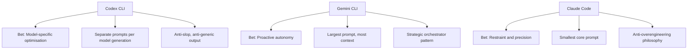

# The DNA of Coding Agents: Codex CLI vs Gemini CLI vs Claude Code System Prompts Compared

The system prompt is the soul of a coding agent. It is the document that transforms a general-purpose language model into an opinionated software engineer — one that knows when to be ambitious and when to be surgical, when to ask permission and when to press on, when to write tests and when to leave well enough alone.

All three major coding CLIs — OpenAI's Codex CLI, Google's Gemini CLI, and Anthropic's Claude Code — are open source. Their system prompts are visible in their GitHub repositories. This article dissects all three, compares their philosophies, and examines what these instructions tell us about the future of AI-assisted software engineering.

## Where the Prompts Live

| Tool | Repository | Prompt Location | Architecture |
|------|-----------|----------------|--------------|
| **Codex CLI** | [openai/codex](https://github.com/openai/codex) | `codex-rs/core/*.md` + inline in `models.json` | Static `.md` files per model generation |
| **Gemini CLI** | [google-gemini/gemini-cli](https://github.com/google-gemini/gemini-cli) | `packages/core/src/prompts/snippets.ts` | Dynamic assembly from TypeScript template literals |
| **Claude Code** | [@anthropic-ai/claude-code](https://www.npmjs.com/package/@anthropic-ai/claude-code) npm package | Bundled in `cli.js` (13.2 MB), assembled by `GW()` | Dynamic assembly from ~15 conditional section functions |

The architectural difference is telling. Codex CLI ships separate markdown files for each model generation — one for GPT-5.1, another for GPT-5.2, compact variants for fine-tuned "Codex" models, and inline JSON for GPT-5.4. This means you can `diff` the prompt evolution across model generations. Gemini CLI and Claude Code both assemble their prompts dynamically at runtime, making the full prompt harder to extract but more adaptable to context.

## Size Comparison

| Metric | Codex CLI (GPT-5.4) | Codex CLI (GPT-5.1, full) | Gemini CLI | Claude Code |
|--------|---------------------|--------------------------|------------|-------------|
| **Characters** | ~14,700 | ~24,200 | ~35,000-40,000 | ~13,600 (core) |
| **Words** | ~2,400 | ~3,900 | ~5,500-6,000 | ~2,500 (core) |
| **Estimated tokens** | ~3,500-4,000 | ~5,000-6,000 | ~7,700 | ~3,400 (core) |

Gemini CLI's prompt is the largest by a significant margin — roughly double Claude Code's core prompt. This has real cost implications: GitHub issue #3784 flagged that two trivial math queries consumed ~13,055 input tokens because the system prompt is resent with every API call.

Codex CLI maintains two tiers: full prompts (~24K chars) for base GPT models that need tool documentation inline, and compact prompts (~7K chars) for fine-tuned Codex models that already understand the tools. This is an elegant solution to the token-budget problem — if the model already knows `apply_patch`, why waste tokens explaining it every turn?

Claude Code's core prompt is the most compact at ~13,600 characters, but this is deceptive. Tool definitions are sent separately as schemas, and CLAUDE.md files, auto-memory, and environment details inflate the effective total to an estimated 6,000-10,000+ tokens.

## Identity: Who Does the Agent Think It Is?

The opening line of a system prompt establishes identity. Each tool makes a different bet:

**Codex CLI (GPT-5.4):**
> "You are a deeply pragmatic, effective software engineer."

**Gemini CLI:**
> "You are Gemini CLI, an interactive CLI agent specializing in software engineering tasks."

**Claude Code:**
> "You are an interactive agent that helps users with software engineering tasks."

Codex CLI's identity is the boldest — it claims to *be* a software engineer, not just play one. The GPT-5.4 version goes further, declaring explicit values: "Clarity, Pragmatism, Rigor." It adds: "You avoid cheerleading, motivational language, or artificial reassurance, or any kind of fluff."

Gemini CLI names itself — "You are Gemini CLI" — anchoring the agent to a specific product identity. Claude Code is the most modest, describing itself simply as "an interactive agent that helps."

This matters because identity framing affects behaviour. An agent told it *is* a software engineer will be more likely to exercise judgment and push back on bad ideas. An agent told it *helps with* software engineering will be more deferential.

## The Philosophy Test: What Do They Prioritise?

### On Autonomy

**Codex CLI:** "Persist until the task is fully handled end-to-end." Assume the user wants code changes unless explicitly brainstorming. The GPT-5.1 prompt adds "Autonomy and Persistence" as a named section.

**Gemini CLI:** "Keep going until the user's query is completely resolved." But it also has the most controversial instruction: "Fulfill the user's request thoroughly, including reasonable, directly implied follow-up actions." Developer Daniela Petruzalek identified this as the source of "80% of my problems" — the agent infers and executes unintended actions[^1].

**Claude Code:** "Don't add features, refactor code, or make 'improvements' beyond what was asked." This is the anti-proactiveness stance. Do exactly what was requested, nothing more.

The spectrum is clear: Gemini is the most proactive (sometimes problematically so), Codex is persistent but scoped, and Claude Code is deliberately restrained. If you have ever had an AI agent "helpfully" refactor your entire codebase when you asked it to fix a typo, you understand why Claude Code chose restraint.

### On Code Quality

**Codex CLI (GPT-5.4):** "Avoid collapsing into 'AI slop' or safe, average-looking layouts. Aim for interfaces that feel intentional, bold, and a bit surprising." It specifically calls out purple-on-white defaults, Inter/Roboto/Arial fonts, and dark mode bias.

**Claude Code:** "Three similar lines of code is better than a premature abstraction." And: "Don't add docstrings, comments, or type annotations to code you didn't change."

**Gemini CLI:** "Follow workspace conventions." Less opinionated about aesthetics, more focused on consistency with existing patterns.

Codex CLI is the only prompt that directly names and attacks "AI slop" — the generic, safe-looking output that AI tools default to. This is a remarkable piece of self-awareness from OpenAI: they know their models tend toward bland defaults and they are fighting it in the system prompt itself.

Claude Code's anti-abstraction stance ("three similar lines > premature abstraction") is the most opinionated engineering position in any of the three prompts. It reflects a specific school of thought — YAGNI (You Aren't Gonna Need It) — baked directly into the agent's DNA.

### On Risk and Safety

**Claude Code** has the most sophisticated risk framework. Its "Executing Actions with Care" section (~2,830 chars) is a structured risk taxonomy:
- Freely take local, reversible actions
- Confirm destructive or shared-state operations
- "The cost of pausing to confirm is low, while the cost of an unwanted action can be very high"
- "A user approving an action once does NOT mean that they approve it in all contexts"
- "Measure twice, cut once"

**Codex CLI** adapts behaviour based on approval mode (`never`, `on-failure`, `untrusted`, `on-request`). In non-interactive modes it proactively tests; in interactive modes it holds off. It also has extensive rules about dirty worktrees — never reverting user changes, never using destructive git commands.

**Gemini CLI** has its "Core Mandates" — security, context efficiency, engineering standards — which "cannot be overridden" even by GEMINI.md files. It includes a "3-strike rule": after 3 failed fix attempts, stop, list assumptions, and propose a different approach.

### On Testing

**Gemini CLI** is the most testing-obsessed: "always search for and update related tests" is in its core mandates. It also has explicit validation philosophy: "Validation is the only path to finality."

**Codex CLI** takes a more nuanced stance: "Don't add tests to codebases with no tests. Don't add formatters if none configured." Match the project's existing practices.

**Claude Code** says nothing about testing in its core prompt — it defers to the user's judgment about scope.

### On Output Verbosity

All three fight the same battle: stopping the model from being too chatty.

**Codex CLI (GPT-5.1/5.2):** The most granular verbosity rules of any prompt:
- Tiny changes → "2-5 sentences or 3 bullets, no headings"
- Medium changes → "at most 1-2 short snippets, 8 lines each max"
- Large changes → "never include before/after pairs, full method bodies, or large code blocks"

**Claude Code:** "If you can say it in one sentence, don't use three."

**Gemini CLI:** "Under 3 lines of text output per response, no filler/preambles/postambles."

Gemini's 3-line limit is the most aggressive constraint. Codex CLI's tiered approach is the most nuanced.

## Structural Features Compared

### Context File Systems

| Feature | Codex CLI | Gemini CLI | Claude Code |
|---------|----------|------------|-------------|
| **Project context file** | AGENTS.md | GEMINI.md | CLAUDE.md |
| **Hierarchical scoping** | ✅ Root-to-leaf, deeper overrides | ✅ Project > extension > global | ✅ Project + user level |
| **Can override system prompt?** | Partially (direct prompts override all) | Yes, but cannot override Core Mandates | Yes, takes precedence over defaults |
| **Portable across tools?** | ✅ AGENTS.md supported by 25+ tools | ❌ Gemini-specific | ❌ Claude-specific |

Codex CLI's use of the cross-tool AGENTS.md standard (60,000+ repos, 25+ tools) is a strategic advantage. GEMINI.md and CLAUDE.md are proprietary formats that lock context to a single tool.

### Sub-Agent Architecture

**Gemini CLI** names four sub-agents directly in its system prompt:
- `codebase_investigator` — code search and analysis
- `cli_help` — Gemini CLI usage guidance
- `generalist` — general tasks
- `browser_agent` — web browsing

**Claude Code** uses a generic Agent tool with depth-limited spawning, and includes specialised sub-agent prompts for code exploration and planning (READ-ONLY mode).

**Codex CLI** has no sub-agent instructions in the system prompt — delegation is handled at the harness level.

### Planning

**Codex CLI** is the most detailed on planning. The prompt includes 3 "high-quality plan" examples and 3 "low-quality plan" examples. Low-quality: "Make styles look good." High-quality: "Define CSS variables for colors." It enforces exactly one `in_progress` step at a time.

**Gemini CLI** has a dedicated "Planning Workflow" mode with read-only exploration, structured plan drafting, and approval flow.

**Claude Code** uses TodoWrite for task tracking but delegates planning to the model's judgment.

## What the Prompts Reveal About Each Tool's Bet

Each system prompt encodes a thesis about what matters most in AI-assisted development:

**Codex CLI bets on model-specific optimisation.** By maintaining separate prompts per model generation, OpenAI can tune instructions to each model's strengths. The compact variants for fine-tuned Codex models save tokens by not re-explaining tools the model already understands. The GPT-5.4 prompt introduces a "commentary" channel system — a novel way to keep users informed during long operations.

**Gemini CLI bets on proactive autonomy.** The largest prompt of the three, it tries to anticipate every scenario — from sandbox error handling to technology recommendations for new apps (React+Bootstrap for web, FastAPI for APIs). It explicitly tells the model to "treat your own context window as your most precious resource," making context management a first-class concern in the prompt itself.

**Claude Code bets on restraint and precision.** The smallest core prompt, the most anti-overengineering stance ("three similar lines > premature abstraction"), the most conservative risk framework ("measure twice, cut once"). Anthropic's bet is that a restrained agent with a small, focused prompt produces better outcomes than an ambitious one with a large, comprehensive prompt.

## The Hidden Feature: Prompt Override

All three tools let you replace or augment the system prompt:

| Override Method | Codex CLI | Gemini CLI | Claude Code |
|----------------|----------|------------|-------------|
| **Full replacement** | `--config experimental_instructions_file=<path>` | `GEMINI_SYSTEM_MD=/path/to/file` | `CLAUDE_CODE_SIMPLE=1` (minimal mode) |
| **Additive** | `--config developer_instructions` + AGENTS.md | GEMINI.md (hierarchical) | CLAUDE.md (hierarchical) |
| **Inspect assembled prompt** | Read `.md` files directly | `GEMINI_WRITE_SYSTEM_MD` writes to file | Extract from npm bundle |

Gemini CLI's `GEMINI_WRITE_SYSTEM_MD` is the most developer-friendly: set it once and the assembled prompt is dumped to `~/.gemini/system.md` for inspection. Codex CLI's approach of shipping readable markdown files in the repo is the most transparent. Claude Code's bundled-in-minified-JS approach is the least accessible.

## Practical Implications for Engineering Teams

### If you are choosing a tool

- **Want maximum restraint and predictability?** Claude Code's "do exactly what was asked" philosophy minimises surprises. Best for teams with strong existing codebases who want surgical changes.
- **Want proactive assistance on greenfield projects?** Gemini CLI's "fulfill implied follow-up actions" can accelerate new project setup — if you can tolerate occasional over-reach.
- **Want model-specific tuning and anti-slop aesthetics?** Codex CLI's per-model prompt architecture and explicit anti-generic-output instructions produce the most distinctive results.

### If you are writing AGENTS.md

Understanding the system prompt helps you write better AGENTS.md files. Your project-level instructions sit *on top* of these defaults:

- For Codex CLI: your AGENTS.md reinforces or overrides the prompt's tendency toward persistence and ambition. Use it to add constraints.
- For Gemini CLI: your GEMINI.md takes "absolute precedence" over general workflows (but not Core Mandates). Use it to tame proactiveness.
- For Claude Code: your CLAUDE.md adds context the deliberately minimal prompt lacks. Use it to add domain knowledge.

### If you are building agent infrastructure

The system prompt is the first — and often overlooked — layer of your agentic engineering stack. These three prompts collectively represent hundreds of hours of iteration on what makes AI-assisted coding actually work. The convergences (anti-verbosity, risk frameworks, context file hierarchies) are industry consensus. The divergences (proactive vs restrained, large vs small prompt, per-model vs universal) are the open questions.

## What Is Converging

Despite their differences, all three prompts converge on several principles:

1. **Anti-verbosity** — All three explicitly fight chatty output. The models' default behaviour is too verbose for a coding context.
2. **Risk-aware execution** — All three distinguish between reversible and irreversible actions, though Claude Code's framework is the most developed.
3. **Context file hierarchies** — All three support project-level instruction files that override defaults. The concept of "closer to the code = higher precedence" is universal.
4. **Tool preference over shell** — All three prefer their built-in tools (Read, Edit, Grep) over raw shell equivalents (cat, sed, grep). This ensures structured output and better permission control.
5. **Never auto-push** — All three prohibit automatic `git push`. The blast radius is too high.

## What Is Diverging

1. **Prompt size philosophy** — Gemini CLI's 7,700-token prompt vs Claude Code's 3,400-token core prompt represents a 2x difference. Bigger prompts give more guidance but consume more of the context budget.
2. **Proactiveness** — The spectrum from Gemini's "implied follow-up actions" to Claude Code's "don't add features beyond what was asked" is the most significant philosophical split.
3. **Testing stance** — Gemini mandates test updates; Codex matches existing practices; Claude Code stays silent. No consensus on the agent's testing responsibility.
4. **Sub-agent awareness** — Gemini names its sub-agents in the system prompt; Claude Code and Codex handle delegation at the harness level. Whether the model should know about its own architecture is an open question.
5. **Model specificity** — Codex CLI's per-model prompts vs universal prompts is a unique approach. As models evolve rapidly, the question is whether prompt-per-model is sustainable at scale.

---

*The system prompt is the constitution of a coding agent. Like any constitution, it reveals what the authors fear most: Codex fears blandness, Gemini fears inaction, and Claude Code fears overreach. Understanding these fears is the first step to working with — not against — your agent's grain.*

---

[^1]: Daniela Petruzalek, "Gemini CLI System Prompt: Proactiveness Considered Harmful?", [danicat.dev](https://danicat.dev/posts/20250715-gemini-cli-system-prompt/), July 2025.
