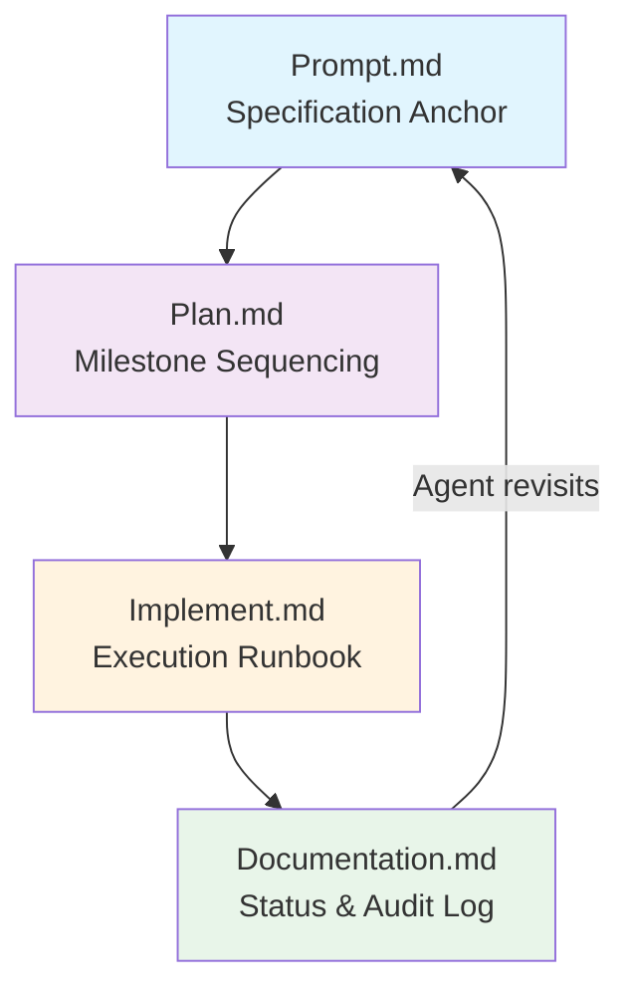
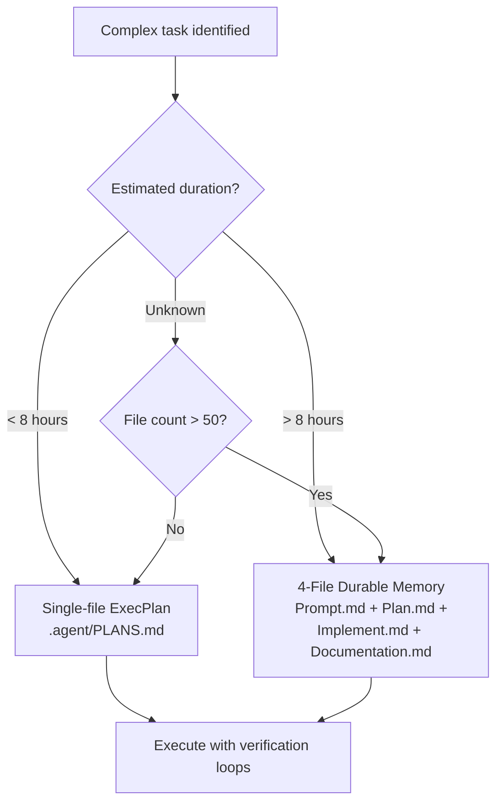
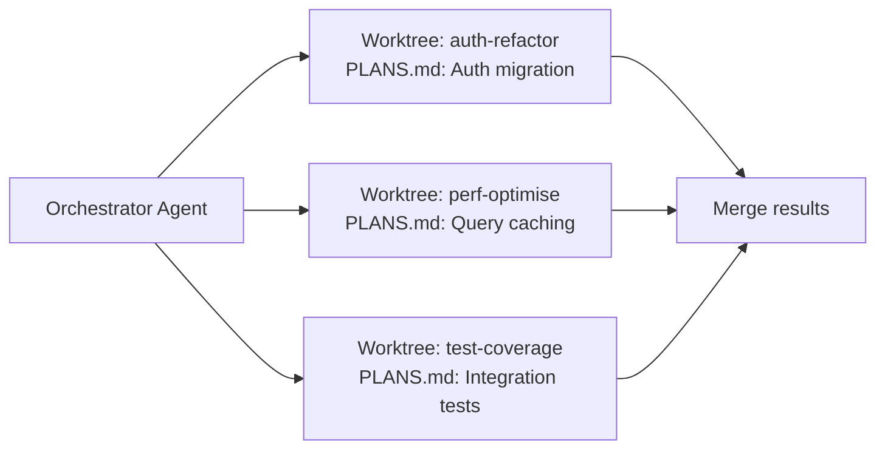

# The ExecPlan Pattern: Structuring 7-Hour Codex Sessions with PLANS.md


---

The single biggest determinant of whether a Codex session completes a complex task or drifts into incoherence is not the model — it is the **planning scaffold**. OpenAI's official ExecPlan pattern, documented in the OpenAI Cookbook by Aaron Friel[^1], has enabled sessions lasting seven hours from a single prompt[^2]. A separate 4-file variant pushed that to 25 hours and ~30,000 lines of generated code[^3]. This article covers both patterns, when to use each, and how to integrate them into agentic pod workflows.

## Why Planning Scaffolds Matter

Without external planning documents, a coding agent relies entirely on its context window to maintain coherence. As sessions extend beyond 30 minutes, three failure modes emerge:

1. **Context drift** — the agent forgets constraints stated early in the conversation
2. **Oscillation** — the agent reverses earlier decisions because the rationale has scrolled out of context
3. **Scope creep** — without an explicit boundary, the agent takes on adjacent work

ExecPlans solve all three by externalising the plan to disk. The agent reads the plan file before each major step, treating it as ground truth rather than relying on chat history[^1]. Alex Embiricos, product lead for Codex at OpenAI, described this as the core insight: "don't jump into coding — make Codex plan first"[^4].

## The Single-File ExecPlan Pattern

### Setup: AGENTS.md Integration

Add the following to your project's `AGENTS.md`:

```markdown
# ExecPlans

When writing complex features or significant refactors, use an ExecPlan
(as described in .agent/PLANS.md) from design to implementation.
```

This gives the model a shorthand term — `ExecPlan` — that triggers structured planning behaviour[^1]. You can also install Friel's dedicated Codex skill by cloning the `.codex/skills/execplans` directory into your project[^5].

### The 12 Required Sections

Every ExecPlan must include these sections[^1]:

| # | Section | Purpose |
|---|---------|---------|
| 1 | **Purpose / Big Picture** | User-visible behaviour gained; how to observe it working |
| 2 | **Progress** | Timestamped checklist reflecting actual current state |
| 3 | **Surprises & Discoveries** | Unexpected behaviours with evidence |
| 4 | **Decision Log** | All decisions with rationale and date/author |
| 5 | **Outcomes & Retrospective** | Summary of achievements, gaps, lessons |
| 6 | **Context and Orientation** | Full-path file names; defined non-obvious terms |
| 7 | **Plan of Work** | Prose sequence of edits with concrete file locations |
| 8 | **Concrete Steps** | Exact commands, working directories, expected output |
| 9 | **Validation and Acceptance** | Observable behaviour verification with specific inputs/outputs |
| 10 | **Idempotence and Recovery** | Safe retry/rollback paths |
| 11 | **Artifacts and Notes** | Key transcripts and diffs as indented examples |
| 12 | **Interfaces and Dependencies** | Prescriptive library/module specs with signatures |

### Non-Negotiable Rules

The Cookbook specifies several hard constraints[^1]:

- **Fully self-contained** — a stateless agent or human novice must be able to read the plan top-to-bottom and produce a working result, with no external references
- **Living document** — updated continuously as work proceeds; every revision maintains self-containment
- **Observable outcomes** — acceptance criteria frame success as "the server returns HTTP 200 with body X", not "the function is implemented correctly"
- **Idempotent steps** — every operation must be safely repeatable after a crash or interruption
- **Prose-first** — reserve checklists for the Progress section; all other sections use narrative prose

### Formatting Constraints

ExecPlans follow strict formatting rules to avoid confusing the model[^1]:

- Single fenced markdown code block (labelled `md`) when embedded in a prompt
- Two newlines after every heading
- No nested triple-backtick fences — use indentation for code examples instead
- Include terminal transcripts and diffs as indented blocks

### Invoking the Pattern

Once configured, invoke ExecPlans with a prompt like:

```
Use the execplans skill. Create an ExecPlan for this migration,
keep it updated while you work, and implement the plan end to end.
```

The agent will create (or refresh) the plan file, work through each section, and update Progress timestamps as milestones complete[^5].

## The 4-File Durable Memory Pattern

For sessions exceeding eight hours or involving extreme complexity, OpenAI's engineering team demonstrated a 4-file variant during a 25-hour autonomous session that produced a complete design tool from a blank repository[^3].

### The Four Files



| File | Role | Key Contents |
|------|------|-------------|
| **Prompt.md** | Immutable specification anchor | Goals, non-goals, hard constraints, "done when" criteria[^3] |
| **Plan.md** | Milestone sequencing | Discrete milestones with acceptance criteria and validation commands[^3] |
| **Implement.md** | Execution runbook | Operational discipline: milestone-by-milestone adherence, scoped diffs, mandatory validation[^3] |
| **Documentation.md** | Status and audit log | Current milestone status, decision rationale, known issues, smoke-test commands[^3] |

### Session Metrics

The 25-hour session achieved[^3]:

- **~13 million tokens** consumed
- **~30,000 lines** of code generated
- **Model**: `gpt-5.3-codex` at "Extra High" reasoning
- **Deliverables**: Canvas editing, live collaboration, prototype mode, threaded comments, multi-format export

The critical enabler was the **verification loop** — after every milestone, the agent ran lint, typecheck, test suites, and build validation before proceeding[^3].

## Choosing Between the Two Patterns



The decision factors[^1][^3]:

| Aspect | Single-File ExecPlan | 4-File Pattern |
|--------|---------------------|----------------|
| **Duration** | Up to ~8 hours | 8–25+ hours |
| **Files affected** | Moderate (< 50) | Large (50+) |
| **Model requirement** | `gpt-5.2-codex` or later | `gpt-5.3-codex` at high reasoning |
| **Setup overhead** | Minimal — one AGENTS.md line | Moderate — four files to template |
| **Best for** | Feature development, refactors | Full-scale migrations, greenfield builds |
| **Token budget** | Not reported | ~13M tokens |

For most daily development work, the single-file ExecPlan is sufficient. Reserve the 4-file pattern for sessions where you expect the agent to run unattended for hours[^3].

## Integrating ExecPlans with Agentic Pods

ExecPlans become particularly powerful in multi-agent configurations.

### Template ExecPlans for Subagents

Create a `.agent/PLANS-TEMPLATE.md` that subagents inherit when spawned:

```toml
# In your orchestrator's AGENTS.md
[subagent.defaults]
planning = ".agent/PLANS-TEMPLATE.md"
```

Each subagent creates its own ExecPlan from the template, giving the orchestrator a standardised format to review[^6].

### Worktree + Plan Pairing

When running parallel agents in Git worktrees, each worktree should maintain its own ExecPlan. This prevents cross-contamination between concurrent tasks:



The orchestrator can read each subagent's PLANS.md to monitor progress without sharing context windows[^4][^6].

### Hook-Based Plan Enforcement

A `PreToolUse` hook can verify that high-impact operations are documented in the active plan before execution:

```bash
#!/bin/bash
# .codex/hooks/pre-tool-use.sh
# Block file deletions not documented in the active ExecPlan

if [[ "$CODEX_TOOL" == "rm" || "$CODEX_TOOL" == "file_delete" ]]; then
    PLAN_FILE=".agent/PLANS.md"
    if [[ -f "$PLAN_FILE" ]]; then
        if ! grep -q "$CODEX_TARGET" "$PLAN_FILE"; then
            echo "BLOCKED: $CODEX_TARGET not documented in ExecPlan"
            exit 1
        fi
    fi
fi
```

This creates a lightweight governance layer — the plan becomes not just a guide but an enforceable contract[^7].

## Practical Tips from the Community

Community adoption of ExecPlans has surfaced several hard-won lessons[^2][^8]:

1. **Start with Progress** — if you're converting an existing session to use ExecPlans mid-flight, write the Progress section first to anchor the agent's understanding of current state

2. **Keep plans under 2,000 words** — overly detailed plans consume context budget that the agent needs for actual code generation

3. **Use `.ai/plans/` for agent-agnostic storage** — Kaushik Gopal recommends this directory structure over `.agent/` for teams using multiple AI tools[^2]:

   ```
   .ai/
   ├── plans/
   │   ├── PLANS.md          # Master template
   │   ├── auth-migration.md # Active plan
   │   └── tmp/              # Gitignored scratch plans
   └── ...
   ```

4. **Gitignore temporary plans** — add `.ai/plans/tmp/` to `.gitignore` for exploratory work; promote plans to the parent directory when they represent committed work

5. **30-minute sessions are normal** — whilst the pattern enables 7+ hour sessions, most practitioners report their sweet spot is 30–60 minutes of focused, plan-guided execution[^2]

## The Sora Case Study

OpenAI used the Plans.md technique internally to build the **Sora Android app in 28 days**[^4]. The technique guided Codex through multi-step architecture and implementation, with each milestone independently reviewable. When approximately 50% of OpenAI staff adopted Codex with planning patterns, they produced roughly 70% more pull requests than non-users[^4] — a productivity gain attributable largely to the coherence that structured planning provides.

## Getting Started

The fastest path to adopting ExecPlans:

1. **Add the AGENTS.md snippet** — two lines, immediate effect
2. **Copy the Codex skill** — clone [friel-openai/plans.md](https://github.com/friel-openai/plans.md) into `.codex/skills/execplans/`[^5]
3. **Run your first plan** — pick a task that would normally take 2–4 hours and prompt: *"Create an ExecPlan for [task], keep it updated, implement end to end"*
4. **Review the living document** — after the session, read the plan to understand what the agent decided and why

The ExecPlan pattern is not about constraining the agent — it is about giving it the same tool that experienced engineers use instinctively: a written plan that survives interruptions, captures decisions, and keeps work focused on observable outcomes.

---

## Citations

[^1]: Aaron Friel, "Using PLANS.md for multi-hour problem solving," OpenAI Cookbook, October 2025. [https://developers.openai.com/cookbook/articles/codex_exec_plans](https://developers.openai.com/cookbook/articles/codex_exec_plans)

[^2]: Kaushik Gopal, "ExecPlans — How to get your coding agent to run for hours," kau.sh, 2026. [https://kau.sh/blog/exec-plans/](https://kau.sh/blog/exec-plans/)

[^3]: OpenAI, "Run long horizon tasks with Codex," OpenAI Developer Blog, February 2026. [https://developers.openai.com/blog/run-long-horizon-tasks-with-codex](https://developers.openai.com/blog/run-long-horizon-tasks-with-codex)

[^4]: Alex Embiricos, "Advanced Codex Workflows," How I AI podcast / Lenny's Newsletter, January 12, 2026. [https://www.lennysnewsletter.com/p/this-week-on-how-i-ai-the-power-users](https://www.lennysnewsletter.com/p/this-week-on-how-i-ai-the-power-users)

[^5]: Aaron Friel, "plans.md — Codex skill for file-backed execution plans," GitHub, 2025–2026. [https://github.com/friel-openai/plans.md](https://github.com/friel-openai/plans.md)

[^6]: OpenAI, "Subagents — Codex," OpenAI Developer Docs, 2026. [https://developers.openai.com/codex/subagents](https://developers.openai.com/codex/subagents)

[^7]: OpenAI Community, "Plans.md file mentioned in the Shipping with Codex talk at Dev Day," OpenAI Developer Forum, 2025. [https://community.openai.com/t/plans-md-file-mentioned-in-the-shipping-with-codex-talk-at-dev-day/1361628](https://community.openai.com/t/plans-md-file-mentioned-in-the-shipping-with-codex-talk-at-dev-day/1361628)

[^8]: ninjaa, "openai-codex-exec-plan," GitHub, 2026. [https://github.com/ninjaa/openai-codex-exec-plan](https://github.com/ninjaa/openai-codex-exec-plan)
