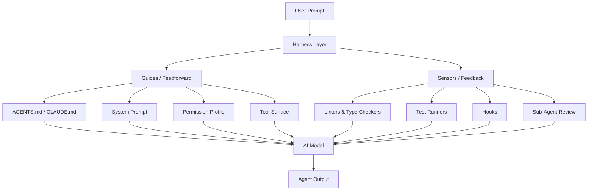
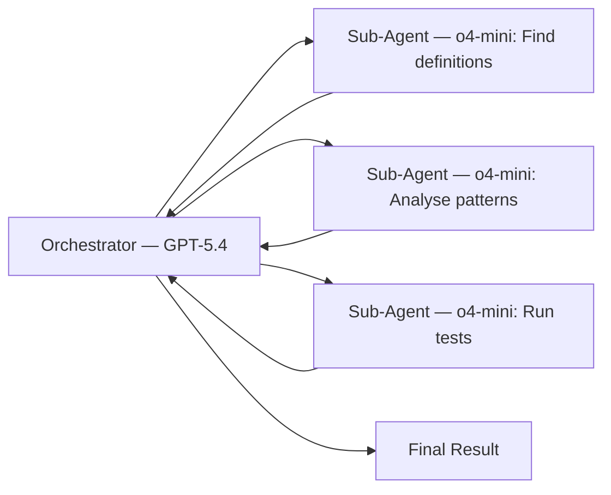

# The Harness Effect: Why the Same Model Scores 16 Points Higher in a Different Tool


---

## The 16-Point Question

Claude Opus running inside Cursor scores 93% on Terminal-Bench 2.0. The same model running inside Claude Code scores 77%[^1]. That is a 16-point differential from harness tuning alone — no model change, no fine-tuning, no prompt engineering on the task itself. The infrastructure surrounding the model shifted the result more than swapping to an entirely different frontier model would have.

This phenomenon — where the agent scaffold, IDE integration, and tooling wrapper determine more of a model's coding performance than the model weights themselves — has gained a name in 2026: the **harness effect**[^2].

Understanding the harness effect is not academic. It is the single highest-leverage optimisation available to engineering teams deploying Codex CLI, Claude Code, or any agentic coding tool today.

## What Is a Harness?

The equation is deceptively simple[^3]:

```
Coding Agent = AI Model + Harness
```

The harness is everything except the model: the system prompt, the file retrieval strategy, the permission model, the tool surface, the memory files (AGENTS.md, CLAUDE.md), hooks, sub-agent topology, and the feedback loops that let the agent verify its own work[^4]. Martin Fowler's taxonomy splits these into two primary mechanisms[^5]:

- **Guides (feedforward controls):** Architecture documentation, coding conventions, bootstrap scripts — anything that steers the agent before it acts.
- **Sensors (feedback controls):** Linters, type checkers, test runners, code review passes — anything that observes after the agent acts and enables self-correction.



## The Benchmark Evidence

Three independent benchmarks in early 2026 quantify the harness effect:

### Terminal-Bench 2.0

Pawel Jozefiak's six-tool comparison tested Claude Code, Codex CLI, Cursor, Aider, OpenCode, and Pi against the same multi-step agentic tasks[^1]. Key scores:

| Tool | Model | Score | Notes |
|------|-------|-------|-------|
| Claude Code ("Mythos" config) | Claude Opus | 92.1% | Full harness optimisation |
| Cursor | Claude Opus | 93% | IDE-integrated harness |
| Claude Code (default) | Claude Opus | 77% | Minimal harness tuning |
| Codex CLI | GPT-5.4 | 77.3% | Strong on focused tasks |

The same model (Opus) swings 16 points depending on which harness wraps it. The "Mythos" configuration — a community-tuned CLAUDE.md with specific architectural guidance — closes most of that gap[^1].

### CORE-Bench

Opus ranged from 42% on a minimal scaffold to 78% on the full Claude Code harness — a 36-point swing driven entirely by harness engineering[^1].

### SWE-bench Pro

The cleaner 2026 successor to SWE-bench Verified showed Claude Code at 80.8% versus Codex CLI at 56.8%[^1]. However, Codex CLI achieves this with roughly 3–4× fewer tokens, making the cost-per-resolved-issue calculation far more nuanced than the headline score suggests.

## Why Codex CLI's Harness Matters Differently

Jozefiak's analysis surfaced a critical finding: Codex CLI handles individual steps cleanly but loses coherence on multi-step chains beyond step three or four[^1]. This is not a model limitation — it is a harness characteristic.

Codex CLI's harness is optimised for:

- **Token efficiency:** 3–4× fewer tokens than Claude Code for equivalent tasks[^1]
- **Focused execution:** Excellent at single-purpose, well-scoped tasks
- **Cloud continuation:** Sessions persist without an open terminal
- **Cost management:** Dramatically lower per-task expenditure

Where it needs harness investment:

- **Multi-step coherence:** The agent loop does not maintain narrative context as aggressively as Claude Code's harness
- **Project memory:** AGENTS.md support exists but requires more explicit structure than CLAUDE.md's richer injection pipeline
- **Feedback density:** Fewer built-in verification passes between steps

The practical implication: teams using Codex CLI benefit disproportionately from harness engineering because the default harness leaves more performance on the table.

## The Capability Overprovisioning Problem

The Aethelgard paper (Sidik & Rokach, April 2026) quantifies a related harness failure: agents receive a **15× overprovision ratio** of capabilities by default[^6]. A summarisation task gets the same shell execution, sub-agent spawning, and credential-access capabilities as a code deployment task.

Their four-layer framework addresses this:

1. **Capability Governor** — dynamically restricts tool visibility per session
2. **RL Learning Policy** — trains on audit logs to learn minimum viable skill sets per task type
3. **Safety Router** — intercepts every tool call before execution using a hybrid rule-based and fine-tuned classifier
4. **Audit Layer** — logs all decisions for continuous policy improvement

On a live deployment with DeepSeek-chat, Aethelgard achieved 73% tool reduction and 100% dangerous-tool elimination for summarisation tasks, with 26.2% of all intercepted tool calls blocked[^6].

The lesson for Codex CLI users: exposing fewer tools to the agent improves both safety and performance. The HumanLayer team confirmed this empirically — too many MCP tools creates what they call "the dumb zone," where the model spends tokens reasoning about irrelevant capabilities rather than solving the task[^3].

## Practical Harness Engineering for Codex CLI

### 1. Craft AGENTS.md with Discipline

An ETH Zurich study found that human-written AGENTS.md files improved performance by approximately 4%, while LLM-generated ones hurt performance by over 20%[^3]. Keep it under 60 lines, manually crafted, and focused on universally applicable guidance:

```markdown
# AGENTS.md

## Architecture
This is a TypeScript monorepo using Turborepo.
Packages: api (Express), web (Next.js), shared (types + utils).

## Conventions
- All new code must have tests in __tests__/ adjacent to source
- Use zod for runtime validation at API boundaries
- Never import from web in api or vice versa

## File Map
- packages/api/src/routes/ — API endpoint handlers
- packages/web/src/app/ — Next.js app router pages
- packages/shared/src/types/ — Shared TypeScript interfaces
```

### 2. Tighten the Permission Profile

Start with the tightest approval mode and loosen only when confident[^7]:

```bash
# Start restrictive
codex --approval-mode on-request

# Only escalate for trusted, well-tested repos
codex --approval-mode never
```

### 3. Add Feedback Hooks

Hooks are more reliable than AGENTS.md instructions for enforcement[^3]. A pre-commit hook that runs fast checks gives the agent a self-correction loop:

```toml
# codex.toml — hook configuration
[hooks.pre-commit]
command = "npm run typecheck && npm run lint"
silent_on_success = true
```

The principle: swallow success output, surface only errors. This keeps the context window clean whilst giving the agent a back-pressure signal[^3].

### 4. Scope MCP Tool Surfaces

Prefer CLIs already in the model's training data (gh, docker, psql) over bespoke MCP servers[^3]. If you must use MCP, limit the connected servers to those relevant to the current task:

```bash
# Good: scoped tool surface
codex --mcp-servers github,jira

# Bad: kitchen-sink approach
codex --mcp-servers github,jira,slack,confluence,datadog,sentry,linear
```

### 5. Use Sub-Agents as Context Firewalls

Sub-agents prevent intermediate tool calls from polluting the parent context[^3]. Use expensive models for orchestration and cheaper models for scoped sub-tasks:



### 6. Benchmark Your Own Harness

Do not rely on public benchmarks. Create a private evaluation set from your team's actual resolved issues[^8]:

```bash
# Extract 20 recent closed issues as evaluation cases
gh issue list --state closed --limit 20 --json number,title,body > eval_cases.json

# Run each through Codex CLI and measure resolution rate
for issue in $(jq -r '.[].number' eval_cases.json); do
  codex exec "Resolve issue #$issue based on its description" \
    --timeout 300 \
    2>&1 | tee "results/issue_${issue}.log"
done
```

## The Emerging Discipline

Harness engineering is becoming a first-class engineering discipline. Martin Fowler has published a taxonomy[^5]. LangChain has formalised the anatomy of an agent harness[^9]. Software Mansion has integrated harness engineering into their agentic engineering guide[^10]. The HumanLayer team reports that harness optimisation delivers more consistent improvements than model upgrades[^3].

The harness effect means that choosing between Codex CLI and Claude Code is not primarily a model decision — it is a harness decision. Codex CLI's token efficiency makes it the better foundation for cost-conscious teams willing to invest in harness engineering. Claude Code's richer default harness makes it the better choice for teams who want strong autonomous performance with less configuration effort.

The 16-point gap is not fixed. It is the space where your engineering effort goes.

---

## Citations

[^1]: Jozefiak, P. (2026, April 15). "Claude Code vs Codex CLI vs Aider vs OpenCode vs Pi vs Cursor: Which AI Coding Harness Actually Works Without You?" *Digital Thoughts*. [https://thoughts.jock.pl/p/ai-coding-harness-agents-2026](https://thoughts.jock.pl/p/ai-coding-harness-agents-2026)

[^2]: "What Is Harness Engineering? Complete Guide for AI Agent Development (2026)." *NxCode*. [https://www.nxcode.io/resources/news/what-is-harness-engineering-complete-guide-2026](https://www.nxcode.io/resources/news/what-is-harness-engineering-complete-guide-2026)

[^3]: "Skill Issue: Harness Engineering for Coding Agents." *HumanLayer Blog*. [https://www.humanlayer.dev/blog/skill-issue-harness-engineering-for-coding-agents](https://www.humanlayer.dev/blog/skill-issue-harness-engineering-for-coding-agents)

[^4]: "The Anatomy of an Agent Harness." *LangChain Blog*. [https://blog.langchain.com/the-anatomy-of-an-agent-harness/](https://blog.langchain.com/the-anatomy-of-an-agent-harness/)

[^5]: Fowler, M. (2026). "Harness Engineering for Coding Agent Users." *martinfowler.com*. [https://martinfowler.com/articles/harness-engineering.html](https://martinfowler.com/articles/harness-engineering.html)

[^6]: Sidik, B. & Rokach, L. (2026, April 12). "Beyond Static Sandboxing: Learned Capability Governance for Autonomous AI Agents." *arXiv:2604.11839*. [https://arxiv.org/abs/2604.11839](https://arxiv.org/abs/2604.11839)

[^7]: "Best Practices — Codex CLI." *OpenAI Developers*. [https://developers.openai.com/codex/learn/best-practices](https://developers.openai.com/codex/learn/best-practices)

[^8]: "Advanced Configuration — Codex." *OpenAI Developers*. [https://developers.openai.com/codex/config-advanced](https://developers.openai.com/codex/config-advanced)

[^9]: "Harness Capabilities." *LangChain Docs*. [https://docs.langchain.com/oss/python/deepagents/harness](https://docs.langchain.com/oss/python/deepagents/harness)

[^10]: "Harness Engineering." *Software Mansion Agentic Engineering Guide*. [https://agentic-engineering.swmansion.com/becoming-productive/harness-engineering/](https://agentic-engineering.swmansion.com/becoming-productive/harness-engineering/)
