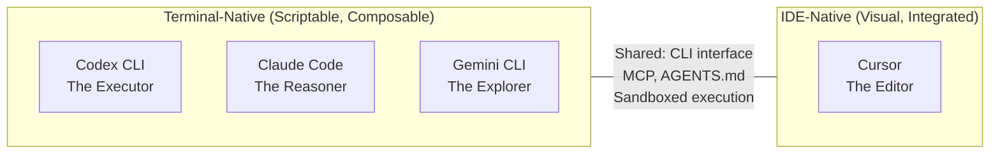
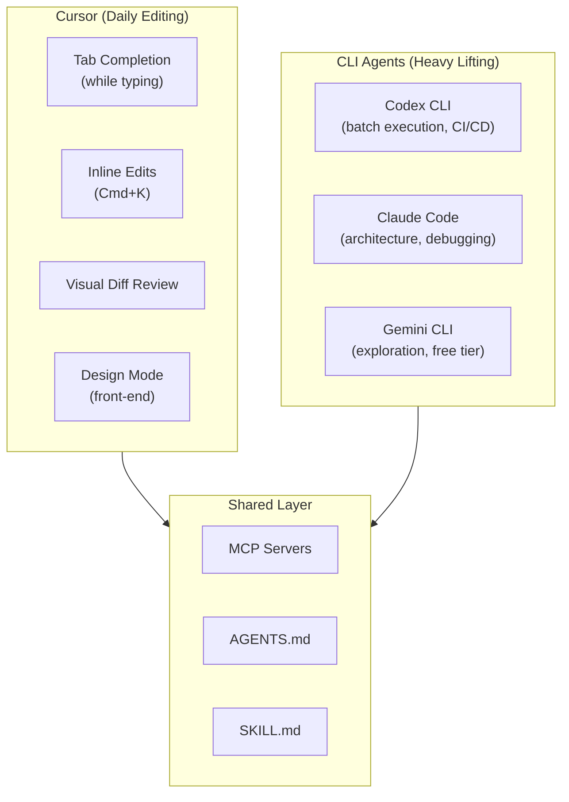

# Three Terminals Meet the Editor: Codex CLI vs Claude Code vs Gemini CLI vs Cursor

The premise of [Three Terminals, Three Fates](../premium-articles/09-three-terminals-three-fates.md) was simple: the three major AI labs each ship a terminal-native coding agent, and your choice between them shapes your development workflow. But there is a fourth contender that rejects the terminal premise entirely.

Cursor is not a terminal agent. It is an AI-native IDE — a fork of VS Code rebuilt around the assumption that the best coding agent is one embedded in a full visual editor with inline diffs, tab predictions, and a file tree. As of April 2026, Cursor 3 ships parallel cloud agents, a visual design mode, and an agent window that manages local, cloud, and SSH agents simultaneously.

This article compares all four tools across two dimensions: **what they can do** (functionality) and **how you can shape them** (customisation). The three terminals share more DNA with each other than any of them shares with Cursor — but Cursor fills gaps that no terminal agent addresses.

## The Philosophical Split

The three CLI agents agree on a fundamental point: the terminal is the right interface for AI-assisted coding. Code goes in, code comes out, everything is scriptable and composable. They disagree on *personality* — Codex CLI is the executor, Claude Code is the reasoner, Gemini CLI is the explorer — but they share the same interface paradigm.

Cursor makes the opposite bet: the IDE is the right interface. Most developers already live in VS Code. Rather than asking them to context-switch to a terminal, embed the AI directly where they work. Tab completions predict your next edit. Inline diffs show changes before you accept them. The agent writes code in the same panes where you read it.



Neither side is wrong. The question is which trade-offs matter for your workflow.

## Functionality Comparison

### Core Capabilities

| Feature | Codex CLI | Claude Code | Gemini CLI | Cursor |
|---------|-----------|-------------|------------|--------|
| **Interface** | Terminal | Terminal | Terminal | VS Code fork (GUI) |
| **Underlying models** | GPT-5.4 / GPT-5.3-Codex | Claude Opus 4.7 / Sonnet 4.6 | Gemini 3 Pro / Flash | Multi-model (GPT-5.4, Claude Opus 4.6, Gemini 3 Pro, Grok, proprietary Composer) |
| **Context window** | 1M (opt-in; default 272K) | 1M (GA for Max/Team/Enterprise) | 1M (default) | 200K advertised (~70-120K usable after truncation) |
| **Open source** | Yes (Apache 2.0) | No | Yes (Apache 2.0) | No (proprietary, VS Code fork) |
| **Tab completion** | No | No | No | Yes (Cursor Tab — proprietary model) |
| **Inline editing** | No | No | No | Yes (Cmd+K, visual diffs) |
| **Multi-model switching** | No (OpenAI only) | No (Anthropic only) | No (Google only) | Yes (switch mid-session) |
| **MCP support** | Yes | Yes | Yes | Yes (5,000+ marketplace servers) |
| **AGENTS.md** | Native | Via fallback | Native | Supported |
| **Multimodal input** | Text only | Text, images | Text, images, PDFs, video | Text, images (paste/drag) |

The first thing that jumps out: **Cursor is the only tool that supports multiple model providers natively.** The three CLI agents are each locked to their parent company's models. Cursor lets you switch between GPT-5.4, Claude Opus 4.6, Gemini 3 Pro, and its own proprietary Composer model within a single session. For a developer who wants the best model for each sub-task without switching tools, this is a genuine advantage.

The second: **Cursor is the only tool with tab completion.** The CLI agents do not predict your next edit as you type. They respond to prompts. Cursor Tab runs a specialised model that watches your edits and predicts multi-line completions in real time. This is a different category of assistance — it augments typing rather than replacing it.

The third: **context window size favours the CLI agents.** Gemini CLI ships with 1M tokens by default. Claude Code and Codex CLI offer 1M at higher tiers. Cursor advertises 200K but community testing suggests 70-120K is usable after internal truncation. For large codebase analysis, the terminal agents have a clear advantage.

### Agent and Automation Capabilities

| Feature | Codex CLI | Claude Code | Gemini CLI | Cursor |
|---------|-----------|-------------|------------|--------|
| **Background/cloud agents** | Codex Cloud | Managed Agents + Routines (April 2026) | No | Cloud Agents (GA, up to 8 parallel) |
| **Parallel agents** | Subagents (TOML-defined) | Agent Teams (peer-to-peer) | `@agent` syntax (GA April 2026) | Agents Window (tiled layout, Cursor 3) |
| **CI/CD mode** | `codex exec` (first-class) | `claude -p` (headless) | `gemini -p` (headless) | No native CI/CD mode |
| **Headless execution** | Yes | Yes | Yes | No (requires GUI) |
| **Subagent architecture** | TOML-defined, parallel | Task tool, teams | 3 built-in + custom Markdown agents | Cloud agents with full desktop environments |
| **Design mode** | No | No | No | Yes (UI annotation via browser) |
| **Automations** | Via hooks | Via hooks | Via hooks | Webhook/CI-triggered (April 2026) |

This is where the philosophical split creates real trade-offs:

**CI/CD and scripting:** The CLI agents win decisively. `codex exec`, `claude -p`, and `gemini -p` all run headlessly in pipelines. Cursor requires a GUI — you cannot run it in a GitHub Actions workflow or a Docker container without significant workarounds.

**Visual feedback:** Cursor wins decisively. Its Design Mode (Cursor 3) lets you annotate a browser-rendered UI and the agent sees your visual annotations. None of the CLI agents can do this.

**Cloud agents:** Both Cursor and Codex CLI offer mature cloud agent capabilities. Cursor's cloud agents are notable for giving each agent a full desktop environment with browser — useful for front-end work where the agent needs to see what it built. Codex Cloud focuses on sandboxed code execution. Claude Code's Managed Agents and Routines (launched April 2026) are newer but closing the gap.

### Security and Sandboxing

| Dimension | Codex CLI | Claude Code | Gemini CLI | Cursor |
|-----------|-----------|-------------|------------|--------|
| **Isolation mechanism** | OS kernel (Seatbelt, Landlock, seccomp) | Application-layer hooks (21 events) | OS kernel + Docker/gVisor/LXC options | Application-layer approval + sandbox (Seatbelt/Landlock/seccomp) |
| **Network access** | Disabled by default | Configurable via hooks | Configurable per sandbox profile | Approval-gated |
| **Sandbox enabled by default** | Yes | Hooks require setup | No (opt-in via `-s` flag) | Yes (GA, agents stop 40% less often) |
| **Self-hostable** | Yes (Apache 2.0) | No | Yes (Apache 2.0) | No |
| **`.cursorignore` / file exclusion** | Via sandbox policy | Via hooks | Via sandbox profiles | `.cursorignore` (files invisible to AI) |

Cursor added OS-level sandboxing in early 2026 — Seatbelt on macOS, Landlock + seccomp on Linux, WSL2-based on Windows. This narrows the gap with Codex CLI and Gemini CLI. However, Cursor's sandbox is focused on the agent's terminal commands; the IDE itself has full filesystem access. The CLI agents' sandbox applies to the entire execution environment.

Cursor's `.cursorignore` is a useful addition that the CLI agents lack in the same form. Files listed in `.cursorignore` are completely invisible to the AI — not just excluded from edits, but excluded from reading and codebase indexing. For repositories with sensitive configuration files, credentials, or proprietary code sections, this is a clean solution.

## Customisation Comparison

This is where the tools diverge most sharply. Customisation determines how well each tool adapts to your codebase, your team's conventions, and your preferred workflow.

### Project Instructions

| Feature | Codex CLI | Claude Code | Gemini CLI | Cursor |
|---------|-----------|-------------|------------|--------|
| **Project file** | AGENTS.md | CLAUDE.md (5-layer hierarchy) | GEMINI.md (configurable to read AGENTS.md) | `.cursor/rules/*.mdc` or `.cursorrules` (legacy) |
| **Hierarchical scoping** | Root-to-leaf, deeper overrides | Project + user level | Project > extension > global | File-glob scoping via MDC frontmatter |
| **Cross-tool portability** | AGENTS.md: 60,000+ repos, 25+ tools | CLAUDE.md: Claude-specific | GEMINI.md: Gemini-specific | `.cursorrules`: Cursor-specific; also reads AGENTS.md |
| **Global rules** | Config-level instructions | User-level CLAUDE.md | User-level GEMINI.md | Settings > "Rules for AI" |
| **Team-managed rules** | Via repo | Via repo | Via repo | Dashboard-managed (Teams/Enterprise) |

Cursor's rule system is the most granular at the file level. MDC (Markdown with Context) files in `.cursor/rules/` support YAML frontmatter with `description`, `alwaysApply`, and `globs` properties:

```yaml
---
description: "React component conventions"
globs: "src/components/**/*.tsx"
alwaysApply: false
---

Use functional components with hooks.
Export named components, not default exports.
Co-locate tests in __tests__ subdirectories.
```

This means you can have different rules for your React components, your API routes, your test files, and your infrastructure code — all activated automatically based on which files the agent is working with. The CLI agents' hierarchical systems (deeper AGENTS.md files override shallower ones) achieve something similar but with directory-based rather than glob-based scoping.

The portability advantage goes to the CLI agents. AGENTS.md is an open standard supported by 25+ tools and present in 60,000+ repos. `.cursorrules` files only work in Cursor.

### Model and Provider Configuration

| Feature | Codex CLI | Claude Code | Gemini CLI | Cursor |
|---------|-----------|-------------|------------|--------|
| **Model selection** | Config or CLI flag | Config or CLI flag | Config or CLI flag | Per-feature dropdown (chat, agent, tab) |
| **Per-model system prompts** | Yes (separate `.md` per model generation) | No | No | No |
| **BYOK (Bring Your Own Key)** | N/A (uses OpenAI account) | N/A (uses Anthropic account) | N/A (uses Google account) | Partially deprecated — works for chat, not for Agent/Edit |
| **Custom provider endpoints** | Yes (`model_providers` in config.toml) | No | No | Yes (OpenAI, Anthropic, Google, Azure, Bedrock) |
| **Local model support** | Yes (Ollama, llama.cpp via `model_providers`) | No | No | Limited (via BYOK API key to local endpoint) |

Codex CLI's local model support is significantly more mature than Cursor's. You can configure multiple model providers in `config.toml` with profile switching:

```toml
[model_providers.gb10]
name = "GB10 Ollama"
base_url = "http://localhost:11434/v1"
wire_api = "responses"

[profiles.local-gemma]
model = "gemma4:31b"
model_provider = "gb10"
model_instructions_file = "~/prompts/minimal-codex.md"
```

Codex CLI is also unique in shipping **per-model system prompts** — separate instruction files optimised for each model generation. Compact variants for fine-tuned models save roughly two-thirds of the prompt text by not re-explaining tools the model already understands. The `model_instructions_file` config key lets you replace the system prompt entirely for local models, reducing overhead from ~8,500 to ~3,000 tokens.

Cursor's BYOK situation is complicated. It was announced for partial deprecation in late 2025. Agent and Edit features use Cursor's custom models and cannot route to external keys. Chat completions for standard models may still work with BYOK. This limits Cursor's flexibility for teams that want to control their model infrastructure.

### Hooks and Programmable Governance

| Feature | Codex CLI | Claude Code | Gemini CLI | Cursor |
|---------|-----------|-------------|------------|--------|
| **Hook events** | 5 (SessionStart, Stop, UserPromptSubmit, PreToolUse, PostToolUse) | 21 lifecycle events | 10+ (BeforeTool, AfterTool, BeforeAgent, AfterAgent, BeforeModel, AfterModel, etc.) | No hook system |
| **Pre-execution validation** | PreToolUse (Bash only) | PreToolUse (all tools) | BeforeTool (all tools) | Approval prompts only |
| **Post-execution audit** | PostToolUse (Bash only) | PostToolUse (all tools) | AfterTool + AfterAgent | No |
| **Custom tool creation** | Via MCP servers | Via MCP servers | Via MCP servers + custom agents | Via MCP servers + VS Code extensions |

**Cursor has no hook system.** This is the single largest customisation gap between Cursor and the CLI agents. Hooks let enterprise teams enforce policies programmatically — blocking destructive commands, logging every file write, requiring approval for network access, validating outputs against schema. Without hooks, Cursor's governance is limited to manual approval prompts and sandbox policies.

For Stage 3 and Stage 4 teams in Daniel's adoption model — where agents run with minimal oversight and governance must be automated — the absence of hooks is a significant limitation.

### Context and Memory

| Feature | Codex CLI | Claude Code | Gemini CLI | Cursor |
|---------|-----------|-------------|------------|--------|
| **Codebase indexing** | No (reads files on demand) | No (reads files on demand) | No (reads files on demand) | Yes (embedding-based semantic search) |
| **`@` context references** | No | No | No | Yes (`@file`, `@codebase`, `@web`, `@docs`, `@git`, `@notepad`) |
| **Documentation indexing** | No | No | No | Yes (`@docs` with custom URLs) |
| **Memory system** | Yes (create, consolidate, clean, delete — GA April 2026) | `/memory` command | Gemini memory | Notepads (persistent text documents) |
| **Context compaction** | Automatic summarisation | Automatic summarisation | Automatic summarisation | Automatic summarisation |

Cursor's **codebase indexing** is a standout feature that no CLI agent replicates. When you type `@codebase` in Cursor, it runs a semantic search across your entire project using pre-computed embeddings. The CLI agents read files on demand — they can search with grep and glob, but they do not maintain a persistent semantic index.

The `@docs` feature is equally distinctive. Point Cursor at a documentation URL (React docs, your internal API docs, a framework guide) and it indexes the content for reference in conversations. None of the CLI agents offer this.

Cursor's **Notepads** serve a similar role to AGENTS.md sections but are managed through the Cursor UI rather than as files in the repository. You can reference them with `@notepad/name` in any conversation. This is convenient for personal context but not portable — Notepads do not live in version control.

## The Pricing Reality

| Tier | Codex CLI | Claude Code | Gemini CLI | Cursor |
|------|-----------|-------------|------------|--------|
| **Free** | — | — | 1,000 req/day | Hobby (limited) |
| **$20/mo** | Plus | Pro | Gemini Advanced | Pro |
| **$60/mo** | — | — | — | Pro+ (3x credits) |
| **$100/mo** | Pro 5x | Max 5x | — | — |
| **$200/mo** | Pro 20x | Max 20x | — | Ultra (20x usage) |
| **Team** | Enterprise (custom) | $150/user/mo (Max plan) | Via Google Workspace | $40/user/mo |
| **Billing model** | Subscription + API overflow | Subscription + API overflow | Free tier + API pay-as-you-go | Credit-based (monthly pool) |

Cursor's pricing is competitive at the individual level — $20/mo Pro matches the CLI agents' entry tiers. But the credit-based billing model (introduced June 2025) means your monthly allowance depletes based on which model you use. Heavy use of Claude Opus 4.6 through Cursor burns credits faster than using Claude Sonnet.

For teams, Cursor at $40/user/mo is significantly cheaper than Claude Code's Team/Max pricing at $150/user/mo, but more expensive than the Codex Plus + Gemini Free combination at $20/user/mo.

## When Cursor Wins

Cursor is the right choice when:

1. **Your team lives in VS Code.** The migration cost from VS Code to Cursor is near zero — your extensions, keybindings, and settings carry over. The migration cost from VS Code to a terminal agent is a workflow paradigm shift.

2. **You need tab completion.** If predictive inline editing is a core part of your workflow, no CLI agent offers this. Cursor Tab is genuinely useful and has no terminal equivalent.

3. **You want multi-model flexibility without switching tools.** Need Claude for reasoning, GPT for execution, Gemini for exploration — all in one window? Cursor is the only single tool that does this.

4. **Visual diff review matters.** Cursor shows changes as inline diffs in the editor. CLI agents show changes as text output. For reviewing complex multi-file edits, the visual presentation is faster to parse.

5. **Design Mode is relevant.** If you do front-end work and want to annotate a rendered UI for the agent to see, Cursor's Design Mode is unique.

6. **You need codebase-wide semantic search.** The `@codebase` embedding index finds semantically related code that grep would miss. CLI agents have no equivalent.

## When the CLI Agents Win

The terminal agents are the right choice when:

1. **CI/CD integration is required.** `codex exec`, `claude -p`, and `gemini -p` run headlessly in pipelines. Cursor cannot.

2. **Programmable governance is non-negotiable.** Hooks give you pre-execution validation, post-execution audit, and automated policy enforcement. Cursor has no hook system.

3. **Context window size matters.** 1M tokens (CLI agents) vs ~70-120K usable (Cursor). For large codebase analysis or long sessions, the CLI agents have 8-14x more working memory.

4. **Local model support is needed.** Codex CLI's `model_providers` configuration with profile switching and custom system prompts is mature. Cursor's local model support is limited.

5. **Self-hosting or auditability is required.** Codex CLI and Gemini CLI are Apache 2.0 open source. Cursor is proprietary.

6. **You are building agentic infrastructure.** The CLI agents are composable building blocks — pipe them together, wrap them in scripts, orchestrate them with tools like NanoClaw or `ccb`. Cursor is a monolithic application.

7. **Token efficiency matters.** Codex CLI uses roughly 4x fewer tokens than Claude Code for comparable tasks. Cursor's token consumption data is limited, but IDE overhead (codebase indexing queries, context assembly) adds to the total.

## The Hybrid Pattern

The most productive setup may be running both:



Use Cursor for the moment-to-moment editing — tab completions, inline changes, visual review. Switch to the terminal for heavy-lifting agent tasks — batch refactoring with Codex, architectural reasoning with Claude Code, codebase exploration with Gemini CLI. The shared MCP servers, AGENTS.md files, and skills work across all four tools.

This is not hypothetical. Community analysis suggests that many of the most productive developers already use Cursor alongside a CLI agent, typically Claude Code. The IDE handles the 80% of work that benefits from visual feedback. The terminal handles the 20% that benefits from deep context, scriptability, and governance.

## The Verdict

Cursor and the CLI agents are not competing for the same niche. They are competing for different phases of the development workflow:

| Phase | Best Tool | Why |
|-------|-----------|-----|
| **Typing code** | Cursor | Tab completion, inline predictions |
| **Small edits** | Cursor | Cmd+K, visual inline diffs |
| **Exploring unfamiliar code** | Gemini CLI or Cursor | Gemini: 1M context, free. Cursor: `@codebase` semantic search |
| **Architectural reasoning** | Claude Code | Deepest reasoning, largest effective context |
| **Batch execution** | Codex CLI | Token efficient, kernel sandbox, subagent parallelism |
| **CI/CD pipelines** | Codex CLI or Gemini CLI | Headless execution, scriptable |
| **Front-end design iteration** | Cursor | Design Mode, visual browser annotation |
| **Enterprise governance** | Claude Code or Codex CLI | Hooks, audit logging, self-hosting |
| **Cost-constrained exploration** | Gemini CLI | 1,000 free requests/day |
| **Running local models** | Codex CLI | Mature provider config, custom system prompts, profile switching |

The three terminals and the editor are not three fates plus one. They are four tools for four different moments in a developer's day. The convergence thesis from Article 09 still holds — MCP, AGENTS.md, and the four core tools (Read, Search, Edit, Execute) are becoming universal infrastructure. But Cursor adds capabilities that no terminal can replicate (tab completion, semantic indexing, visual diffs), just as the terminals add capabilities that no IDE can replicate (headless CI/CD, programmable hooks, 1M-token context, full scriptability).

Invest in the shared layer. Use the right tool for the moment. The editor and the terminal are not rivals — they are complements.

---

*This article extends the analysis from [Three Terminals, Three Fates](../premium-articles/09-three-terminals-three-fates.md) (premium article 09 in the From Experiment to Enterprise series). For system prompt architecture details across the CLI agents and Pi, see [The DNA of Coding Agents](2026-04-19-system-prompts-compared-codex-gemini-claude-code.md).*

---

[^1]: Cursor Changelog, "Cursor 3.0," April 2, 2026. Agents Window, Design Mode, Agent Tabs. https://cursor.com/changelog/3-0
[^2]: Cursor Changelog, "Cursor 3.1," April 13, 2026. Tiled multi-agent layout, upgraded voice input, 87% fewer dropped frames. https://cursor.com/changelog
[^3]: Cursor Blog, "Agent Sandboxing," 2026. Seatbelt (macOS), Landlock + seccomp (Linux), WSL2 (Windows). Sandboxed agents stop 40% less often. https://cursor.com/blog/agent-sandboxing
[^4]: Cursor Changelog, "Cloud Agents + Computer Use," February 24, 2026. Each agent gets full desktop environment with browser. https://cursor.com/changelog
[^5]: Cursor Changelog, "Self-hosted Cloud Agents," March 25, 2026. Code and tool execution stay on customer infrastructure. https://cursor.com/changelog
[^6]: Cursor Rules documentation. `.cursor/rules/*.mdc` format with `description`, `alwaysApply`, `globs` frontmatter. https://cursor.com/docs/context/rules
[^7]: DEV Community, "AI Coding Tools Comparison 2026: Claude Code vs Cursor vs Gemini CLI vs Codex," 2026. https://dev.to/gonewx/ai-coding-tools-comparison-2026-claude-code-vs-cursor-vs-gemini-cli-vs-codex-4aai
[^8]: NxCode, "Codex vs Cursor vs Claude Code 2026." https://www.nxcode.io/resources/news/codex-vs-cursor-vs-claude-code-2026
[^9]: Cursor pricing breakdown via Vantage, 2026. Credit-based billing, tier comparison. https://www.vantage.sh/blog/cursor-pricing-explained
[^10]: Cursor MCP documentation. 5,000+ community-built MCP servers, Marketplace for one-click installation. https://cursor.com/docs/mcp
[^11]: Premium article 09, "Three Terminals, Three Fates," for CLI agent feature matrix, benchmarks, and convergence analysis. System prompt comparison data from "The DNA of Coding Agents" article.
