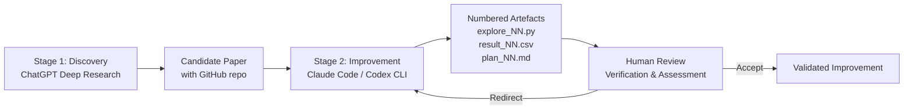
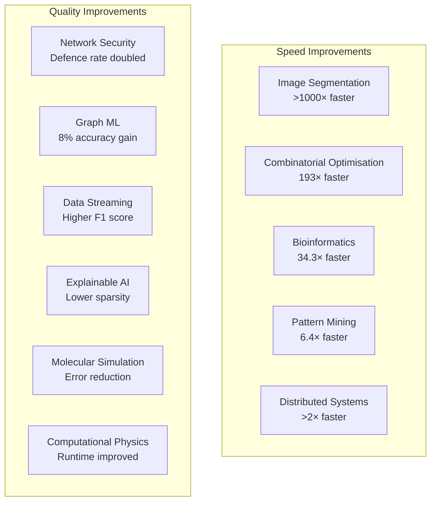

# Using Codex CLI to Improve Published Algorithms: A Two-Stage Pipeline


---

A recent paper by Suwannik (April 2026) demonstrates something that should give every research-oriented developer pause: an agentic coding tool, given a published algorithm implementation and a structured prompt, improved performance across all eleven computational domains tested — with gains ranging from 8% accuracy improvements to over 1000× speedups[^1]. Each improvement was achieved within a single working day.

This article walks through the two-stage pipeline described in the paper, translates it into practical Codex CLI and Claude Code commands you can run today, and examines the irreplaceable human roles that make the difference between a useful experiment and a misleading one.

## The Two-Stage Pipeline

The pipeline separates *discovery* from *improvement*, using different tools for each stage[^1].



### Stage 1: Discovery with Deep Research

The first stage uses a large language model with research capabilities to identify candidate papers. The selection criteria are deliberately strict[^1]:

- **Recency**: Published post-2021 in Q1/Q2 journals
- **Reproducibility**: GitHub implementation publicly available
- **Tractability**: Execution time under 30 seconds on commodity hardware
- **Datasets**: Publicly available benchmark data

This filtering matters. Agentic tools excel at iterative refinement but struggle with problems requiring novel insight or access to proprietary data. The criteria ensure the agent has everything it needs to run, measure, and iterate autonomously.

In practice, you can replicate this stage with any research-capable LLM. The key output is a structured brief: the paper's core algorithm, its reported baseline metrics, the repository URL, and the dataset locations.

### Stage 2: Iterative Improvement with Claude Code

The improvement stage follows a structured loop. The agent receives a prompt containing the baseline implementation, the reported metrics, and instructions to iterate up to 20 times[^1]. Each iteration produces three numbered artefacts:

| Artefact | Purpose |
|----------|---------|
| `explore_NN.py` | The modified implementation for iteration NN |
| `result_NN.csv` | Benchmark results from that iteration |
| `plan_NN.md` | Hypothesis for the next iteration, informed by current results |

This numbered artefact pattern is the pipeline's most transferable idea. It transforms an opaque agent session into an auditable trail of hypotheses and outcomes.

## Translating the Pipeline to Codex CLI

Whilst the original paper used Claude Code (versions Sonnet 4.6, Opus 4.6, and Code 2.1.96)[^1], the same pattern works with Codex CLI. Here is how to set it up.

### Project Structure

```bash
mkdir algorithm-improvement && cd algorithm-improvement
git clone <target-repo-url> original/
mkdir iterations/
```

### The AGENTS.md Configuration

Create an `AGENTS.md` file that encodes the iterative improvement protocol. This compensates for the navigation weaknesses that recent benchmarks have identified as the dominant failure mode for coding agents[^2].

```markdown
# Algorithm Improvement Agent

## Project Structure
- `original/` — Unmodified baseline implementation (DO NOT MODIFY)
- `iterations/` — All improvement artefacts go here
- `iterations/explore_NN.py` — Implementation for iteration NN
- `iterations/result_NN.csv` — Benchmark results for iteration NN
- `iterations/plan_NN.md` — Hypothesis and plan for iteration NN+1

## Protocol
1. Run the baseline implementation and record results as `iterations/result_00.csv`
2. Analyse results and write `iterations/plan_01.md` with your improvement hypothesis
3. Implement the hypothesis as `iterations/explore_01.py`
4. Run and record results as `iterations/result_01.csv`
5. Compare with previous best. If improved, note the gain. If not, note why.
6. Write `iterations/plan_02.md` and continue until iteration 20 or convergence.

## Rules
- Never modify files in `original/`
- Every claim about performance must be backed by measured results in a CSV
- Each plan must state the hypothesis AND the expected magnitude of improvement
- If stuck for 3 consecutive iterations with no improvement, try a fundamentally different approach
```

### Running with Codex CLI

```bash
# Using full-auto mode for unattended iteration
codex --approval-mode full-auto \
  --model o4-mini \
  "Follow the protocol in AGENTS.md. Start by reproducing the baseline, \
   then iterate to improve performance. Target: beat the published results \
   on all benchmark datasets."
```

For longer-running experiments, Codex CLI's `exec` subcommand enables scripted automation within CI/CD pipelines[^3]:

```bash
codex exec "Reproduce baseline results for the algorithm in original/ \
  and save to iterations/result_00.csv"
```

### Using Claude Code

The original paper used Claude Code directly. The equivalent setup[^4]:

```bash
claude --dangerously-skip-permissions \
  "Follow the protocol in AGENTS.md. Reproduce the baseline, \
   then iterate up to 20 times to improve performance."
```

The `--dangerously-skip-permissions` flag is appropriate here because the agent needs to create files, run scripts, and execute benchmarks autonomously. In a production research context, you would use approval modes or sandboxing instead.

## Results: What the Pipeline Achieved

The paper tested the pipeline across eleven computational domains. Every domain showed improvement[^1]:



The speed improvements are particularly striking. A 1000× speedup in image segmentation suggests the agent found algorithmic shortcuts — vectorisation opportunities, unnecessary recomputation, or suboptimal data structures — that the original authors missed[^1].

## The Irreplaceable Human Roles

This is where the paper's honesty is most valuable. Despite the impressive results, Suwannik identifies several human contributions that the pipeline cannot replace[^1]:

1. **Task specification**: Defining *what* to improve and *why* it matters requires domain expertise the agent lacks
2. **Verification**: The paper explicitly notes it "did not conduct a line-by-line audit" and "accepted the model's reported results without running code outside Claude Code REPL shell"
3. **Novelty assessment**: Determining whether an improvement is genuinely new or rediscovering known techniques requires literature knowledge
4. **Impact judgement**: A 193× speedup on a toy benchmark may be meaningless if it does not generalise
5. **Ethical responsibility**: Deciding what to publish and how to disclose AI involvement remains a human obligation

The paper's core insight is worth quoting directly: "the bottleneck is no longer writing code but formulating what to improve and verifying improvement is real, general, and novel"[^1].

## Practical Considerations

### Verification is Non-Negotiable

The paper's acknowledged limitation — accepting agent-reported results without independent verification — is a critical gap. When adapting this pipeline, build verification into the workflow:

```bash
# Run baseline independently, outside the agent session
python original/benchmark.py > baseline_results.csv

# Compare agent-reported results against independent baseline
diff <(sort baseline_results.csv) <(sort iterations/result_00.csv)
```

### Cost Management

Twenty iterations with a frontier model consume significant tokens. The paper used Claude Sonnet 4.6, Opus 4.6, and Code 2.1.96[^1]. For Codex CLI, consider using `o4-mini` for exploratory iterations and reserving `o3` for refinement passes where reasoning depth matters[^5]. Codex CLI's reasoning effort levels can further optimise cost[^6]:

```bash
# Lower effort for quick exploratory iterations
codex --model o4-mini "Run iteration 15 with a minor variant of the previous approach"

# Higher effort for deep algorithmic analysis
codex --model o3 "Analyse the bottleneck in explore_14.py and propose a fundamentally different algorithm"
```

### Session Management

Long iterative sessions benefit from Codex CLI's resume capabilities. If a session is interrupted, you can resume from where you left off[^3]:

```bash
# Resume a named session
codex /resume algorithm-improvement-session
```

### When This Pipeline Works (and When It Does Not)

The pipeline works best when:

- The baseline implementation is correct but unoptimised
- Performance can be measured automatically (runtime, accuracy, F1)
- The search space for improvements is tractable (algorithmic constants, data structures, vectorisation)

It struggles when:

- Improvements require novel mathematical insight
- The problem space is poorly defined or subjective
- Verification requires domain-specific equipment or data

## Broader Implications

The Suwannik paper is part of a growing body of work showing that agentic tools are shifting the bottleneck in computational research. Recent benchmarks like CocoaBench, HiL-Bench, and the Amazing Agent Race confirm that frontier agents handle tool use competently but struggle with navigation and help-seeking[^2][^7]. The numbered artefact pattern directly addresses the navigation problem by giving the agent an explicit map of where to put things and where to find previous results.

For teams already using Codex CLI or Claude Code in their development workflow, adapting this pipeline for internal algorithm optimisation — database query tuning, ML model hyperparameter search, build system optimisation — is a natural next step. The key is the structured iteration protocol: hypothesis, implementation, measurement, comparison.

The human role is not diminished by this pipeline. It is clarified. The agent handles the mechanical work of implementing and benchmarking variations. The human handles the intellectual work of deciding what matters.

## Citations

[^1]: Suwannik, W. (2026). "Applying an Agentic Coding Tool for Improving Published Algorithm Implementations." arXiv:2604.13109. [https://arxiv.org/abs/2604.13109](https://arxiv.org/abs/2604.13109)

[^2]: Kim, J. et al. (2026). "The Amazing Agent Race." arXiv:2604.10261. [https://arxiv.org/abs/2604.10261](https://arxiv.org/abs/2604.10261)

[^3]: OpenAI. (2026). "Codex CLI Documentation." [https://developers.openai.com/codex/cli](https://developers.openai.com/codex/cli)

[^4]: Anthropic. (2026). "Claude Code Best Practices." [https://code.claude.com/docs/en/best-practices](https://code.claude.com/docs/en/best-practices)

[^5]: OpenAI. (2026). "Codex CLI Models." [https://developers.openai.com/codex/models](https://developers.openai.com/codex/models)

[^6]: Vaughan, D. (2026). "Codex CLI Token Usage and Cost by Reasoning Effort Level." codex-resources. [https://github.com/danielvaughan/codex-resources](https://github.com/danielvaughan/codex-resources)

[^7]: Elfeki, M. et al. (2026). "HiL-Bench: Benchmarking LLMs' Capability of Generating Help-Seeking Information in Code." arXiv:2604.09408. [https://arxiv.org/abs/2604.09408](https://arxiv.org/abs/2604.09408)
