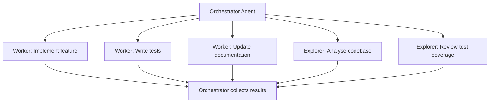
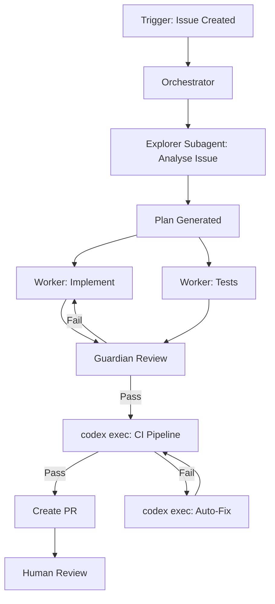

# What You Can Build with Codex CLI: 10 Real-World Setups from Simple to Advanced


---

Developers evaluating Codex CLI often ask the same question: *what can I actually do with it?* The answer depends on how deep you want to go. Codex CLI scales from a single terminal command that fixes a bug to a full agentic engineering factory with parallel agents, automated review, and CI/CD integration.

This article presents ten concrete setups in ascending complexity. Each one is self-contained — pick your entry point, get it working, then move up when you're ready.

```mermaid
graph LR
    A[1. Single Fix] --> B[2. AGENTS.md]
    B --> C[3. Model Profiles]
    C --> D[4. Resume Sessions]
    D --> E[5. MCP Integration]
    E --> F[6. Guardian Review]
    F --> G[7. codex exec CI]
    G --> H[8. Parallel Worktrees]
    H --> I[9. Multi-Agent Pod]
    I --> J[10. Agentic Factory]
```



---

## 1. Single-Command Bug Fix

**Complexity:** Trivial
**Time to set up:** 30 seconds

The simplest useful invocation. Point Codex at a bug and let it fix it.

```bash
codex "Fix the off-by-one error in src/pagination.rs that skips the last page"
```

Codex reads the relevant files, reasons about the fix, applies the edit, and runs your tests — all inside the sandbox [^1]. You review the diff and accept or reject.

**When to use:** Quick fixes, one-off refactors, exploratory changes where you want a second pair of eyes.

---

## 2. Project Conventions with AGENTS.md

**Complexity:** Low
**Time to set up:** 10 minutes

Drop an `AGENTS.md` file in your repository root to encode project norms. Codex reads it before doing any work [^2], so every session starts with consistent expectations.

```markdown
# AGENTS.md

## Code Style
- Use British English in all user-facing strings and comments
- Prefer `Result<T, E>` over panics; never use `unwrap()` in production code

## Testing
- Every public function must have at least one unit test
- Run `cargo test` before proposing any commit

## Architecture
- Domain logic lives in `src/domain/`; HTTP handlers in `src/api/`
- Never import `api` types from `domain` modules
```

Codex also reads `AGENTS.md` files in subdirectories for scoped overrides [^2]. A global `~/.codex/AGENTS.md` sets defaults across all your projects [^2].

**When to use:** Any team project where you want agents to follow the same conventions as humans.

---

## 3. Model Profiles for Cost Control

**Complexity:** Low
**Time to set up:** 5 minutes

Define named profiles in `~/.codex/config.toml` to switch between models and reasoning effort depending on the task [^3].

```toml
[profiles.quick]
model = "gpt-5.3-codex-spark"
reasoning_effort = "low"

[profiles.deep]
model = "gpt-5.4"
reasoning_effort = "high"

[profiles.budget]
model = "o4-mini"
reasoning_effort = "medium"
```

```bash
# Fast lint fix — use the spark model
codex --profile quick "Fix all clippy warnings"

# Complex architectural refactor — use full reasoning
codex --profile deep "Refactor the payment module to use the strategy pattern"
```

GPT-5.3-Codex-Spark delivers over 1,000 tokens per second [^4], making it ideal for lightweight tasks. Reserve GPT-5.4 for work that demands deep reasoning [^4].

**When to use:** When you want to balance cost against capability, or when your team needs standardised model choices.

---

## 4. Session Resume for Long-Running Work

**Complexity:** Low
**Time to set up:** None (built in)

Codex stores transcripts locally so you can pick up where you left off [^1]. Name your sessions for easy recall.

```bash
# Start a named session
codex --session "payment-refactor" "Begin refactoring the payment module"

# Resume later with full context
codex resume payment-refactor
```

From the TUI, `/resume` can jump directly to a session by ID or name [^5]. Your conversation history, file context, and agent state carry over.

**When to use:** Multi-day refactors, iterative design work, or any task that spans multiple terminal sessions.

---

## 5. MCP Integration with External Services

**Complexity:** Medium
**Time to set up:** 15 minutes

The Model Context Protocol (MCP) gives Codex access to external tools and data sources [^6]. Add servers via the CLI or directly in `config.toml`.

```bash
# Add Linear issue tracking
codex mcp add linear --url https://mcp.linear.app/mcp

# Add a local documentation server
codex mcp add docs -- npx @modelcontextprotocol/server-filesystem ./docs
```

```toml
# Or configure in ~/.codex/config.toml
[[mcp_servers]]
name = "linear"
url = "https://mcp.linear.app/mcp"

[[mcp_servers]]
name = "postgres"
command = ["npx", "@modelcontextprotocol/server-postgres"]
env = { DATABASE_URL = "postgresql://localhost/myapp" }
```

With MCP configured, Codex can query your issue tracker, read database schemas, or pull documentation — all within the agent loop [^6]. Project-scoped servers live in `.codex/config.toml` for trusted projects [^6].

**When to use:** When your workflow requires context beyond the local filesystem — issue trackers, databases, APIs, documentation.

---

## 6. Guardian Auto-Review Before Commit

**Complexity:** Medium
**Time to set up:** 10 minutes

The Guardian reviewer is a subagent that reviews Codex's proposed changes before they land [^7]. It's an automated code review gate built into the agent loop.

```toml
# ~/.codex/config.toml
approvals_reviewer = "guardian_subagent"

[approval_policy.granular]
file_write = "auto"
shell_command = "on-request"
```

With this configuration, Codex routes eligible approval requests through the Guardian subagent instead of prompting you directly [^7]. The Guardian checks for security issues, convention violations, and logical errors before approving the change.

Combine this with `AGENTS.md` review criteria for project-specific review policies:

```markdown
# AGENTS.md — Review section
## Guardian Review Criteria
- Reject any change that adds a direct SQL query outside `src/db/`
- Flag any new dependency not in the approved list
- Reject changes that reduce test coverage
```

**When to use:** When you want automated review without leaving the terminal, especially for `--full-auto` workflows where human review is deferred.

---

## 7. CI/CD Pipeline with `codex exec`

**Complexity:** Medium
**Time to set up:** 30 minutes

`codex exec` runs a single task non-interactively and exits [^8], making it the bridge between Codex and your CI/CD system.


```yaml
# .github/workflows/codex-autofix.yml
name: Codex Autofix
on:
  workflow_dispatch:
    inputs:
      task:
        description: "What should Codex fix?"
        required: true

jobs:
  fix:
    runs-on: ubuntu-latest
    steps:
      - uses: actions/checkout@v4
      - name: Run Codex
        uses: openai/codex-github-action@v1
        with:
          task: ${{ github.event.inputs.task }}
          model: gpt-5.3-codex
          approval_policy: on-request
        env:
          OPENAI_API_KEY: ${{ secrets.OPENAI_API_KEY }}
```


For automatic CI failure triage, OpenAI's cookbook demonstrates a pattern that watches for failed Actions runs and dispatches Codex to diagnose and fix them [^9].

```bash
# Local scripted usage
codex exec --model gpt-5.3-codex \
  --approval-policy on-request \
  "Run the test suite, identify failures, and fix them"
```

**When to use:** Automated bug fixing, scheduled code maintenance, any non-interactive pipeline task.

---

## 8. Parallel Worktree Refactoring

**Complexity:** High
**Time to set up:** 15 minutes

Git worktrees let you run multiple Codex sessions on isolated copies of your repository simultaneously [^10]. Each agent works in its own worktree, so there are no file conflicts.

```bash
# Create worktrees for parallel work
git worktree add ../refactor-auth feature/refactor-auth
git worktree add ../refactor-payments feature/refactor-payments
git worktree add ../refactor-notifications feature/refactor-notifications

# Run Codex in each (separate terminals or tmux panes)
cd ../refactor-auth && codex "Refactor auth module to use OAuth2 PKCE flow"
cd ../refactor-payments && codex "Migrate payment processing to Stripe v3 API"
cd ../refactor-notifications && codex "Extract notification service into standalone crate"
```

Each session has its own branch, its own working directory, and its own Codex context. Merge results back when all agents complete.

**When to use:** Large-scale refactors where independent modules can be worked on simultaneously.

---

## 9. Multi-Agent Pod with Subagents

**Complexity:** High
**Time to set up:** 20 minutes

Codex subagents, released in March 2026 [^10], enable structured multi-agent workflows with up to six concurrent subagents [^10]. Three roles are available: **explorer** (read-only analysis), **worker** (read-write execution), and **default** (general tasks) [^10].



Subagents use path-based addresses like `/root/agent_a` for structured inter-agent messaging [^5]. From the TUI, use `/agent` to switch between active agent threads, inspect progress, or steer a running subagent [^10].

```bash
# Start Codex and ask it to spawn subagents
codex "Implement the user profile feature. Spawn subagents:
  - Explorer to analyse the existing user model and API routes
  - Worker to implement the profile endpoints
  - Worker to write integration tests
  Collect results and create a single coherent PR."
```

**When to use:** Complex features requiring parallel analysis and implementation, or when you want specialised agents handling different aspects of a task.

---

## 10. The Agentic Engineering Factory

**Complexity:** Very High
**Time to set up:** 1–2 hours

This is the full stack: every previous setup combined into an automated engineering pipeline.



The key components:

| Layer | Setup | Config |
|-------|-------|--------|
| **Conventions** | `AGENTS.md` in every repo | Project norms, file maps, review criteria |
| **Models** | Profiles in `config.toml` | Spark for triage, GPT-5.4 for implementation |
| **External context** | MCP servers | Issue tracker, database, documentation |
| **Review** | Guardian subagent | Automated pre-commit review |
| **CI/CD** | `codex exec` in GitHub Actions | Autofix, test generation, deployment checks |
| **Parallelism** | Subagents + worktrees | Up to 6 concurrent agents per session |
| **Cost management** | Per-profile token budgets | Reasoning effort tuned per task type |

```toml
# Production config.toml — the full setup
model = "gpt-5.3-codex"
approval_policy = "on-request"
approvals_reviewer = "guardian_subagent"

[profiles.triage]
model = "gpt-5.3-codex-spark"
reasoning_effort = "low"

[profiles.implement]
model = "gpt-5.4"
reasoning_effort = "high"

[[mcp_servers]]
name = "linear"
url = "https://mcp.linear.app/mcp"

[[mcp_servers]]
name = "postgres"
command = ["npx", "@modelcontextprotocol/server-postgres"]
env = { DATABASE_URL = "postgresql://localhost/myapp" }
```

**When to use:** Teams that have validated Codex on smaller setups and want to scale to a fully automated development pipeline.

---

## Choosing Your Entry Point

You don't need to build the factory on day one. Most developers get immediate value from setups 1–3, meaningful workflow improvement from 4–6, and transformative results from 7–10. Start where you are and move up when the current level becomes second nature.

The critical insight: each layer compounds. `AGENTS.md` makes every subsequent setup better. Model profiles make CI/CD cheaper. Guardian review makes full automation safe. The progression isn't just about adding features — it's about building the trust and infrastructure that makes each next step possible.

---

## Citations

[^1]: [Features – Codex CLI | OpenAI Developers](https://developers.openai.com/codex/cli/features)
[^2]: [Custom instructions with AGENTS.md – Codex | OpenAI Developers](https://developers.openai.com/codex/guides/agents-md)
[^3]: [Configuration Reference – Codex | OpenAI Developers](https://developers.openai.com/codex/config-reference)
[^4]: [Models – Codex | OpenAI Developers](https://developers.openai.com/codex/models)
[^5]: [Changelog – Codex | OpenAI Developers](https://developers.openai.com/codex/changelog)
[^6]: [Model Context Protocol – Codex | OpenAI Developers](https://developers.openai.com/codex/mcp)
[^7]: [Agent approvals & security – Codex | OpenAI Developers](https://developers.openai.com/codex/agent-approvals-security)
[^8]: [Non-interactive mode – Codex | OpenAI Developers](https://developers.openai.com/codex/noninteractive)
[^9]: [Use Codex CLI to automatically fix CI failures – OpenAI Cookbook](https://developers.openai.com/cookbook/examples/codex/autofix-github-actions)
[^10]: [Subagents – Codex | OpenAI Developers](https://developers.openai.com/codex/subagents)
