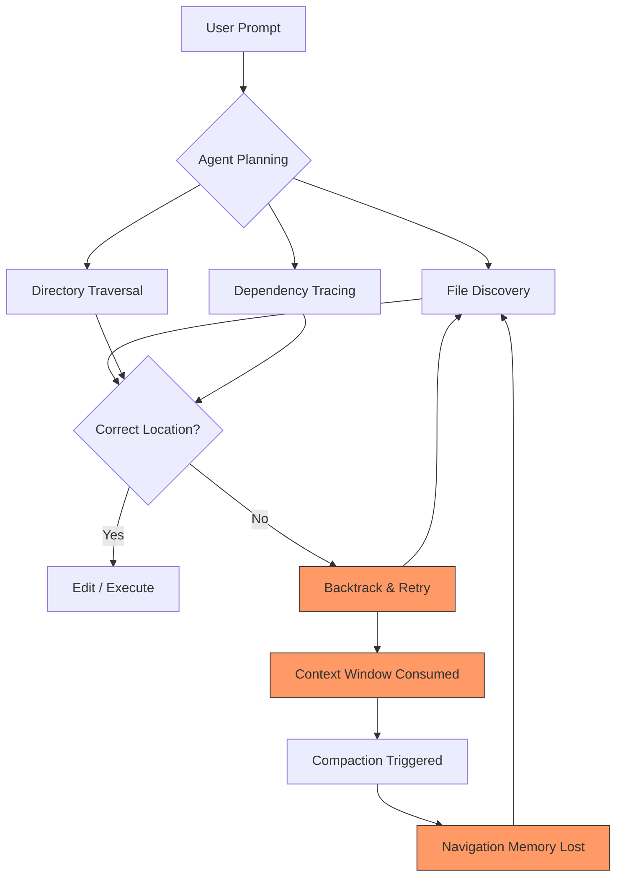
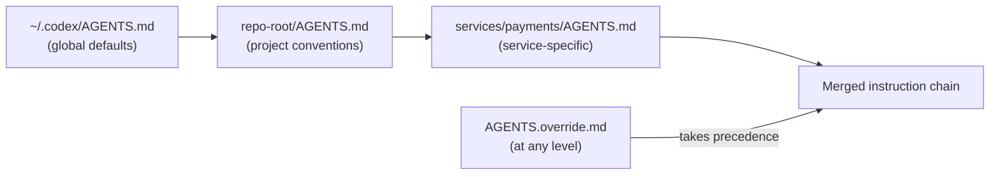

# Why Coding Agents Fail at Navigation (and How AGENTS.md File Maps Fix It)


Your coding agent can refactor a function, write tests, and call APIs — but ask it to find the right file in a monorepo, and there's a coin-flip chance it wanders off into the wrong directory. Three peer-reviewed studies from April 2026 converge on the same conclusion: **navigation, not tool use, is the dominant failure mode in modern coding agents**[^1][^2][^3]. This article unpacks the research, explains why navigation is hard for LLM-based agents, and shows how a well-crafted `AGENTS.md` file map turns a known weakness into a solved problem.

## The Evidence: Navigation Dominates Agent Failures

### The Amazing Agent Race (Kim et al., April 2026)

The AAR benchmark introduced 1,400 directed acyclic graph (DAG) puzzles requiring agents to navigate Wikipedia, execute branching tool chains, and aggregate results[^1]. The findings are stark:

- **Navigation errors account for 27–52% of all trial failures**[^1]
- **Tool-use errors remain below 17%**[^1]
- The best-performing agent achieved only **37.2% accuracy** overall[^1]
- Agent architecture matters as much as model scale — Claude Code matched Codex CLI at 37% accuracy whilst using 6× fewer tokens[^1]

The critical insight: linear benchmarks (where tasks proceed step-by-step) masked this weakness entirely. It was only when agents had to navigate branching paths — choosing which page to visit, which file to open, which directory to explore — that the gap became visible[^1].

### Beyond Resolution Rates (Mehtiyev & Assunção, April 2026)

This large-scale empirical study analysed **9,374 trajectories from 19 agents** (8 frameworks, 14 LLMs) across 500 tasks[^2]. Key findings relevant to navigation:

- Agents that **gather context before editing** and invest in validation succeed more often[^2]
- 12 tasks were never solved by any agent despite requiring only simple patches — the difficulty stemmed from **architectural reasoning gaps**, not code complexity[^2]
- The underlying LLM dominates both outcomes and behavioural choices; framework influence diminishes as LLM capabilities improve[^2]

The implication is clear: if agents cannot locate the right files to modify, the quality of their code generation is irrelevant.

### Formal Architecture Descriptors (arXiv:2604.13108, April 2026)

This study directly measured the impact of providing explicit architectural context to coding agents[^3]:

- Architecture context **reduces navigation steps by 33–44%** (Wilcoxon p=0.009, Cohen's d=0.92)[^3]
- An automatically generated descriptor achieved **100% accuracy** versus 80% for unaided approaches (p=0.002)[^3]
- Analysis of **7,012 Claude Code sessions** showed a **52% reduction in agent behavioural variance** when descriptors were available[^3]

## Why Navigation Is Hard for LLM-Based Agents

Understanding why agents struggle with navigation helps you write better file maps. The problem has three layers:



**1. Combinatorial explosion.** A monorepo with 10,000 files offers an enormous search space. Each `ls` or `find` call consumes tokens, and the agent must decide which directories to explore without knowing the codebase layout[^4].

**2. Context window pressure.** Navigation is expensive. Each directory listing, file read, and backtrack attempt eats into the context window. When compaction triggers, the agent may lose its mental map of where it has already looked, leading to repeated exploration of the same paths[^5].

**3. Naming ambiguity.** Agents rely on file and directory names as semantic signals. When your `utils/` directory contains both database helpers and string formatters, or when your `services/` directory mixes HTTP handlers with background workers, the agent guesses — and guesses wrong roughly half the time[^1].

## How AGENTS.md File Maps Fix This

The `AGENTS.md` file is loaded into the agent's context at the start of every session, sitting just below the system prompt[^6]. A file map section gives the agent a pre-built mental model of your codebase, eliminating the exploration phase entirely.

### Codex CLI's Discovery Process

Codex CLI has the most sophisticated `AGENTS.md` discovery of any coding agent. It walks from your project root to the current working directory, checking each level for instruction files[^6]:



Files closer to your working directory take precedence, and `AGENTS.override.md` at any level temporarily replaces the standard guidance[^6]. The merged instruction chain respects a configurable byte limit (32 KiB by default)[^6].

### Anatomy of an Effective File Map

The research is unambiguous: **architectural overviews do not reduce navigation time**[^7]. What works is a concise, functional map that tells the agent where things live and what they do. Here is a proven structure:

```markdown
## Project Structure

### Source Layout
- `src/api/` — HTTP handlers, one file per route group
- `src/api/middleware/` — auth, rate-limiting, CORS
- `src/services/` — business logic, no I/O (pure functions)
- `src/repositories/` — database access, one per aggregate root
- `src/workers/` — background job processors (Bull queues)
- `src/shared/types/` — TypeScript interfaces shared across layers

### Configuration
- `config/` — environment-specific YAML (dev, staging, prod)
- `infrastructure/` — Terraform modules, one per AWS service

### Tests
- `tests/unit/` — mirrors `src/` structure
- `tests/integration/` — Docker Compose + test containers
- `tests/e2e/` — Playwright specs in `tests/e2e/specs/`

### Key Entry Points
- `src/api/server.ts` — Express app bootstrap
- `src/workers/index.ts` — worker process entry
- `prisma/schema.prisma` — database schema (source of truth)
```

### What Makes This Work

Analysis of 2,500+ repositories with `agents.md` files identified six sections that consistently appear in high-performing agent configurations[^7]:

1. **Commands** — executable build/test/lint commands with full flags, placed early
2. **Testing protocols** — how and where to run tests
3. **Project structure** — the file map
4. **Code style** — one representative code snippet beats three paragraphs of description
5. **Git workflow** — branch naming, commit conventions
6. **Boundaries** — what the agent should never touch

The file map (section 3) is the navigation enabler, but it works best in concert with the others. An agent that knows both where to find tests and how to run them navigates the test-fix-verify loop without wasted exploration.

### Anti-Patterns to Avoid

**Over-documentation.** The maas repository's 371-line `AGENTS.md` is the empirical upper bound before splitting becomes necessary[^7]. Beyond that, use nested files per directory.

**Static path lists.** Listing every file path creates a maintenance burden and bloats the context window. Describe capabilities and patterns instead:

```markdown
# ❌ Brittle — breaks when files change
- `src/api/users.ts`
- `src/api/orders.ts`
- `src/api/products.ts`

# ✅ Resilient — survives refactoring
- `src/api/` — one handler file per resource (users, orders, products)
```

**Missing boundaries.** The most common helpful constraint across 2,500+ repositories: "Never commit secrets"[^7]. Without explicit boundaries, agents will happily modify `.env` files, vendor directories, and production configurations.

## Putting It Together: A Complete Navigation-Optimised AGENTS.md

```markdown
# AGENTS.md

## Project Overview
Payment processing service. Node.js 22, TypeScript 5.7, PostgreSQL 16.
Monorepo managed by Turborepo.

## Commands
```bash
pnpm install          # install dependencies
pnpm test             # unit tests (Vitest)
pnpm test:integration # integration tests (requires Docker)
pnpm lint             # ESLint + Prettier check
pnpm build            # TypeScript compilation
```

## Project Structure

- `apps/api/src/routes/` — Express route handlers, one per domain
- `apps/api/src/services/` — business logic (no I/O)
- `apps/api/src/repos/` — Prisma repository layer
- `apps/worker/src/jobs/` — background processors
- `packages/shared/` — shared types and validation schemas
- `packages/config/` — environment configuration loader
- `infra/` — Terraform (do not modify without approval)

## Key Files

- `apps/api/src/server.ts` → app entry point
- `prisma/schema.prisma` → database schema (single source of truth)
- `packages/shared/src/types.ts` → domain types

## Code Style

- Functional core, imperative shell
- No classes except Prisma models
- All errors as typed Result<T, E> — never throw

## Boundaries

- ✅ Always: run `pnpm test` before committing
- ⚠️ Ask first: database migrations, dependency upgrades
- 🚫 Never: modify `.env.*`, `infra/`, or `node_modules/`

```

## Measuring the Impact

You can verify that your file map is working by checking Codex CLI's session logs:

```bash
# Check which instruction files were loaded
cat ~/.codex/log/codex-tui.log | grep "AGENTS"

# Verify active instructions in a session
codex --ask-for-approval never "Show which instruction files are active."
```

If the agent's first actions in a session are targeted file reads rather than exploratory `ls` commands, your file map is doing its job. Based on the architecture descriptor research, you should expect a **33–44% reduction in navigation steps** and significantly less variance in agent behaviour across sessions[^3].

## Scaling File Maps in Monorepos

For large codebases, use Codex CLI's hierarchical discovery to split your file map across directories:

```
monorepo/
├── AGENTS.md                    # global: tech stack, CI commands
├── apps/
│   ├── web/
│   │   └── AGENTS.md            # React app structure
│   └── api/
│       └── AGENTS.md            # API service structure
├── packages/
│   └── AGENTS.md                # shared package conventions
└── infra/
    └── AGENTS.override.md       # strict: never auto-edit
```

Each nested file inherits from its parent and can override specific guidance. Configure fallback filenames for teams with existing documentation:

```toml
# ~/.codex/config.toml
project_doc_fallback_filenames = ["TEAM_GUIDE.md", ".agents.md"]
project_doc_max_bytes = 65536
```

## Key Takeaways

1. **Navigation is the bottleneck.** Three independent studies confirm that 27–52% of agent failures stem from navigation errors, not tool-use errors[^1][^2][^3].
2. **File maps eliminate the exploration phase.** A concise project structure section in `AGENTS.md` reduces navigation steps by 33–44%[^3].
3. **Describe patterns, not paths.** Resilient file maps survive refactoring by documenting directory purposes rather than individual file names[^7].
4. **Use hierarchical AGENTS.md files** in monorepos, leveraging Codex CLI's root-to-leaf discovery mechanism[^6].
5. **Set boundaries explicitly.** Agents without clear "never touch" zones will explore — and modify — everything they can reach[^7].

The irony is that the fix for the most common agent failure mode is the simplest intervention available: a few dozen lines of markdown, checked into your repository, describing where things live. The research says it works. The 60,000+ repositories that have adopted `AGENTS.md` agree[^8].

## Citations

[^1]: Kim, H. et al. "The Amazing Agent Race: Strong Tool Users, Weak Navigators." arXiv:2604.10261, April 2026. [https://arxiv.org/abs/2604.10261](https://arxiv.org/abs/2604.10261)

[^2]: Mehtiyev, T. & Assunção, W. "Beyond Resolution Rates: Behavioral Drivers of Coding Agent Success and Failure." arXiv:2604.02547, April 2026. [https://arxiv.org/abs/2604.02547](https://arxiv.org/abs/2604.02547)

[^3]: "Formal Architecture Descriptors as Navigation Primitives for AI Coding Agents." arXiv:2604.13108, April 2026. [https://arxiv.org/abs/2604.13108](https://arxiv.org/abs/2604.13108)

[^4]: OpenAI. "Unrolling the Codex Agent Loop." January 2026. [https://openai.com/index/unrolling-the-codex-agent-loop/](https://openai.com/index/unrolling-the-codex-agent-loop/)

[^5]: ZenML. "Building Production-Ready AI Agents: OpenAI Codex CLI Architecture and Agent Loop Design." 2026. [https://www.zenml.io/llmops-database/building-production-ready-ai-agents-openai-codex-cli-architecture-and-agent-loop-design](https://www.zenml.io/llmops-database/building-production-ready-ai-agents-openai-codex-cli-architecture-and-agent-loop-design)

[^6]: OpenAI. "Custom Instructions with AGENTS.md — Codex CLI." [https://developers.openai.com/codex/guides/agents-md](https://developers.openai.com/codex/guides/agents-md)

[^7]: GitHub Blog. "How to Write a Great agents.md: Lessons from Over 2,500 Repositories." [https://github.blog/ai-and-ml/github-copilot/how-to-write-a-great-agents-md-lessons-from-over-2500-repositories/](https://github.blog/ai-and-ml/github-copilot/how-to-write-a-great-agents-md-lessons-from-over-2500-repositories/)

[^8]: AGENTS.md — Open Format for Guiding Coding Agents. [https://agents.md/](https://agents.md/)
