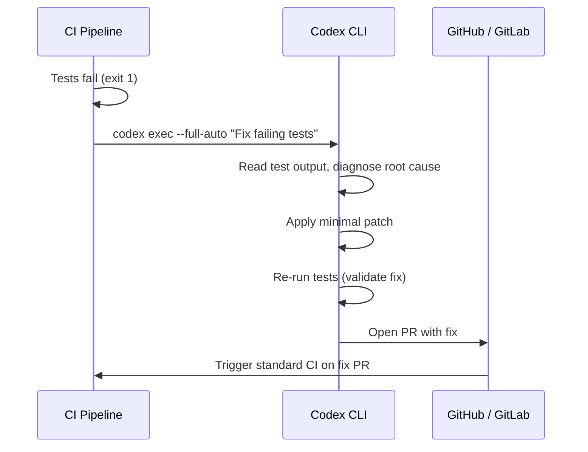

# Automated CI Failure Recovery with Codex CLI: Self-Healing Pipelines from GitHub Actions to GitLab CI


---

When a CI pipeline goes red at 2 a.m., the traditional response is a Slack notification followed by a bleary-eyed developer pushing a hotfix. Codex CLI offers a different pattern: the pipeline diagnoses its own failure, generates a minimal fix, validates it, and opens a pull request — all before anyone wakes up. This article covers the complete architecture for self-healing CI pipelines using `codex exec`, the official `codex-action` for GitHub Actions, and equivalent GitLab CI patterns including code quality reports and automated security patch generation.

---

## The Autofix Pattern

The core idea is simple: when a CI workflow fails, a follow-up workflow triggers `codex exec` against the failing commit, generates a fix, re-runs the test suite to validate it, and opens a PR with the patch[^1]. Codex runs headlessly — no TUI, no approval prompts — under whatever sandbox policy you configure.



The key constraint is **minimality**: the prompt must instruct Codex to make the smallest possible change that fixes the failure, not to refactor surrounding code[^2].

## How `codex exec` Works in CI

The `codex exec` subcommand strips away the interactive TUI and runs a single agent session to completion[^3]. Progress streams to `stderr`, the final agent message goes to `stdout`, and the process exits. Authentication uses the `CODEX_API_KEY` environment variable — store it as a CI secret, never inline[^3].

```bash
CODEX_API_KEY="${OPENAI_API_KEY}" \
  codex exec --full-auto --sandbox workspace-write \
  "Fix the failing tests with minimal changes. Do not refactor unrelated code."
```

### Permission Flags

| Flag | Effect |
|------|--------|
| `--full-auto` | Allows file edits without approval prompts[^3] |
| `--sandbox workspace-write` | Permits writes to the project directory only[^4] |
| `--sandbox read-only` | Default; no filesystem writes[^3] |
| `--sandbox danger-full-access` | Full system access — use only in disposable containers[^4] |
| `--ephemeral` | Prevents session persistence to disk[^3] |
| `--skip-git-repo-check` | Overrides the Git repository requirement[^3] |

### Machine-Readable Output

For downstream processing, use JSON Lines output:

```bash
codex exec --json "analyse test failures" | jq '.type'
```

This produces a JSONL stream with event types including `thread.started`, `turn.started`, `item.*`, `turn.completed`, and `turn.failed`[^3]. For structured results, pass an output schema:

```bash
codex exec "extract failure metadata" \
  --output-schema ./failure-schema.json \
  -o ./failure-report.json
```

## GitHub Actions: The `codex-action`

The official `openai/codex-action@v1` wraps `codex exec` for GitHub Actions, handling CLI installation, Responses API proxy startup, and permission management[^4].

### Minimal Autofix Workflow


```yaml
name: Codex auto-fix on CI failure

on:
  workflow_run:
    workflows: ["CI"]
    types: [completed]

jobs:
  auto-fix:
    if: ${{ github.event.workflow_run.conclusion == 'failure' }}
    runs-on: ubuntu-latest
    permissions:
      contents: write
      pull-requests: write
    steps:
      - uses: actions/checkout@v5
        with:
          ref: ${{ github.event.workflow_run.head_sha }}

      - name: Run Codex autofix
        uses: openai/codex-action@v1
        with:
          openai-api-key: ${{ secrets.OPENAI_API_KEY }}
          prompt: |
            The CI pipeline failed on this commit. Diagnose the failure
            from the test output and apply the minimal fix. Do not
            refactor unrelated code.
          sandbox: workspace-write
          safety-strategy: drop-sudo

      - name: Create fix PR
        uses: peter-evans/create-pull-request@v6
        with:
          title: "fix: auto-repair CI failure"
          body: "Automated fix generated by Codex CLI"
          branch: codex/autofix-${{ github.event.workflow_run.head_sha }}
```


The workflow triggers only when the main CI workflow completes with a failure, checks out the failing commit, runs Codex to generate a fix, and opens a PR[^1][^4].

### Safety Strategies

The `safety-strategy` input controls privilege isolation on the runner[^4]:

| Strategy | Behaviour | Use Case |
|----------|-----------|----------|
| `drop-sudo` | Irreversibly removes sudo before Codex runs; protects secrets | Default; recommended for most pipelines |
| `unprivileged-user` | Runs as a specific non-root account | When you need user-level isolation |
| `read-only` | Prevents file and network changes | Analysis-only jobs (code review, triage) |
| `unsafe` | No privilege restriction | Windows runners only; avoid on Linux/macOS |

**Critical**: `drop-sudo` is irreversible within the job — once sudo is dropped, no subsequent step can reclaim it[^4]. Run Codex as the final step to prevent inherited state leakage.

### PR Review Workflow

Beyond autofix, the `codex-action` excels at automated code review:


```yaml
name: Codex PR review

on:
  pull_request:
    types: [opened, synchronize, reopened]

jobs:
  review:
    runs-on: ubuntu-latest
    permissions:
      contents: read
      pull-requests: write
    steps:
      - uses: actions/checkout@v5
        with:
          ref: refs/pull/${{ github.event.pull_request.number }}/merge

      - name: Fetch base and head
        run: |
          git fetch --no-tags origin \
            ${{ github.event.pull_request.base.ref }} \
            +refs/pull/${{ github.event.pull_request.number }}/head

      - name: Run Codex review
        id: review
        uses: openai/codex-action@v1
        with:
          openai-api-key: ${{ secrets.OPENAI_API_KEY }}
          prompt-file: .github/codex/prompts/review.md
          output-file: codex-review.md
          safety-strategy: drop-sudo
          sandbox: read-only

      - name: Post review comment
        if: steps.review.outputs.final-message != ''
        uses: actions/github-script@v7
        with:
          script: |
            await github.rest.issues.createComment({
              owner: context.repo.owner,
              repo: context.repo.repo,
              issue_number: context.payload.pull_request.number,
              body: process.env.REVIEW,
            });
        env:
          REVIEW: ${{ steps.review.outputs.final-message }}
```


Note the `prompt-file` input — store review instructions as a committed file so the review criteria evolve with the codebase[^4].

## GitLab CI: Code Quality and Security Remediation

GitLab does not have a direct equivalent to `codex-action`, but `codex exec` runs natively in GitLab CI/CD pipelines[^5]. The OpenAI Cookbook provides two production patterns: CodeClimate-compliant quality reports and automated security patch generation[^6].

### Marker-Based Output Extraction

Both patterns use a reliable extraction technique: instruct Codex to wrap its output between marker lines, then extract with `awk`[^6]:

```bash
sed -E 's/\x1B\[[0-9;]*[A-Za-z]//g' "${RAW_LOG}" \
  | tr -d '\r' \
  | awk '
      /^\s*=== BEGIN_CODE_QUALITY_JSON ===\s*$/ {grab=1; next}
      /^\s*=== END_CODE_QUALITY_JSON ===\s*$/   {grab=0}
      grab
    ' > "${OUTPUT_FILE}"
```

The `sed` pass strips ANSI escape codes, `tr` removes carriage returns, and `awk` captures only the content between markers[^6]. This avoids parsing prose, markdown, or code fences that Codex might generate despite instructions.

### Code Quality Reports

Generate GitLab-native CodeClimate JSON that surfaces directly in merge request widgets:

```yaml
codex_review:
  stage: codex
  image: node:24
  rules:
    - if: '$CI_PIPELINE_SOURCE == "merge_request_event"'
      when: on_success
  variables:
    CODEX_QA_PATH: "gl-code-quality-report.json"
  script:
    - npm -g i @openai/codex@latest
    - FILE_LIST="$(git ls-files | sed 's/^/- /')"
    - |
      codex exec --full-auto "
        Review this repository and output a GitLab Code Quality report
        in CodeClimate JSON format. Output ONLY a JSON array between
        === BEGIN_CODE_QUALITY_JSON === and === END_CODE_QUALITY_JSON ===
        markers. Use repo-relative paths from: ${FILE_LIST}
      " | tee raw.log >/dev/null
    - # Extract and validate JSON
    - |
      sed -E 's/\x1B\[[0-9;]*[A-Za-z]//g' raw.log | tr -d '\r' | awk '
        /BEGIN_CODE_QUALITY_JSON/ {grab=1; next}
        /END_CODE_QUALITY_JSON/  {grab=0}
        grab' > "${CODEX_QA_PATH}"
      node -e 'JSON.parse(require("fs").readFileSync(process.argv[1],"utf8"))' \
        "${CODEX_QA_PATH}" || echo "[]" > "${CODEX_QA_PATH}"
  artifacts:
    reports:
      codequality: gl-code-quality-report.json
```

The `git ls-files` allowlist prevents Codex from hallucinating file paths that do not exist in the repository[^6].

### Automated Security Patch Generation

The most advanced pattern processes SAST scanner output, generates validated `git apply`-compatible patches for each High/Critical vulnerability, and stores them as pipeline artefacts[^6]:

```yaml
codex_remediation:
  stage: remediation
  image: node:24
  variables:
    SAST_REPORT: "gl-sast-report.json"
    PATCH_DIR: "codex_patches"
  script:
    - npm -g i @openai/codex@latest
    - mkdir -p "${PATCH_DIR}"
    - |
      jq -c '.vulnerabilities[]?
        | select((.severity|ascii_downcase)=="high"
             or (.severity|ascii_downcase)=="critical")' \
        "${SAST_REPORT}" | nl -ba > /tmp/vulns.txt
    - |
      while IFS=$'\t' read -r idx vuln; do
        codex exec --full-auto "
          Fix this vulnerability with a minimal, safe patch.
          Output a unified diff between === BEGIN_UNIFIED_DIFF ===
          and === END_UNIFIED_DIFF === markers.
          VULNERABILITY: ${vuln}
        " | tee /tmp/raw.log >/dev/null

        sed -E 's/\x1B\[[0-9;]*[A-Za-z]//g' /tmp/raw.log \
          | tr -d '\r' \
          | awk '/BEGIN_UNIFIED_DIFF/{g=1;next}/END_UNIFIED_DIFF/{g=0}g' \
          > "${PATCH_DIR}/fix-${idx}.patch"

        if git apply --check "${PATCH_DIR}/fix-${idx}.patch" 2>/dev/null; then
          echo "Patch ${idx} validated"
        else
          echo "Patch ${idx} failed validation; removing"
          rm -f "${PATCH_DIR}/fix-${idx}.patch"
        fi
      done < /tmp/vulns.txt
  artifacts:
    paths:
      - codex_patches/
    expire_in: 14 days
```

Each vulnerability is processed individually, producing a separate patch file. The `git apply --check` validation ensures only syntactically correct, cleanly applicable patches survive[^6].

## Production Hardening

### Prompt Engineering for CI

The quality of autofix output depends entirely on prompt specificity. Key patterns:

1. **Constrain scope**: "Fix the failing tests with minimal changes. Do not refactor unrelated code."
2. **Provide context**: Pipe test output or log excerpts into the prompt via stdin[^3]
3. **Specify output format**: Use marker-based extraction for reliable parsing[^6]
4. **Include file allowlists**: Feed `git ls-files` output to prevent path hallucination[^6]

```bash
gh run view "${RUN_ID}" --log-failed \
  | codex exec "Diagnose the root cause of this CI failure and suggest a fix"
```

### Error Handling

Robust CI integration requires graceful degradation:

- **Use `set +o pipefail` around Codex invocations** to capture both successful and failed runs without premature pipeline termination[^6]
- **Validate all outputs** before consuming them — JSON parsing for quality reports, `git apply --check` for patches, regex guards for placeholder detection[^6]
- **Fall back to safe defaults** when Codex produces invalid output: empty JSON arrays for quality reports, skip-and-log for patches[^6]
- **Set timeouts** — `codex exec` can hang if the model enters a reasoning loop; use CI-level job timeouts as a backstop

### Cost Management

Each `codex exec` invocation consumes API tokens. For cost-conscious pipelines:

- Use `--model gpt-5.4-mini` for triage and diagnostic jobs where full reasoning power is unnecessary
- Reserve `--model gpt-5.4` for patch generation where accuracy matters
- Set `--ephemeral` to avoid session storage overhead[^3]
- ⚠️ Token consumption scales with repository size — consider scoping prompts to specific directories or files rather than entire repositories

### Security Considerations

- **Never expose API keys in logs** — use CI secret management exclusively[^4]
- **Prefer `drop-sudo`** on GitHub Actions to prevent Codex from escalating privileges[^4]
- **Run Codex as the final step** in a job to prevent inherited state leakage to subsequent steps[^4]
- **Restrict workflow triggers** — use `allow-users` and `allow-bots` inputs on `codex-action` to prevent untrusted actors from triggering Codex runs via PRs from forks[^4]
- **Sanitise prompt inputs** from pull request titles, commit messages, and branch names to prevent prompt injection[^4]

## Beyond Autofix: CI Integration Patterns

### Log Analysis and Triage

```bash
tail -n 200 app.log \
  | codex exec "Identify the root cause and suggest fixes in 5 bullets"
```

### Dynamic Prompts

```bash
./generate-review-prompt.sh | codex exec - --json > results.jsonl
```

### Session Resumption

For multi-step CI workflows, resume a previous session:

```bash
codex exec resume --last "Now fix the race conditions you found"
codex exec resume "${SESSION_ID}" "Apply the recommended changes"
```

### Structured Output for Downstream Tools

```json
{
  "type": "object",
  "properties": {
    "root_cause": { "type": "string" },
    "severity": { "enum": ["low", "medium", "high", "critical"] },
    "suggested_fix": { "type": "string" },
    "affected_files": { "type": "array", "items": { "type": "string" } }
  }
}
```

```bash
codex exec "Analyse this CI failure" \
  --output-schema ./failure-schema.json \
  -o ./failure-report.json
```

The structured output integrates cleanly with dashboards, ticketing systems, and alerting pipelines[^3].

## Limitations and Honest Assessment

- **Non-deterministic**: The same failure may produce different fixes across runs — always validate with a test re-run before merging
- **Context window constraints**: Large repositories with extensive test output may exceed the model's context window, producing incomplete diagnoses
- **False confidence**: Codex may generate a "fix" that passes the specific failing test but introduces a regression elsewhere — comprehensive test suites are essential
- ⚠️ **Cost at scale**: Running autofix on every CI failure across a monorepo with hundreds of daily commits can accumulate significant API costs without proper gating (e.g., only trigger on `main` branch failures, not feature branches)

---

## Citations

[^1]: OpenAI Cookbook, "Use Codex CLI to automatically fix CI failures," [cookbook.openai.com/examples/codex/autofix-github-actions](https://cookbook.openai.com/examples/codex/autofix-github-actions)

[^2]: OpenAI, "Auto-fix CI failures with Codex," [developers.openai.com/codex/guides/autofix-ci](https://developers.openai.com/codex/guides/autofix-ci/)

[^3]: OpenAI, "Command line options – Codex CLI," [developers.openai.com/codex/cli/reference](https://developers.openai.com/codex/cli/reference)

[^4]: OpenAI, "GitHub Action – Codex," [developers.openai.com/codex/github-action](https://developers.openai.com/codex/github-action)

[^5]: OpenAI, "CLI – Codex," [developers.openai.com/codex/cli](https://developers.openai.com/codex/cli)

[^6]: OpenAI Cookbook, "Automating Code Quality and Security Fixes with Codex CLI on GitLab," [cookbook.openai.com/examples/codex/secure_quality_gitlab](https://cookbook.openai.com/examples/codex/secure_quality_gitlab)
