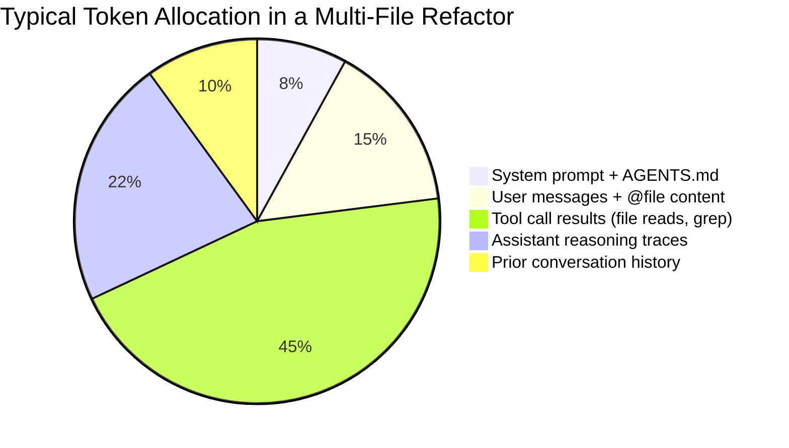
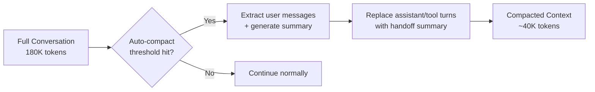
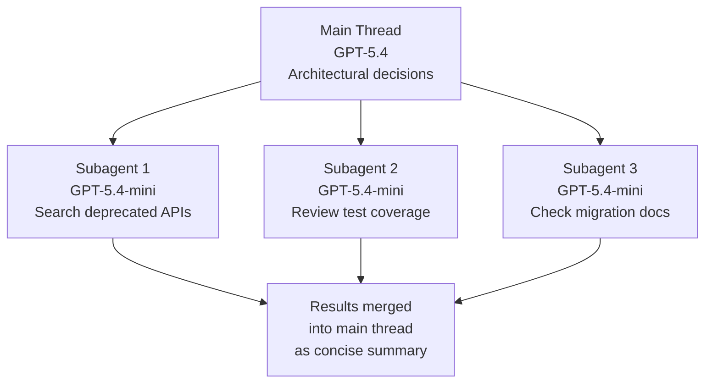
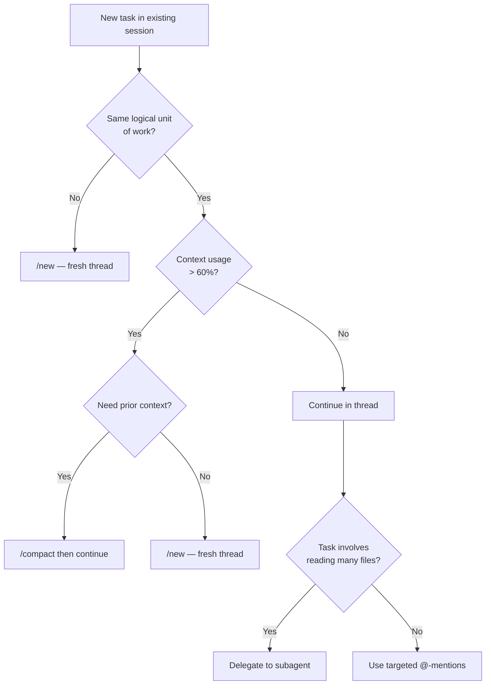

# The Model Context Window Budget: Practical Token Management for Large Codebases


---

Every agentic coding session is a budgeting exercise. Your model has a finite context window — and every file read, tool call, reasoning trace, and conversation turn consumes tokens from that budget. In small repositories the budget feels infinite. In a 200-module monorepo with a seven-hour debugging session, it very much does not.

This guide covers the practical mechanics of context window budgeting in Codex CLI: how tokens are consumed, when compaction fires, how to structure prompts and AGENTS.md for minimal waste, and when to delegate work to subagents rather than stuffing everything into a single thread.

## Context Window Sizes in 2026

The context budget depends on your model choice[^1][^2]:

| Model | Input Window | Output Window | Notes |
|---|---|---|---|
| `codex-1` (o3-based) | 192K tokens | — | Default Codex model, optimised for SWE tasks |
| `o4-mini` | 200K tokens | 100K tokens | Lower cost, faster inference |
| `GPT-5.4` | 272K default / 1.05M long-context | 128K | Long-context mode billed at 2×/1.5× over 272K |
| `GPT-5.4-mini` | 272K | 128K | Subagent workhorse at ~30% of GPT-5.4 quota |

The effective usable window is always smaller than the headline number. Codex CLI's auto-compaction threshold defaults to 200,000 tokens[^3], and system prompts, AGENTS.md content, and tool definitions consume a baseline allocation before your first message.

## Where Your Tokens Actually Go

A single agentic task — plan, execute, verify, fix — typically requires three to eight API round trips[^4]. Each round trip sends the *entire* accumulated context as input. Understanding the consumption breakdown matters:



Tool results dominate. In the analysis by Justin3go, tool results comprised roughly 81% of total tokens in a representative debugging session[^5]. This has a direct practical implication: **the biggest lever you have is controlling which files the agent reads and when**.

## The Compaction System

When your session approaches the context limit, Codex CLI triggers compaction — a process that summarises the conversation history into a condensed form so work can continue[^6].

### How Compaction Works

Codex uses a **single-layer handoff summary** approach[^5]:

1. The system extracts recent user messages (capped at approximately 20,000 tokens)
2. An LLM call generates a structured summary covering: current progress and decisions, constraints and preferences, remaining tasks, and critical data for continuation
3. All assistant replies and tool results are replaced by this single summary
4. User messages are preserved verbatim



### Server-Side vs Client-Side Compaction

Codex CLI supports two compaction paths[^6][^7]:

- **Server-side** (OpenAI models): Configured via `compact_threshold` in the API's `context_management` parameter. The server returns an encrypted compaction item that carries forward key context. Session Memory Compact can sometimes avoid an LLM call entirely by leveraging structured information already in session memory[^7].
- **Client-side** (local/third-party models): A standard LLM summarisation call. Compatible with any provider but less efficient.

### The Compaction Trade-Off

Compaction is lossy. Once it fires, you lose[^5]:

- Detailed reasoning chains from earlier in the session
- Specific tool output (exact grep results, test failures, stack traces)
- Intermediate debugging context that might be needed later

This is an **all-or-nothing** compression — unlike Claude Code's three-layer progressive approach (tool result trimming → prompt cache optimisation → structured summary), Codex replaces everything in one pass[^5]. The practical consequence: **it is better to avoid needing compaction than to rely on it**.

## Six Strategies for Staying Under Budget

### 1. One Thread Per Task, Not Per Project

The official best practice is clear: keep one thread per coherent unit of work[^8]. A thread that starts with "fix the login bug" and drifts into "also refactor the auth module and update the docs" will burn through context far faster than three focused threads.

Use `/new` to start a fresh conversation for each distinct task. Use `/fork` when you want to explore an alternative approach without polluting the main thread's context[^9].

### 2. Surgical `@`-Mentions Over Broad Context

Every `@file` reference includes the file's full content in the token count[^3]. In a monorepo, an innocent `@src/` mention could inject tens of thousands of tokens.

**Do this:**

```
Fix the race condition in @src/services/auth/session-manager.ts
using the lock pattern from @src/lib/distributed-lock.ts
```

**Not this:**

```
Fix the race condition somewhere in @src/services/
```

The first approach gives the agent exactly what it needs. The second forces it to read an entire directory tree, burning tokens on irrelevant files and potentially triggering early compaction.

### 3. Structure AGENTS.md for Progressive Disclosure

A well-structured AGENTS.md is the most cost-effective context you can provide — it loads once per session and guides every subsequent decision. But a bloated AGENTS.md is counterproductive[^8][^10].

**Root AGENTS.md** — keep it short and architectural:

```markdown
# Project: payments-platform

## Architecture
Monorepo with 4 services: api-gateway, billing, notifications, admin-ui.
Each service has its own AGENTS.md with service-specific conventions.

## Build & Test
- `make test` runs all unit tests
- `make integration` runs integration suite (requires Docker)

## Constraints
- All currency values use decimal.js, never floating point
- Database migrations must be backwards-compatible
```

**Service-level AGENTS.md** — detailed but scoped:

```markdown
# billing service

## Key files
- src/models/invoice.ts — core domain model
- src/services/stripe-sync.ts — Stripe webhook handler
- src/jobs/reconciliation.ts — nightly reconciliation job

## Testing
Run `npm test -- --grep billing` for this service only
```

This hierarchy means the agent gets the global picture cheaply, then loads service-specific detail only when working in that directory[^10]. For monorepos, the nearest AGENTS.md to the edited file takes precedence, supplementing (not replacing) parent files[^10].

### 4. Use `/compact` Proactively, Not Reactively

Do not wait for auto-compaction to interrupt your flow. If you have finished a distinct phase of work (e.g., debugging is done, now moving to testing), run `/compact` manually[^8][^9]:

```
/compact
```

You can customise the compaction prompt via `compact_prompt` in your `config.toml` to ensure the summary retains domain-specific context that matters to your workflow[^3].

Checking your current token consumption with `/status` before starting a complex phase helps you decide whether to compact or fork first[^9].

### 5. Tune Reasoning Effort to the Task

Not every task needs maximum reasoning depth. Codex CLI's `model_reasoning_effort` setting directly affects token consumption[^3][^8]:

```toml
# In .codex/config.toml

# For routine formatting, linting, simple renames
model_reasoning_effort = "low"

# For most development work
# model_reasoning_effort = "medium"

# For complex architectural decisions, subtle bugs
# model_reasoning_effort = "high"
```

Similarly, set `model_reasoning_summary = "none"` when you do not need the model to explain its reasoning traces — this saves tokens on models that support extended thinking[^3].

### 6. Delegate to Subagents for Context Isolation

Since v0.107.0, Codex CLI supports subagent delegation[^11]. Each subagent runs in its own context window, which means a 5-file investigation that would consume 30,000 tokens in your main thread instead consumes them in a disposable child context.

**Ideal subagent tasks** (mostly read-only, bounded scope)[^11]:

- Codebase search and file review
- Documentation lookup
- Background research across multiple files
- Test result analysis

**Delegation pattern:**

```
Search @src/services/ for all usages of the deprecated PaymentV1 interface.
Delegate this to a subagent — I need a list of files and line numbers,
grouped by service.
```

GPT-5.4-mini subagents cost roughly 30% of a GPT-5.4 call[^2], making delegation both a context management and cost optimisation strategy.



The key insight: subagent results return as concise summaries, not raw tool outputs. You get the answer without the token cost of the investigation.

## Measuring Your Budget

The Codex CLI TUI provides a context-percentage indicator in the status line (updated in v0.121.0)[^3]. Use it as a fuel gauge:

| Context Usage | Action |
|---|---|
| 0–40% | Work freely, full context available |
| 40–70% | Consider whether remaining work fits; use `/compact` if switching task phase |
| 70–85% | Compact now or fork; avoid starting complex multi-file operations |
| 85%+ | Auto-compaction imminent; expect interruption |

For programmatic monitoring, the OTEL metrics integration (tracking issue #18026) enables dashboards showing per-session token consumption, compaction frequency, and cost attribution across team members[^12].

## The Decision Tree

When you are about to start a new piece of work within an existing session, ask:



## Summary

Context window management is not glamorous work, but in large codebases it is the difference between a productive seven-hour session and one that degrades into compaction loops after ninety minutes. The principles are straightforward:

1. **Budget consciously** — check `/status`, know your model's limits
2. **Minimise tool result bloat** — surgical `@`-mentions, not directory dumps
3. **Structure AGENTS.md hierarchically** — progressive disclosure, not encyclopaedias
4. **Compact proactively** — between task phases, not when forced
5. **Delegate breadth to subagents** — keep the main thread for depth
6. **Match reasoning effort to task complexity** — not everything needs `xhigh`

The context window is your most constrained resource. Spend it wisely.

## Citations

[^1]: [OpenAI Codex CLI Pricing and Model Specifications](https://developers.openai.com/codex/pricing)
[^2]: [GPT-5.4 Model Documentation](https://developers.openai.com/api/docs/models/gpt-5.4)
[^3]: [Codex CLI: The Definitive Technical Reference — Blake Crosley](https://blakecrosley.com/guides/codex)
[^4]: [Context Management Strategies for OpenAI Codex — Alex Merced](https://iceberglakehouse.com/posts/2026-03-context-openai-codex/)
[^5]: [Context Compaction in Codex, Claude Code, and OpenCode — Justin3go (April 2026)](https://justin3go.com/en/posts/2026/04/09-context-compaction-in-codex-claude-code-and-opencode)
[^6]: [OpenAI API Compaction Guide](https://developers.openai.com/api/docs/guides/compaction)
[^7]: [Support Asynchronous/Background Compaction — GitHub Issue #18007](https://github.com/openai/codex/issues/18007)
[^8]: [Codex Best Practices — OpenAI Developers](https://developers.openai.com/codex/learn/best-practices)
[^9]: [Slash Commands in Codex CLI — OpenAI Developers](https://developers.openai.com/codex/cli/slash-commands)
[^10]: [Steering AI Agents in Monorepos with AGENTS.md — DEV Community / Datadog](https://dev.to/datadog-frontend-dev/steering-ai-agents-in-monorepos-with-agentsmd-13g0)
[^11]: [OpenAI Codex Subagents: Parallel Agent Workflows — BaristaLabs](https://www.baristalabs.io/blog/openai-codex-subagents-parallel-agents-2026)
[^12]: [Codex CLI Features — OpenAI Developers](https://developers.openai.com/codex/cli/features)
