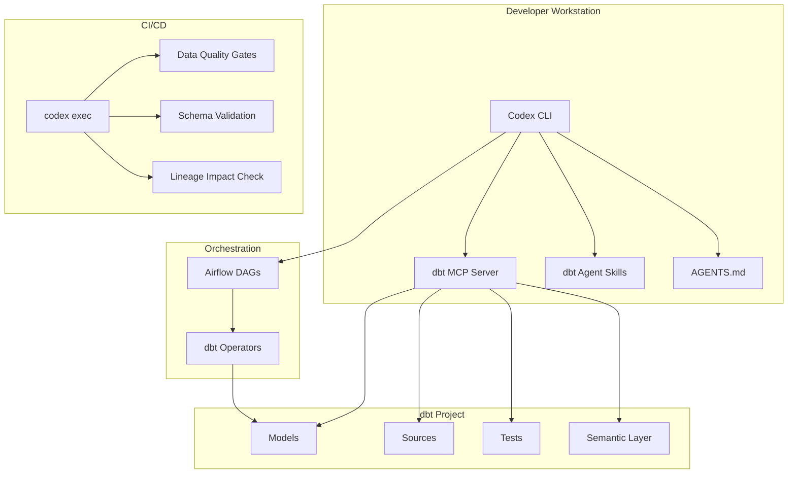
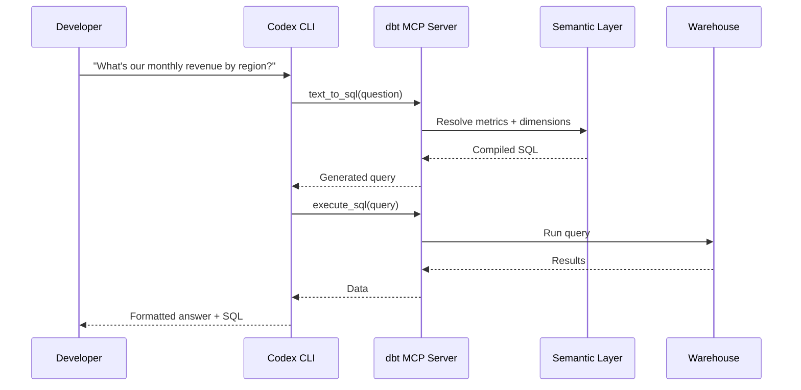

# Codex CLI for Data Engineering: dbt, Airflow, and Pipeline Generation


---

Data engineering workflows—building dbt models, orchestrating Airflow DAGs, validating data quality—are repetitive, context-heavy, and ripe for agentic automation. With the dbt MCP server, dbt agent skills, and Codex CLI's non-interactive execution mode, you can transform a generalist coding agent into a capable data engineering partner that understands your warehouse schema, lineage, and transformation conventions.

This article covers the practical integration of Codex CLI with dbt Core 1.11[^1], Apache Airflow 3[^2], and the dbt MCP server[^3] for automated pipeline generation, testing, and review.

## Architecture Overview



## Setting Up the dbt MCP Server

The dbt MCP server exposes your project's models, sources, macros, tests, and lineage to Codex CLI via the Model Context Protocol[^3]. Two deployment modes exist:

### Local MCP (dbt Core / dbt Fusion)

The local server runs alongside your dbt project and requires no platform account:

```bash
# Install and run
uvx dbt-mcp
```

Configure in your Codex CLI config (`~/.codex/config.toml`):

```toml
[[mcp_servers]]
name = "dbt"
command = "uvx"
args = ["dbt-mcp"]

[mcp_servers.env]
DBT_MCP_ENABLE_DISCOVERY = "true"
DBT_MCP_ENABLE_EXECUTE_SQL = "true"
DBT_MCP_ENABLE_SEMANTIC_LAYER = "true"
```

### Remote MCP (dbt Platform)

For teams using dbt Cloud, the remote server provides hosted access without local installation[^4]:

```toml
[[mcp_servers]]
name = "dbt-remote"
type = "http"
url = "https://mcp.cloud.getdbt.com"

[mcp_servers.env]
DBT_CLOUD_API_KEY = "${DBT_CLOUD_API_KEY}"
DBT_MCP_ENVIRONMENT_ID = "12345"
```

### Controlling Exposed Toolsets

Use `DBT_MCP_ENABLE_*` environment variables to restrict which capabilities the agent can access[^3]. For model generation workflows, enable discovery and SQL execution; for read-only review, disable execute and limit to discovery and semantic layer access.

## Installing dbt Agent Skills

dbt Labs released a curated collection of agent skills that encode dbt best practices—naming conventions, materialisation strategy, testing patterns, and macro usage[^5]. These transform Codex CLI from a generalist into a data-aware agent:

```bash
# Install dbt agent skills into your project
cd your-dbt-project
git clone https://github.com/dbt-labs/dbt-agent-skills.git .skills/dbt
```

Reference them in your `AGENTS.md`:

```markdown
## Data Engineering Conventions

This project uses dbt Core 1.11. Follow the conventions in `.skills/dbt/`:

- Model naming: `stg_` → `int_` → `fct_`/`dim_` (see .skills/dbt/naming-conventions.md)
- All models require at minimum `unique` and `not_null` tests on primary keys
- Use incremental materialisation for any model processing >1M rows daily
- Sources must be declared in `_sources.yml` before use
- SQL style: trailing commas, lowercase keywords, CTEs over subqueries
```

## Generating dbt Models with Codex CLI

With the MCP server providing schema context and agent skills guiding conventions, Codex can generate production-quality dbt models:

```bash
codex "Create a staging model for the raw_orders table in our Snowflake
source. Include schema tests, a freshness check, and document all columns."
```

The agent will:

1. Query the MCP server's discovery tools to inspect the source schema
2. Apply naming conventions from the dbt agent skills
3. Generate the model SQL, schema YAML, and freshness configuration
4. Run `dbt compile` to validate syntax

### Batch Model Generation with `codex exec`

For generating multiple models non-interactively—useful in CI or migration projects:

```bash
#!/bin/bash
# generate-staging-models.sh
SOURCES=$(dbt ls --resource-type source --output json | jq -r '.name')

for source in $SOURCES; do
  codex exec "Generate a staging model for source '${source}'.
    Follow .skills/dbt/naming-conventions.md.
    Include unique and not_null tests on the primary key.
    Output only the model SQL and schema YAML." \
    --approval-mode full-auto \
    --sandbox-permissions read-write
done
```

## Airflow DAG Generation

Apache Airflow 3 introduced the Common AI Provider with native LLM and agent operator support[^2]. Codex CLI can generate DAGs that leverage both the new `@task.llm` decorators and traditional dbt operators:

```bash
codex "Create an Airflow 3 DAG that:
1. Runs dbt source freshness checks at 06:00 UTC
2. Executes the staging → intermediate → marts layer in dependency order
3. Triggers data quality checks after each layer completes
4. Sends a Slack alert on any test failure
Use the CosmosOperator for dbt execution."
```

### AGENTS.md for Airflow Conventions

```markdown
## Airflow DAG Conventions

- Use Airflow 3.x TaskFlow API with type annotations
- dbt execution via astronomer-cosmos DbtTaskGroup
- Schedule intervals as cron expressions, never timedelta
- All DAGs must have `owner`, `retries: 2`, `retry_delay: 300`
- Data quality gates use the `@task.branch` pattern
- Connections referenced by ID only — never hardcode credentials
```

## Data Quality Gates in CI

The `codex exec` command enables automated data quality validation as part of your CI pipeline[^6]:

```bash
# .github/workflows/data-quality.yml
name: Data Quality Gate
on:
  pull_request:
    paths: ['models/**', 'tests/**']

jobs:
  validate:
    runs-on: ubuntu-latest
    steps:
      - uses: actions/checkout@v4

      - name: Validate model changes
        run: |
          codex exec "Review the changed dbt models in this PR. For each:
            1. Check naming conventions match stg_/int_/fct_/dim_ patterns
            2. Verify all primary keys have unique+not_null tests
            3. Check for missing documentation on new columns
            4. Validate no direct table references (must use ref/source)
            5. Report any issues as a structured JSON array" \
            --approval-mode full-auto \
            --sandbox-permissions read-only
```

### SQL Review Patterns

Codex CLI can perform warehouse-aware SQL review by combining MCP server access with static analysis:

```bash
codex exec "Using the dbt MCP server, analyse the SQL in models/marts/fct_revenue.sql:
  1. Check for full table scans on tables >1B rows
  2. Identify missing partition pruning on date columns
  3. Flag any cross-database joins
  4. Suggest materialisation strategy based on query complexity
  Report findings as actionable review comments." \
  --approval-mode full-auto
```

## The text_to_sql Pipeline

The dbt MCP server's `text_to_sql` tool generates SQL from natural language using your project's semantic layer context[^3]. This enables a powerful pattern for ad-hoc data exploration within Codex sessions:



## Practical Workflow: End-to-End Pipeline Creation

Here's a complete workflow combining all components to build a new data pipeline from scratch:

```bash
# 1. Discover available sources
codex "List all sources in our dbt project that don't have staging models yet.
       Use the dbt MCP server discovery tools."

# 2. Generate the full pipeline
codex "For the raw_payments source:
  - Create stg_payments with column renaming, type casting, and deduplication
  - Create int_payments_pivoted that pivots payment_method into columns
  - Create fct_payment_summary with daily aggregations by customer
  - Add schema tests, documentation, and freshness checks
  - Generate an Airflow DAG that orchestrates the full pipeline
  Follow all conventions in AGENTS.md and .skills/dbt/"

# 3. Validate the pipeline
codex exec "Run dbt compile on all new models, execute dbt test --select
  stg_payments int_payments_pivoted fct_payment_summary, and report any
  failures with suggested fixes." \
  --approval-mode suggest
```

## Permission Profiles for Data Engineering

Data engineering work often requires write access to warehouse metadata but should never modify production data directly. Configure a scoped permission profile:

```toml
[profiles.data-engineering]
sandbox = "permissive"

[profiles.data-engineering.permissions]
# Allow dbt commands and SQL compilation
allowed_commands = ["dbt", "uvx", "python"]

# Read warehouse credentials but never write them
file_policy = [
  { path = "~/.dbt/profiles.yml", access = "read" },
  { path = "./models/**", access = "read-write" },
  { path = "./tests/**", access = "read-write" },
  { path = "./dags/**", access = "read-write" },
  { path = "./target/**", access = "read" },
]

# Allow MCP server and warehouse connections
network_policy = [
  { domain = "localhost", ports = [8580], access = "allow" },
  { domain = "*.snowflakecomputing.com", access = "allow" },
]
```

## Combining with Existing Codex Patterns

### Agentic Pod for Data Teams

For larger data teams, deploy a multi-agent configuration:

- **Schema Agent**: Monitors source freshness, proposes new staging models
- **Quality Agent**: Runs data quality checks on every PR via `codex exec`
- **Lineage Agent**: Validates impact analysis before mart-layer changes merge

### ExecPlan for Migration Projects

When migrating legacy ETL (stored procedures, SSIS packages) to dbt, use the ExecPlan pattern[^7]:

```markdown
# PLANS.md — Legacy SP Migration

## Objective
Migrate 47 stored procedures from SQL Server to dbt models on Snowflake.

## Phases
1. Inventory: Catalog all SPs with dependencies (complete)
2. MTR: Map each SP to target dbt model with lineage
3. Generate: Use Codex to create initial dbt models from SP logic
4. Validate: Parity testing between SP output and dbt model output
5. Cutover: Swap Airflow DAG references from SP tasks to dbt tasks
```

## Key Considerations

**Model hallucination risk**: Codex may generate plausible-looking SQL that references non-existent columns or applies incorrect join logic. Always validate generated models against `dbt compile` and run `dbt test` before merging[^8].

**Semantic layer accuracy**: The `text_to_sql` tool relies on correctly configured metrics and dimensions. ⚠️ If your semantic layer definitions are incomplete, generated SQL may silently produce incorrect aggregations.

**Cost management**: Each MCP server call consumes tokens for schema serialisation. For large warehouses (500+ tables), consider enabling only the relevant toolsets via `DBT_MCP_ENABLE_*` variables to reduce context overhead.

## Citations

[^1]: dbt Labs, "Upgrading to v1.10," dbt Developer Hub, 2026. [https://docs.getdbt.com/docs/dbt-versions/core-upgrade/upgrading-to-v1.10](https://docs.getdbt.com/docs/dbt-versions/core-upgrade/upgrading-to-v1.10)

[^2]: Apache Airflow, "Introducing the Common AI Provider: LLM and AI Agent Support for Apache Airflow," 2026. [https://airflow.apache.org/blog/common-ai-provider/](https://airflow.apache.org/blog/common-ai-provider/)

[^3]: dbt Labs, "About dbt Model Context Protocol (MCP) server," dbt Developer Hub, 2026. [https://docs.getdbt.com/docs/dbt-ai/about-mcp](https://docs.getdbt.com/docs/dbt-ai/about-mcp)

[^4]: dbt Labs, "Set up remote MCP," dbt Developer Hub, 2026. [https://docs.getdbt.com/docs/dbt-ai/setup-remote-mcp](https://docs.getdbt.com/docs/dbt-ai/setup-remote-mcp)

[^5]: dbt Labs, "Make your AI better at data work with dbt's agent skills," dbt Developer Blog, 2026. [https://docs.getdbt.com/blog/dbt-agent-skills](https://docs.getdbt.com/blog/dbt-agent-skills)

[^6]: OpenAI, "Non-interactive mode – Codex," OpenAI Developers, 2026. [https://developers.openai.com/codex/noninteractive](https://developers.openai.com/codex/noninteractive)

[^7]: OpenAI Cookbook, "Using PLANS.md for multi-hour problem solving," Aaron Friel, October 2025. Referenced via Codex CLI documentation.

[^8]: DataCamp, "Codex CLI For Data Workflow Automation: A Complete Guide," 2026. [https://www.datacamp.com/tutorial/codex-cli-for-data-workflow-automation](https://www.datacamp.com/tutorial/codex-cli-for-data-workflow-automation)
