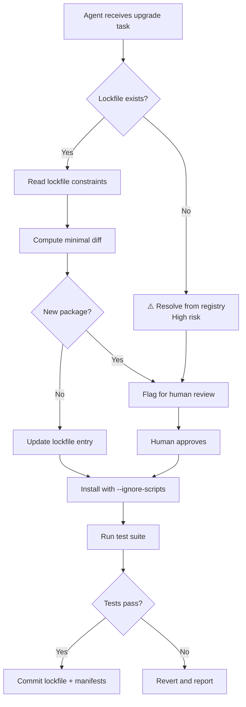

# Safe Dependency Management with Codex CLI: Why AI Agents Get It Wrong and How to Fix It


---

Dependency management is one of the most natural tasks to hand to a coding agent. "Upgrade React to v20," "patch all critical CVEs," "migrate from Express to Hono" — these feel like perfect agent workloads. The reality is more dangerous than most developers realise.

A January 2026 study analysing 117,062 dependency changes across seven ecosystems found that AI agents select known-vulnerable package versions **2.46% of the time** at PR submission, compared to **1.64% for humans** [^1]. Worse, agent-driven dependency work produced a net vulnerability increase of 98, whilst human-authored changes yielded a net reduction of 1,316 [^1]. The agents are not just less careful — they are actively degrading your security posture.

This article covers why agents struggle with dependencies, how to configure Codex CLI to manage them safely, and practical patterns for automated upgrade pipelines that do not compromise your supply chain.

## Why Coding Agents Fail at Dependency Decisions

Three failure modes dominate agent-driven dependency work.

### Hallucinated Packages and Versions

LLMs recommend packages that do not exist. Research shows **28% of LLM-assisted dependency upgrades suggest non-existent package versions** [^2]. Attackers exploit this through *slopsquatting* — registering the hallucinated package names with malicious payloads [^3]. When the agent resolves the name, it installs the attacker's code.

### Lockfile Regeneration

Agents frequently regenerate lockfiles from unpinned specifications rather than updating them incrementally. This resolves backdoored minor releases that a strict lockfile would have prevented [^3]. The poisoned `nx/debug` package on npm was automatically installed by coding agents operating without lockfile discipline, enabling a hidden backdoor that exfiltrated SSH keys and API tokens [^3].

### Install-Time Code Execution

When an agent runs `npm install` or `pip install`, postinstall scripts execute with the agent's permissions — which are typically broader than a human developer's terminal session [^3]. Codex CLI's sandbox mitigates this, but only if configured correctly.



## Configuring Codex CLI for Safe Dependency Work

### Sandbox Settings

The default `workspace-write` sandbox blocks network access, which means dependency installation fails unless you explicitly enable it. For dependency upgrade tasks, use a scoped configuration override:

```bash
codex -c 'sandbox_workspace_write.network_access=true' \
      -c 'approval_policy="on-request"' \
      "Upgrade all packages with critical CVEs and run tests"
```

Keeping `approval_policy` at `on-request` ensures you see every `npm install` or `pip install` command before it executes [^4]. Never combine network access with `--dangerously-bypass-approvals-and-sandbox` for dependency work.

### Profile for Dependency Tasks

Create a dedicated profile in `~/.codex/config.toml`:

```toml
[profiles.deps]
model = "gpt-5.4"
model_reasoning_effort = "high"
approval_policy = "on-request"

[profiles.deps.sandbox_workspace_write]
network_access = true
writable_roots = ["."]
```

Invoke it with `codex --profile deps` to get network access with mandatory human approval for every shell command [^5].

### AGENTS.md Dependency Policy

Encode your dependency rules in `AGENTS.md` so they persist across sessions:

```markdown
## Dependency Management Rules

- NEVER regenerate lockfiles from scratch. Use `npm ci` or `pip install -r requirements.txt` for installs.
- When adding a new dependency, update the lockfile incrementally (`npm install <pkg>`, NOT `rm package-lock.json && npm install`).
- Always pin exact versions in production dependencies.
- Run `npm audit` or `pip-audit` after any dependency change and report findings.
- Do NOT install packages from git URLs without explicit approval.
- Prefer `--ignore-scripts` for initial installs; enable scripts only for known-safe packages.
- After upgrading a major version, run the full test suite and list all breaking changes found.
```

This guidance is loaded into every Codex session automatically [^6], preventing the agent from taking shortcuts with your dependency tree.

## Practical Upgrade Patterns

### Pattern 1: Targeted CVE Patching

The safest dependency workflow — patch only what has a known vulnerability:

```bash
codex --profile deps \
  "Run npm audit. For each critical or high severity vulnerability, \
   upgrade the affected package to the minimum version that fixes the CVE. \
   Do not change any other dependencies. Run tests after each upgrade."
```

This constrains the agent to minimal, auditable changes. Each upgrade is a separate `npm install <pkg>@<version>` call that you approve individually.

### Pattern 2: Major Version Migration

For framework upgrades (React 19 → 20, Django 5.1 → 5.2), use a structured approach:

```bash
codex --profile deps \
  "I need to upgrade React from v19 to v20. \
   First, read the React 20 migration guide. \
   Then create a PLANS.md with every breaking change that affects our codebase. \
   Wait for my approval before making any changes."
```

After reviewing the plan, continue in the same session:

```bash
codex resume --last
# Then: "Proceed with the migration plan. Apply changes one file at a time, running tests after each."
```

This two-phase approach ensures the agent researches breaking changes before touching code [^7].

### Pattern 3: Automated Audit Pipeline with `codex exec`

For CI integration, use `codex exec` to run dependency audits headlessly:

```bash
#!/bin/bash
# .github/scripts/dependency-audit.sh

AUDIT_RESULT=$(codex exec \
  --approval-policy on-failure \
  --sandbox workspace-write \
  --model gpt-5.4 \
  "Run npm audit --json. Parse the output. \
   For each critical vulnerability, determine if a patch-level upgrade exists. \
   Output a JSON array of {package, current, target, cve} objects. \
   Do NOT install anything — only report." 2>&1)

echo "$AUDIT_RESULT"
```

This produces a structured audit report without modifying your project, suitable for a weekly scheduled GitHub Action [^8].

### Pattern 4: Multi-Ecosystem Dependency Review

For projects spanning multiple ecosystems, use a skill:

```markdown
# .agents/skills/dependency-review/SKILL.md

---
trigger: "review dependencies" OR "dependency audit" OR "check for updates"
---

## Dependency Review Skill

For each ecosystem detected in the project:

### Node.js (package.json)
1. Run `npm outdated --json`
2. Run `npm audit --json`
3. Categorise: critical patches, minor updates, major upgrades

### Python (requirements.txt / pyproject.toml)
1. Run `pip-audit --format=json` if pip-audit is installed
2. Run `pip list --outdated --format=json`
3. Categorise updates by severity

### Rust (Cargo.toml)
1. Run `cargo audit --json` if cargo-audit is installed
2. Run `cargo outdated --format=json` if cargo-outdated is installed

Output a unified Markdown report grouped by severity.
Do NOT install or upgrade anything — report only.
```

## Defence-in-Depth Checklist

The following checklist synthesises recommendations from Nesbitt's package security research [^3] [^9] and the DepDec-Bench study [^1]:

| Defence Layer | Implementation | Codex CLI Config |
|---|---|---|
| **Lockfile discipline** | Never regenerate; incremental updates only | AGENTS.md rule |
| **Install script isolation** | `--ignore-scripts` by default | `approval_policy = "on-request"` |
| **Network scoping** | Enable network only for dependency profiles | `profiles.deps.sandbox_workspace_write.network_access = true` |
| **Cooldown windows** | Wait 24–72 hours before installing new releases | AGENTS.md rule + human approval |
| **Provenance verification** | Require npm sigstore attestations where available | AGENTS.md rule |
| **Hallucination guard** | Verify package existence before install | AGENTS.md rule: "Confirm the package exists on the registry before installing" |
| **Audit trail** | Log every dependency change | OTel integration [^10] |
| **Post-install monitoring** | Continuous CVE scanning on merged dependencies | CI pipeline with `codex exec` |

## What the Benchmarks Miss

Current coding agent benchmarks like SWE-bench evaluate test-passing and executability but do not assess dependency decisions [^1]. The DepDec-Bench framework proposes evaluating safe version selection, dependency reuse, and restraint against unnecessary additions [^1] — but no major agent platform has adopted it yet.

Until benchmarks catch up, the responsibility falls on developers to constrain their agents. The patterns above treat dependency management as a *high-risk operation* requiring human oversight, not a task to delegate fully.

## Conclusion

Codex CLI is a powerful tool for dependency management when properly constrained. The key principles:

1. **Never bypass approvals** for dependency commands
2. **Lockfile integrity** is non-negotiable — encode it in AGENTS.md
3. **Separate profiles** for dependency work with scoped network access
4. **Audit before upgrade** — report first, change second
5. **Two-phase migrations** for major versions — plan, then execute

The agent compresses human judgement out of the dependency pipeline by default. Your job is to put it back in at the right checkpoints.

## Citations

[^1]: Singla, T. "Understanding Security Risks of AI Agents' Dependency Updates." arXiv:2601.00205, January 2026. [https://arxiv.org/abs/2601.00205](https://arxiv.org/abs/2601.00205)

[^2]: Lanyado, B. "LLM Package Hallucinations." Vulcan Cyber Research, 2025. Referenced in Nesbitt (2026). [https://nesbitt.io/2026/04/08/package-security-problems-for-ai-agents.html](https://nesbitt.io/2026/04/08/package-security-problems-for-ai-agents.html)

[^3]: Nesbitt, A. "Package Security Problems for AI Agents." April 8, 2026. [https://nesbitt.io/2026/04/08/package-security-problems-for-ai-agents.html](https://nesbitt.io/2026/04/08/package-security-problems-for-ai-agents.html)

[^4]: OpenAI. "Agent Approvals & Security — Codex." [https://developers.openai.com/codex/agent-approvals-security](https://developers.openai.com/codex/agent-approvals-security)

[^5]: OpenAI. "Advanced Configuration — Codex." [https://developers.openai.com/codex/config-advanced](https://developers.openai.com/codex/config-advanced)

[^6]: OpenAI. "Custom Instructions with AGENTS.md — Codex." [https://developers.openai.com/codex/guides/agents-md](https://developers.openai.com/codex/guides/agents-md)

[^7]: OpenAI. "Best Practices — Codex." [https://developers.openai.com/codex/learn/best-practices](https://developers.openai.com/codex/learn/best-practices)

[^8]: OpenAI Cookbook. "Use Codex CLI to Automatically Fix CI Failures." [https://cookbook.openai.com/examples/codex/autofix-github-actions](https://cookbook.openai.com/examples/codex/autofix-github-actions)

[^9]: Nesbitt, A. "Package Security Defenses for AI Agents." April 9, 2026. [https://nesbitt.io/2026/04/09/package-security-defenses-for-ai-agents.html](https://nesbitt.io/2026/04/09/package-security-defenses-for-ai-agents.html)

[^10]: OpenAI. "Codex CLI Advanced Configuration — OTel." [https://developers.openai.com/codex/config-advanced](https://developers.openai.com/codex/config-advanced)
