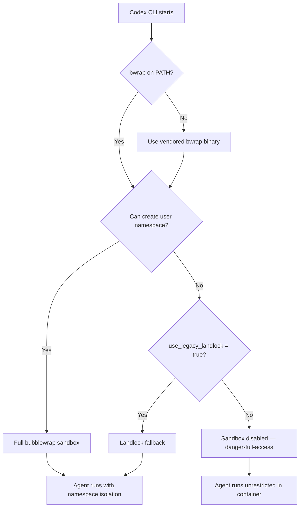
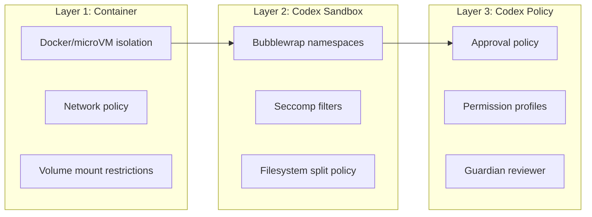

# Running Codex CLI in Devcontainers and Docker Sandboxes: Secure Containerised Agent Workflows


---

Running a coding agent on your bare metal workstation means trusting it with your filesystem, network, and credentials. Even with Codex CLI's built-in bubblewrap sandbox, a misconfigured `danger-full-access` flag or an unpatched namespace escape can expose your host[^1]. Containerisation adds a second, independent isolation boundary — and with Docker Sandboxes, devcontainer features, and custom Dockerfiles now mature enough for production use, there is no reason not to adopt one.

This article covers the three main approaches to running Codex CLI inside containers, the security trade-offs of each, and practical configuration for local development and CI/CD pipelines.

## Why Containerise Your Coding Agent?

Codex CLI already ships with platform-native sandboxing: Seatbelt on macOS, bubblewrap on Linux[^2]. These mechanisms restrict filesystem writes to the workspace and block network access by default. So why add another layer?

**Blast radius containment.** If an agent-generated command escapes the bubblewrap sandbox — something the CBSE (Configuration-Based Sandbox Escape) attack class has demonstrated is possible via path traversal and apply_patch bypasses[^3] — the container boundary is the second line of defence. The agent can trash the container filesystem without touching your host.

**Reproducible environments.** A Dockerfile pins the Node.js version, system libraries, and Codex CLI version. Every team member and CI runner gets an identical agent environment, eliminating "works on my machine" failures.

**Credential isolation.** Bind-mounting only `OPENAI_API_KEY` (not your entire `~/.ssh` or `~/.aws`) keeps secrets outside the agent's reach.

**CI/CD compatibility.** Headless `codex exec` inside a container slots naturally into GitHub Actions and GitLab CI without polluting runner state.

## Approach 1: Docker Sandboxes (`sbx run codex`)

Docker Sandboxes — shipped as the `sbx` CLI — run each agent inside a lightweight microVM with its own Linux kernel, filesystem, and network stack[^4]. This is the highest-isolation option available today.

### Setup

```bash
# Install Docker Sandboxes (requires Docker Desktop 4.44+)
sbx version

# Store your API key once
sbx secret set -g openai

# Launch Codex against a project
sbx run codex ~/my-project
```

If the workspace path is omitted, `sbx` defaults to the current directory[^5].

### Network Policies

Docker Sandboxes enforce network isolation via a host-side HTTP/HTTPS proxy with three configurable tiers[^4]:

| Policy | Behaviour |
|--------|-----------|
| **Open** | All traffic allowed |
| **Balanced** (default) | Default deny; common developer domains (npm, PyPI, GitHub) permitted |
| **Locked Down** | All traffic blocked unless explicitly allowed |

### Passing Codex CLI Options

Supply flags after a double-dash delimiter:

```bash
sbx run codex --name my-sandbox -- --model gpt-5.4 \
  -c model_reasoning_effort="high"
```

### Limitations

- User-level configuration (`~/.codex/config.toml`, memory files) is **not** mounted automatically — only project-level configuration travels into the sandbox[^5].
- Approval prompts are disabled by default inside the sandbox, so the agent runs with full autonomy within the container boundary.
- OAuth authentication runs on the host machine, not inside the sandbox container[^5].

## Approach 2: Devcontainer Features

For teams already using VS Code devcontainers, a community-maintained devcontainer feature installs Codex CLI as part of the container build[^6].

### Minimal Configuration

```json
{
  "name": "codex-dev",
  "image": "mcr.microsoft.com/devcontainers/base:ubuntu",
  "features": {
    "ghcr.io/dirien/devcontainer-feature-codex/codex:0": {
      "version": "latest"
    }
  },
  "remoteEnv": {
    "OPENAI_API_KEY": "${localEnv:OPENAI_API_KEY}"
  }
}
```

The feature requires Node.js — either include the `node` devcontainer feature or use a base image with Node pre-installed[^6].

### Persistent Authentication and Configuration

Bind-mount your Codex configuration directory to preserve session history and memory across container rebuilds:

```json
{
  "mounts": [
    "source=${localEnv:HOME}/.codex,target=/home/vscode/.codex,type=bind,consistency=cached"
  ]
}
```

> ⚠️ **Security note:** Avoid mounting your entire home directory. Bind only the specific directories the agent needs — `~/.codex` for configuration, never `~/.ssh` or `~/.aws`[^7].

### Version Pinning

For reproducible builds, pin the Codex CLI version:

```json
{
  "features": {
    "ghcr.io/dirien/devcontainer-feature-codex/codex:0": {
      "version": "1.0.9"
    }
  }
}
```

## Approach 3: Custom Dockerfile

When you need full control — custom system dependencies, language toolchains, or bubblewrap pre-installed — build your own image.

### Base Dockerfile

```dockerfile
FROM mcr.microsoft.com/devcontainers/base:ubuntu

# System dependencies
RUN apt-get update && apt-get install -y \
    curl git build-essential bubblewrap \
    && rm -rf /var/lib/apt/lists/*

# Node.js (required for Codex CLI)
RUN curl -fsSL https://deb.nodesource.com/setup_22.x | bash - \
    && apt-get install -y nodejs

# Install Codex CLI
RUN npm install -g @openai/codex@latest

# Non-root user with UID 1000 for host/container UID alignment
USER vscode
WORKDIR /workspace
```

### Docker Compose for Team Use

```yaml
services:
  codex-agent:
    build:
      context: .devcontainer
      dockerfile: Dockerfile
    volumes:
      - .:/workspace
      - codex-config:/home/vscode/.codex
    environment:
      - OPENAI_API_KEY
    security_opt:
      - seccomp=unconfined
    cap_add:
      - SYS_ADMIN
    command: codex exec "Run the test suite and fix failures"

volumes:
  codex-config:
```

The `SYS_ADMIN` capability and unconfined seccomp profile are necessary for bubblewrap's user namespace creation inside the container[^2]. Without them, `bwrap` cannot call `clone(CLONE_NEWUSER)` and Codex falls back to `danger-full-access` mode.

## The Bubblewrap-in-Container Challenge

Codex CLI's Linux sandbox uses bubblewrap to create isolated user and PID namespaces[^8]. Inside a Docker container, this requires the host kernel to permit unprivileged user namespace creation — which many container runtimes block by default.



### Enabling Bubblewrap in Containers

Three options, from most to least secure:

**Option A — Enable user namespaces in the container runtime:**

```bash
docker run --security-opt seccomp=unconfined \
  --cap-add SYS_ADMIN \
  -e OPENAI_API_KEY \
  -v $(pwd):/workspace \
  codex-agent
```

**Option B — Use the Landlock fallback:**

```toml
# .codex/config.toml inside the container
[features]
use_legacy_landlock = true
```

This avoids the namespace requirement but provides weaker isolation than bubblewrap[^8].

**Option C — Rely on container isolation alone:**

```bash
codex --sandbox danger-full-access exec "Fix the failing test"
```

When the container itself is the security boundary (as with Docker Sandboxes' microVMs), disabling the inner sandbox is acceptable. The agent cannot escape the container regardless[^4].

### AppArmor Considerations

On distributions with AppArmor restricting namespace creation (Ubuntu 24.04+), you may need[^2]:

```bash
sudo sysctl -w kernel.apparmor_restrict_unprivileged_userns=0
```

Or configure the container's AppArmor profile to permit `clone(CLONE_NEWUSER)`.

## Security Layering: Defence in Depth

The optimal configuration depends on your threat model:



| Scenario | Container Layer | Codex Sandbox | Approval Policy |
|----------|----------------|---------------|-----------------|
| Local dev (trusted code) | Devcontainer | `workspace-write` | `on-request` |
| CI/CD pipeline | Docker Sandboxes (balanced) | `read-only` | `never` |
| Untrusted repo review | Docker Sandboxes (locked down) | `read-only` | `untrusted` |
| Enterprise shared runner | microVM + custom seccomp | Full bubblewrap | `granular` + Guardian |

## CI/CD Integration Patterns

### GitHub Actions with Docker Sandboxes


```yaml
jobs:
  codex-autofix:
    runs-on: ubuntu-latest
    steps:
      - uses: actions/checkout@v4

      - name: Install Docker Sandboxes
        run: |
          curl -fsSL https://get.docker.com/sbx | sh

      - name: Run Codex in sandbox
        env:
          OPENAI_API_KEY: ${{ secrets.OPENAI_API_KEY }}
        run: |
          sbx run codex . -- exec \
            --sandbox read-only \
            --ask-for-approval never \
            "Analyse test failures and suggest fixes"
```


### GitLab CI with Custom Image

```yaml
codex-review:
  image: your-registry/codex-agent:latest
  variables:
    OPENAI_API_KEY: $OPENAI_API_KEY
  script:
    - codex exec --sandbox read-only --ask-for-approval never \
        "Review the diff in this merge request and list issues"
  artifacts:
    paths:
      - codex-output.md
```

### Headless Execution with `codex exec`

For containerised CI, `codex exec` is the entry point[^9]. It routes through `InProcessAppServerClient` (as of PR #14005), unifying the internal plumbing with the IDE integration path:

```bash
codex exec \
  --model gpt-5.3-codex \
  --sandbox read-only \
  --ask-for-approval never \
  "Run the linter, fix all warnings, and output a summary"
```

## Configuration Reference

### Essential `config.toml` for Containerised Agents

```toml
# Model selection
model = "gpt-5.3-codex"
model_reasoning_effort = "medium"

# Sandbox — adjust based on container isolation level
sandbox_mode = "workspace-write"
approval_policy = "on-request"

# Bubblewrap fallback if user namespaces unavailable
[features]
use_legacy_landlock = true

# Network — typically handled by container layer
[sandbox_workspace_write]
network_access = false

# Disable login shells for tighter security
allow_login_shell = false
```

### Named Profile for CI

```toml
[profiles.ci]
approval_policy = "never"
sandbox_mode = "read-only"
model_reasoning_effort = "low"
```

Activate with `codex --profile ci exec "..."`.

## Troubleshooting

| Symptom | Cause | Fix |
|---------|-------|-----|
| `bwrap: Can't create namespace` | Container blocks `CLONE_NEWUSER` | Add `--cap-add SYS_ADMIN --security-opt seccomp=unconfined` |
| `⚠ Codex could not find system bubblewrap` | `bwrap` not installed in image | `apt install bubblewrap` in Dockerfile |
| Sandbox falls back to `danger-full-access` | WSL1 or restricted container | Use `use_legacy_landlock = true` or accept container-only isolation |
| Config not loaded | `~/.codex` not mounted | Add bind mount for `.codex` directory |
| Network timeout in sandbox | Codex network isolation + container network isolation double-blocking | Set `network_access = true` in config and rely on container-level network policy |

## Conclusion

Containerising Codex CLI is not about replacing its built-in sandbox — it is about adding a second, independent isolation layer. Docker Sandboxes provide the strongest out-of-the-box isolation with microVM boundaries. Devcontainer features offer the smoothest developer experience for VS Code users. Custom Dockerfiles give full control for CI/CD and enterprise deployments.

The key architectural decision is where to enforce each security concern: let the container handle network isolation and credential scoping, let bubblewrap handle filesystem isolation within the workspace, and let Codex's approval policies handle the semantic layer of what the agent should and should not do.

## Citations

[^1]: Cymulate Research Labs, "Configuration-Based Sandbox Escape (CBSE)" research, April 2026. CVE-2025-59532 and related vulnerabilities demonstrating sandbox escape vectors in coding agents.

[^2]: OpenAI, "Sandbox – Codex CLI," OpenAI Developers documentation, 2026. [https://developers.openai.com/codex/concepts/sandboxing](https://developers.openai.com/codex/concepts/sandboxing)

[^3]: OpenAI Codex CLI v0.121.0 security fixes including apply_patch bypass remediation and zsh-fork bypass patches, April 2026. [https://github.com/openai/codex/releases](https://github.com/openai/codex/releases)

[^4]: Docker, "Docker Sandboxes — Sandboxes for Coding Agents," Docker documentation, 2026. [https://docs.docker.com/ai/sandboxes/](https://docs.docker.com/ai/sandboxes/)

[^5]: Docker, "Codex — Docker Sandboxes," Docker documentation, 2026. [https://docs.docker.com/ai/sandboxes/agents/codex/](https://docs.docker.com/ai/sandboxes/agents/codex/)

[^6]: Engin Diri, "devcontainer-feature-codex — Dev Container feature to install OpenAI Codex CLI," GitHub, 2026. [https://github.com/dirien/devcontainer-feature-codex](https://github.com/dirien/devcontainer-feature-codex)

[^7]: Mark Phelps, "Running AI Agents in Devcontainers," 2026. [https://markphelps.me/posts/running-ai-agents-in-devcontainers/](https://markphelps.me/posts/running-ai-agents-in-devcontainers/)

[^8]: OpenAI, "codex-rs/linux-sandbox README," GitHub, 2026. [https://github.com/openai/codex/blob/main/codex-rs/linux-sandbox/README.md](https://github.com/openai/codex/blob/main/codex-rs/linux-sandbox/README.md)

[^9]: OpenAI, "Agent approvals & security – Codex CLI," OpenAI Developers documentation, 2026. [https://developers.openai.com/codex/agent-approvals-security](https://developers.openai.com/codex/agent-approvals-security)
