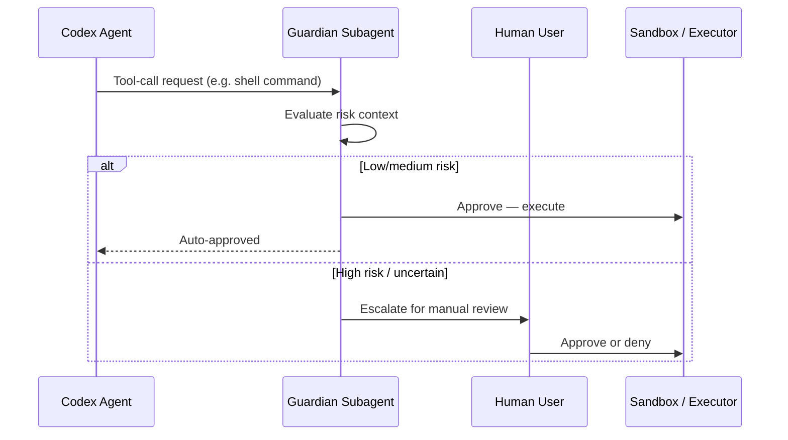

# Codex CLI Guardian Approval: Configuring Auto-Review Policies


---

Every developer who has spent a day in `on-request` mode knows the pattern: approve, approve, approve, glance-approve, approve-without-reading. That reflexive clicking — authorisation fatigue — is not just annoying; it is a genuine security risk[^1]. Codex CLI's guardian approval feature addresses this by delegating eligible approval decisions to a reviewer subagent: an independent LLM instance that evaluates each tool-call request on your behalf, escalating only genuinely risky operations to the human.

This article is a practical configuration reference. It covers every knob, shows how the pieces fit together, and provides copy-paste policy examples for common workflows.

## How Guardian Approval Works

When guardian approval is active, Codex interposes a reviewer subagent between the agent's requested action and execution. The flow looks like this:



The guardian inherits your current sandbox policy and network settings from the parent session[^2]. It sees the full conversation context, the requested command, and any file-change diffs. Its output is a structured assessment with discrete risk, authorisation, outcome, and rationale fields[^3].

## The Configuration Stack

Guardian approval involves three configuration keys that work in concert. Getting them right requires understanding how they interact.

### 1. `approval_policy` — When to Pause

Controls which actions trigger an approval checkpoint at all. Without a checkpoint, the guardian never sees the request.

```toml
# Options: "untrusted" | "on-request" | "never" | { granular = { ... } }
approval_policy = "on-request"
```

| Value | Behaviour |
|-------|-----------|
| `"untrusted"` | Only known-safe read operations run automatically; everything else pauses[^4] |
| `"on-request"` | Actions outside sandbox constraints pause for review |
| `"never"` | No approval checkpoints — guardian never activates |
| `{ granular = { ... } }` | Fine-grained control per category |

### 2. `approvals_reviewer` — Who Reviews

Determines whether approval checkpoints route to you or to the guardian subagent.

```toml
# Options: "user" | "guardian_subagent"
approvals_reviewer = "guardian_subagent"
```

Setting this to `"guardian_subagent"` is the key toggle[^5]. When set to `"user"` (the default), every checkpoint requires manual human response.

### 3. `features.guardian_approval` — Feature Gate

The experimental feature flag that enables the guardian subsystem. Required alongside `approvals_reviewer`[^6].

```toml
[features]
guardian_approval = true
```

### How They Interact

```mermaid
flowchart TD
    A[Agent requests action] --> B{approval_policy}
    B -->|"never"| C[Execute immediately — no review]
    B -->|"on-request" / "untrusted" / granular| D{Action needs approval?}
    D -->|No — within sandbox| C
    D -->|Yes — outside sandbox| E{approvals_reviewer}
    E -->|"user"| F[Prompt human]
    E -->|"guardian_subagent"| G{features.guardian_approval?}
    G -->|false| F
    G -->|true| H[Guardian evaluates]
    H -->|Approved| C
    H -->|Denied / Escalated| F
```

All three must align: `approval_policy` must create checkpoints, `approvals_reviewer` must point to the guardian, and the feature flag must be enabled. Miss any one and you get standard human-in-the-loop approval.

## Minimal Setup

The fastest path to guardian approval:

```toml
# ~/.codex/config.toml
approval_policy = "on-request"
approvals_reviewer = "guardian_subagent"

[features]
guardian_approval = true
```

Or enable it dynamically mid-session with the `/experimental` slash command in the TUI, which toggles Smart Approvals and automatically configures:

- `approval_policy = "on-request"`
- `approvals_reviewer = "guardian_subagent"`
- `sandbox_mode = "workspace-write"`[^7]

From the CLI, the `--full-auto` flag sets `--sandbox workspace-write --ask-for-approval on-request`, but you still need the guardian feature flag in your config to route reviews to the subagent rather than the terminal[^8].

## Granular Approval Policies

The real power emerges with granular policies. Instead of a blanket `"on-request"`, you can selectively enable or disable approval categories:

```toml
approval_policy = { granular = {
  sandbox_approval = true,     # Sandbox escalation prompts
  rules = true,                # ExecPolicy prompt rules
  mcp_elicitations = true,     # MCP server elicitation prompts
  request_permissions = false,  # request_permissions tool prompts
  skill_approval = false        # Skill-script approval prompts
} }

approvals_reviewer = "guardian_subagent"

[features]
guardian_approval = true
```

Each boolean controls whether that category of prompt surfaces at all[^5]. When a category is `true`, the prompt passes to whichever reviewer is configured. When `false`, Codex auto-rejects that category silently.

### Category Reference

| Category | What It Gates | Guardian-Eligible? |
|----------|--------------|-------------------|
| `sandbox_approval` | File writes outside workspace, network access | Yes |
| `rules` | ExecPolicy `prompt` rules from `.codex/exec-policy.toml` | Yes |
| `mcp_elicitations` | MCP servers requesting user input | Yes |
| `request_permissions` | Agent requesting additional permissions at runtime | No — always routes to user |
| `skill_approval` | Skill script execution confirmations | Yes |

Note that `request_permissions` always routes to the human regardless of reviewer setting — the guardian cannot grant itself new permissions[^5].

## Profile-Based Policies

Named profiles let you switch between approval configurations per task:

```toml
# Tight review for production work
[profiles.production]
approval_policy = "untrusted"
approvals_reviewer = "user"
sandbox_mode = "read-only"

# Guardian-assisted for routine development
[profiles.dev]
approval_policy = "on-request"
approvals_reviewer = "guardian_subagent"
sandbox_mode = "workspace-write"

# Full autonomy for trusted CI pipelines
[profiles.ci]
approval_policy = "never"
sandbox_mode = "workspace-write"
```

Switch profiles from the command line:

```bash
codex --profile dev "Refactor the auth module"
codex --profile production "Review the deployment config changes"
```

## Admin Constraints for Teams

Enterprise administrators can constrain which reviewers are permitted using managed configuration[^9]. The `allowed_approvals_reviewers` admin setting restricts what individual developers can configure:

```toml
# Admin-managed config (organisation level)
allowed_approvals_reviewers = ["user"]  # Guardian disabled org-wide
```

When set, any developer attempting to configure `approvals_reviewer = "guardian_subagent"` will find it silently overridden to the allowed value. This gives security teams a kill switch for guardian approval across the organisation without modifying individual developer configs.

## What the Guardian Sees

When evaluating a request, the guardian subagent receives:

1. **The conversation context** — what the agent has been asked to do
2. **The specific tool call** — the command, file path, or API request
3. **Sandbox state** — current permission boundaries
4. **Recent actions** — what the agent has already done in this session

It produces a structured assessment containing risk level, authorisation decision, outcome, and human-readable rationale[^3]. This structured output feeds into the app-server protocol via lifecycle notifications: `item/autoApprovalReview/started` and `item/autoApprovalReview/completed`[^7].

## Practical Examples

### Example 1: Guardian Approves a Test Command

With guardian enabled, running `npm run test` when it requires network access:

```
Agent wants to run: npm run test
⏳ Guardian reviewing...
✅ Auto-reviewer approved codex to run npm run test this time.
```

The guardian recognises test commands as routine and approves without human intervention[^1].

### Example 2: Guardian Escalates a Destructive Operation

```
Agent wants to run: rm -rf dist/ && git push --force origin main
⏳ Guardian reviewing...
⚠️ Auto-reviewer denied (risk: high) — escalating to user
> Approve? [y/N]
```

Force pushes and recursive deletions trigger the guardian's high-risk heuristics, routing to the human.

### Example 3: Granular Policy Skipping MCP Prompts

```toml
approval_policy = { granular = {
  sandbox_approval = true,
  mcp_elicitations = false   # Auto-reject MCP prompts
} }
approvals_reviewer = "guardian_subagent"
```

MCP elicitation prompts are silently rejected. Sandbox escalations route through the guardian. This is useful when MCP servers are chatty but trusted.

## Troubleshooting

### "Guardian review completed without an assessment payload"

This error (tracked in issue #15341) occurred in v0.116.0 when the underlying API returned malformed reasoning items. The fix (PR #15542) drops orphan reasoning items before replay[^10]. Upgrade to v0.117.0+ to resolve.

### Guardian Never Activates

Check all three conditions:

1. `approval_policy` is not `"never"` — that bypasses all checkpoints
2. `approvals_reviewer = "guardian_subagent"` is set
3. `features.guardian_approval = true` is present
4. The action actually falls outside your sandbox boundary

### Guardian Approves Too Aggressively

Tighten the sandbox. The guardian evaluates risk relative to your sandbox policy. A broad `workspace-write` sandbox means fewer actions need approval in the first place. Consider:

```toml
sandbox_mode = "read-only"
approval_policy = "on-request"
approvals_reviewer = "guardian_subagent"
```

This forces more actions through the approval checkpoint, giving the guardian more opportunities to evaluate.

## Guardian in CI/CD Pipelines

For `codex exec` in CI, guardian approval adds a layer of runtime safety without blocking:

```bash
codex exec \
  --sandbox workspace-write \
  --ask-for-approval on-request \
  "Run the migration and verify schema"
```

With `guardian_approval = true` in the CI environment's config, approval checkpoints are handled by the guardian rather than hanging on stdin. This is particularly valuable for long-running batch jobs where human approval would stall the pipeline[^8].

⚠️ Note: `codex exec` behaviour with guardian in fully non-interactive environments may vary — test thoroughly in your CI setup before relying on it for production pipelines.

## Guardian vs Full Autonomy

A common question: why not just use `approval_policy = "never"` and skip approvals entirely?

The guardian provides **informed autonomy** rather than blind autonomy. It evaluates each action against the conversation context and can catch genuinely dangerous operations that the static sandbox policy cannot anticipate — like a semantically dangerous `curl` to a production endpoint that is technically within the network allowlist. The `"never"` policy skips all safety checks; the guardian maintains them while removing the human bottleneck for routine operations.

## Summary

| Configuration | Effect |
|---------------|--------|
| `approval_policy = "on-request"` | Creates approval checkpoints for out-of-sandbox actions |
| `approvals_reviewer = "guardian_subagent"` | Routes checkpoints to AI reviewer instead of human |
| `features.guardian_approval = true` | Enables the guardian subsystem |
| Granular policy with category booleans | Selective checkpoint control per action type |
| `allowed_approvals_reviewers` (admin) | Organisation-level constraint on reviewer options |
| `--profile <name>` | Switch between named policy sets |

The guardian is not a replacement for sandbox policy — it is a complement. Configure your sandbox boundaries first, then layer guardian approval on top for the actions that cross those boundaries. The result is a workflow that maintains security oversight without the authorisation fatigue that undermines it.

## Citations

[^1]: azukiazusa.dev, "Understanding Codex Sandbox and Agent Approvals," 2026. [https://azukiazusa.dev/en/blog/codex-sandbox-agent-authorization/](https://azukiazusa.dev/en/blog/codex-sandbox-agent-authorization/)

[^2]: OpenAI, "Subagents – Codex," OpenAI Developers. [https://developers.openai.com/codex/subagents](https://developers.openai.com/codex/subagents)

[^3]: OpenAI, "Guardian Output Schema," PR #17061 / Codex CLI v0.119. Referenced in existing codex-resources article `2026-04-10-guardian-output-schema-enterprise-compliance.md`.

[^4]: OpenAI, "Agent approvals & security – Codex," OpenAI Developers. [https://developers.openai.com/codex/agent-approvals-security](https://developers.openai.com/codex/agent-approvals-security)

[^5]: OpenAI, "Configuration Reference – Codex," OpenAI Developers. [https://developers.openai.com/codex/config-reference](https://developers.openai.com/codex/config-reference)

[^6]: OpenAI, "Sample Configuration – Codex," OpenAI Developers. [https://developers.openai.com/codex/config-sample](https://developers.openai.com/codex/config-sample)

[^7]: charley-oai, "Add Smart Approvals guardian review across core, app-server, and TUI," PR #13860, openai/codex. [https://github.com/openai/codex/pull/13860](https://github.com/openai/codex/pull/13860)

[^8]: SmartScope, "Codex CLI No-Approval Guide: --full-auto vs approval modes," 2026. [https://smartscope.blog/en/generative-ai/chatgpt/codex-cli-approval-modes-no-approval/](https://smartscope.blog/en/generative-ai/chatgpt/codex-cli-approval-modes-no-approval/)

[^9]: OpenAI, "Advanced Configuration – Codex," OpenAI Developers. [https://developers.openai.com/codex/config-advanced](https://developers.openai.com/codex/config-advanced)

[^10]: GitHub Issue #15341, "Automatic approval review failed: guardian review completed without an assessment payload," openai/codex. [https://github.com/openai/codex/issues/15341](https://github.com/openai/codex/issues/15341)
