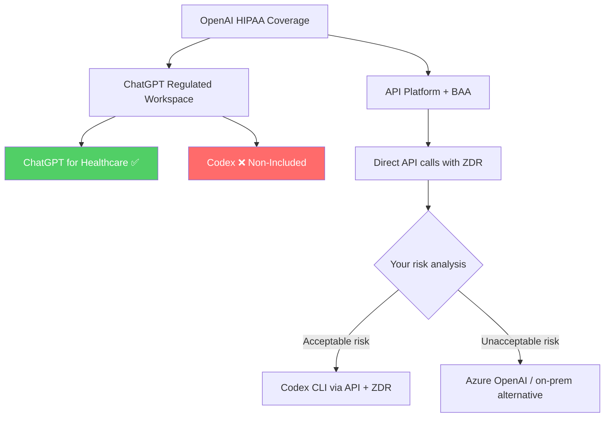
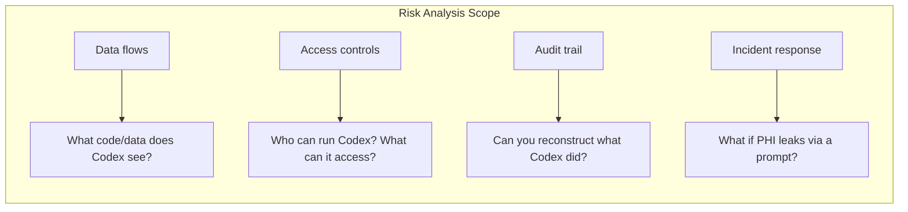
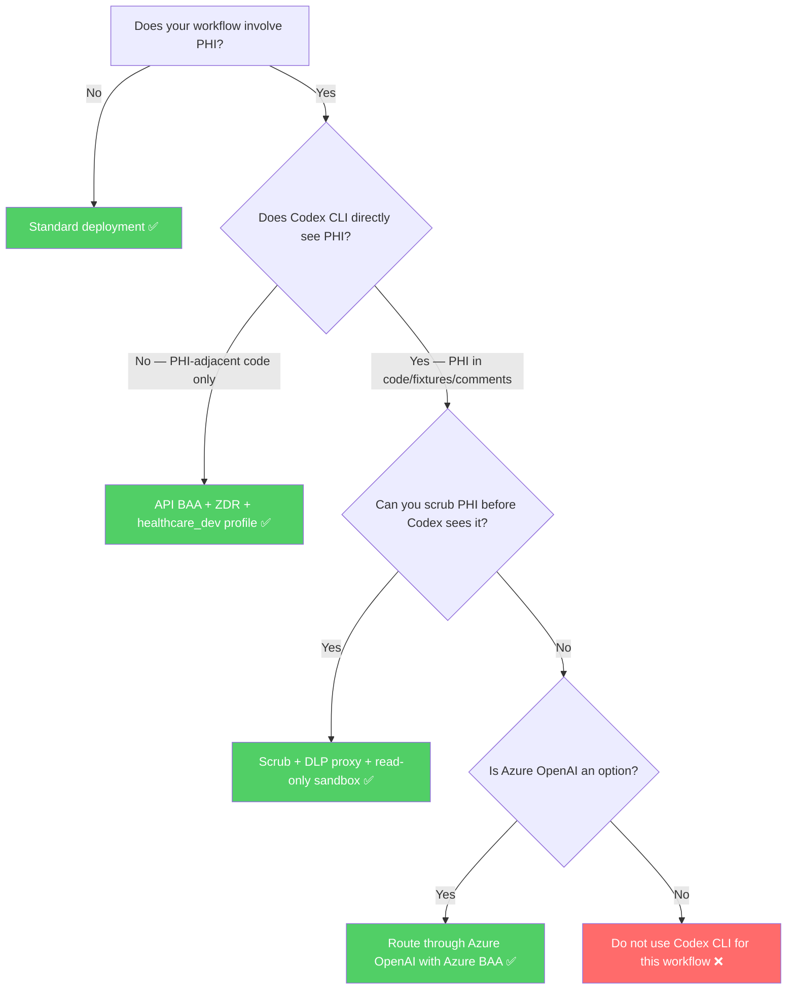

# Codex CLI HIPAA Compliance in 2026: The Regulated Workspace Exclusion and What It Means


If your organisation processes Protected Health Information (PHI) and you are evaluating Codex CLI, there is a critical distinction buried in OpenAI's documentation that most teams miss: **Codex is listed as "Non-Included Functionality" in the ChatGPT Regulated Workspace specification**.[^1] This does not mean Codex CLI cannot be used in healthcare settings — but it fundamentally changes the compliance architecture you need to build around it.

This article updates the compliance landscape as of April 2026, covering the Regulated Workspace exclusion, new OpenAI certifications, the updated HIPAA Security Rule requirements, and practical deployment patterns for teams that need to use Codex CLI with PHI-adjacent workflows.

---

## The Regulated Workspace Exclusion: What Changed

OpenAI's ChatGPT Regulated Workspace specification, dated January 8, 2026, defines a hardened environment for handling PHI under a signed Business Associate Agreement (BAA).[^1] The Regulated Workspace covers ChatGPT for Healthcare — a dedicated product launched in January 2026 with GPT-5.2 clinical models and BAA support.[^2]

However, the specification explicitly lists **Codex as "Non-Included Functionality"**.[^1] This means:

- Codex Cloud tasks are **not** covered by the Regulated Workspace's HIPAA protections
- The BAA's PHI handling guarantees do **not** extend to Codex-specific features
- Organisations cannot rely on the Regulated Workspace as their HIPAA compliance mechanism for Codex workflows

This is a significant departure from the earlier understanding (documented in [the March 2026 regulated environments article](/2026/03/28/codex-cli-regulated-environments-hipaa-soc2/)) that ZDR + BAA = HIPAA-eligible for all API surfaces. The Regulated Workspace exclusion means teams need a more nuanced approach.



### What This Means in Practice

The exclusion does **not** mean Codex CLI is prohibited in healthcare environments. It means:

1. **Your BAA coverage comes from the API layer**, not the Regulated Workspace product. The OpenAI API BAA (requested via `baa@openai.com`) still covers API traffic with ZDR enabled.[^3]
2. **Codex-specific features** — Cloud tasks, Slack integrations, Linear integrations — fall outside the Regulated Workspace's PHI protections. These must not process PHI unless you have separate written confirmation from OpenAI.
3. **Your organisation bears the risk analysis burden.** Under the updated HIPAA Security Rule, you must document why your Codex CLI deployment meets the Security Rule requirements independently of the Regulated Workspace.[^4]

---

## Updated OpenAI Certification Landscape (April 2026)

Since the March 2026 article, OpenAI's Trust Portal has expanded considerably.[^5] The current certification inventory:

| Certification | Status | Relevance |
|---|---|---|
| SOC 2 Type II (Security, Availability, Confidentiality, Privacy) | ✅ Current (Jan–Jun 2025 report) | Core audit evidence |
| SOC 3 | ✅ Current | Public-facing summary |
| ISO/IEC 27001:2022 | ✅ Current | Information security management |
| ISO/IEC 27017:2015 | ✅ Current | Cloud security controls |
| ISO/IEC 27018:2019 | ✅ Current | PII protection in cloud |
| ISO/IEC 27701:2019 | ✅ Current | Privacy information management |
| **ISO/IEC 42001:2023** | ✅ **New** | AI management systems |
| **CSA STAR** | ✅ **New** | Cloud Security Alliance |
| **PCI DSS v4.0.1** | ✅ **New** | Payment card industry |
| **FedRAMP 20x Moderate** | 🔄 In progress | Federal risk authorisation |
| **TX-RAMP** | ✅ **New** | Texas Risk and Authorization |
| GDPR / CCPA | ✅ Compliant | Data protection |

Three certifications are particularly relevant for healthcare compliance teams:

**ISO/IEC 42001:2023** covers AI-specific management systems — governance, risk management, and responsible development of AI systems.[^6] This is the first AI-specific ISO standard, and OpenAI holding it provides evidence that the underlying platform has formal AI governance controls. Useful for auditors asking "how does the AI vendor manage AI-specific risks?"

**CSA STAR** provides cloud security assurance through the Cloud Security Alliance's maturity model.[^7] For organisations using the CSA CAIQ (Consensus Assessments Initiative Questionnaire) as part of their vendor assessment, OpenAI's STAR listing simplifies the evaluation.

**FedRAMP 20x Moderate** remains in progress.[^8] Federal healthcare agencies (VA, DoD health, HHS) requiring FedRAMP authorisation should continue routing through Azure OpenAI Service, which holds FedRAMP High P-ATO.

---

## The 2026 HIPAA Security Rule: What Changed for AI Tools

The HIPAA Security Rule update, finalised from the January 2025 NPRM, introduces explicit requirements for AI tools in healthcare settings.[^4] Key provisions affecting Codex CLI deployments:

### Technology Asset Inventory

All AI coding tools must be inventoried as technology assets under the updated Security Rule. Your Codex CLI deployment needs a formal entry in your asset inventory that includes:

- Version number (currently v0.121.0 as of April 2026)[^9]
- Authentication method (API key vs ChatGPT Enterprise login)
- Data flow classification (PHI-adjacent vs PHI-touching)
- Sandbox mode and approval policy configuration

### Risk Analysis Inclusion

The updated rule explicitly requires AI tools to be included in your organisation's risk analysis.[^4] For Codex CLI, this means documenting:



### Patch Management

The Security Rule now requires documented patch management for all technology assets.[^4] Codex CLI's rapid release cadence (multiple releases per month) means you need a process for evaluating and deploying updates. The v0.121.0 release (April 15, 2026) introduced secure devcontainer profiles, bubblewrap sandbox improvements, and supply-chain hardening — all security-relevant changes that should trigger your patch evaluation workflow.[^9]

---

## Practical Deployment: PHI-Adjacent vs PHI-Touching Workflows

The most pragmatic approach for healthcare teams is to classify Codex CLI usage into two categories and apply different controls to each.

### PHI-Adjacent Workflows (Lower Risk)

Codex CLI operates on code that *processes* PHI but never sees the PHI itself. Examples: refactoring an EHR integration module, writing database migration scripts for a patient records schema, generating unit tests for a FHIR API client.

**Minimum controls:**

```toml
# config.toml — PHI-adjacent profile
[permissions.healthcare_dev]
network.enabled = true
network.mode = "limited"
network.allowed_domains = ["api.openai.com"]

[sandbox]
mode = "workspace-write"

[default_permissions]
profile = "healthcare_dev"
```

Pair with `requirements.toml` to prevent developers from overriding:

```toml
# /etc/codex/requirements.toml
allowed_approval_policies = ["on-request", "untrusted"]
allowed_sandbox_modes = ["workspace-write", "read-only"]

[features]
log_user_prompt = false
```

### PHI-Touching Workflows (Higher Risk)

Codex CLI might encounter PHI in code comments, test fixtures, configuration files, or database seed data. This category requires stricter controls.

**Additional controls beyond the PHI-adjacent baseline:**

1. **Data Loss Prevention (DLP) proxy** — route all API traffic through a corporate gateway that scans for PHI patterns (SSN, MRN, date-of-birth combinations) before they leave the network.[^10]

2. **Read-only sandbox mode** — prevent Codex from writing files that might persist PHI in the working tree:

```toml
[sandbox]
mode = "read-only"
```

1. **Pre-session data scrubbing** — use `.codexignore` or equivalent to exclude directories containing test fixtures with PHI:

```bash
# .codexignore
test/fixtures/patient_data/
seeds/
data/sample_records/
```

1. **Separate API key with ZDR verification** — use a dedicated API key for PHI-touching projects and verify ZDR status quarterly:

```bash
curl https://api.openai.com/v1/organization/settings \
  -H "Authorization: Bearer $OPENAI_HEALTHCARE_KEY" | jq '.data_retention'
```

---

## Compliance API Limitations: The API Key Gap

A significant gap exists in Codex's audit infrastructure: **API-key-authenticated Codex CLI usage is not captured by the Compliance API**.[^11] The Compliance API only records events from ChatGPT-authenticated usage — meaning if your developers authenticate Codex CLI with direct API keys (the most common pattern), their sessions will not appear in Compliance API exports.

This creates a blind spot for HIPAA audit trails. Mitigations:

| Gap | Mitigation |
|---|---|
| API-key sessions missing from Compliance API | Export OTel spans to your SIEM as the primary audit source |
| No centralised session recording for API-key usage | Implement corporate proxy logging (deployment Option B) |
| Cannot query historical sessions via Compliance API | Archive OTel data to immutable storage (S3 with Object Lock) |

The OTel pipeline becomes your **primary** audit evidence source rather than a supplementary one. Configure it with immutable storage and retention periods matching HIPAA requirements (minimum 6 years):[^12]

```toml
[otel]
exporter = "otlp-http"
trace_exporter = "otlp-http"
metrics_exporter = "otlp-http"
environment = "production-healthcare"
# CRITICAL: do not enable prompt logging in PHI environments
# log_user_prompt = false  (default)
```

---

## Supply-Chain Security Considerations

The v0.121.0 release addressed several supply-chain hardening concerns relevant to healthcare deployments.[^9] Healthcare compliance teams should verify:

1. **Binary integrity** — verify Codex CLI binaries against published checksums before deployment to developer workstations
2. **Dependency auditing** — Codex CLI's dependency tree should be included in your software composition analysis (SCA) scans
3. **Update channel** — pin to verified releases rather than tracking the bleeding edge in regulated environments

```bash
# Verify installed version
codex --version
# Expected: 0.121.0 or later with supply-chain hardening
```

---

## Decision Framework: Can You Use Codex CLI with PHI?



---

## Audit Checklist: Evidence Your Auditor Will Request

For healthcare organisations deploying Codex CLI, assemble this evidence package proactively:

- [ ] **BAA** — signed API-level BAA from OpenAI (not Regulated Workspace)
- [ ] **ZDR confirmation** — per-surface verification, distinguishing CLI/IDE (automatic ZDR) from Cloud tasks (workspace policy)
- [ ] **Risk analysis** — Codex CLI documented as a technology asset with data flow diagrams
- [ ] **`requirements.toml`** — centrally managed policy preventing `danger-full-access` mode and prompt logging
- [ ] **OTel pipeline** — spans archived to immutable storage with 6-year retention
- [ ] **DLP proxy logs** — evidence that outbound API traffic is scanned for PHI patterns (if PHI-touching)
- [ ] **SCIM configuration** — IdP-backed access management with automated deprovisioning
- [ ] **Patch management records** — documented evaluation of Codex CLI updates
- [ ] **Incident response plan** — documented procedure for PHI exposure via prompts
- [ ] **Vendor risk assessment** — OpenAI documented in third-party risk register with ISO 42001, SOC 2 Type II, and CSA STAR evidence

---

## Summary

The Regulated Workspace exclusion is not a dealbreaker — it is a boundary clarification. Codex CLI remains deployable in healthcare environments, but the compliance architecture must be built on the **API-level BAA and ZDR** rather than on the Regulated Workspace product. The key changes since early 2026:

1. **Codex is excluded from the Regulated Workspace** — do not rely on it for HIPAA compliance
2. **New certifications** (ISO 42001, CSA STAR, PCI DSS v4.0.1) strengthen the vendor evidence package
3. **The Compliance API has a gap** for API-key-authenticated usage — OTel becomes your primary audit source
4. **The updated HIPAA Security Rule** explicitly requires AI tools in your risk analysis and asset inventory
5. **PHI-adjacent vs PHI-touching** classification drives your control selection

For teams already running the controls described in the [March 2026 regulated environments article](/2026/03/28/codex-cli-regulated-environments-hipaa-soc2/), the primary action is to update your risk analysis documentation to reflect the Regulated Workspace exclusion and ensure your OTel pipeline — not the Compliance API — is your designated audit evidence source.

---

## Citations

[^1]: OpenAI — "ChatGPT Regulated Workspace" specification (January 8, 2026). Codex listed as "Non-Included Functionality." [cdn.openai.com/osa/chatgpt-regulated-workspace.pdf](https://cdn.openai.com/osa/chatgpt-regulated-workspace.pdf) (accessed April 2026).

[^2]: OpenAI — "OpenAI for Healthcare" announcement. ChatGPT for Healthcare with BAA support and GPT-5.2 clinical models. [openai.com/index/openai-for-healthcare](https://openai.com/index/openai-for-healthcare/) (accessed April 2026).

[^3]: OpenAI Help Centre — "How can I get a Business Associate Agreement (BAA) with OpenAI?" [help.openai.com/en/articles/8660679](https://help.openai.com/en/articles/8660679-how-can-i-get-a-business-associate-agreement-baa-with-openai) (accessed April 2026).

[^4]: HHS HIPAA Security Rule NPRM (January 2025) — AI tools must be included in risk analysis activities. Accorian summary: "HIPAA Security Rule 2026 — This Is Going to Expose Some Gaps." [accorian.com/hipaa-security-rule-2026-this-is-going-to-expose-some-gaps](https://www.accorian.com/hipaa-security-rule-2026-this-is-going-to-expose-some-gaps/) (accessed April 2026).

[^5]: OpenAI Trust Portal — full certifications list including ISO 42001, CSA STAR, PCI DSS v4.0.1. [trust.openai.com](https://trust.openai.com/) (accessed April 2026).

[^6]: ISO/IEC 42001:2023 — Information technology — Artificial intelligence — Management system. [iso.org/standard/81230.html](https://www.iso.org/standard/81230.html) (accessed April 2026).

[^7]: Cloud Security Alliance — STAR Registry. [cloudsecurityalliance.org/star](https://cloudsecurityalliance.org/star/) (accessed April 2026).

[^8]: OpenAI Help Centre — "ChatGPT Enterprise and API Platform for FedRAMP." [help.openai.com/en/articles/20001070](https://help.openai.com/en/articles/20001070-chatgpt-enterprise-and-api-platform-for-fedramp) (accessed April 2026).

[^9]: OpenAI Codex Changelog — v0.121.0 (April 15, 2026): secure devcontainer profile, bubblewrap sandbox, supply-chain hardening. [developers.openai.com/codex/changelog](https://developers.openai.com/codex/changelog) (accessed April 2026).

[^10]: HIPAA Journal — "Is ChatGPT HIPAA Compliant?" (updated 2026). DLP proxy recommendations for AI tool deployments. [hipaajournal.com/is-chatgpt-hipaa-compliant](https://www.hipaajournal.com/is-chatgpt-hipaa-compliant/) (accessed April 2026).

[^11]: OpenAI Developers — Admin Setup for Codex Enterprise. Compliance API scope and authentication requirements. [developers.openai.com/codex/enterprise/admin-setup](https://developers.openai.com/codex/enterprise/admin-setup) (accessed April 2026).

[^12]: NIST SP 800-66r2 — Implementing the HIPAA Security Rule: A Cybersecurity Resource Guide. Retention requirements. [csrc.nist.gov/publications/detail/sp/800-66/rev-2/final](https://csrc.nist.gov/publications/detail/sp/800-66/rev-2/final) (accessed April 2026).
