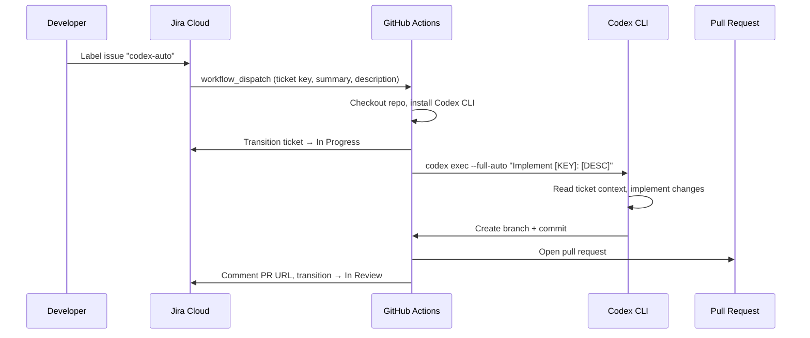
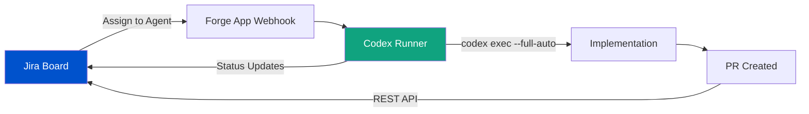

# Ticket-Driven Development with Codex CLI: Automating the Jira-to-Pull-Request Pipeline


---

The Atlassian Rovo MCP Server reached general availability in February 2026, exposing over 60 tools spanning Jira, Confluence, Bitbucket Cloud, Compass, and Jira Service Management to any MCP-compatible client[^1]. Meanwhile, Atlassian's "Agents in Jira" open beta — launched in March 2026 — allows AI agents to appear as assignees alongside human developers on Jira boards[^2]. These two developments, combined with Codex CLI's `codex exec` headless mode, make fully automated ticket-to-PR pipelines a practical reality.

This article covers the end-to-end automation pipeline: from Jira label trigger through agent implementation to pull request creation and ticket status update. It assumes familiarity with Codex CLI basics and MCP configuration; for initial setup, see the companion article on [Codex CLI and Jira: Issue-Driven Development](/2026/04/10/codex-cli-jira-atlassian-mcp-server/).

---

## The SSE Deprecation: Migrate Before June 2026

Before building automation pipelines, address the transport change. The legacy HTTP+SSE endpoint at `/v1/sse` is deprecated and **will stop working after 30 June 2026**[^3]. The replacement is Streamable HTTP at `/v1/mcp`, which uses a single endpoint for bidirectional communication and dynamically upgrades to SSE when needed[^4].

Update your `~/.codex/config.toml` or project-level `.codex/config.toml`:

```toml
[mcp_servers.atlassian]
type = "command"
command = ["npx", "-y", "mcp-remote", "https://mcp.atlassian.com/v1/mcp", "--transport", "http-first"]
```

If your Codex CLI version supports native HTTP MCP transport (v0.120+), you can skip `mcp-remote` entirely:

```toml
[mcp_servers.atlassian]
url = "https://mcp.atlassian.com/v1/mcp"
bearer_token_env_var = "ATLASSIAN_TOKEN"
```

The native transport is simpler, avoids the Node.js dependency, and is the recommended path for CI environments[^5].

---

## Architecture: Label-Triggered Automation

The pipeline follows a pattern documented in the OpenAI Cookbook[^6]: a Jira automation rule triggers a GitHub Actions workflow, which runs Codex CLI in full-auto mode against the ticket's requirements.



### Step 1: Jira Automation Rule

In Jira Cloud, create an automation rule triggered by the label `codex-auto`:

- **Trigger:** Issue labelled with `codex-auto`
- **Action:** Send web request (POST) to `https://api.github.com/repos/{owner}/{repo}/dispatches`
- **Headers:** `Authorization: Bearer {{GITHUB_PAT}}`, `Accept: application/vnd.github+json`
- **Body:**


```json
{
  "event_type": "jira-codex-auto",
  "client_payload": {
    "ticket_key": "{{issue.key}}",
    "summary": "{{issue.summary}}",
    "description": "{{issue.description}}"
  }
}
```


### Step 2: GitHub Actions Workflow


```yaml
name: Codex Auto-Implement
on:
  repository_dispatch:
    types: [jira-codex-auto]

jobs:
  implement:
    runs-on: ubuntu-latest
    timeout-minutes: 30
    steps:
      - uses: actions/checkout@v4

      - name: Install Codex CLI
        run: npm install -g @openai/codex

      - name: Transition ticket to In Progress
        env:
          JIRA_BASE_URL: ${{ secrets.JIRA_BASE_URL }}
          JIRA_EMAIL: ${{ secrets.JIRA_EMAIL }}
          JIRA_API_TOKEN: ${{ secrets.JIRA_API_TOKEN }}
        run: |
          TICKET_KEY="${{ github.event.client_payload.ticket_key }}"
          curl -s -X POST \
            "$JIRA_BASE_URL/rest/api/3/issue/$TICKET_KEY/transitions" \
            -u "$JIRA_EMAIL:$JIRA_API_TOKEN" \
            -H "Content-Type: application/json" \
            -d '{"transition":{"id":"21"}}'

      - name: Run Codex CLI
        env:
          OPENAI_API_KEY: ${{ secrets.OPENAI_API_KEY }}
        run: |
          TICKET_KEY="${{ github.event.client_payload.ticket_key }}"
          SUMMARY="${{ github.event.client_payload.summary }}"
          DESCRIPTION="${{ github.event.client_payload.description }}"

          git checkout -b "codex/$TICKET_KEY"

          codex exec \
            --approval-mode full-auto \
            --model o4-mini \
            "Implement Jira ticket $TICKET_KEY: $SUMMARY. Details: $DESCRIPTION. \
             Write tests. Follow existing code conventions."

          git add -A
          git commit -m "feat($TICKET_KEY): $SUMMARY

          Automated implementation by Codex CLI.
          Jira: $JIRA_BASE_URL/browse/$TICKET_KEY"

      - name: Create PR and update Jira
        env:
          GH_TOKEN: ${{ secrets.GITHUB_TOKEN }}
          JIRA_BASE_URL: ${{ secrets.JIRA_BASE_URL }}
          JIRA_EMAIL: ${{ secrets.JIRA_EMAIL }}
          JIRA_API_TOKEN: ${{ secrets.JIRA_API_TOKEN }}
        run: |
          TICKET_KEY="${{ github.event.client_payload.ticket_key }}"
          SUMMARY="${{ github.event.client_payload.summary }}"

          git push -u origin "codex/$TICKET_KEY"
          PR_URL=$(gh pr create \
            --title "feat($TICKET_KEY): $SUMMARY" \
            --body "Automated implementation of $TICKET_KEY ($JIRA_BASE_URL/browse/$TICKET_KEY)." \
            --head "codex/$TICKET_KEY")

          # Comment PR URL on Jira ticket
          curl -s -X POST \
            "$JIRA_BASE_URL/rest/api/3/issue/$TICKET_KEY/comment" \
            -u "$JIRA_EMAIL:$JIRA_API_TOKEN" \
            -H "Content-Type: application/json" \
            -d "{\"body\":{\"type\":\"doc\",\"version\":1,\"content\":[{\"type\":\"paragraph\",\"content\":[{\"type\":\"text\",\"text\":\"Codex CLI opened PR: $PR_URL\"}]}]}}"

          # Transition to In Review
          curl -s -X POST \
            "$JIRA_BASE_URL/rest/api/3/issue/$TICKET_KEY/transitions" \
            -u "$JIRA_EMAIL:$JIRA_API_TOKEN" \
            -H "Content-Type: application/json" \
            -d '{"transition":{"id":"31"}}'
```


⚠️ Transition IDs (`21`, `31`) are project-specific. Retrieve yours via the Jira REST API: `GET /rest/api/3/issue/{key}/transitions`.

---

## Enriching Agent Context with Confluence

A ticket summary rarely contains enough context for high-quality implementation. The Rovo MCP Server exposes Confluence tools — `getConfluencePage`, `searchConfluenceUsingCql` — that let the agent pull architecture documents, API specifications, and design decisions at runtime[^1].

Configure this in your project's `AGENTS.md`:

```markdown
## Jira Ticket Context Protocol

When implementing a Jira ticket:
1. Read the full ticket with `getJiraIssue` including all comments
2. Search Confluence for the ticket key: `searchConfluenceUsingCql` with
   query `text ~ "PROJ-1234"` to find related design docs
3. Check linked issues via `getJiraIssueRemoteIssueLinks`
4. If the ticket references an API, search Confluence for the API spec:
   `searchConfluenceUsingCql` with query `label = "api-spec" AND text ~ "<service-name>"`

Always limit search results: set `maxResults` to 10 to avoid context overflow.
```

This pattern transforms the agent from "implement what the summary says" to "implement what the team intended," pulling in the same context a human developer would gather before starting work.

---

## Agents in Jira: The Assignee Model

Atlassian's "Agents in Jira" open beta, announced in March 2026, introduces a different paradigm: rather than triggering agents via labels, you assign tickets directly to an AI agent the way you would assign work to a colleague[^2]. The agent appears on the Jira board with its own avatar and handles the full lifecycle.

Currently, the GitHub Copilot coding agent is the first publicly integrated agent in this model[^7]. However, the architecture is designed for any agent that can register via the Atlassian Forge platform. For Codex CLI teams, this means building a lightweight Forge app that:

1. Listens for assignment events via Jira webhooks
2. Dispatches to a `codex exec` runner (self-hosted or cloud)
3. Reports status back through the Jira REST API



This approach is more tightly integrated than label-triggered automation but requires maintaining a Forge app. For most teams, the label-trigger pipeline described above offers a better effort-to-value ratio until Codex CLI has a native Jira agent integration.

---

## Scoping MCP Tools for Safety

The Rovo MCP Server exposes over 60 tools across six Atlassian products[^1]. In a CI pipeline, the agent needs perhaps five of them. Codex CLI's `enabled_tools` configuration restricts the tool surface:

```toml
[mcp_servers.atlassian]
url = "https://mcp.atlassian.com/v1/mcp"
bearer_token_env_var = "ATLASSIAN_TOKEN"
enabled_tools = [
  "getJiraIssue",
  "searchJiraIssuesUsingJql",
  "addCommentToJiraIssue",
  "transitionJiraIssue",
  "searchConfluenceUsingCql"
]
```

This prevents the agent from creating issues, editing Confluence pages, or interacting with Bitbucket — actions that belong to human workflows. For interactive sessions where broader access is appropriate, maintain a separate profile:

```toml
[mcp_servers.atlassian_interactive]
url = "https://mcp.atlassian.com/v1/mcp"
bearer_token_env_var = "ATLASSIAN_TOKEN"
disabled_tools = ["createConfluencePage", "updateConfluencePage"]
```

The `disabled_tools` approach is more permissive — everything except the explicitly listed tools is available[^5].

---

## On-Premises Atlassian: The sooperset Alternative

The official Rovo MCP Server only supports Atlassian Cloud. Teams running Jira Server or Data Center need the community-maintained `sooperset/mcp-atlassian` package, currently at v0.21.1 (April 2026)[^8]. It provides 72 tools and supports both Cloud and Server/Data Center deployments:

```toml
[mcp_servers.atlassian_onprem]
type = "command"
command = ["uvx", "mcp-atlassian"]
env = {
  JIRA_URL = "https://jira.internal.company.com",
  JIRA_PERSONAL_TOKEN = "${JIRA_PAT}"
}
```

The trade-off: `sooperset/mcp-atlassian` runs as a local process (STDIO transport), which means the agent host needs network access to your Jira instance. In CI, this typically means running within your corporate network or VPN.

---

## Practical Patterns for Ticket-Driven Sessions

### Pattern 1: Morning Sprint Triage

Start a Codex CLI session scoped to the current sprint:

```bash
codex "Search Jira for issues in the current sprint of project ACME \
  that are unassigned and labelled 'good-first-agent'. \
  For each, summarise the requirements and estimate complexity."
```

The agent calls `searchJiraIssuesUsingJql` with a JQL query like `project = ACME AND sprint in openSprints() AND assignee is EMPTY AND labels = "good-first-agent"`, then synthesises a summary. This replaces the manual board-scanning ritual.

### Pattern 2: Batch Bug Fixes

For bug tickets with clear reproduction steps, run parallel `codex exec` sessions:

```bash
for TICKET in ACME-101 ACME-102 ACME-103; do
  codex exec \
    --approval-mode full-auto \
    --model o4-mini \
    "Read Jira ticket $TICKET using the Atlassian MCP server. \
     Implement the fix described. Write a regression test. \
     Create a git branch codex/$TICKET and commit." &
done
wait
```

Each session reads its own ticket context, implements independently, and commits to a separate branch. The parallelism is limited only by API rate limits and available compute.

### Pattern 3: JQL-Driven Refactoring Campaigns

When a tech debt initiative spans dozens of tickets:

```bash
codex "Search Jira for all issues with label 'tech-debt-q2' in project ACME. \
  Group them by component. For the 'auth-service' component, \
  read each ticket and create a consolidated PLANS.md \
  with the implementation order and dependencies."
```

This produces a structured plan that can feed into the ExecPlan pattern for multi-hour implementation sessions.

---

## Security Considerations

Ticket-driven automation introduces specific risks worth addressing:

1. **Credential scope:** The Atlassian API token used in CI should be scoped to a service account with read access to issues and write access only to comments and transitions. Never use a personal admin token[^1].

2. **Prompt injection via ticket content:** A malicious ticket description could contain instructions that subvert the agent's behaviour. Codex CLI's sandbox mitigates execution-level attacks, but consider validating ticket content against a schema before passing it to the agent.

3. **Transition authority:** The automation should only transition tickets through expected states. Validate the target transition ID against an allowlist rather than hardcoding values.

4. **Audit trail:** The Rovo MCP Server provides MCP usage logs that show every tool call, the requesting client, and the Atlassian user whose permissions were used[^1]. Enable these in Atlassian Administration for compliance.

---

## What's Next

The convergence of the Rovo MCP Server, Agents in Jira, and Codex CLI's headless execution creates a pipeline where tickets can flow from "To Do" to "In Review" with minimal human intervention. The human role shifts from implementation to specification and review — writing precise ticket descriptions, reviewing agent-generated PRs, and refining AGENTS.md to improve future runs.

The practical limit today is not tooling but ticket quality. The better a ticket describes what to build, the acceptance criteria, and the edge cases, the more reliably the agent can deliver. Ticket-driven development, it turns out, rewards the same discipline that makes human teams effective: clear requirements, well-defined scope, and accessible context.

---

## Citations

[^1]: Atlassian, "Atlassian Rovo MCP Server — Getting Started," support.atlassian.com, February 2026. [https://support.atlassian.com/atlassian-rovo-mcp-server/docs/getting-started-with-the-atlassian-remote-mcp-server/](https://support.atlassian.com/atlassian-rovo-mcp-server/docs/getting-started-with-the-atlassian-remote-mcp-server/)

[^2]: Atlassian Community, "Introducing Agents in Jira — Now in Open Beta," community.atlassian.com, March 2026. [https://community.atlassian.com/forums/Jira-articles/Introducing-Agents-in-Jira-now-in-open-beta/ba-p/3194583](https://community.atlassian.com/forums/Jira-articles/Introducing-Agents-in-Jira-now-in-open-beta/ba-p/3194583)

[^3]: Atlassian Community, "HTTP+SSE Deprecation Notice," community.atlassian.com, April 2026. [https://community.atlassian.com/forums/Atlassian-Remote-MCP-Server/HTTP-SSE-Deprecation-Notice/ba-p/3205484](https://community.atlassian.com/forums/Atlassian-Remote-MCP-Server/HTTP-SSE-Deprecation-Notice/ba-p/3205484)

[^4]: The New Stack, "How MCP Uses Streamable HTTP for Real-Time AI Tool Interaction," thenewstack.io, 2026. [https://thenewstack.io/how-mcp-uses-streamable-http-for-real-time-ai-tool-interaction/](https://thenewstack.io/how-mcp-uses-streamable-http-for-real-time-ai-tool-interaction/)

[^5]: OpenAI, "Codex CLI — MCP Configuration," developers.openai.com, 2026. [https://developers.openai.com/codex/mcp](https://developers.openai.com/codex/mcp)

[^6]: OpenAI Cookbook, "Automate Jira to GitHub with Codex," developers.openai.com, 2026. [https://developers.openai.com/cookbook/examples/codex/jira-github](https://developers.openai.com/cookbook/examples/codex/jira-github)

[^7]: GitHub Blog, "GitHub Copilot Coding Agent for Jira — Public Preview," github.blog, March 5, 2026. [https://github.blog/changelog/2026-03-05-github-copilot-coding-agent-for-jira-is-now-in-public-preview/](https://github.blog/changelog/2026-03-05-github-copilot-coding-agent-for-jira-is-now-in-public-preview/)

[^8]: sooperset, "mcp-atlassian v0.21.1," PyPI, April 2026. [https://pypi.org/project/mcp-atlassian/](https://pypi.org/project/mcp-atlassian/)
