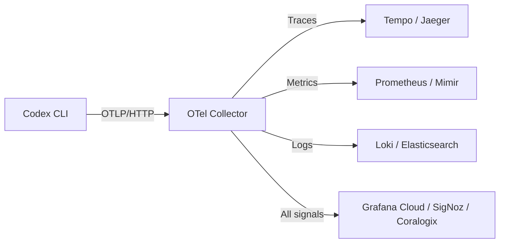
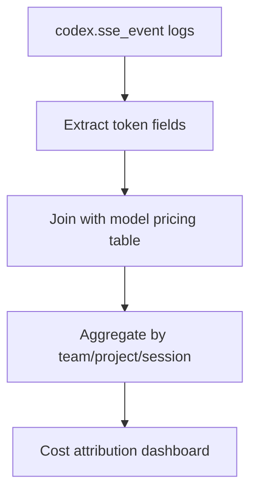
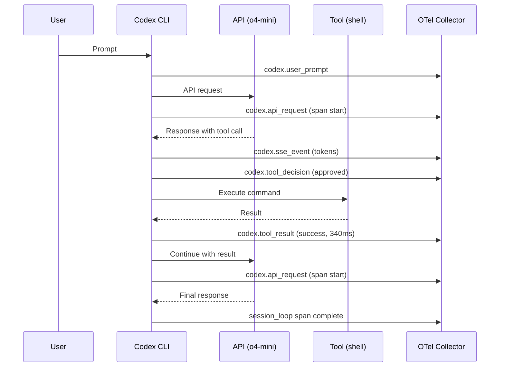

# Codex CLI Observability: OpenTelemetry Traces, Metrics, and Production Monitoring


---

Coding agents are opaque by default. When a Codex CLI session burns through 400k tokens over twelve minutes and produces a questionable diff, you need more than gut instinct to understand what happened. OpenTelemetry (OTel) — the vendor-neutral observability standard — gives you that visibility without coupling your toolchain to a single backend[^1].

This guide covers Codex CLI's native OTel integration end-to-end: configuration, emitted signals, backend routing, dashboard design, cost attribution, and alerting patterns for teams running agents in production.

## What Codex CLI Emits

Codex generates three signal types when OTel is enabled[^2]:

| Signal | Interactive CLI | `codex exec` | `codex mcp-server` |
|--------|:-:|:-:|:-:|
| Traces | ✅ | ✅ | ❌ |
| Logs (events) | ✅ | ✅ | ❌ |
| Metrics | ✅ | ❌ | ❌ |

The `codex mcp-server` entry point currently emits no telemetry — a known gap tracked in issue #12913[^3]. Plan accordingly if your architecture routes work through MCP.

### Structured Log Events

Every session emits structured OTel log events with consistent metadata (`service.name`, `env`, `conversation.id`, `app.version`, `model`)[^4]:

- **`codex.conversation_starts`** — session initialisation with provider, approval policy, sandbox config, and connected MCP servers
- **`codex.api_request`** — outbound API calls with attempt count, duration, and HTTP status
- **`codex.sse_event`** — streaming events carrying token counts (input, output, cached, reasoning)
- **`codex.user_prompt`** — user input with character length (redacted by default)
- **`codex.tool_decision`** — permission verdict (approved/denied/abort) with decision source
- **`codex.tool_result`** — tool execution outcome with success status, output excerpt, and duration

### Traces

Codex emits one trace per session. The root span is `session_loop`, with child spans for each API call and tool invocation[^5]. This gives you a complete timeline of every turn in the agent loop — invaluable for diagnosing sessions that stall or loop excessively.

### Metrics

The interactive CLI emits counters and duration histograms[^2]:

- `codex.api_request` (counter) — total API calls by model and status
- `codex.api_request.duration_ms` (histogram) — API latency distribution
- `codex.sse_event` (counter) — streaming events by type
- `codex.websocket.request` / `codex.websocket.event` — WebSocket activity
- `codex.tool.call` (counter) — tool invocations by tool name
- `codex.tool.call.duration_ms` (histogram) — tool execution time

Default attributes on all instruments include `auth_mode`, `originator`, `session_source`, `model`, and `app.version`[^2].

## Configuration Reference

All OTel settings live in `~/.codex/config.toml` under the `[otel]` section[^6]:

```toml
[otel]
environment = "production"        # resource attribute; default "dev"
log_user_prompt = false           # redact prompts unless true
exporter = "none"                 # log events: none | otlp-http | otlp-grpc
metrics_exporter = "none"         # metrics: none | statsig | otlp-http | otlp-grpc
trace_exporter = "none"           # traces: none | otlp-http | otlp-grpc
```

Each exporter accepts nested configuration:

```toml
[otel.exporter.otlp-http]
endpoint = "https://otel-collector.internal:4318/v1/logs"
protocol = "binary"               # binary (protobuf) or json
headers = { "Authorization" = "Bearer ${OTLP_TOKEN}" }

[otel.trace_exporter.otlp-http]
endpoint = "https://otel-collector.internal:4318/v1/traces"
protocol = "binary"
headers = { "Authorization" = "Bearer ${OTLP_TOKEN}" }

[otel.metrics_exporter.otlp-http]
endpoint = "https://otel-collector.internal:4318/v1/metrics"
protocol = "binary"
headers = { "Authorization" = "Bearer ${OTLP_TOKEN}" }
```

For mutual TLS environments, each exporter block supports[^6]:

```toml
[otel.trace_exporter.otlp-grpc]
endpoint = "https://otel.corp.internal:4317"
tls.ca-certificate = "/etc/ssl/corp-ca.pem"
tls.client-certificate = "/etc/ssl/codex-client.pem"
tls.client-private-key = "/etc/ssl/codex-client-key.pem"
```

Standard OTel environment variables (`OTEL_RESOURCE_ATTRIBUTES`, `OTEL_EXPORTER_OTLP_ENDPOINT`) are also respected for team-level segmentation[^4].

## Architecture: Collector-First Routing

For production deployments, route telemetry through an OTel Collector rather than directly to backends. This decouples instrumentation from vendor choice and enables sampling, enrichment, and fan-out.



A minimal Collector config for Codex:

```yaml
receivers:
  otlp:
    protocols:
      http:
        endpoint: "0.0.0.0:4318"

processors:
  batch:
    timeout: 5s
  attributes:
    actions:
      - key: team
        value: "platform"
        action: upsert

exporters:
  otlphttp/grafana:
    endpoint: "https://otlp-gateway-prod-gb-south-0.grafana.net/otlp"
    headers:
      Authorization: "Basic ${GRAFANA_OTLP_TOKEN}"

service:
  pipelines:
    traces:
      receivers: [otlp]
      processors: [batch, attributes]
      exporters: [otlphttp/grafana]
    logs:
      receivers: [otlp]
      processors: [batch, attributes]
      exporters: [otlphttp/grafana]
```

## Backend Integration Guides

### Grafana Cloud

Grafana provides a native Codex integration with three prebuilt dashboards — overview, usage, and performance[^7]. Configuration requires a Cloud Access Policy Token with `metrics:write`, `logs:write`, and `traces:write` permissions:

```toml
[otel]
environment = "production"
log_user_prompt = false

[otel.exporter.otlp-http]
endpoint = "https://otlp-gateway-prod-gb-south-0.grafana.net/otlp/v1/logs"
protocol = "binary"
headers = { "Authorization" = "Basic ${GRAFANA_ENCODED_CREDS}" }

[otel.trace_exporter.otlp-http]
endpoint = "https://otlp-gateway-prod-gb-south-0.grafana.net/otlp/v1/traces"
protocol = "binary"
headers = { "Authorization" = "Basic ${GRAFANA_ENCODED_CREDS}" }
```

### SigNoz

For SigNoz Cloud, point the gRPC exporter at your regional ingest endpoint[^8]:

```toml
[otel]
log_user_prompt = true

[otel.exporter.otlp-grpc]
endpoint = "https://ingest.eu.signoz.cloud:443"
headers = { "signoz-ingestion-key" = "${SIGNOZ_KEY}" }

[otel.trace_exporter.otlp-grpc]
endpoint = "https://ingest.eu.signoz.cloud:443"
headers = { "signoz-ingestion-key" = "${SIGNOZ_KEY}" }
```

### AI Observer (Self-Hosted)

For developers wanting local-only observability, AI Observer is a single-binary OTLP backend with an embedded React dashboard, DuckDB storage, and cost tracking for 67+ models[^9]:

```bash
docker run -d -p 8080:8080 -p 4318:4318 \
  -v ai-observer-data:/app/data tobilg/ai-observer:latest
```

```toml
[otel]
log_user_prompt = true

[otel.exporter.otlp-http]
endpoint = "http://localhost:4318/v1/logs"
protocol = "binary"

[otel.trace_exporter.otlp-http]
endpoint = "http://localhost:4318/v1/traces"
protocol = "binary"
```

Access the dashboard at `http://localhost:8080` — no external dependencies, all data stays on your machine.

## Cost Attribution and Team Segmentation

Token counts flow through `codex.sse_event` logs with fields for input, output, cached, and reasoning tokens[^4]. To attribute costs per team or project:

1. **Set `OTEL_RESOURCE_ATTRIBUTES`** per environment:

   ```bash
   export OTEL_RESOURCE_ATTRIBUTES="team=platform,project=api-migration"
   ```

2. **Use the Collector's attributes processor** to enrich with metadata from your org structure.

3. **Build cost dashboards** by joining token counts with model pricing:



A typical PromQL query for daily spend:

```promql
sum by (team, model) (
  rate(codex_sse_event_tokens_total{token_type="output"}[24h])
  * on(model) group_left() model_price_per_token
)
```

## Alerting Patterns

### Runaway Session Detection

Sessions that loop without converging burn tokens and time. Alert when a session exceeds your expected bound:

```yaml
# Grafana alert rule
- alert: CodexRunawaySession
  expr: |
    histogram_quantile(0.95,
      rate(codex_api_request_duration_ms_bucket[5m])
    ) > 120000
  for: 2m
  labels:
    severity: warning
  annotations:
    summary: "Codex session exceeding 2-minute API call duration (p95)"
```

### Tool Failure Rate

High tool failure rates indicate sandbox misconfiguration or flaky dependencies:

```yaml
- alert: CodexToolFailureSpike
  expr: |
    sum(rate(codex_tool_call_total{status="error"}[10m]))
    / sum(rate(codex_tool_call_total[10m])) > 0.3
  for: 5m
  labels:
    severity: critical
```

### Budget Breach

For teams with daily token budgets:

```yaml
- alert: CodexDailyBudgetBreach
  expr: |
    sum(increase(codex_sse_event_tokens_total{token_type=~"input|output"}[24h]))
    by (team) > 5000000
  labels:
    severity: warning
```

## Debugging Agent Loops with Traces

The `session_loop` root span contains the complete turn history. To diagnose a problematic session:

1. **Find the trace** — filter by `conversation.id` or time range
2. **Inspect child spans** — each API call and tool invocation appears as a child span with duration and status
3. **Identify the loop** — repeated tool calls with similar inputs indicate the agent is stuck
4. **Check tool decisions** — `codex.tool_decision` events reveal whether approvals or denials disrupted the flow



## Production Hardening Checklist

- [ ] **Redact prompts** — keep `log_user_prompt = false` unless you have data classification controls
- [ ] **Use a Collector** — never point directly at vendor endpoints from developer machines
- [ ] **Set `environment`** — distinguish dev/staging/production telemetry
- [ ] **Rotate credentials** — use environment variable interpolation (`${OTLP_TOKEN}`) rather than hardcoded keys
- [ ] **Enable mTLS** — for corporate networks, configure client certificates on the exporter
- [ ] **Sample traces** — at scale, use the Collector's `probabilistic_sampler` to control volume
- [ ] **Batch exports** — OTel batches data before sending; allow 10–30 seconds for visibility[^8]
- [ ] **Monitor the gap** — `codex exec` lacks metrics and `codex mcp-server` lacks all telemetry; instrument these paths separately if critical[^3]
- [ ] **Set resource attributes** — use `OTEL_RESOURCE_ATTRIBUTES` for team/project segmentation

## What's Coming

The current telemetry gaps — particularly the absence of metrics from `codex exec` and complete silence from `codex mcp-server` — are actively tracked[^3]. The OTel semantic conventions for generative AI stabilised in early 2026[^1], meaning Codex's instrumentation will likely align with the `gen_ai.*` namespace conventions as they mature. Watch for:

- Metrics parity across all entry points
- `gen_ai.client.token.usage` and `gen_ai.client.operation.duration` standard metrics
- MCP server telemetry for tool-routing observability
- Cost-per-session as a first-class metric rather than a derived calculation

## Citations

[^1]: OpenTelemetry Documentation — Semantic Conventions for Generative AI. [https://opentelemetry.io/docs/](https://opentelemetry.io/docs/)

[^2]: OpenAI Developers — Advanced Configuration: OpenTelemetry. [https://developers.openai.com/codex/config-advanced](https://developers.openai.com/codex/config-advanced)

[^3]: GitHub Issue #12913 — `codex exec` emits no OTel metrics; `codex mcp-server` emits no OTel telemetry at all. [https://github.com/openai/codex/issues/12913](https://github.com/openai/codex/issues/12913)

[^4]: VictoriaMetrics Blog — Vibe coding tools observability with VictoriaMetrics Stack and OpenTelemetry. [https://victoriametrics.com/blog/vibe-coding-observability/](https://victoriametrics.com/blog/vibe-coding-observability/)

[^5]: OpenAI Developers — Configuration Reference: trace_exporter. [https://developers.openai.com/codex/config-reference](https://developers.openai.com/codex/config-reference)

[^6]: OpenAI Developers — Configuration Reference: Full OTEL keys. [https://developers.openai.com/codex/config-reference](https://developers.openai.com/codex/config-reference)

[^7]: Grafana Cloud Documentation — OpenAI Codex Integration. [https://grafana.com/docs/grafana-cloud/monitor-infrastructure/integrations/integration-reference/integration-openai-codex/](https://grafana.com/docs/grafana-cloud/monitor-infrastructure/integrations/integration-reference/integration-openai-codex/)

[^8]: SigNoz Documentation — OpenAI Codex Observability & Monitoring with OpenTelemetry. [https://signoz.io/docs/codex-monitoring/](https://signoz.io/docs/codex-monitoring/)

[^9]: GitHub — tobilg/ai-observer: Unified local observability for AI coding assistants. [https://github.com/tobilg/ai-observer](https://github.com/tobilg/ai-observer)
