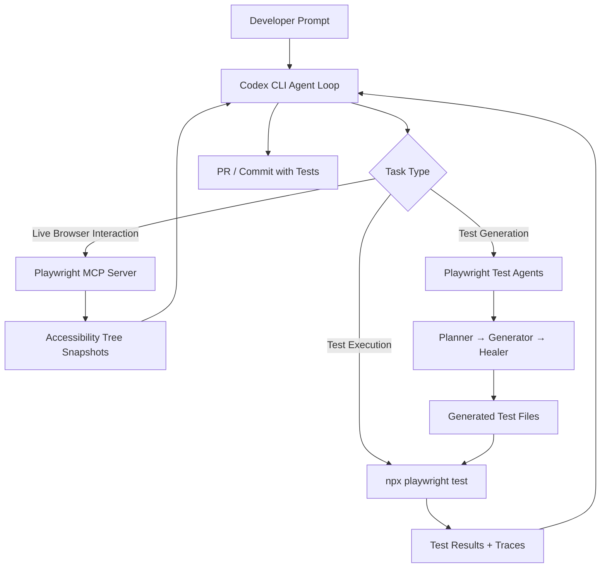
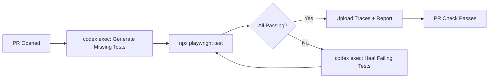

# End-to-End Testing with Codex CLI and Playwright: Agent-Driven Test Generation Pipelines


---

End-to-end test suites are the perennial bottleneck in modern development workflows. They take the longest to write, break the most often, and demand the deepest understanding of both application behaviour and browser mechanics. In April 2026, the convergence of three developments has fundamentally changed the economics of E2E testing: Playwright's native test agents (Planner, Generator, Healer), the Playwright MCP server for live browser interaction, and Codex CLI's ability to orchestrate both through its agent loop.[^1][^2][^3]

This article covers the practical integration of all three — from configuring the Playwright MCP server in Codex CLI to building fully automated test generation pipelines that run in CI.

---

## The Architecture: Three Layers of Agent-Driven Testing

Before diving into configuration, it helps to understand how the pieces fit together.



The Codex CLI agent loop sits at the centre, delegating to specialised tools depending on the task. For exploratory interaction with a running application, it calls the Playwright MCP server. For structured test generation, it invokes Playwright's native agents. For verification, it runs the generated tests headlessly and feeds results back into its reasoning loop.[^1][^4]

---

## Configuring the Playwright MCP Server

The Playwright MCP server exposes over 20 browser-control tools — `browser_navigate`, `browser_click`, `browser_type`, `browser_snapshot` — to any MCP-compatible client.[^5] Codex CLI connects to it via the standard MCP configuration in `config.toml`.

### Global configuration

Add to `~/.codex/config.toml`:

```toml
[mcp_servers.playwright]
command = "npx"
args = ["@playwright/mcp@latest", "--headless"]
```

### Project-scoped configuration

For team-shared configuration, place the same block in `.codex/config.toml` at the repository root. This requires the project to be marked as trusted.[^6]

### Headed mode for debugging

Drop the `--headless` flag when you need to observe the browser session visually:

```toml
[mcp_servers.playwright]
command = "npx"
args = ["@playwright/mcp@latest"]
```

### Browser selection and custom configuration

The MCP server supports Chromium (default), Firefox, and WebKit. Pass a JSON configuration file for advanced options:

```toml
[mcp_servers.playwright]
command = "npx"
args = ["@playwright/mcp@latest", "--headless", "--config", "./playwright-mcp.config.json"]
```

Where `playwright-mcp.config.json` might contain:

```json
{
  "browserName": "chromium",
  "isolated": true
}
```

The `isolated` flag gives each session a clean browser context — essential for test generation where state leakage between runs produces flaky assertions.[^5]

### Enabling parallel MCP calls

If your test workflow involves concurrent browser interactions (multiple tabs, parallel navigation), enable parallel tool calls for the server:

```toml
[mcp_servers.playwright]
command = "npx"
args = ["@playwright/mcp@latest", "--headless"]
supports_parallel_tool_calls = true
```

Only enable this when your workflow genuinely benefits from concurrent browser operations. Sequential interaction is safer for most E2E test authoring.[^6]

---

## The Accessibility-Tree-First Approach

A critical design decision in the Playwright MCP server is its default reliance on the accessibility tree rather than screenshots.[^5] When Codex requests a page snapshot, the MCP server returns a structured YAML representation of the DOM's semantic structure — roles, labels, states — not a rendered image.

This matters for three reasons:

1. **Deterministic selectors.** An agent targeting `Role: button, Name: Checkout` produces locators (`getByRole('button', { name: 'Checkout' })`) that survive CSS refactors and redesigns.[^7]
2. **Token efficiency.** A YAML accessibility snapshot consumes a fraction of the context tokens that a base64-encoded screenshot would occupy.
3. **Assertion stability.** Playwright's `toMatchAriaSnapshot()` assertion validates semantic structure, not pixel-level layout — exactly the kind of assertion agents should generate.[^7]

The MCP server falls back to vision mode (screenshot-based interaction) only when semantic markup proves insufficient, such as canvas-heavy applications or custom-rendered components without ARIA annotations.[^5]

---

## Playwright's Native Test Agents

Playwright 1.52+ ships with three purpose-built agents that operate independently or as a sequential pipeline.[^1]

### Planner

The Planner explores your running application and produces structured test plans in Markdown. It takes a seed test (establishing environment setup), a user request, and an optional Product Requirement Document as inputs:

```bash
npx playwright init-agents --loop=opencode
```

This scaffolds the agent definitions, a `specs/` directory for generated plans, and a seed test template.[^1]

A typical seed test bootstraps the application context:

```typescript
import { test, expect } from './fixtures';

test('seed', async ({ page }) => {
  await page.goto(process.env.BASE_URL || 'http://localhost:3000');
  await page.waitForLoadState('networkidle');
});
```

The Planner executes this seed to understand initialisation requirements, then maps user flows into structured Markdown specifications with steps and expected outcomes.[^1]

### Generator

The Generator takes Markdown plans from `specs/` and converts them into executable Playwright Test code. It validates selectors against the live application during generation, using role-based locators by default:

```typescript
// spec: specs/checkout-flow.md
// seed: tests/seed.spec.ts
import { test, expect } from '../fixtures';

test('complete checkout with valid card', async ({ page }) => {
  await page.getByRole('button', { name: 'Add to cart' }).click();
  await page.getByRole('link', { name: 'Cart' }).click();
  await page.getByRole('button', { name: 'Checkout' }).click();
  await page.getByLabel('Card number').fill('4242424242424242');
  await page.getByRole('button', { name: 'Pay now' }).click();
  await expect(page).toHaveURL(/\/confirmation/);
});
```

Generated tests include comments referencing their source specifications, maintaining traceability from plan to implementation.[^1]

### Healer

The Healer monitors test execution, replays failing steps, inspects the current UI state, and patches broken interactions. It achieves a success rate exceeding 75% on selector-related failures — the most common cause of E2E test flakiness.[^7] When the failure traces to a genuine functionality regression rather than a selector change, the Healer skips the test and flags it for human review.

---

## Integrating Playwright Agents with Codex CLI

The real power emerges when Codex CLI orchestrates the entire pipeline. Here is a practical AGENTS.md configuration that teaches the agent how to work with your E2E test infrastructure:

```markdown
## E2E Testing Conventions

- Framework: Playwright with TypeScript
- Test location: `e2e/tests/`, page objects in `e2e/pages/`
- Specs location: `e2e/specs/` (Markdown test plans)
- Locator strategy: Always use role-based locators (`getByRole`, `getByLabel`, `getByTestId`). Never use CSS selectors or XPath.
- Test organisation: Use `test.describe` blocks to group related scenarios
- Execution: `npx playwright test` (headless), `npx playwright test --headed` (debug)
- Setup command: `npm ci && npx playwright install --with-deps chromium`
- Before generating tests, always run the Planner agent to produce a spec
- After generating tests, always execute them and fix any failures before committing
```

### Interactive test authoring workflow

In the Codex CLI TUI, a typical session might look like this:

```
> Use the Playwright MCP to navigate to http://localhost:3000/dashboard,
  explore the user settings flow, then generate a Playwright test suite
  covering: profile update, password change, and notification preferences.
  Use our existing page object pattern in e2e/pages/.
```

Codex will:

1. Call `browser_navigate` via the MCP server to load the page
2. Use `browser_snapshot` to capture the accessibility tree
3. Explore interactive elements with `browser_click` and `browser_type`
4. Generate test files following the conventions in AGENTS.md
5. Run `npx playwright test` to validate the generated tests
6. Iterate on any failures until all tests pass

### Non-interactive batch generation with `codex exec`

For CI integration, use `codex exec` to generate tests from a specification:

```bash
codex exec --full-auto \
  -i e2e/specs/checkout-flow.md \
  "Generate Playwright tests from this spec. Follow the conventions in AGENTS.md. \
   Run the tests and fix any failures."
```

The `--full-auto` flag allows the agent to read files, write tests, and execute them without manual approval — appropriate when running inside a sandboxed CI environment.[^8]

---

## Codex Cloud for Parallel Test Generation

For large test suites, Codex Cloud enables parallel test generation across multiple sandboxed environments. Each task receives its own container with the full repository and can install dependencies independently.[^9]

```bash
# Launch parallel cloud tasks for different test suites
codex cloud exec "Generate Playwright tests for the authentication flows in e2e/specs/auth.md"
codex cloud exec "Generate Playwright tests for the payment flows in e2e/specs/payments.md"
codex cloud exec "Generate Playwright tests for the admin dashboard in e2e/specs/admin.md"

# Check progress
codex cloud list

# Apply results when ready
codex cloud apply <task-id>
```

Each cloud task produces a pull request with the generated tests, execution results, and any trace files. Review and merge independently.[^9]

---

## The Test-Skills Pattern: Structured Agent Memory

The open-source `test-skills` package from Agent Mantis provides six curated skills that transform coding agents into production-grade SDET equivalents.[^10] The skills are:

| Skill | Type | Purpose |
|-------|------|---------|
| `e2e-test-conventions` | Reference | Auto-loaded foundation: structure, selectors, auth, parallelism |
| `e2e-test-suite-init` | Task | Scaffolds complete `e2e/` directory with config and fixtures |
| `create-pom` | Task | Generates Page Object Models with lifecycle methods |
| `create-regression-test` | Task | Creates regression specs with data, fixtures, and cleanup |
| `create-handover-test` | Task | Builds ticket-driven tests for developer handover |
| `promote-handover-test` | Task | Transitions handover tests into the regression suite |

Install for Codex CLI by placing the skill files in `$HOME/.agents/skills/` or `.agents/skills/` at the project root. The `e2e-test-conventions` skill loads automatically as a reference, while the task skills activate on request.[^10]

The handover-to-regression lifecycle is particularly valuable: developers create ticket-scoped handover tests during feature work, and the agent promotes stable ones into the regression suite — maintaining test quality without manual curation overhead.

---

## Playwright CLI as an MCP Alternative

For teams that find the MCP server's context overhead too expensive, the Playwright CLI offers a lighter-weight integration path.[^11] Rather than exposing browser tools through the MCP protocol, it uses native terminal commands that agents already understand:

```bash
# Navigate and capture state
playwright-cli goto https://app.example.com/login
playwright-cli snapshot

# Interact with elements
playwright-cli fill "e21" "user@example.com"
playwright-cli click "e35"

# Mock API responses for isolation
playwright-cli route "http://localhost:4001/api/auth" \
  --body='{"token":"mock-token-123","user":{"id":1}}'
```

Each command generates timestamped YAML snapshots stored in `.playwright-cli/`, keeping heavy state on disk rather than in the model's context window. Named sessions (`-s=auth`, `-s=public`) provide isolated browser contexts for concurrent workflows.[^11]

This approach avoids what the community calls the "MCP tax" — large tool schema definitions that consume context tokens before any actual work begins. For test generation workflows where the agent needs to interact with many pages sequentially, the cumulative token savings are significant.[^11]

---

## CI Pipeline Integration

A complete CI workflow combines `codex exec` with Playwright's native test runner:



In a GitHub Actions workflow:

```yaml
name: E2E Test Generation
on:
  pull_request:
    paths:
      - 'src/**'
      - 'e2e/specs/**'

jobs:
  generate-and-run:
    runs-on: ubuntu-latest
    steps:
      - uses: actions/checkout@v4
      - uses: actions/setup-node@v4
        with:
          node-version: '22'
      - run: npm ci && npx playwright install --with-deps chromium
      - name: Generate tests for changed specs
        run: |
          codex exec --full-auto --ephemeral \
            "Review the changed spec files in e2e/specs/. Generate or update \
             Playwright tests to match. Run all e2e tests and fix failures."
      - name: Run full suite
        run: npx playwright test --reporter=html
      - uses: actions/upload-artifact@v4
        if: always()
        with:
          name: playwright-report
          path: playwright-report/
```

The `--ephemeral` flag skips session persistence, keeping CI runs stateless. Generated tests are committed back to the PR branch if they pass validation.[^8]

---

## Common Pitfalls and Mitigations

**Flaky locators from AI generation.** Despite guidance, agents occasionally generate CSS-selector-based locators. Enforce role-based locators through a custom ESLint rule or Playwright's `@playwright/test` strict mode, and include an explicit prohibition in your AGENTS.md.[^7]

**Context window exhaustion on large applications.** A single accessibility tree snapshot of a complex dashboard can consume 10,000+ tokens. Use the Playwright MCP's `--viewport-size` option to constrain the visible area, and instruct the agent to navigate to specific sections rather than snapshotting entire pages.

**Test isolation failures.** Agent-generated tests that share state across `test.describe` blocks produce intermittent failures in parallel execution. Configure `fullyParallel: true` in `playwright.config.ts` and enforce independent browser contexts per test file through fixtures.

**Over-reliance on the Healer.** The Healer fixes selector drift effectively but cannot diagnose business logic regressions. Configure your CI pipeline to flag healed tests for human review — automatic healing should reduce noise, not mask failures.[^1]

---

## Citations

[^1]: "Playwright Test Agents," Playwright Documentation, 2026. [https://playwright.dev/docs/test-agents](https://playwright.dev/docs/test-agents)

[^2]: "Model Context Protocol – Codex," OpenAI Developers, 2026. [https://developers.openai.com/codex/mcp](https://developers.openai.com/codex/mcp)

[^3]: "Features – Codex CLI," OpenAI Developers, 2026. [https://developers.openai.com/codex/cli/features](https://developers.openai.com/codex/cli/features)

[^4]: "Write Playwright Tests with Codex: Cloud Agent Guide," TestDino, 2026. [https://testdino.com/blog/playwright-tests-with-codex/](https://testdino.com/blog/playwright-tests-with-codex/)

[^5]: "Playwright MCP," Playwright Documentation, 2026. [https://playwright.dev/docs/getting-started-mcp](https://playwright.dev/docs/getting-started-mcp)

[^6]: "Command line options – Codex CLI," OpenAI Developers, 2026. [https://developers.openai.com/codex/cli/reference](https://developers.openai.com/codex/cli/reference)

[^7]: "Playwright AI Ecosystem 2026: MCP, Agents & Self-Healing Tests," TestDino, 2026. [https://testdino.com/blog/playwright-ai-ecosystem/](https://testdino.com/blog/playwright-ai-ecosystem/)

[^8]: "CLI – Codex," OpenAI Developers, 2026. [https://developers.openai.com/codex/cli](https://developers.openai.com/codex/cli)

[^9]: "Write Playwright Tests with Codex: Cloud Agent Guide," TestDino, 2026. [https://testdino.com/blog/playwright-tests-with-codex/](https://testdino.com/blog/playwright-tests-with-codex/)

[^10]: "test-skills: Playwright E2E testing skills for AI coding agents," Agent Mantis, GitHub, 2026. [https://github.com/agentmantis/test-skills](https://github.com/agentmantis/test-skills)

[^11]: "Playwright CLI, Skills and Isolated Agentic Testing," Awesome Testing, March 2026. [https://www.awesome-testing.com/2026/03/playwright-cli-skills-and-isolated-agentic-testing](https://www.awesome-testing.com/2026/03/playwright-cli-skills-and-isolated-agentic-testing)
