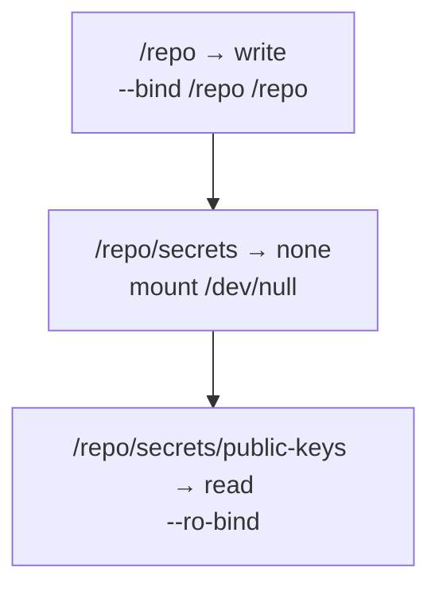
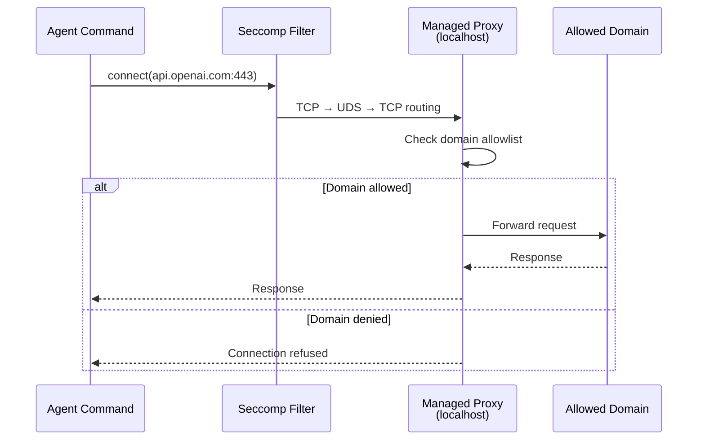

# Codex CLI Split Permissions: Fine-Grained Filesystem and Network Policies


---

The three-mode sandbox (`read-only`, `workspace-write`, `danger-full-access`) that shipped with early Codex CLI versions works well for solo developers, but falls apart the moment a team needs the agent to write to a build cache *and* deny access to `.env` files *and* allow egress only to `api.openai.com`. Named permission profiles — introduced progressively through v0.119–v0.121 and documented as stable in the April 2026 configuration reference[^1] — solve this by replacing a single boolean sandbox toggle with composable, path-specific filesystem and network rules.

This article covers the full split-permissions surface: filesystem path policies with glob-based deny rules, the managed network proxy with domain allowlists, and practical configuration patterns for CI pipelines and enterprise teams.

---

## Why the Legacy Sandbox Modes Are Not Enough

The original `sandbox_mode` key offers three settings[^2]:

| Mode | Filesystem | Network |
|------|-----------|---------|
| `read-only` | No writes | Disabled |
| `workspace-write` | Writes to CWD + `writable_roots` | Disabled (opt-in via `network_access`) |
| `danger-full-access` | Unrestricted | Unrestricted |

This is fundamentally a coarse-grained model. Consider a monorepo where the agent must write to `packages/api/src/` but not to `packages/billing/secrets/`, must read `.env.example` but not `.env`, and must reach `npm.pkg.github.com` for package installs but nothing else. With the legacy model, you either grant `workspace-write` (too broad) or `read-only` (too restrictive). The `writable_roots` array adds paths but cannot *subtract* them[^3].

Split permissions solve this with a deny-capable, path-hierarchical filesystem policy and a managed proxy for network egress.

---

## Named Permission Profiles

A named profile groups filesystem and network rules under a single identifier. Activate it by setting `default_permissions` in your `config.toml`[^1]:

```toml
default_permissions = "workspace"
```

Every sandboxed tool call then uses the `[permissions.workspace]` tables for enforcement. You can define multiple profiles and switch between them via `--profile` or the `/permissions` TUI command[^4].

---

## Filesystem Split Policies

### Path-Specificity Ordering

The filesystem table maps absolute paths (or special tokens) to access levels: `read`, `write`, or `none`[^5]. When paths overlap, the most specific (narrowest) path wins — a model borrowed from route-matching in web frameworks:

```toml
[permissions.workspace.filesystem]
"/repo" = "write"
"/repo/secrets" = "none"
"/repo/secrets/public-keys" = "read"
```

This configuration allows the agent to write anywhere under `/repo`, completely blocks `/repo/secrets`, but re-opens `/repo/secrets/public-keys` for reading. The enforcement layer in `codex-linux-sandbox` resolves these by sorting entries from broadest to narrowest and applying bubblewrap bind mounts in that order[^5]:



Protected paths — `.git`, `.codex`, and resolved `gitdir:` references — are always re-mounted as read-only inside writable roots, regardless of explicit policy[^5].

### The `:project_roots` Token

Rather than hardcoding absolute paths, you can scope rules relative to detected project roots (directories containing `.git` or configured `project_root_markers`)[^1]:

```toml
[permissions.workspace.filesystem.":project_roots"]
"." = "write"
"dist" = "write"
"node_modules" = "read"
```

This makes the profile portable across machines and repositories — the same `config.toml` works whether the project lives at `/home/dev/app` or `/workspace/monorepo/packages/api`.

### Glob-Based File Restrictions

The most powerful feature for secret protection is glob-based denial. Any path key containing a wildcard character is evaluated as a glob pattern against files within the scope[^5]:

```toml
[permissions.workspace.filesystem.":project_roots"]
"." = "write"
"**/*.env" = "none"
"**/*.pem" = "none"
"**/*.key" = "none"
"**/credentials.json" = "none"
```

Under the hood, Codex uses `rg --files --hidden --no-ignore --glob <pattern>` to enumerate matching files at sandbox construction time. If ripgrep is unavailable, it falls back to an internal globset walker. Any enumeration failure aborts sandbox construction entirely — the system fails closed[^5].

You can tune glob scan depth to balance security against startup latency:

```toml
[permissions.workspace.filesystem]
glob_scan_max_depth = 2
```

⚠️ Setting `glob_scan_max_depth` too low may miss deeply nested sensitive files. For monorepos with deep directory structures, the default (unlimited) is safer, albeit slower on first invocation.

---

## Managed Network Proxy

The legacy `network_access = true` flag in `[sandbox_workspace_write]` is an all-or-nothing switch. The managed proxy replaces it with domain-level and socket-level control[^1][^6].

### Architecture

When network rules are active, Codex starts a local proxy bridge that routes all subprocess TCP traffic through a controlled path:



After the bridge is active, a seccomp filter blocks new `AF_UNIX` and `socketpair` creation for user commands, preventing bypass of the proxy[^5]. On Windows (elevated sandbox mode), OS-level firewall rules enforce proxy-only networking at the kernel level, making it impossible for even malicious code to exfiltrate data[^7].

### Configuration

```toml
[permissions.workspace.network]
enabled = true
mode = "limited"

[permissions.workspace.network.domains]
"api.openai.com" = "allow"
"npm.pkg.github.com" = "allow"
"registry.npmjs.org" = "allow"
"*.example.com" = "deny"

[permissions.workspace.network.unix_sockets]
"/var/run/docker.sock" = "allow"
```

The `mode` key accepts two values[^1]:

- **`limited`** — only domains in the allowlist are reachable; everything else is denied by default
- **`full`** — all domains are reachable except those explicitly denied

For most security-conscious setups, `limited` is correct.

### SOCKS5 Support

Some tools (database clients, custom TCP protocols) don't respect HTTP proxies. The managed proxy optionally exposes a SOCKS5 listener[^1]:

```toml
[permissions.workspace.network]
enabled = true
enable_socks5 = true
socks_url = "socks5://127.0.0.1:43130"
enable_socks5_udp = false
```

### Upstream Proxy Chaining

In corporate environments where all traffic must traverse a corporate proxy, the managed proxy can chain to an upstream[^1]:

```toml
[permissions.workspace.network]
enabled = true
proxy_url = "http://127.0.0.1:43128"
allow_upstream_proxy = true
```

---

## Shell Environment Policy

Split permissions extend beyond files and sockets to environment variables. The `[shell_environment_policy]` table controls what subprocess tools can see[^1][^8]:

```toml
[shell_environment_policy]
inherit = "none"
set = { PATH = "/usr/bin:/usr/local/bin", HOME = "/home/agent" }
exclude = ["AWS_*", "AZURE_*", "GH_TOKEN"]
```

By default, Codex applies "default excludes" that filter any variable whose name contains `KEY`, `SECRET`, or `TOKEN` (case-insensitive) before your explicit rules run[^8]. You can suppress this with `ignore_default_excludes = true`, but doing so is inadvisable for anything beyond local development.

The three inheritance modes are:

| Mode | Behaviour |
|------|-----------|
| `all` | Inherit everything from the parent process, then apply excludes |
| `core` | Inherit only `PATH`, `HOME`, `USER`, `SHELL`, `LANG`, and `TERM` |
| `none` | Start with an empty environment; only `set` values are available |

---

## Practical Configuration Patterns

### Pattern 1: Monorepo with Secret Protection

A team working on a monorepo with multiple services, each containing its own `.env` and credential files:

```toml
default_permissions = "monorepo"

[permissions.monorepo.filesystem.":project_roots"]
"." = "write"
"**/*.env" = "none"
"**/*.env.*" = "none"
"**/*.pem" = "none"
"**/secrets/" = "none"
".git" = "read"

[permissions.monorepo.network]
enabled = true
mode = "limited"

[permissions.monorepo.network.domains]
"api.openai.com" = "allow"
"registry.npmjs.org" = "allow"
```

### Pattern 2: CI Pipeline with codex exec

Non-interactive pipelines need write access to build outputs but zero network access beyond the API:

```toml
default_permissions = "ci"
approval_policy = "never"

[permissions.ci.filesystem]
"/workspace" = "write"
"/workspace/.env" = "none"
"/tmp" = "write"

[permissions.ci.network]
enabled = true
mode = "limited"

[permissions.ci.network.domains]
"api.openai.com" = "allow"

[shell_environment_policy]
inherit = "core"
exclude = ["CI_*_TOKEN", "DOCKER_AUTH_*"]
```

### Pattern 3: Secure Devcontainer

The v0.121.0 secure devcontainer profile[^9] pairs bubblewrap isolation with split permissions inside Docker containers:

```toml
default_permissions = "devcontainer"

[permissions.devcontainer.filesystem]
"/workspace" = "write"
"/workspace/**/*.env" = "none"
"/home/vscode" = "read"

[permissions.devcontainer.network]
enabled = true
mode = "limited"

[permissions.devcontainer.network.domains]
"api.openai.com" = "allow"

[permissions.devcontainer.network.unix_sockets]
"/var/run/docker.sock" = "none"
```

Inside the container, bubblewrap provides namespace-level isolation (`--unshare-user`, `--unshare-pid`, `--unshare-net`), whilst the split permissions layer provides path-level and domain-level control within those namespaces[^5].

---

## Debugging Permissions

When a tool call fails with a sandbox denial, use the built-in sandbox test commands[^10]:

```bash
# macOS
codex sandbox macos --full-auto --log-denials ls /path/to/denied

# Linux
codex sandbox linux --full-auto ls /path/to/denied
```

The `--log-denials` flag on macOS surfaces Seatbelt denial messages. On Linux, bubblewrap failures appear as `EPERM` or `EACCES` errors in the tool output.

The `/status` TUI command shows the active permissions profile and its resolved rules. The `/permissions` command allows switching profiles mid-session[^4].

---

## Limitations and Caveats

**Glob scan cost**: On large repositories (100k+ files), the initial glob enumeration can add 2–5 seconds to sandbox construction. The `glob_scan_max_depth` setting mitigates this at the cost of reduced coverage.

**WSL1 incompatibility**: Bubblewrap-based enforcement requires user namespace support, which WSL1 lacks. Since v0.115, WSL1 is unsupported for sandboxed execution[^11]. WSL2 follows the standard Linux path.

**AppArmor restrictions**: On Ubuntu 24.04+ and similar distributions where AppArmor restricts unprivileged user namespaces, you must explicitly enable them[^5]:

```bash
sudo sysctl -w kernel.apparmor_restrict_unprivileged_userns=0
```

**No cross-profile composition**: You cannot combine rules from multiple named profiles. Each tool call uses exactly one profile. Teams needing different policies for different subagents should configure per-agent profiles via `agents.<name>.config_file`[^1].

---

## Citations

[^1]: [Configuration Reference – Codex | OpenAI Developers](https://developers.openai.com/codex/config-reference)
[^2]: [Sandbox – Codex | OpenAI Developers](https://developers.openai.com/codex/concepts/sandboxing)
[^3]: [Advanced Configuration – Codex | OpenAI Developers](https://developers.openai.com/codex/config-advanced)
[^4]: [Agent approvals & security – Codex | OpenAI Developers](https://developers.openai.com/codex/agent-approvals-security)
[^5]: [codex-rs/linux-sandbox/README.md – openai/codex GitHub](https://github.com/openai/codex/blob/main/codex-rs/linux-sandbox/README.md)
[^6]: [Sample Configuration – Codex | OpenAI Developers](https://developers.openai.com/codex/config-sample)
[^7]: [Codex by OpenAI – Release Notes April 2026](https://releasebot.io/updates/openai/codex)
[^8]: [Config basics – Codex | OpenAI Developers](https://developers.openai.com/codex/config-basic)
[^9]: [Release 0.121.0 – openai/codex GitHub](https://github.com/openai/codex/releases/tag/rust-v0.121.0)
[^10]: [Command line options – Codex CLI | OpenAI Developers](https://developers.openai.com/codex/cli/reference)
[^11]: [Regression in 0.115.0: shell commands fail in WSL – GitHub Issue #16076](https://github.com/openai/codex/issues/16076)
