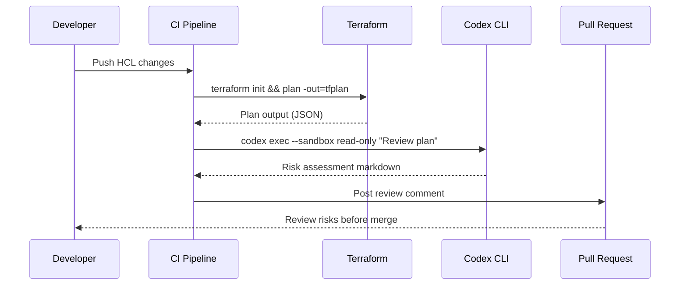

# Codex CLI + Terraform/IaC: Infrastructure Agent Patterns


---

Infrastructure as code demands precision that most AI coding assistants struggle to deliver. Terraform's declarative semantics, provider-specific resource schemas, and state-dependent operations create a hallucination minefield. This article covers practical patterns for using Codex CLI safely and effectively with Terraform — from plan review automation to module generation, drift detection, and state file protection.

## The Hallucination Problem in IaC

LLMs hallucinate Terraform resource arguments at an alarming rate. A February 2026 analysis by Lukas Niessen found that frontier models regularly invent non-existent attributes, confuse provider versions, and misapply lifecycle rules[^1]. The root cause: Terraform's API surface spans over 3,000 providers with constantly-shifting schemas that rarely appear in training data at sufficient density[^2].

This makes naive "generate my Terraform" prompts dangerous. The patterns below address this by constraining the agent's operating envelope through AGENTS.md policies, sandbox restrictions, and structured review gates.

## AGENTS.md for Terraform Projects

The foundation of safe IaC generation is a well-crafted `AGENTS.md` that encodes your organisation's Terraform conventions. Place this at the root of your infrastructure repository:

```markdown
# AGENTS.md

## Terraform Conventions

- Use Terraform >= 1.14 with the AWS provider >= 5.x
- All modules follow the standard structure: main.tf, variables.tf, outputs.tf, versions.tf
- Use `for_each` over `count` for resource iteration (prevents index-shift bugs)
- All resources MUST include `moved` blocks when refactoring
- Never hardcode provider credentials — use assume_role or OIDC
- Remote state backend is mandatory (S3 + DynamoDB locking)
- All variable declarations require `description` and `type`
- Tag all resources with: Environment, Team, ManagedBy, CostCentre

## Forbidden Operations

- NEVER run `terraform apply` — only `plan` and `validate`
- NEVER modify .tfstate files directly
- NEVER commit .tfstate or .tfstate.backup to version control
- NEVER use `terraform taint` — use `moved` blocks instead

## Module Generation Workflow

1. Check `.terrashark/references/` for provider documentation if available
2. Run `terraform validate` after generating any HCL
3. Run `tflint` with the project ruleset
4. Generate a `terraform plan` for review — never auto-approve
```

This layered instruction set prevents the most common agent failure modes: hallucinated attributes, unsafe state operations, and credential exposure[^3].

### Subdirectory Overrides

For monorepos with multiple environments, place environment-specific `AGENTS.md` files in subdirectories:

```
infra/
├── AGENTS.md              # Global conventions
├── modules/
│   └── AGENTS.md          # Module authoring rules
├── environments/
│   ├── dev/
│   │   └── AGENTS.md      # "May run plan with -auto-approve for dev"
│   └── prod/
│       └── AGENTS.md      # "NEVER run apply. Plan only. Require human review."
```

Codex CLI concatenates these files from root downward, with closer files taking precedence[^4].

## Sandbox Configuration for State File Safety

Terraform state files contain sensitive infrastructure topology and often include secrets. The Codex CLI sandbox must be configured to prevent accidental state corruption:

```toml
# codex.toml — Terraform-safe sandbox profile
[profile.terraform]
model = "gpt-5.4"
approval_policy = "unless-allow-listed"

[profile.terraform.sandbox]
mode = "workspace-write"

[profile.terraform.sandbox.filesystem]
# Explicitly deny writes to state files and credential paths
denyWrite = [
  "**/*.tfstate",
  "**/*.tfstate.backup",
  "**/.terraform/",
  "**/terraform.tfvars",
  "**/.aws/",
  "**/.azure/"
]

# Allow writes only to HCL source files
allowWrite = [
  "**/*.tf",
  "**/*.tfvars.example",
  "**/README.md"
]

[profile.terraform.sandbox.network]
# Terraform needs registry access for init
allowDomains = [
  "registry.terraform.io",
  "releases.hashicorp.com",
  "github.com"
]
```

This configuration ensures the agent can generate and modify `.tf` files but cannot touch state, credentials, or the `.terraform` directory containing provider binaries[^5].

## Plan Review with codex exec

The most immediately valuable pattern: automated plan review in CI. Use `codex exec` to analyse `terraform plan` output and surface risks before human review:

```bash
#!/bin/bash
# ci/terraform-plan-review.sh

# Generate plan in JSON format
terraform plan -out=tfplan -detailed-exitcode
EXIT_CODE=$?

if [ $EXIT_CODE -eq 2 ]; then
  # Changes detected — get AI review
  terraform show -json tfplan > tfplan.json

  codex exec \
    --model codex-mini-latest \
    --sandbox read-only \
    --approval on-failure \
    "Review the Terraform plan in tfplan.json. Identify:
     1. Resources being destroyed or replaced (HIGH RISK)
     2. Security group changes that widen access
     3. IAM policy modifications
     4. Cost implications of new resources
     5. Missing tags per our tagging policy
     Output a structured risk assessment as markdown."
fi
```

This pattern keeps the agent in read-only mode — it analyses the plan but cannot execute it[^6]. The JSON plan format gives the agent structured data rather than human-readable output, reducing parsing errors.



## Module Generation Pipeline

For generating new Terraform modules, use a two-stage pipeline that mirrors the approach validated by Suwannik's research on agentic algorithm improvement[^7]:

**Stage 1: Scaffold with constraints**

```bash
codex exec \
  --model gpt-5.4 \
  --profile terraform \
  "Generate a Terraform module for an AWS ECS Fargate service with:
   - ALB integration with health checks
   - Auto-scaling based on CPU/memory
   - CloudWatch log group with 30-day retention
   - Security groups following least-privilege
   Follow the conventions in AGENTS.md.
   Place files in modules/ecs-fargate/"
```

**Stage 2: Validate and iterate**

```bash
cd modules/ecs-fargate
terraform init -backend=false
terraform validate
tflint --config=../../.tflint.hcl

# If validation fails, feed errors back to Codex
if [ $? -ne 0 ]; then
  codex exec \
    --model codex-mini-latest \
    --profile terraform \
    "Fix the validation errors in modules/ecs-fargate/.
     Error output: $(terraform validate 2>&1)
     Lint output: $(tflint 2>&1)"
fi
```

## Drift Detection Automation

Scheduled drift detection with Codex-powered analysis combines `terraform plan -refresh-only` with intelligent triage:

```bash
# Run weekly via cron or GitHub Actions schedule
terraform plan -refresh-only -detailed-exitcode -out=drift.tfplan
EXIT_CODE=$?

if [ $EXIT_CODE -eq 2 ]; then
  terraform show -json drift.tfplan > drift.json

  codex exec \
    --model codex-mini-latest \
    --sandbox read-only \
    "Analyse drift.json. For each drifted resource:
     1. Classify as intentional (manual hotfix) or accidental
     2. Recommend: import into state, revert in cloud, or update HCL
     3. Estimate blast radius if we terraform apply to reconcile
     Output as a table with columns: Resource, Drift Type, Recommendation, Risk"
fi
```

This addresses a real operational pain point: drift detection tools identify *what* drifted, but platform teams still need human judgement on *why* and *what to do*[^8]. The agent provides a first-pass triage that accelerates human decision-making.

## TerraShark Integration

TerraShark is a purpose-built Terraform skill for Codex and Claude Code that addresses hallucination at the methodology level[^1]. Rather than dumping reference documentation, it implements a 7-step diagnostic workflow:

1. **Task classification** — Determine if this is a new module, refactor, or fix
2. **Failure mode identification** — Check which known LLM mistakes apply
3. **Reference loading** — Pull only relevant provider docs (≈600 tokens vs 4,400 for bulk approaches)
4. **Risk control mapping** — Require explicit controls for each identified risk
5. **Code generation** — Generate HCL with constraints applied
6. **Validation loop** — Run `terraform validate` and `tflint`
7. **Output contract** — Document assumptions, tradeoffs, and rollback notes

Install TerraShark for Codex CLI:

```bash
# Clone into skills directory
git clone https://github.com/LukasNiessen/terrashark.git \
  ~/.codex/skills/terrashark

# Or reference in AGENTS.md
echo "When working with Terraform or OpenTofu, follow the workflow in \
.terrashark/SKILL.md" >> AGENTS.md
```

The key insight: telling the model *how to think* about Terraform problems outperforms giving it examples of good Terraform[^9].

## Security Patterns for Infrastructure Agents

### Credential Isolation

Never allow the agent access to cloud credentials directly. Instead, use short-lived session tokens:

```bash
# Generate scoped, read-only credentials for plan operations
CREDS=$(aws sts assume-role \
  --role-arn arn:aws:iam::123456789:role/codex-terraform-readonly \
  --role-session-name codex-plan-review \
  --duration-seconds 900)

# Export into agent environment
export AWS_ACCESS_KEY_ID=$(echo $CREDS | jq -r '.Credentials.AccessKeyId')
export AWS_SECRET_ACCESS_KEY=$(echo $CREDS | jq -r '.Credentials.SecretAccessKey')
export AWS_SESSION_TOKEN=$(echo $CREDS | jq -r '.Credentials.SessionToken')

codex exec --profile terraform "Run terraform plan and review the output"
```

### PreToolUse Hooks for Apply Prevention

Add a hook that blocks any `terraform apply` or `terraform destroy` command:

```bash
#!/bin/bash
# .codex/hooks/pre-tool-use.sh

if echo "$CODEX_TOOL_ARGS" | grep -qE "terraform\s+(apply|destroy|import)"; then
  echo "BLOCKED: Terraform state-modifying commands are not permitted"
  exit 1
fi
```

This provides defence-in-depth beyond AGENTS.md instructions — even if the model ignores soft constraints, the hook enforces hard boundaries[^10].

## Practical Workflow: PR-Triggered Infrastructure Review

Combining all patterns into a GitHub Actions workflow:

```yaml
name: Terraform Plan Review
on:
  pull_request:
    paths: ['infra/**/*.tf']

jobs:
  plan-review:
    runs-on: ubuntu-latest
    permissions:
      id-token: write
      contents: read
      pull-requests: write
    steps:
      - uses: actions/checkout@v4

      - uses: hashicorp/setup-terraform@v3
        with:
          terraform_version: "1.14.2"

      - uses: aws-actions/configure-aws-credentials@v4
        with:
          role-to-assume: arn:aws:iam::123456789:role/terraform-plan
          aws-region: eu-west-1

      - name: Terraform Plan
        run: |
          cd infra/environments/prod
          terraform init
          terraform plan -out=tfplan -detailed-exitcode || true
          terraform show -json tfplan > tfplan.json

      - name: AI Plan Review
        uses: openai/codex-action@v1
        with:
          model: codex-mini-latest
          sandbox: read-only
          prompt: |
            Review infra/environments/prod/tfplan.json against our AGENTS.md policies.
            Post a risk assessment as a PR comment.

      - name: Post Review
        uses: actions/github-script@v7
        with:
          script: |
            // Post codex output as PR comment
```

## Key Takeaways

| Pattern | Risk Mitigated | Complexity |
|---------|---------------|------------|
| AGENTS.md constraints | Hallucinated attributes, unsafe operations | Low |
| Sandbox denyWrite for .tfstate | State corruption, credential exposure | Low |
| codex exec plan review | Missed security/cost risks in PRs | Medium |
| TerraShark skill | Systematic hallucination reduction | Low |
| PreToolUse hooks | Accidental apply/destroy | Low |
| Short-lived credentials | Credential theft, privilege escalation | Medium |
| Two-stage generation + validate | Invalid HCL shipping to main | Medium |

The overarching principle: treat Codex CLI as a powerful reviewer and generator, but never as an executor of infrastructure changes. The agent plans; the human approves; the pipeline applies.

## Citations

[^1]: Niessen, L. "TerraShark: How I Fixed LLM Hallucinations in Terraform Without Burning All My Tokens." Medium, February 2026. https://lukasniessen.medium.com/terrashark-how-i-fixed-llm-hallucinations-in-terraform-without-burning-all-my-tokens-6c52a9910234

[^2]: HashiCorp. "Terraform Registry — Providers." https://registry.terraform.io/browse/providers (Over 3,000 providers listed as of April 2026)

[^3]: OpenAI. "Custom instructions with AGENTS.md — Codex." https://developers.openai.com/codex/guides/agents-md

[^4]: OpenAI. "Custom instructions with AGENTS.md — Codex." Codex concatenates files from root downward, with closer files taking precedence. https://developers.openai.com/codex/guides/agents-md

[^5]: OpenAI. "Sandbox — Codex." https://developers.openai.com/codex/concepts/sandboxing

[^6]: OpenAI. "Command line options — Codex CLI." https://developers.openai.com/codex/cli/reference

[^7]: Suwannik, T. "Applying an Agentic Coding Tool for Improving Published Algorithm Implementations." arXiv:2604.13109, April 2026.

[^8]: env0. "8 Terraform Drift Detection Tools Enterprise Teams Actually Use in 2026." https://www.env0.com/blog/8-terraform-drift-detection-tools-enterprise-teams-actually-use-in-2026

[^9]: LukasNiessen. "TerraShark — Terraform Skill for Claude Code and Codex." GitHub. https://github.com/LukasNiessen/terrashark

[^10]: OpenAI. "Agent approvals & security — Codex." https://developers.openai.com/codex/agent-approvals-security
