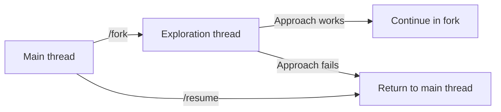
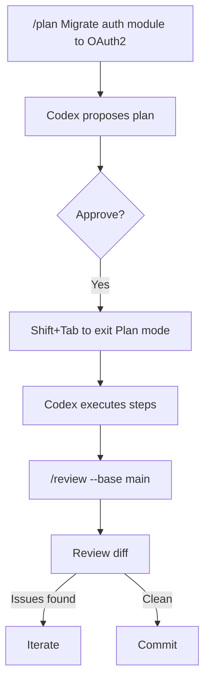

# Codex CLI TUI Mastery: Slash Commands, Keyboard Shortcuts, and Session Workflows for Power Users


---

The Codex CLI terminal user interface has evolved from a simple prompt-and-response loop into a full-screen interactive workspace. With v0.121.0 shipping Ctrl+R reverse history search, prompt recall, and clipboard improvements[^1], plus thirty-plus slash commands accumulated across recent releases[^2], the TUI now rivals traditional IDE integrations for developer throughput — if you know what's available. This guide maps every interaction surface in the current TUI, from keystroke-level shortcuts to session-scoped workflow patterns.

## The Composer: Input Beyond Typing

The composer is where every Codex session begins, but most developers treat it as a plain text box. It supports considerably more.

### Keyboard Shortcuts in the Composer

| Shortcut | Action |
|----------|--------|
| `Ctrl+R` | Reverse history search — fuzzy, case-insensitive subsequence matching across sessions[^1] |
| `Ctrl+G` | Open the prompt in your `$VISUAL` or `$EDITOR` for multi-line editing[^3] |
| `@` | Fuzzy file search — insert workspace file paths as context mentions[^3] |
| `!` | Shell escape — prefix a line with `!` to run a local command without leaving the TUI[^3] |
| `Shift+Tab` | Toggle Plan mode inline — switch between execution and planning without a slash command[^4] |
| `Tab` | Queue a slash command while the agent is still working (v0.121+ slash command queueing)[^5] |
| `↑` / `↓` | Navigate prompt history within the current session |

### Prompt History Architecture

The v0.121 prompt history system operates at two tiers[^1]:

- **In-session**: Full fidelity — text, elements, and attachments are all recalled exactly as submitted.
- **Cross-session**: Text-only persistence — attachments and rich elements are stripped, but the prompt text survives across CLI restarts.

Matching uses fuzzy scoring as the primary sort key, with recency as a tie-breaker[^1]. This means a prompt you used frequently three days ago will rank above one you used once yesterday, provided the fuzzy match quality is comparable.

```bash
# Practical example: you ran a complex review prompt last week
# Press Ctrl+R, type "review migration", and the full prompt appears
# Edit and re-submit without retyping
```

## The Complete Slash Command Reference

As of v0.121.0, Codex CLI exposes over thirty slash commands[^2]. Here they are grouped by function.

### Session Control

| Command | Purpose |
|---------|---------|
| `/new` | Start a fresh conversation within the same CLI process |
| `/resume` | Reopen a previous session — supports picker, `--last`, or session ID[^6] |
| `/fork` | Clone the current conversation into a new thread, preserving the full transcript[^2] |
| `/clear` | Reset the terminal view and start fresh |
| `/compact` | Summarise the conversation to reclaim context window tokens[^7] |
| `/quit` / `/exit` | Exit the CLI |

### Model and Reasoning

| Command | Purpose |
|---------|---------|
| `/model` | Switch the active model and reasoning effort mid-session[^2] |
| `/fast` | Toggle Fast mode for GPT-5.4 — optimised for speed over depth[^2] |
| `/personality` | Choose communication style: `friendly`, `pragmatic`, or `none`[^2] |

### Workflow Modes

| Command | Purpose |
|---------|---------|
| `/plan` | Enter Plan mode — Codex gathers context and proposes a plan before executing[^4] |
| `/review` | Local code review against base branch, uncommitted changes, or specific commits[^8] |
| `/diff` | Display the current Git diff including untracked files[^2] |

### Tooling and Integration

| Command | Purpose |
|---------|---------|
| `/mcp` | List configured MCP servers and their exposed tools[^2] |
| `/apps` | Browse available ChatGPT apps and insert as mentions[^2] |
| `/plugins` | Inspect installed and discoverable plugins[^2] |
| `/agent` | Switch between active agent threads for inspection[^2] |
| `/mention` | Attach specific files or folders to the conversation[^2] |
| `/init` | Scaffold an `AGENTS.md` in the current directory[^4] |

### Configuration and Diagnostics

| Command | Purpose |
|---------|---------|
| `/permissions` | Adjust approval mode mid-session without restarting[^2] |
| `/experimental` | Toggle experimental features like Apps or Smart Approvals[^2] |
| `/status` | Display session state: model, token usage, active configuration[^2] |
| `/debug-config` | Print the full config layer stack and requirements diagnostics[^2] |
| `/statusline` | Configure the footer status-line fields interactively[^2] |
| `/title` | Configure terminal window or tab title fields[^2] |
| `/sandbox-add-read-dir` | Grant sandbox read access to additional directories (Windows only)[^2] |

### Utility

| Command | Purpose |
|---------|---------|
| `/copy` | Copy the latest Codex output to the system clipboard[^2] |
| `/ps` | Show background terminals and their recent output[^2] |
| `/stop` | Cancel all background terminal work (alias: `/clean`)[^2] |
| `/feedback` | Submit logs and diagnostics to the Codex maintainers[^2] |
| `/logout` | Clear local credentials[^2] |

## TUI Navigation Shortcuts

Beyond the composer, the full-screen TUI responds to navigation keys for moving through output, approvals, and draft history.

| Shortcut | Action |
|----------|--------|
| `Ctrl+C` | Cancel the current agent turn[^3] |
| `Ctrl+D` | Exit the session[^3] |
| `Ctrl+L` | Clear the screen without starting a new conversation[^3] |
| `Ctrl+O` | Copy the latest agent response to the clipboard — works over SSH and across platforms[^9] |
| `←` / `→` | Navigate through draft history when reviewing agent proposals |
| `y` / `n` | Approve or reject tool calls in approval mode |

## Session Workflow Patterns

Understanding individual commands is necessary but insufficient. The real productivity gains come from composing them into workflow patterns.

### Pattern 1: The Exploration Fork

When you are unsure whether an approach will work, fork the session before committing to it.



The `/fork` command preserves the full conversation transcript in the new thread[^2]. If the exploration fails, you return to the original thread with `/resume` — no context is lost, and no cleanup is required.

### Pattern 2: The Compact-and-Continue Loop

Long sessions accumulate context that degrades response quality once the window fills. The `/compact` command summarises the conversation into a condensed form, freeing tokens for fresh reasoning[^7].

```bash
# After a long debugging session, context is near capacity
/status          # Check token usage — "85% context used"
/compact         # Codex summarises the session so far
# Continue with a fresh context window but preserved intent
```

The best practice: run `/compact` proactively when `/status` shows context usage above 70%, rather than waiting for degradation symptoms[^4].

### Pattern 3: The Plan-Execute-Review Cycle

For multi-step tasks, alternate between Plan mode and execution.



Starting with `/plan` forces Codex to gather context and propose a structured approach before touching any files[^4]. The `Shift+Tab` toggle switches back to execution mode without starting a new command. After execution, `/review --base main` provides a diff-based code review against the target branch[^8].

### Pattern 4: Queued Command Chains

With v0.121's slash command queueing, you can chain commands while the agent is still working[^5]. Press `Tab` to queue a follow-up command that executes as soon as the current turn completes.

```bash
# While Codex is implementing a feature:
# Press Tab, then type:
/review
# The review runs automatically when implementation finishes
```

This eliminates the idle time between agent turns — you describe the next step before the current one completes, creating a fire-and-forget pipeline within a single session.

### Pattern 5: The Multi-Agent Inspector

When running parallel agent workflows (subagents or explicit multi-agent sessions), use `/agent` to switch between threads and `/ps` to monitor background work.

```bash
/ps              # See all active background agents
/agent 2         # Switch to agent thread 2 for inspection
/status          # Check this agent's token usage and model
/agent 1         # Switch back to the primary agent
```

This pattern is essential for orchestrating subagent workflows where a primary agent delegates bounded tasks — testing, linting, or exploration — to specialist subagents[^10].

## Configuration for TUI Productivity

Several `config.toml` settings directly affect TUI behaviour.

```toml
# ~/.codex/config.toml

# Set default model and reasoning effort
model = "gpt-5.4"
reasoning_effort = "medium"

# Enable web search for context gathering
web_search = "cached"

# Enable memories for cross-session context
[features]
memories = true

# Configure MCP servers that appear in /mcp
[mcp_servers.github]
type = "stdio"
command = "gh-mcp"
```

The `reasoning_effort` setting deserves particular attention. The official best practices recommend `medium` as the default for interactive TUI work — it balances intelligence with response speed[^4]. Reserve `high` or `xhigh` for complex, multi-step tasks where you are willing to wait for deeper reasoning.

### Statusline Customisation

The `/statusline` command configures the persistent footer that shows session metadata. Common configurations include:

- **Model and effort**: Always visible — confirms which model is active
- **Token usage**: Critical for knowing when to `/compact`
- **Active profile**: Useful when switching between project-specific configurations

## The External Editor Workflow

For complex prompts that exceed a few lines, `Ctrl+G` opens your configured `$VISUAL` or `$EDITOR`[^3]. This is particularly powerful when combined with prompt templates:

```bash
# Set your editor to VS Code for rich editing
export VISUAL="code --wait"

# In the TUI, press Ctrl+G
# VS Code opens with a temporary file
# Write a detailed, multi-paragraph prompt with code examples
# Save and close — the prompt is submitted to Codex
```

This workflow eliminates the awkwardness of composing long prompts in a single-line input field. For teams that standardise on prompt templates, the editor workflow lets developers paste from a shared template library and customise before submission.

## Practical Tips

**Use `/status` habitually.** It is the single most informative diagnostic command — model, reasoning effort, token usage, active profile, and sandbox mode are all visible in one glance[^2].

**Bind `/review` to your muscle memory.** After every implementation task, running `/review` catches issues before they reach Git. The `code_review.md` file in your repo root can codify review standards that `/review` enforces automatically[^4].

**Prefer `/fork` over `/new`.** Starting a fresh session with `/new` discards all accumulated context. Forking preserves it, giving the new thread a head start[^2].

**Queue liberally.** With slash command queueing[^5], there is no penalty for planning ahead. Queue your next command as soon as you know what it should be.

**Run `/compact` before it matters.** Context degradation is gradual and hard to notice until responses become noticeably worse. Proactive compaction at 70% usage prevents quality cliffs[^4][^7].

## Citations

[^1]: Codex v0.121.0 release notes — Ctrl+R reverse search and prompt history improvements. [Codex Changelog](https://developers.openai.com/codex/changelog), April 2026.

[^2]: Codex CLI slash commands reference. [OpenAI Developers — Slash Commands](https://developers.openai.com/codex/cli/slash-commands), accessed April 2026.

[^3]: Codex CLI features documentation — keyboard shortcuts, image input, and interactive mode. [OpenAI Developers — CLI Features](https://developers.openai.com/codex/cli/features), accessed April 2026.

[^4]: Codex best practices — prompt structure, Plan mode, AGENTS.md, and session management. [OpenAI Developers — Best Practices](https://developers.openai.com/codex/learn/best-practices), accessed April 2026.

[^5]: Slash command queueing — PR #18542 (etraut-openai). [GitHub — openai/codex](https://github.com/openai/codex/pull/18542), April 19, 2026.

[^6]: Codex CLI conversation resumption — resume subcommand with session picker, `--last`, and `--all` options. [OpenAI Developers — CLI Features](https://developers.openai.com/codex/cli/features), accessed April 2026.

[^7]: Context window management and `/compact` command. [OpenAI Developers — CLI Features](https://developers.openai.com/codex/cli/features), accessed April 2026.

[^8]: Codex CLI `/review` command — local code review workflows with base branch, uncommitted changes, and custom instructions. [OpenAI Developers — CLI Features](https://developers.openai.com/codex/cli/features), accessed April 2026.

[^9]: Codex v0.121.0 release — Ctrl+O clipboard copy with improved SSH and cross-platform behaviour. [Codex Changelog](https://developers.openai.com/codex/changelog), April 2026.

[^10]: Codex CLI subagent workflows and parallel agent orchestration. [OpenAI Developers ��� CLI Features](https://developers.openai.com/codex/cli/features), accessed April 2026.
