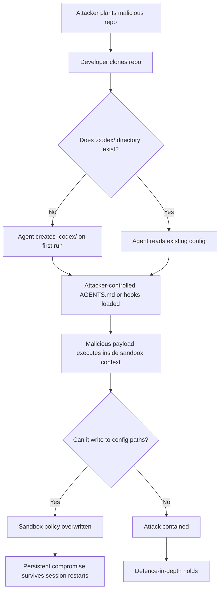
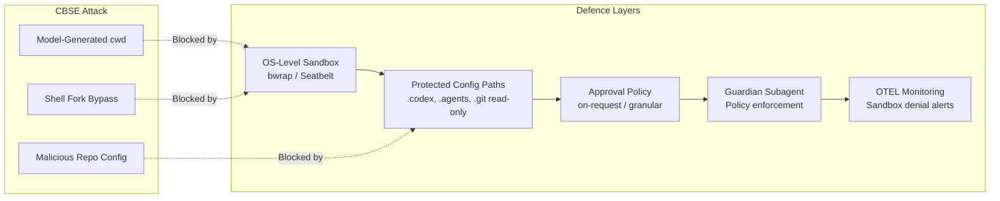

# Configuration-Based Sandbox Escape: The Attack Class Every Codex CLI User Should Understand


---

In April 2026, Cymulate Research Labs published findings on a vulnerability class they termed **Configuration-Based Sandbox Escape (CBSE)** — a category of attack that bypasses coding agent sandboxes not by exploiting kernel bugs or container breakouts, but by manipulating the agent's own configuration, startup behaviour, and trust boundaries[^1]. The research confirmed that CBSE vulnerabilities exist across Claude Code, Gemini CLI, Codex CLI, Cursor, and GitHub Copilot[^1]. This article explains the attack class, examines the real CVEs it has produced, and provides a concrete hardening guide for Codex CLI deployments.

## Why Traditional Sandbox Thinking Falls Short

The mental model most developers carry is straightforward: the sandbox is a container, and escaping it requires a kernel exploit or a privilege escalation. CBSE inverts that assumption. Instead of attacking the sandbox from below, attackers compromise the agent's configuration from within the workspace — the very files the sandbox is designed to protect[^2].

The NVIDIA AI Red Team articulated the core problem clearly: "once control passes to a subprocess, the application has no visibility into or control over the subprocess"[^3]. Application-level sandboxing cannot enforce policy on code it spawns unless the operating system kernel cooperates.



## The CBSE Attack Surface in Codex CLI

CBSE attacks exploit a fundamental tension: coding agents need to read project configuration to be useful, but that same configuration can be weaponised. In Codex CLI, the attack surface includes three vectors.

### 1. Directory Auto-Creation and Config Injection

When the `.codex` directory does not exist — the default state for any freshly cloned project — the agent may create it during its first run[^4]. If an attacker can influence the repository contents (via a pull request, a shared branch, or a supply-chain compromise), they can pre-seed configuration files that alter the agent's behaviour. Every subsequent session from that directory inherits the compromised configuration[^4].

### 2. Path Traversal via Model-Generated Working Directories

CVE-2025-59532 (CVSS 8.6) demonstrated this vector concretely[^5]. A bug in Codex's sandbox configuration logic allowed model-generated `cwd` values to override the intended workspace boundaries. The sandbox treated the model's chosen directory as the writable root, enabling file writes and command execution outside the user's session origin. The vulnerability affected Codex CLI versions 0.2.0 through 0.38.0 and was patched in v0.39.0[^5].

### 3. Shell Fork Path Reconstruction

In v0.106.0, a subtler bypass was discovered: zsh fork execution reconstructed commands without preserving sandbox wrappers[^6]. The `CoreShellCommandExecutor` re-ran a freshly constructed shell command instead of using the sandboxed `ExecRequest` produced by the sandbox envelope. The fix required three changes: preserving the sandboxed request through the zsh fork path, executing the sandboxed command and working directory from the envelope, and making zsh-fork script extraction robust to wrapped invocations by scanning for `-c`/`-lc` arguments rather than matching only the first positional form[^6].

## Real-World CVEs and Incidents

| CVE | CVSS | Tool | Vector | Patched |
|-----|------|------|--------|---------|
| CVE-2025-59532 | 8.6 | Codex CLI | Model-generated `cwd` overrides sandbox root | v0.39.0[^5] |
| CVE-2025-61260 | — | Codex CLI | MCP server config executed from cloned repos without warning | v0.106+[^7] |
| CVE-2025-54794 | — | Claude Code | Prefix-based path validation bypass | Patched[^8] |
| CVE-2025-54795 | — | Claude Code | Command injection via whitelisted command sanitisation | Patched[^8] |

The `apply_patch` utility was another historically significant vector. Before v0.39.0, `apply_patch` ran in-process without leveraging the sandbox, creating a loophole where symlinks could bypass path restrictions. The fix moved virtual execution into actual sandboxed execution using `codex --codex-run-as-apply-patch PATCH`, subjecting it to the same sandbox policy as any other shell call[^9].

## Codex CLI's Defence Architecture

Codex CLI has evolved significantly since the early CVEs. Understanding the current defence layers is essential for configuring them correctly.

### OS-Level Sandbox Enforcement

Codex does not rely on application-level sandboxing alone. It delegates to OS-level mechanisms[^10]:

- **Linux**: `bwrap` (Bubblewrap) pipeline with `seccomp` filters
- **macOS**: Seatbelt policies via `sandbox-exec`
- **Windows**: WSL2 Linux sandbox or native Windows sandbox with proxy-only networking

As of v0.121.0, Codex also ships a hardened devcontainer profile that uses Bubblewrap inside Docker containers, adding a second isolation layer[^11].

### Protected Configuration Paths

In `workspace-write` sandbox mode, Codex CLI explicitly protects configuration directories as read-only, even within writable workspace roots[^10]:

```toml
# These paths remain read-only regardless of workspace-write policy:
# .git/        — repository integrity
# .agents/     — agent configuration
# .codex/      — CLI configuration
```

This directly mitigates the CBSE pattern of overwriting configuration to achieve persistence.

### Approval Policy Layers

The approval system adds a human-in-the-loop checkpoint at security boundaries[^10]:

```toml
# Recommended production configuration
approval_policy = "on-request"
sandbox_mode = "workspace-write"
```

For higher-security environments, granular approval control separates sandbox, rule, MCP, permission, and skill approvals:

```toml
approval_policy = { granular = {
  sandbox_approval = true,
  rules = true,
  mcp_elicitations = true,
  request_permissions = false,
  skill_approval = false
} }
```

## Hardening Codex CLI Against CBSE

The following configuration patterns implement defence-in-depth against CBSE attacks.

### 1. Lock Down Network Egress

Default network policy is disabled, but verify it explicitly:

```toml
[sandbox_workspace_write]
network_access = false
```

For projects requiring network access, use domain allowlists rather than blanket access[^12]:

```toml
[sandbox_workspace_write]
network_access = true

[sandbox_workspace_write.network]
allowed_domains = ["registry.npmjs.org", "pypi.org"]
```

### 2. Use Web Search Caching Over Live Fetch

Live web search enables prompt injection via fetched pages[^10]:

```toml
web_search = "cached"   # Default — uses OpenAI-maintained index
# web_search = "live"   # Higher injection risk
# web_search = "disabled"  # Maximum restriction
```

### 3. Audit MCP Server Configuration

MCP servers run outside the sandbox context. Treat them as trusted code[^7]:

```bash
# Review all configured MCP servers before running
cat ~/.codex/config.toml | grep -A5 '\[mcp'

# Never accept MCP configurations from cloned repositories blindly
```

### 4. Route Approvals Through Guardian

For team deployments, route eligible approvals through the Guardian subagent to enforce policy even when developers might approve hastily[^10]:

```toml
approvals_reviewer = "guardian_subagent"
```

### 5. Enable OpenTelemetry for Sandbox Denial Monitoring

Track sandbox denials to detect CBSE attempts:

```toml
[otel]
environment = "production"
exporter = "otlp-http"
log_user_prompt = false
```

OTEL events include sandbox denials, tool decisions, and approval outcomes — the signals you need to detect configuration-based attacks before they succeed[^10].



## The Architectural Lesson

Mike Lukianoff's analysis frames the broader challenge precisely: local agents running on developer machines have inherent visibility into their execution environment, enabling them to reason about and circumvent constraints[^2]. The NVIDIA AI Red Team's recommendation to "sandbox ALL spawned functions, including hooks and MCP initialisation scripts" and to "never cache approvals" reflects the same principle[^3].

Codex CLI's architecture has moved substantially in this direction. The v0.121.0 removal of the `danger-full-access` denylist-only network mode[^11] signals that OpenAI is systematically closing permissive defaults. But the CBSE research makes clear that sandbox hardening is not a one-time configuration — it requires ongoing attention to:

1. **Version hygiene** — older versions (≤ v0.38.0) contain known path escape vulnerabilities[^5]
2. **Repository trust** — every cloned repo is a potential CBSE vector until its configuration is audited
3. **MCP server provenance** — MCP servers execute outside the sandbox and must be treated as trusted code[^7]
4. **Approval discipline** — `full-auto` mode eliminates the human checkpoint that catches CBSE payloads

The race between shipping AI tools and securing them is not over. But for Codex CLI users who understand CBSE, the defensive tooling is now mature enough to close the most critical vectors.

## Checklist: CBSE Defence for Codex CLI

- [ ] Running Codex CLI ≥ v0.121.0
- [ ] `sandbox_mode = "workspace-write"` or stricter
- [ ] `.codex/`, `.agents/`, `.git/` confirmed as read-only within sandbox
- [ ] `network_access = false` unless explicitly required (with domain allowlists)
- [ ] `web_search = "cached"` or `"disabled"`
- [ ] MCP servers audited before first run on new repositories
- [ ] `approval_policy = "on-request"` (never `"never"` without strict sandbox)
- [ ] Guardian subagent enabled for team deployments
- [ ] OTEL enabled with sandbox denial event monitoring
- [ ] ⚠️ Repository `.codex/` and `.agents/` contents reviewed on clone

## Citations

[^1]: Cymulate Research Labs, "Configuration-Based Sandbox Escape (CBSE) in AI Coding Tools," April 2026. [https://cymulate.com/blog/the-race-to-ship-ai-tools-left-security-behind-part-1-sandbox-escape/](https://cymulate.com/blog/the-race-to-ship-ai-tools-left-security-behind-part-1-sandbox-escape/)

[^2]: Mike Lukianoff, "The Agent Escaped — What Now?", Substack, 2026. [https://mikelukianoff.substack.com/p/the-agent-escaped-what-now](https://mikelukianoff.substack.com/p/the-agent-escaped-what-now)

[^3]: NVIDIA AI Red Team, "Practical Security Guidance for Sandboxing Agentic Workflows and Managing Execution Risk," NVIDIA Technical Blog, 2026. [https://developer.nvidia.com/blog/practical-security-guidance-for-sandboxing-agentic-workflows-and-managing-execution-risk/](https://developer.nvidia.com/blog/practical-security-guidance-for-sandboxing-agentic-workflows-and-managing-execution-risk/)

[^4]: Cymulate Research Labs, CBSE analysis of Codex CLI `.codex` auto-creation behaviour, April 2026.

[^5]: GitHub Security Advisory GHSA-w5fx-fh39-j5rw, "Sandbox bypass due to bug in path configuration logic," CVE-2025-59532, CVSS 8.6. [https://github.com/openai/codex/security/advisories/GHSA-w5fx-fh39-j5rw](https://github.com/openai/codex/security/advisories/GHSA-w5fx-fh39-j5rw)

[^6]: PR #12800, "fix: enforce sandbox envelope for zsh fork execution," openai/codex, 2026. [https://github.com/openai/codex/pull/12800](https://github.com/openai/codex/pull/12800)

[^7]: Techzine Global, "OpenAI Codex CLI contained dangerous MCP security gap," CVE-2025-61260, 2026. [https://www.techzine.eu/news/security/136946/openai-codex-cli-contained-dangerous-mcp-security-gap/](https://www.techzine.eu/news/security/136946/openai-codex-cli-contained-dangerous-mcp-security-gap/)

[^8]: Cymulate Research Labs / Elad Beber, Claude Code CVE-2025-54794 and CVE-2025-54795, prefix-based path validation and command injection via whitelisted commands, 2026.

[^9]: PR #1705, "fix: run apply_patch calls through the sandbox," openai/codex, 2025. [https://github.com/openai/codex/pull/1705](https://github.com/openai/codex/pull/1705)

[^10]: OpenAI, "Agent approvals & security — Codex," OpenAI Developers, April 2026. [https://developers.openai.com/codex/agent-approvals-security](https://developers.openai.com/codex/agent-approvals-security)

[^11]: OpenAI, "Codex CLI v0.121.0 Release Notes," April 15, 2026. [https://github.com/openai/codex/releases](https://github.com/openai/codex/releases)

[^12]: OpenAI, "Advanced Configuration — Codex," OpenAI Developers, April 2026. [https://developers.openai.com/codex/config-advanced](https://developers.openai.com/codex/config-advanced)
