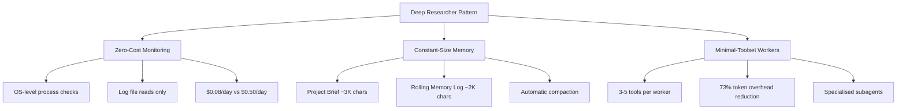
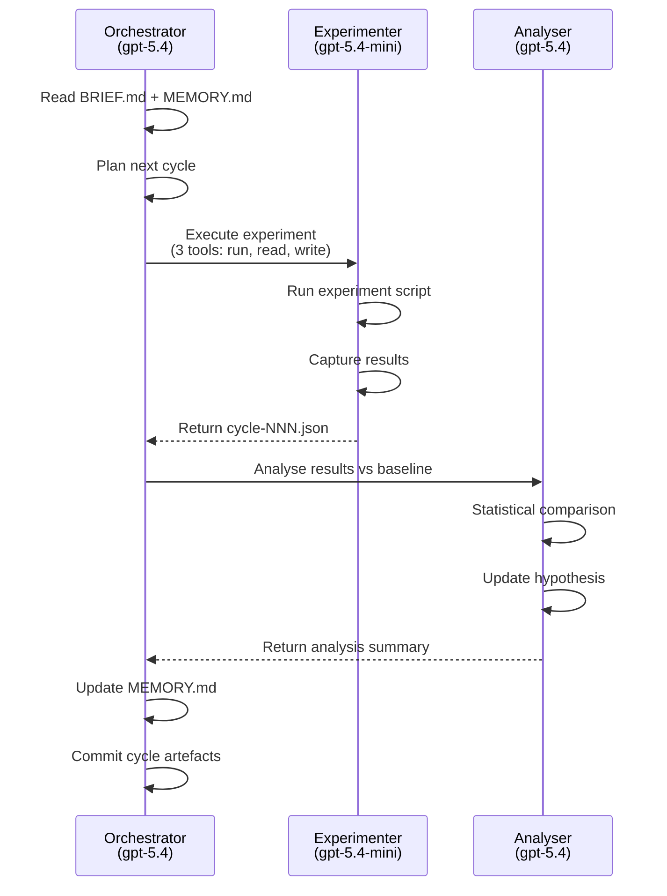

# The Deep Researcher Pattern: Building 24/7 Autonomous Experimentation Loops with Codex CLI


---

A new open-source framework called Deep Researcher Agent, published by Xiangyue Zhang at the University of Tokyo in April 2026, demonstrates that an LLM agent can run 500+ autonomous experiment cycles over 30+ continuous days at under \$0.16 per day in API costs[^1]. The trick is not a bigger model or a longer context window — it is three architectural patterns that any Codex CLI practitioner can adopt today: zero-cost monitoring, constant-size memory, and minimal-toolset worker specialisation.

This article translates the Deep Researcher Agent's architecture into practical Codex CLI configurations, combining it with OpenAI's own long-horizon task guidance[^2] and the thread automations system[^3] to build experimentation loops that run overnight, over weekends, or indefinitely.

## Why Experimentation Loops Matter

Most developers use Codex CLI for single-session tasks: fix a bug, generate tests, review a PR. But the highest-value applications — performance tuning, algorithm comparison, migration validation, regression hunting — require iterative loops where each cycle's output feeds the next cycle's input. The Deep Researcher Agent paper showed a 52% metric improvement across four concurrent projects through 200+ automated experiment cycles[^1]. The core insight: sustained iteration at low cost beats expensive one-shot attempts.

Codex CLI already supports sessions lasting up to seven hours with automatic context compaction[^4], and OpenAI's 25-hour demo generated approximately 30,000 lines of code across 13 million tokens[^2]. The missing piece for most teams is not capability — it is the operational architecture to sustain these loops without runaway costs or context degradation.

## The Three Pillars



### Pillar 1: Zero-Cost Monitoring

The Deep Researcher Agent's most counterintuitive insight is that 90% of an autonomous agent's wall-clock time is spent waiting — for builds, tests, training runs, or deployments[^1]. During these periods, conventional agent loops burn tokens polling for status. The zero-cost monitoring pattern replaces LLM polling with OS-level checks: process liveness verification, GPU/CPU utilisation confirmation, and log file reads. This reduced monitoring costs from approximately \$0.50 to \$0.08 per 24-hour cycle[^1].

In Codex CLI, you can replicate this pattern using **thread automations** with a wake-up schedule rather than a continuous session:

```toml
# In your Codex App automation configuration:
# Schedule: Every 30 minutes (or custom cron: */30 * * * *)
# Prompt: Check the experiment status and decide next steps
```

The automation prompt should instruct Codex to:

1. Read the process status file or CI output
2. Parse the latest log entries
3. Decide whether the current cycle completed, failed, or is still running
4. If complete, analyse results and launch the next cycle
5. If still running, report status and go back to sleep

This mirrors the Deep Researcher Agent's Think → Execute → Monitor → Reflect loop[^1], but each "Monitor" phase costs zero tokens when the experiment is still running — the automation simply does not wake up Codex until the next scheduled interval.

### Pillar 2: Constant-Size Memory

Unbounded context growth is the silent killer of long-running agent sessions. The Deep Researcher Agent maintains a strict two-tier memory capped at approximately 5,000 characters regardless of runtime duration[^1]:

- **Project Brief** (~3,000 characters): Frozen at session start. Contains goals, constraints, success metrics, and architectural decisions that must not drift.
- **Rolling Memory Log** (~2,000 characters): Updated after each cycle. Contains only the most recent results, active hypotheses, and next-step decisions.

OpenAI's own long-horizon guidance uses a similar four-file pattern[^2]:

| File | Purpose | Deep Researcher Equivalent |
|------|---------|---------------------------|
| `Prompt.md` | Goals + constraints freeze | Project Brief |
| `Plan.md` | Milestone checkpoints | Rolling Memory Log (planned) |
| `Implement.md` | Execution runbook | Rolling Memory Log (active) |
| `Documentation.md` | Audit log | Rolling Memory Log (historical) |

For Codex CLI, implement constant-size memory using AGENTS.md directives and a pair of markdown files:

```markdown
<!-- AGENTS.md excerpt -->
## Experimentation Loop Protocol

### Memory Files
- `experiment/BRIEF.md` — DO NOT MODIFY after initial creation.
  Contains: research question, success metric, hard constraints, baseline.
- `experiment/MEMORY.md` — UPDATE after every cycle.
  Maximum 2,000 characters. Summarise: last result, delta from baseline,
  current hypothesis, next planned action. Delete older entries that
  exceed the character budget.

### Rules
- Always read BRIEF.md and MEMORY.md before starting any cycle.
- Never exceed 2,000 characters in MEMORY.md — summarise ruthlessly.
- Log raw results to `experiment/results/cycle-NNN.json`, not to memory.
```

This pattern works with Codex CLI's built-in context compaction[^5]. When auto-compaction triggers — at approximately `context_window - 13,000` tokens[^6] — the externalised memory files ensure that critical state survives the compaction without the re-read cascade that plagued earlier Codex versions[^7].

### Pillar 3: Minimal-Toolset Worker Specialisation

The Deep Researcher Agent equips each worker with only 3–5 tools, achieving a 73% reduction in token overhead compared to agents with 15+ tools[^1]. Every tool definition consumes prompt tokens on every call, so fewer tools means cheaper cycles.

In Codex CLI, this translates to **subagent delegation with scoped permission profiles**:

```toml
# config.toml — Experimenter profile
[profiles.experimenter]
model = "gpt-5.4-mini"
approval_policy = "auto-edit"

[profiles.experimenter.sandbox]
allow_commands = ["python", "pytest", "git diff", "cat"]
```



The orchestrator uses the full model (`gpt-5.4`) for planning and analysis, while the experimenter subagent uses `gpt-5.4-mini` with a minimal tool surface for raw execution[^8]. This mirrors the Deep Researcher Agent's leader-worker architecture whilst keeping per-cycle costs low.

## Putting It Together: A Complete Loop

Here is a concrete example — automated performance benchmarking across configuration variants:

### Step 1: Initialise the Experiment

```bash
mkdir -p experiment/results
codex "Create experiment/BRIEF.md for this task: benchmark our API
  response times across 3 database connection pool sizes (10, 25, 50).
  Success metric: p99 latency. Baseline: current production config.
  Constraint: each cycle must complete in under 10 minutes.
  Then create experiment/MEMORY.md with the initial plan."
```

### Step 2: Create the Cycle Skill

```markdown
<!-- .codex/skills/run-experiment/SKILL.md -->
---
description: "Run one experiment cycle from the current plan"
---

Read experiment/BRIEF.md and experiment/MEMORY.md.
Determine the next planned experiment variant from MEMORY.md.
Execute the benchmark script with the planned configuration.
Save raw results to experiment/results/cycle-NNN.json.
Analyse: compare p99 against baseline and previous cycles.
Update experiment/MEMORY.md (max 2000 chars): last result, delta,
next hypothesis, next action.
Commit all changes with message "experiment: cycle NNN — [result summary]".
If all planned variants are complete, write "COMPLETE" to MEMORY.md.
```

### Step 3: Schedule the Automation

In the Codex App, create a thread automation:

- **Schedule:** Every 15 minutes
- **Prompt:** `Run /run-experiment. If MEMORY.md contains "COMPLETE", report final results and stop.`
- **Project:** Your repository

Alternatively, use `codex exec` with cron for pure CLI workflows:

```bash
# crontab entry — run every 15 minutes
*/15 * * * * cd /path/to/repo && codex exec "Run /run-experiment" \
  --approval-mode full-auto -m gpt-5.4-mini --json \
  >> /var/log/experiment.jsonl 2>&1
```

### Step 4: Review Results

```bash
# Next morning — check what happened overnight
codex "Read experiment/MEMORY.md and experiment/results/.
  Summarise all cycle outcomes, identify the winning configuration,
  and draft a PR with the recommended change."
```

## Cost Projections

The Deep Researcher Agent achieved \$0.08 per 24-hour cycle for monitoring phases and \$0.16 average total daily cost including active LLM calls[^1]. Applying similar patterns to Codex CLI:

| Component | Estimated Cost per Cycle | Notes |
|-----------|------------------------|-------|
| Orchestrator planning (gpt-5.4) | ~\$0.02 | Short prompt, scoped context |
| Experimenter execution (gpt-5.4-mini) | ~\$0.005 | Minimal tools, small context |
| Analysis (gpt-5.4) | ~\$0.015 | Results comparison only |
| **Total per cycle** | **~\$0.04** | |
| **24 cycles (6-hour overnight run)** | **~\$0.96** | |

These are estimates based on current `gpt-5.4` pricing (\$2.50/M input, \$15/M output) and `gpt-5.4-mini` rates[^9]. Actual costs depend on context size and output length. The key saving comes from *not* running the LLM during experiment execution — mirroring the zero-cost monitoring pattern.

## Dry-Run Validation

One underappreciated finding from the Deep Researcher Agent paper: 18% of planned experiments were caught during mandatory dry-runs before committing compute resources[^1]. Implement this in your AGENTS.md:

```markdown
## Dry-Run Rule
Before executing any experiment script, run it with `--dry-run` or
equivalent flag. Verify:
1. No syntax errors
2. Expected output format matches the analysis parser
3. Estimated runtime is within the cycle budget
If dry-run fails, fix the issue and retry. Never skip dry-run validation.
```

This catches misconfigurations before they waste 10-minute benchmark cycles — or worse, corrupt results that propagate through subsequent cycles.

## Limitations and Caveats

⚠️ **Thread automations require the Codex App** — the CLI alone does not support scheduled wake-ups natively. The cron-based `codex exec` workaround lacks session continuity between cycles, meaning each invocation starts with a cold context read from the memory files.

⚠️ **Context compaction quality varies.** Issue #16812 documented a regression in CLI v0.118 where compactions triggered twice as frequently, causing 10-20× token multiplication from file re-reads[^7]. Monitor your token usage across cycles and adjust the compaction threshold if needed.

⚠️ **The 52% improvement figure** from the Deep Researcher Agent paper applies to deep learning hyperparameter tuning across specific benchmarks. Your mileage will vary depending on the search space and task type. The architectural patterns — not the specific numbers — are what transfer.

## Citations

[^1]: Zhang, X. "Deep Researcher Agent: An Autonomous Framework for 24/7 Deep Learning Experimentation with Zero-Cost Monitoring." arXiv:2604.05854, April 2026. [https://arxiv.org/abs/2604.05854](https://arxiv.org/abs/2604.05854)

[^2]: OpenAI. "Run long horizon tasks with Codex." OpenAI Developers Blog, 2026. [https://developers.openai.com/blog/run-long-horizon-tasks-with-codex](https://developers.openai.com/blog/run-long-horizon-tasks-with-codex)

[^3]: OpenAI. "Automations — Codex app." OpenAI Developers Documentation, 2026. [https://developers.openai.com/codex/app/automations](https://developers.openai.com/codex/app/automations)

[^4]: OpenAI. "Features — Codex CLI." OpenAI Developers Documentation, 2026. [https://developers.openai.com/codex/cli/features](https://developers.openai.com/codex/cli/features)

[^5]: Justin3go. "Shedding Heavy Memories: Context Compaction in Codex, Claude Code, and OpenCode." April 2026. [https://justin3go.com/en/posts/2026/04/09-context-compaction-in-codex-claude-code-and-opencode](https://justin3go.com/en/posts/2026/04/09-context-compaction-in-codex-claude-code-and-opencode)

[^6]: Badlogic. "Context Compaction Research: Claude Code, Codex CLI, OpenCode, Amp." GitHub Gist, 2026. [https://gist.github.com/badlogic/cd2ef65b0697c4dbe2d13fbecb0a0a5f](https://gist.github.com/badlogic/cd2ef65b0697c4dbe2d13fbecb0a0a5f)

[^7]: "Context compaction regression in CLI v0.118 — 2x more frequent compactions cause token usage explosion." GitHub Issue #16812, openai/codex. [https://github.com/openai/codex/issues/16812](https://github.com/openai/codex/issues/16812)

[^8]: OpenAI. "Models — Codex." OpenAI Developers Documentation, 2026. [https://developers.openai.com/codex/models](https://developers.openai.com/codex/models)

[^9]: OpenAI. "GPT-5.4 Model." OpenAI API Documentation, 2026. [https://developers.openai.com/api/docs/models/gpt-5.4](https://developers.openai.com/api/docs/models/gpt-5.4)
