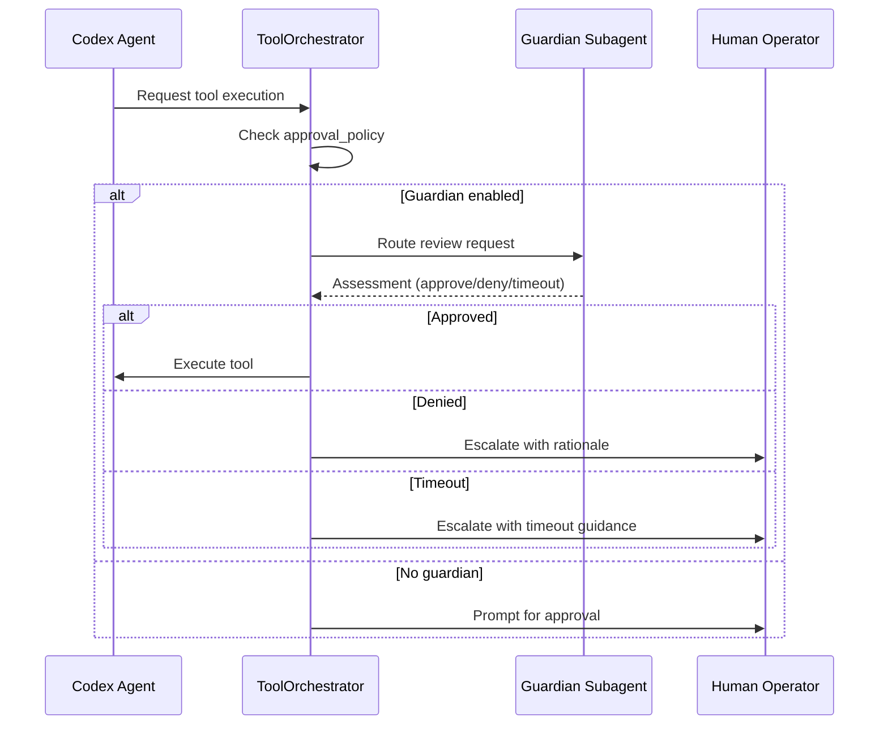
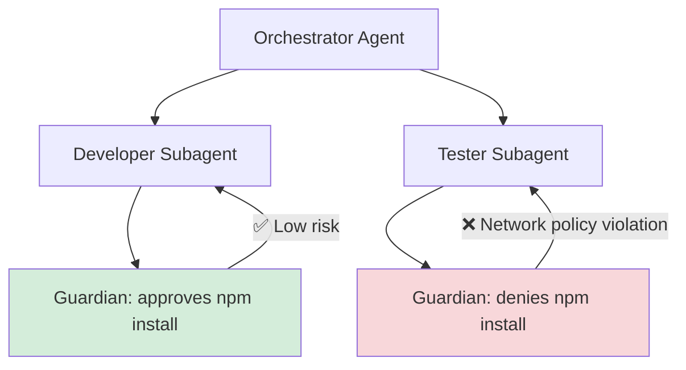
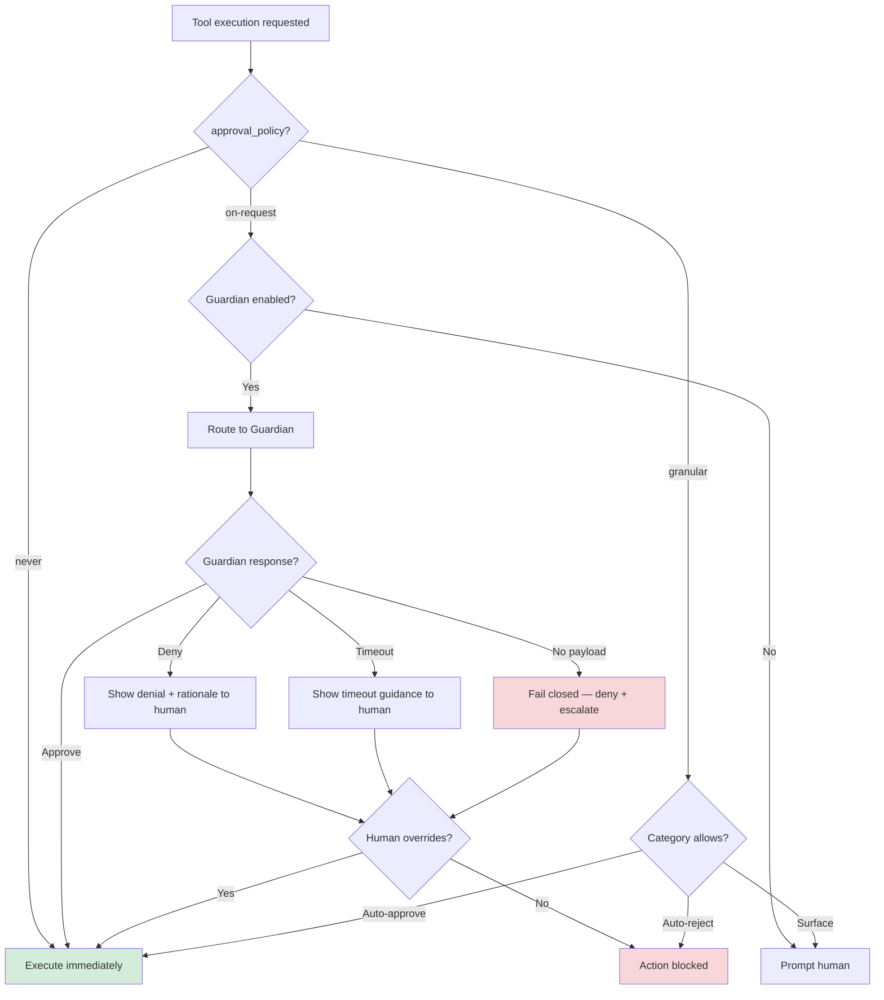

# When Guardian Approval Goes Wrong: Failure Modes and Escalation Patterns


---

Guardian auto-review is one of the most powerful features in Codex CLI — a subagent that reviews approval requests on your behalf, reducing the need for manual intervention during autonomous sessions[^1]. But like any automated gate, it introduces its own failure modes. This article catalogues the ways Guardian can go wrong, explains the escalation mechanics that determine what happens next, and provides practical patterns for tuning sensitivity so your sessions stay productive without sacrificing safety.

## How Guardian Review Works (Briefly)

When you set `approvals_reviewer = "guardian_subagent"` in your configuration, eligible approval requests are routed to a reviewer subagent instead of prompting you directly[^2]. The guardian inherits sandbox and network settings from its parent session, evaluates the pending action against your policy context, and returns a structured assessment with a risk level, authorisation decision, and rationale[^3].



The `ToolOrchestrator` in `codex-rs/core/src/codex.rs` implements this as: approval check → sandbox selection → execution attempt → retry-with-escalation-on-denial[^4]. Guardian sits at the approval check stage, acting as a first pass before the human sees anything.

## Failure Mode 1: Missing Assessment Payload

The most commonly reported Guardian failure is the "guardian review completed without an assessment payload" error[^5]. This occurs when the guardian subagent finishes its review but returns no structured decision — the review ran, but produced no actionable output.

**Symptoms:**

- Error message: `Automatic approval review failed: guardian review completed without an assessment payload`
- The action is denied with a `high` risk rating by default
- Session stalls waiting for manual intervention

**Root causes:**

- Context window exhaustion in long sessions where the guardian's transcript has grown too large
- Model output truncation when the assessment JSON exceeds the response buffer
- Network interruption during the guardian's API call

**Mitigation:**

Since v0.119.0, Codex sends transcript deltas rather than the full history on guardian follow-ups[^6], which significantly reduces this failure mode. If you're still encountering it:

```toml
# Reduce guardian context pressure
[guardian]
approvals_reviewer = "guardian_subagent"

# Use compaction aggressively in long sessions
# /compact regularly to keep transcript size manageable
```

Use `/compact` before entering sections of heavy tool use to keep the guardian's context window within bounds.

## Failure Mode 2: Timeout vs Denial Confusion

Before the April 2026 changelog fix, guardian timeouts were indistinguishable from policy denials in the TUI[^7]. A slow network or an overloaded API endpoint would surface the same denial message as a genuine policy violation, leading operators to debug their policies when the real issue was latency.

**What changed:**

Guardian timeouts are now distinct from policy denials, with timeout-specific guidance and visible TUI history entries[^7]. This means you can differentiate between:

- **Timeout**: Guardian didn't respond in time → retry is likely to succeed
- **Denial**: Guardian evaluated and explicitly rejected → examine the rationale

**Practical implication:** If you see repeated timeouts in CI/CD pipelines using `codex exec`, consider whether your guardian configuration adds more latency than value. In headless contexts, a well-scoped `approval_policy = "on-request"` with tight filesystem policies may be more reliable than guardian review[^8].

## Failure Mode 3: Approval Fatigue Transfer

Guardian was designed to solve approval fatigue — the well-documented problem where too many approval prompts lead to reflexive, unexamined approvals[^9]. But Guardian can transfer this fatigue rather than eliminate it.

**The pattern:**

1. Guardian approves most requests automatically
2. When it does escalate to the human, the operator has been conditioned to expect automatic approval
3. The escalated request gets rubber-stamped because the operator assumes "Guardian would have caught anything dangerous"

This is particularly dangerous with `approval_policy = "on-request"`, where the human only sees requests that Guardian couldn't resolve — precisely the ones that need the most careful scrutiny.

**Mitigation:**

```toml
# Use granular policies to keep humans in the loop for high-impact categories
[approval_policy.granular]
sandbox_approval = true        # Always surface sandbox escalation
rules = true                   # Surface execpolicy rule triggers
mcp_elicitations = true        # Surface MCP prompts
request_permissions = false    # Auto-reject permission expansion
skill_approval = true          # Surface skill-script approvals
```

This configuration ensures that certain categories always reach the human regardless of Guardian's assessment[^10]. The key insight: Guardian should handle the high-volume, low-risk approvals (file reads, safe writes), while humans retain authority over boundary-crossing actions.

## Failure Mode 4: Guardian Subagent Disagreements in Agentic Pods

When running multiple agents in an agentic pod — say a Designer, Developer, and Tester subagent orchestrated by a parent — each subagent may have its own guardian instance. These guardians can reach contradictory conclusions about the same operation.

**Example scenario:**



The Developer's guardian approves `npm install` because its profile permits network access, while the Tester's guardian denies it because the testing profile restricts outbound connections. Both are correct within their own policy scope, but the pod's workflow breaks.

**Mitigation:**

Use named permission profiles to ensure consistent policy interpretation across subagents that share workflows[^11]:

```toml
# Shared profile for agents that need network access
[profiles.network-allowed]
sandbox = "workspace-write"
network_policy = { allow_domains = ["registry.npmjs.org", "pypi.org"] }
approvals_reviewer = "guardian_subagent"

# Restricted profile for agents that should be offline
[profiles.isolated]
sandbox = "workspace-write"
network_policy = { allow_domains = [] }
approval_policy = "on-request"  # No guardian — human decides
```

The principle: subagents that participate in the same workflow phase should share a permission profile, or at minimum, a common network policy.

## Failure Mode 5: Audit Trail Gaps

Guardian produces structured output with risk levels and rationale[^3], but this data can be lost if your observability pipeline isn't configured to capture it. In enterprise environments requiring SOC 2 or ISO 27001 compliance, missing guardian decisions create audit gaps.

**What gets lost without proper wiring:**

- The guardian's risk assessment (low/medium/high)
- The specific action that triggered review
- Whether the decision was approve, deny, or timeout
- The rationale text explaining why

**Fix:** Wire guardian events into your OpenTelemetry pipeline. Guardian review events now include stable review IDs[^12] and parent thread ID tracking[^13], making it possible to reconstruct the full decision chain:

```bash
# Ensure OTEL export is configured
export OTEL_EXPORTER_OTLP_ENDPOINT="https://your-collector:4317"
export OTEL_SERVICE_NAME="codex-cli"

# Guardian events will appear as spans with:
# - guardian.review_id (stable per-review)
# - guardian.parent_thread_id (links to parent session)
# - guardian.assessment.risk_level
# - guardian.assessment.outcome
```

## Escalation Decision Tree

When Guardian can't resolve a review, Codex follows a deterministic escalation path. Here's the full decision tree:



The critical property: Guardian always fails closed[^14]. A missing payload, timeout, or error results in denial and human escalation, never silent approval. This is the correct security posture — if you find yourself wanting to change it, reconsider whether Guardian is the right tool for that workflow.

## Tuning Guardian Sensitivity

Guardian sensitivity is primarily controlled through your policy configuration rather than the guardian itself. Here are the levers:

| Lever | Effect | When to adjust |
|-------|--------|----------------|
| `approval_policy` | Controls which actions need any review | Too many/few escalations overall |
| `approvals_reviewer` | Routes reviews to guardian vs human | Want automated first-pass |
| `granular` policy categories | Per-category auto-approve/reject | Specific category causing fatigue |
| Permission profiles | Per-profile policy sets | Subagent disagreements |
| `/compact` frequency | Reduces guardian context pressure | Missing payload errors |
| Network timeout config | Guardian response deadline | Timeout escalations in CI |

## Recommendations

1. **Start without Guardian** in new projects. Add it when approval fatigue becomes measurable — typically when you're dismissing more than 10 prompts per session without reading them.

2. **Use granular policies first.** Many approval fatigue problems are better solved by auto-approving safe categories than by adding an AI reviewer. Guardian is for the grey area where static rules can't decide.

3. **Monitor guardian decisions.** If Guardian is approving >99% of requests, it's adding latency without value. If it's denying >20%, your policies are likely too loose and should be tightened at the configuration level.

4. **Wire OTEL before going to production.** Guardian audit trails are only useful if they're captured. Set up the pipeline before your compliance team asks for it.

5. **Test guardian behaviour in a staging profile.** Create a `[profiles.guardian-test]` that mirrors production but routes to a separate log, so you can tune sensitivity without affecting live sessions.

## Citations

[^1]: [Agent approvals & security – Codex | OpenAI Developers](https://developers.openai.com/codex/agent-approvals-security)
[^2]: [Configuration Reference – Codex | OpenAI Developers](https://developers.openai.com/codex/config-reference)
[^3]: [Guardian Output Schema and Enterprise Compliance Audit Trails](https://codex.danielvaughan.com/2026/04/10/guardian-output-schema-enterprise-compliance/)
[^4]: [OpenAI Codex CLI Architecture and Multi-Runtime Agent Patterns – Zylos Research](https://zylos.ai/research/2026-03-26-openai-codex-cli-architecture-multi-runtime-patterns)
[^5]: [Issue #15341: Automatic approval review failed – openai/codex](https://github.com/openai/codex/issues/15341)
[^6]: [PR #17269: Send only transcript deltas on guardian followups – openai/codex](https://github.com/openai/codex/pull/17269)
[^7]: [Changelog – Codex | OpenAI Developers](https://developers.openai.com/codex/changelog)
[^8]: [Advanced Configuration – Codex | OpenAI Developers](https://developers.openai.com/codex/config-advanced)
[^9]: [Solving Approval Fatigue in Coding Agents Like Claude Code with AI](https://zenn.dev/kbwok/articles/d9d1b14a0dc55a?locale=en)
[^10]: [PR #12087: Add Reject approval policy with granular prompt rejection controls – openai/codex](https://github.com/openai/codex/pull/12087)
[^11]: [Config basics – Codex | OpenAI Developers](https://developers.openai.com/codex/config-basic)
[^12]: [PR #17298: Introduce guardian review IDs – openai/codex](https://github.com/openai/codex/pull/17298)
[^13]: [Guardian Review IDs, Timeouts and Delta Transcripts – Codex Blog](https://codex.danielvaughan.com/2026/04/11/guardian-review-ids-timeouts-delta-transcripts/)
[^14]: [PR #13860: Add Smart Approvals guardian review across core, app-server, and TUI – openai/codex](https://github.com/openai/codex/pull/13860)
